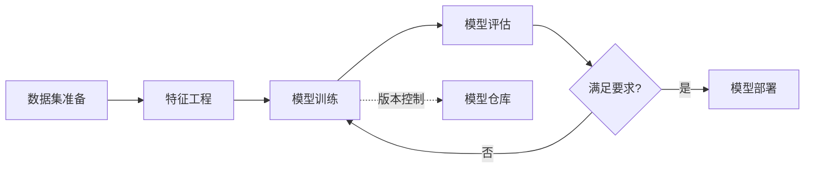

# 模型版本控制原理与代码实战案例讲解

关键词：模型版本控制、机器学习、深度学习、实验管理、再现性

## 1. 背景介绍
### 1.1 问题的由来
随着机器学习和深度学习的快速发展,训练模型的过程变得越来越复杂。在实验过程中,我们经常需要尝试不同的模型架构、超参数组合、数据集等,每一次尝试都会产生一个新的模型版本。如何有效地管理这些模型版本,追踪它们的变化过程,并能够方便地复现实验结果,成为了一个亟待解决的问题。

### 1.2 研究现状
目前,针对模型版本控制的研究主要集中在以下几个方面:

1. 基于Git等通用版本控制工具的模型版本管理方法,如DVC、Pachyderm等。
2. 针对机器学习场景设计的专用模型版本控制平台,如MLflow、Sacred等。
3. 基于容器技术实现的模型打包和部署方案,如Docker、Kubernetes等。
4. 利用区块链技术保证模型版本的不可篡改性和可追溯性的探索。

### 1.3 研究意义
模型版本控制对于机器学习实验管理和结果复现具有重要意义:

1. 提高实验效率:通过版本管理,可以方便地追踪和比较不同的模型版本,加快迭代优化的过程。
2. 保证实验可复现性:记录下每个版本的模型参数、训练数据、运行环境等,为实验结果的复现提供了保障。
3. 促进团队协作:模型版本控制使得不同研究人员之间可以共享和迭代模型,提高团队的协作效率。
4. 利于模型部署:打包封装特定版本的模型,可以方便地在不同环境下进行部署和应用。

### 1.4 本文结构
本文将围绕模型版本控制展开,主要内容包括:

1. 模型版本控制的核心概念和关键技术
2. 主流的模型版本控制工具和平台介绍
3. 模型版本控制的典型工作流程和最佳实践
4. 模型版本控制的工程实现和代码案例
5. 模型版本控制面临的挑战和未来发展方向

## 2. 核心概念与联系

### 2.1 模型版本控制的定义
模型版本控制是一种用于管理、跟踪和组织机器学习模型不同版本的技术和工具。它记录了模型在开发过程中的变化历史,包括模型结构、超参数、使用的数据集、训练脚本、评估指标等,并为不同版本的模型提供唯一的版本号,以便追踪和复现。

### 2.2 模型版本控制的关键要素
1. 模型的版本化存储:将不同版本的模型文件、配置文件等按照一定规则进行组织和存储。
2. 版本元数据管理:记录每个模型版本的参数、环境、数据集、评估指标等关键信息。
3. 版本迭代与追踪:通过版本号、标签等机制,管理模型的迭代过程,并支持版本之间的追踪和比较。
4. 实验可复现性:详细记录实验过程中的各种因素,包括随机种子、依赖库版本等,保证实验的可复现性。

### 2.3 模型版本控制与实验管理的关系
模型版本控制是实验管理的重要组成部分。实验管理不仅包括模型版本的管理,还涉及数据集版本管理、超参数搜索、效果评估等。通过实验管理平台集成模型版本控制能力,可以更好地组织和管理整个机器学习开发流程。



## 3. 核心算法原理 & 具体操作步骤

### 3.1 算法原理概述
模型版本控制的核心是将模型的各个组成部分(架构、参数、环境等)进行快照,并赋予唯一的版本号。常见的实现方式包括:

1. 基于文件系统:将不同版本的模型文件和配置组织为不同的目录或文件,通过目录结构和命名规则来管理版本。
2. 基于数据库:将模型的各个组成部分序列化后,存储到数据库中,通过数据库的记录来管理版本。
3. 基于版本控制系统:借鉴代码版本控制的思路,将模型文件和配置纳入Git等版本控制系统来管理。

### 3.2 算法步骤详解
以基于文件系统的模型版本控制为例,其典型步骤如下:

1. 模型训练:在训练脚本中指定模型版本号,并将训练得到的模型文件和配置保存到对应版本的目录下。
2. 版本元数据记录:将模型版本的关键信息(如超参数、评估指标等)写入元数据文件(如YAML、JSON等格式)。
3. 模型评估:评估模型在验证集或测试集上的性能,将评估结果记录到元数据文件中。
4. 模型发布:将特定版本的模型文件和元数据打包,发布到模型仓库或部署到生产环境。
5. 版本追踪与回滚:通过版本号或标签,对不同版本的模型进行追踪、比较和回滚。

### 3.3 算法优缺点
基于文件系统的模型版本控制优点是简单直观,易于实现和理解。但缺点是当版本数量较多时,管理和查询的效率较低。相比之下,基于数据库和版本控制系统的方法在版本管理和追踪方面更加强大,但实现复杂度也更高。

### 3.4 算法应用领域
模型版本控制广泛应用于各种机器学习和深度学习场景,包括计算机视觉、自然语言处理、推荐系统等。特别是在需要频繁迭代和实验的场景下,模型版本控制可以极大地提高开发效率和可复现性。

## 4. 数学模型和公式 & 详细讲解 & 举例说明

### 4.1 数学模型构建
模型版本控制可以用数学语言进行形式化描述。假设我们有一个模型$M$,其定义为一个五元组:

$$M = (A, P, D, E, H)$$

其中,$A$表示模型的架构,$P$表示模型的参数,$D$表示训练数据集,$E$表示运行环境,$H$表示超参数配置。

一个模型版本$V_i$则可以表示为某个时间戳$t_i$下模型$M$的一个快照:

$$V_i = M_{t_i} = (A_{t_i}, P_{t_i}, D_{t_i}, E_{t_i}, H_{t_i})$$

### 4.2 公式推导过程
基于上述数学模型,我们可以定义两个模型版本之间的差异度量。假设有两个模型版本$V_i$和$V_j$,它们的差异度量$\Delta(V_i, V_j)$可以定义为:

$$\Delta(V_i, V_j) = \sum_{k \in \{A, P, D, E, H\}} \omega_k \cdot \delta(V_i^k, V_j^k)$$

其中,$\omega_k$是各个组成部分的权重系数,$\delta(V_i^k, V_j^k)$是组成部分$k$的差异度量函数。

例如,对于模型参数$P$,可以使用参数向量的欧氏距离作为差异度量:

$$\delta(V_i^P, V_j^P) = \sqrt{\sum_{l=1}^{L} (p_l^i - p_l^j)^2}$$

其中,$L$是参数向量的长度,$p_l^i$和$p_l^j$分别是两个版本的第$l$个参数值。

### 4.3 案例分析与讲解
考虑一个简单的二分类问题,我们使用逻辑回归模型进行训练。模型的参数为权重向量$w$和偏置项$b$。我们对模型进行了三次迭代训练,得到了三个版本:

- 版本1: $w=[0.5, -0.2, 0.8]$, $b=0.1$, 准确率=0.85
- 版本2: $w=[0.6, -0.3, 0.9]$, $b=0.2$, 准确率=0.87 
- 版本3: $w=[0.6, -0.3, 0.9]$, $b=0.2$, 准确率=0.90

我们可以计算版本1和版本2之间的参数差异:

$$\delta(V_1^P, V_2^P) = \sqrt{(0.5-0.6)^2 + (-0.2-(-0.3))^2 + (0.8-0.9)^2} \approx 0.173$$

从准确率的提升和参数差异的计算结果可以看出,版本2相比版本1有一定的优化,但改进幅度不大。版本3与版本2的参数完全相同,但准确率又有提升,说明可能是训练的轮数或学习率等超参数发生了变化。

### 4.4 常见问题解答
问:为什么需要对模型的不同组成部分分别进行差异度量?

答:模型的不同组成部分对模型性能的影响不同,例如改变模型架构或训练数据集通常比改变学习率更加显著。通过分别度量不同部分的差异,可以更准确地评估两个模型版本之间的区别,有助于理解模型迭代优化的过程。

问:差异度量对模型版本管理有什么帮助?

答:通过计算差异度量,我们可以定量评估不同模型版本之间的差异大小。这可以帮助我们识别出性能改进显著的版本,进行重点分析和优化。此外,差异度量还可以用于版本聚类、可视化等分析任务,帮助我们更好地管理和理解模型版本之间的关系。

## 5. 项目实践:代码实例和详细解释说明

### 5.1 开发环境搭建
本项目使用Python语言和PyTorch框架进行开发,并使用DVC工具进行模型版本控制。首先,我们需要安装以下依赖库:

```bash
pip install torch torchvision
pip install dvc
```

### 5.2 源代码详细实现
以下是一个简单的模型训练和版本控制的示例代码:

```python
import torch
import torch.nn as nn
import torch.optim as optim
from torchvision import datasets, transforms
import dvc.api

# 定义模型架构
class Net(nn.Module):
    def __init__(self):
        super(Net, self).__init__()
        self.conv1 = nn.Conv2d(1, 32, 3, 1)
        self.conv2 = nn.Conv2d(32, 64, 3, 1)
        self.fc1 = nn.Linear(9216, 128)
        self.fc2 = nn.Linear(128, 10)

    def forward(self, x):
        x = self.conv1(x)
        x = nn.functional.relu(x)
        x = self.conv2(x)
        x = nn.functional.relu(x)
        x = nn.functional.max_pool2d(x, 2)
        x = torch.flatten(x, 1)
        x = self.fc1(x)
        x = nn.functional.relu(x)
        x = self.fc2(x)
        output = nn.functional.log_softmax(x, dim=1)
        return output

# 加载数据集
train_loader = torch.utils.data.DataLoader(
    datasets.MNIST('../data', train=True, download=True,
                   transform=transforms.Compose([
                       transforms.ToTensor(),
                       transforms.Normalize((0.1307,), (0.3081,))
                   ])),
    batch_size=64, shuffle=True)

test_loader = torch.utils.data.DataLoader(
    datasets.MNIST('../data', train=False, 
                   transform=transforms.Compose([
                       transforms.ToTensor(),
                       transforms.Normalize((0.1307,), (0.3081,))
                   ])),
    batch_size=1000, shuffle=True)

# 训练函数
def train(model, train_loader, optimizer, epoch):
    model.train()
    for batch_idx, (data, target) in enumerate(train_loader):
        optimizer.zero_grad()
        output = model(data)
        loss = nn.functional.nll_loss(output, target)
        loss.backward()
        optimizer.step()

# 测试函数
def test(model, test_loader):
    model.eval()
    test_loss = 0
    correct = 0
    with torch.no_grad():
        for data, target in test_loader:
            output = model(data