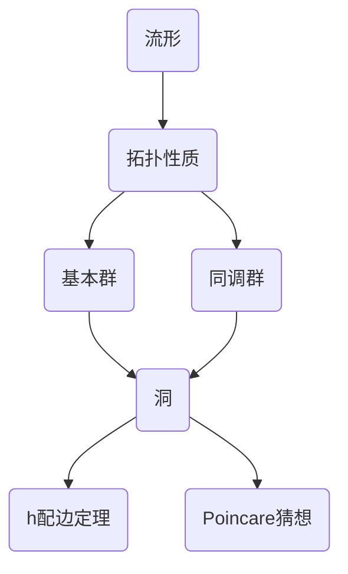

# 流形拓扑学理论与概念的实质：h配边定理与n≥5的Poincare猜想

关键词：流形、拓扑学、h配边定理、Poincare猜想、同伦群、同调群、Morse理论、Ricci流

## 1. 背景介绍
### 1.1  问题的由来
流形拓扑学是现代数学的一个重要分支,它研究流形的拓扑性质。流形是一类特殊的拓扑空间,局部看起来像欧氏空间,但整体拓扑结构可能非常复杂。理解高维流形的拓扑结构是一个极具挑战性的问题。法国数学家Poincare在1904年提出了著名的Poincare猜想,即任何一个紧致、单连通的三维流形都同胚于三维球面。这个猜想引发了大量深刻的数学研究。

### 1.2  研究现状
Poincare猜想在提出后的一个多世纪里一直悬而未决,被列为千禧年大奖难题之一。俄罗斯数学家Perelman在2002-2003年间发表了一系列论文,宣布完整证明了Poincare猜想。Perelman的证明引入了Hamilton的Ricci流方法,通过研究Ricci流方程的性质,最终完成了对Poincare猜想的证明。Perelman因此获得了2006年的菲尔兹奖。

对于高维的情形,美国数学家Smale在1960年证明了n≥5时的Poincare猜想。4维情形则由Freedman在1982年解决。因此,Perelman的工作完成了对Poincare猜想的最后一块拼图。

### 1.3  研究意义 
Poincare猜想的解决是数学史上的一个里程碑。它不仅解决了一个困扰数学家一个多世纪的难题,更重要的是,在证明的过程中发展出了许多深刻而精巧的数学工具和理论,如Ricci流、几何化猜想、Alexandrov空间、κ-解等。这些理论工具在微分几何、偏微分方程、几何群论等领域都有广泛应用。

此外,对高维流形拓扑的研究对理论物理也有重要意义。许多物理理论,如弦理论、M理论,都涉及到高维时空的拓扑结构。深入理解流形拓扑学有助于发展出新的物理理论。

### 1.4  本文结构
本文将主要介绍流形拓扑学的一些核心概念和定理,重点讨论h配边定理和高维Poincare猜想。第2节介绍流形、同伦、同调等核心概念。第3节讨论h配边定理的内容、证明思路和应用。第4节介绍Morse理论,并用它分析流形的拓扑结构。第5节讨论Smale对高维Poincare猜想的证明。第6节探讨这些理论的一些应用。第7节推荐一些学习资源。第8节总结全文,并展望流形拓扑学的一些前沿方向和未解决问题。

## 2. 核心概念与联系
流形拓扑学涉及许多重要概念,本节选择性地介绍几个最核心的概念。

**流形(manifold)**是一类特殊的拓扑空间,它局部同胚于欧氏空间$\mathbb{R}^n$。更准确地说,对流形上每一点,都存在一个邻域同胚于$\mathbb{R}^n$中的开球。这些同胚被称为**坐标卡(chart)**。流形的维数定义为局部坐标卡的维数$n$。直观地说,流形就是一个任意弯曲扭折,但没有尖点、交叉或自交的空间。

两个流形$M$和$N$称为**同胚(homeomorphic)**,如果存在一个双射$f:M\to N$,使得$f$和$f^{-1}$都连续。同胚是拓扑空间之间的一种等价关系。

对一个流形$M$,它的**基本群(fundamental group)**$\pi_1(M)$定义为所有从某个固定点$x_0$出发并最终回到$x_0$的闭合路径在同伦等价意义下的等价类所构成的群。直观地,基本群刻画了流形上的"洞"的信息。例如,圆周$S^1$的基本群为整数群$\mathbb{Z}$,而球面$S^n(n\geq 2)$的基本群为平凡群。

与基本群类似,流形的**同调群(homology group)**$H_n(M)$也刻画了流形的拓扑信息,但同调群使用了代数拓扑的语言。$n$维同调群$H_n(M)$定义为$n$维循环群$Z_n(M)$模掉$n$维边界群$B_n(M)$。直观地,$H_n(M)$也反映了流形中$n$维"洞"的信息。

下图展示了这些核心概念之间的联系:

可以看到,流形的拓扑性质主要由基本群和同调群刻画,而它们都反映了流形中"洞"的信息。理解流形中的"洞"对于h配边定理和Poincare猜想至关重要。

## 3. 核心算法原理 & 具体操作步骤
### 3.1  算法原理概述
h配边定理是三维拓扑学的一个核心内容。它刻画了三维流形边界的拓扑性质与流形内部拓扑的关系。具体来说,h配边定理断言:如果一个紧致的三维流形$M$的边界$\partial M$是一个定向曲面,那么$M$存在一个"好"的剖分,使得每个3-单形都以一种非常规则的方式粘接在一起。这种好的剖分被称为**h配边(handle decomposition)**。

h配边定理的一个重要推论是:如果$M$是单连通的(即$\pi_1(M)=0$),且$\partial M$同胚于$S^2$,那么$M$同胚于三维闭球$B^3$。这实际上就是Poincare猜想的一个特例。可以说,h配边定理在三维情形下已经蕴含了Poincare猜想的大部分内容。

### 3.2  算法步骤详解
h配边定理的证明依赖于Heegaard图的概念。**Heegaard图**是对三维流形的一种特殊剖分。它将流形分解为两个手柄体(handlebody),即去掉若干个互不相交的球面内部后所得到的空间。这两个手柄体沿着一个称为**Heegaard曲面**的定向曲面粘合在一起。

h配边定理的证明主要分为以下几步:

1. 对于给定的三维流形$M$和它的边界曲面$\partial M$,先构造$M$的一个Heegaard图。这可以通过在$M$内部选取一个合适的Heegaard曲面$S$来完成。

2. 证明Heegaard图可以简化为一个"好"的形式,使得两个手柄体都是一些1-、2-和3-手柄通过一定规则依次粘合而成。这个简化过程主要用到了Heegaard图的一些不变量,如Heegaard亏格等。

3. 根据上述简化后的Heegaard图,给出$M$的一个h配边。在构造中需要仔细分析手柄的粘合方式,使得最终得到的h配边是"好"的,即满足一些额外的性质。

4. 最后,利用h配边的性质,结合一些代数拓扑的论证,可以推出定理的结论。

### 3.3  算法优缺点
h配边定理的证明虽然很巧妙,但相对比较初等,主要使用了一些基本的代数拓扑工具。它给出了三维流形拓扑结构的一个清晰直观的刻画。定理的结论也很强,在许多情形下可以直接给出流形拓扑型的完全分类。

但h配边定理仅适用于三维的情形。对于高维流形,类似的结论往往不再成立。这也从一个侧面说明了低维拓扑的特殊性。此外,寻找一个给定流形的"好"的h配边在实践中并不容易,目前还没有一个系统的、可计算的算法。

### 3.4  算法应用领域
h配边定理在三维拓扑中有广泛应用。利用h配边,人们可以系统地研究三维流形的拓扑性质,给出许多重要流形的完整分类。一些与h配边相关的话题包括:

- Heegaard亏格与流形复杂度的关系
- 三维流形的Dehn手术与Kirby演算
- Casson不变量与h配边的关系
- 双曲流形的h配边与几何结构

此外,h配边的思想也被推广到四维流形上,发展出了著名的Kirby演算理论。

## 4. 数学模型和公式 & 详细讲解 & 举例说明
### 4.1  数学模型构建
为了研究流形的拓扑性质,一个重要的数学工具是Morse理论。Morse理论研究光滑函数与流形拓扑之间的关系。它的核心思想是,一个光滑函数的临界点包含了流形拓扑的重要信息。

具体来说,设$M$为一个光滑流形,$f:M\to\mathbb{R}$为一个光滑函数。如果$f$在点$p\in M$的梯度$\nabla f(p)=0$,则称$p$为$f$的**临界点(critical point)**。临界点$p$称为**非退化(non-degenerate)**的,如果Hessian矩阵$(\partial^2f/\partial x_i\partial x_j(p))$是非退化的。$f$称为**Morse函数**,如果它的所有临界点都是非退化的。

Morse函数的一个重要性质是Morse不等式。它给出了流形的Betti数与Morse函数临界点指标之间的关系:

$$\sum_{i=0}^n(-1)^ic_i(f)\geq\sum_{i=0}^n(-1)^i\beta_i(M)$$

其中$c_i(f)$表示指标为$i$的临界点个数,$\beta_i(M)$为$M$的第$i$个Betti数,即$i$维同调群$H_i(M)$的秩。

### 4.2  公式推导过程
Morse不等式的证明用到了流形上Morse函数诱导的CW复形的概念。给定流形$M$和Morse函数$f:M\to\mathbb{R}$,对于每个实数$a$,记$M_a=f^{-1}(-\infty,a]$。可以证明,当$a$不是$f$的临界值时,$M_a$的同伦型保持不变。而当$a$经过一个指标为$i$的临界点时,$M_a$的同伦型将发生改变,改变的方式是在$M_a$上粘贴一个$i$维胞腔。

由此,Morse函数$f$诱导了流形$M$的一个CW复形结构。进一步分析这个CW复形的链群,可以得到Morse不等式。证明的大致思路如下:

1. 对于Morse函数$f$的每个临界点$p$,构造一个以$p$为中心的"标准"邻域$U_p$。$U_p$的同伦型仅由$p$的指标决定。

2. 考虑流形$M$上由这些$U_p$构成的开覆盖,及其对应的Mayer-Vietoris序列。通过分析这个序列,可以将$M$的同调群表示为与临界点相关的一些项之间的正合列。

3. 利用代数拓扑中的一些技巧,如长正合列的分裂引理等,可以估计出$M$的Betti数与临界点指标之间的不等式关系,得到Morse不等式。

### 4.3  案例分析与讲解
下面我们通过一个具体的例子来说明Morse理论的应用。

考虑两维球面$S^2$。取$S^2$上的高度函数$f(x,y,z)=z$。可以验证$f$是$S^2$上的一个Morse函数,它有两个临界点:南极点$p_0=(0,0,-1)$和北极点$p_1=(0,0,1)$。$p_0$是指标为0的临界点,$p_1$是指标为2的临界点。

根据Morse理论,这两个临界点完