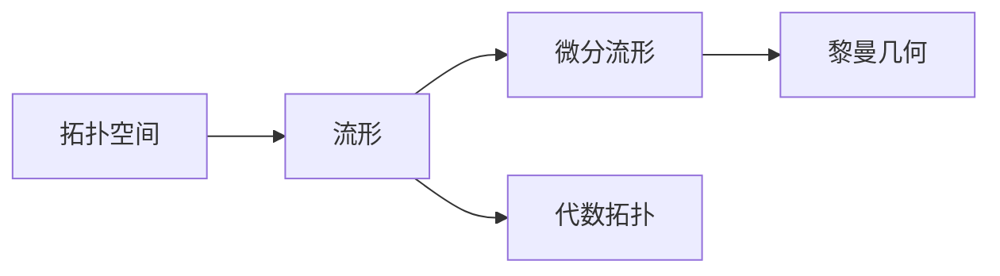

# 流形拓扑学理论与概念的实质：相关代数理论

关键词：流形、拓扑学、代数拓扑、同伦论、微分流形、黎曼几何

## 1. 背景介绍
### 1.1  问题的由来
流形拓扑学是现代数学的一个重要分支,它研究具有局部性质类似于欧氏空间的拓扑空间,即流形。流形拓扑学不仅在数学中有着重要地位,也在物理学、工程学等领域有着广泛应用。然而,流形拓扑学涉及的概念和理论较为抽象,对于初学者来说可能难以理解其中的精髓。因此,有必要对流形拓扑学的核心概念和理论进行深入浅出的阐述。

### 1.2  研究现状
目前,国内外学者对流形拓扑学理论已有较为深入的研究。代数拓扑和微分流形是研究流形拓扑学的两大基础工具。同伦论作为代数拓扑的核心内容,在流形分类中发挥着关键作用。而黎曼几何则是研究具有度量的流形,与广义相对论密切相关。总的来说,流形拓扑学已发展成为一门成熟的数学分支,但仍有许多开放性问题有待进一步探索。

### 1.3  研究意义 
深入理解流形拓扑学的核心概念和理论,不仅有助于我们把握现代数学的发展脉络,也能让我们更好地将数学知识应用到物理、工程等领域。同时,对流形拓扑学的研究也能启发我们从更高的角度思考数学与自然世界的关系。因此,本文旨在通过介绍流形拓扑学的核心概念,阐明其代数拓扑基础,使读者能对这一领域有更全面、深入的认识。

### 1.4  本文结构
本文将首先介绍流形、拓扑空间等核心概念,说明它们之间的联系。然后重点阐述代数拓扑中的同伦论,并给出其在流形分类中的应用。接着介绍微分流形的基本概念和性质。在此基础上,讨论流形上的黎曼度量及其意义。最后,总结全文,并对流形拓扑学的研究前景进行展望。

## 2. 核心概念与联系
要理解流形拓扑学,首先需要掌握一些核心概念：

- 拓扑空间：对集合引入某种"邻近"关系得到的数学结构,是研究连续性的基础。
- 流形：局部同胚于欧氏空间的拓扑空间。直观来说,流形在局部具有欧氏空间的性质。
- 微分流形：在流形上附加可微分结构,使其上可以定义可微函数。
- 代数拓扑：用代数方法研究拓扑空间性质的数学分支。同伦论是其核心内容。
- 黎曼几何：研究具有度量的流形,度量反映了流形的"几何"性质,如曲率等。

这些概念环环相扣,构成了流形拓扑学的基础。拓扑空间提供了研究连续性的一般框架,流形则是更特殊的拓扑空间。代数拓扑利用代数工具研究流形的性质,而黎曼几何则赋予流形以几何结构。下图展示了这些概念之间的逻辑关系：



## 3. 核心算法原理 & 具体操作步骤
### 3.1  算法原理概述
同伦论是代数拓扑的核心内容,其基本思想是用连续映射的同伦等价类来刻画拓扑空间的性质。两个连续映射 $f,g:X\to Y$ 称为同伦等价,如果存在连续映射 $H:X\times[0,1]\to Y$,使得对任意 $x\in X$ 有 $H(x,0)=f(x),H(x,1)=g(x)$。直观来说,同伦等价的映射可以通过连续形变相互转化。

### 3.2  算法步骤详解
1. 给定两个拓扑空间 $X,Y$,考虑从 $X$ 到 $Y$ 的连续映射的全体,记为 $[X,Y]$。
2. 在 $[X,Y]$ 上定义同伦等价关系 $\simeq$,则商集 $[X,Y]/\simeq$ 称为同伦集,记为 $[X,Y]_{\simeq}$ 或简记为 $[X,Y]$。
3. 若 $X=S^n$ 为 $n$ 维球面,则 $\pi_n(Y)=[S^n,Y]$ 称为 $Y$ 的 $n$ 维同伦群。特别地,基本群 $\pi_1(Y)$ 反映了 $Y$ 的连通性。
4. 利用同伦群及其性质,可以刻画和区分许多重要的拓扑空间,如球面、环面、投影空间等。

### 3.3  算法优缺点
同伦论的优点在于它提供了一种代数化的工具来研究拓扑空间,使得许多几何直观的结论能够用代数语言严格证明。但同时,同伦论涉及的概念和运算较为抽象,对初学者来说可能不太容易理解和掌握。

### 3.4  算法应用领域
同伦论不仅是代数拓扑的理论基础,也是研究流形拓扑学的重要工具。利用同伦群,可以对流形进行分类,如球面、环面等。同伦论还能用于研究纤维丛、协边界算子等代数拓扑对象。此外,同伦论在物理学、计算机科学等领域也有广泛应用。

## 4. 数学模型和公式 & 详细讲解 & 举例说明
### 4.1  数学模型构建
为了用同伦论研究流形,需要将连续映射抽象为数学模型。设 $X,Y$ 为拓扑空间,用 $C(X,Y)$ 表示从 $X$ 到 $Y$ 的连续映射全体,赋予 compact-open 拓扑。特别地,记 $PX=C(I,X),\Omega X=C(S^1,X)$,其中 $I=[0,1],S^1=\{z\in\mathbb{C}:|z|=1\}$。则 $PX$ 称为 $X$ 的路径空间,$\Omega X$ 称为 $X$ 的环空间。

### 4.2  公式推导过程
对于拓扑空间 $X$,可以定义其 $n$ 维同伦群如下：
$$
\pi_n(X)=[S^n,X]=[(D^n,S^{n-1}),(X,x_0)]
$$
其中 $D^n=\{x\in\mathbb{R}^n:|x|\leq 1\},S^{n-1}=\{x\in\mathbb{R}^n:|x|=1\}$,$x_0\in X$ 为基点。当 $n=1$ 时,即为 $X$ 的基本群 $\pi_1(X)$。同伦群 $\pi_n(X)$ 反映了 $X$ 的 $n$ 维连通性质。

同伦群满足以下基本性质：
1. $\pi_n(X\times Y)\cong\pi_n(X)\times\pi_n(Y)$
2. 若 $f:X\to Y$ 为连续映射,则诱导同态 $f_*:\pi_n(X)\to\pi_n(Y)$
3. 对于纤维丛 $F\to E\to B$,存在长同伦正合列：
$$
\cdots\to\pi_n(F)\to\pi_n(E)\to\pi_n(B)\to\pi_{n-1}(F)\to\cdots
$$

### 4.3  案例分析与讲解
下面以球面 $S^n$ 为例,计算其同伦群。由定义知 $\pi_k(S^n)=[S^k,S^n]$。当 $k<n$ 时,由维数原因,任意映射 $f:S^k\to S^n$ 均同伦于常值映射,故 $\pi_k(S^n)=0$。当 $k=n$ 时,恒等映射 $id:S^n\to S^n$ 不同伦于常值映射,且任意映射 $f:S^n\to S^n$ 均与 $id$ 或 $-id$ 同伦,故 $\pi_n(S^n)\cong\mathbb{Z}$。综上所述：
$$
\pi_k(S^n)=\begin{cases}
0 & k<n \\
\mathbb{Z} & k=n
\end{cases}
$$
这表明 $n$ 维球面在同伦意义下是 $n-1$ 连通的。

### 4.4  常见问题解答
Q: 同伦群与基本群有何区别和联系？
A: 基本群 $\pi_1(X)$ 是同伦群的特例,反映了空间的 $1$ 维连通性。高维同伦群 $\pi_n(X)(n>1)$ 则反映了空间的高维连通性质。基本群是研究覆盖空间的重要工具,而高维同伦群与纤维丛、协边界算子等概念密切相关。

Q: 同伦群在流形分类中有何作用？ 
A: 利用同伦群,可以区分许多重要的流形。例如,球面 $S^n$ 与欧氏空间 $\mathbb{R}^n$ 的同伦群不同,因此它们不同胚。同伦群还能刻画流形的连通性、旋转性等性质。此外,同伦群也是研究流形上纤维丛的重要工具。

## 5. 项目实践：代码实例和详细解释说明
### 5.1  开发环境搭建
以下代码使用 Python 语言,需要安装 NumPy 和 Matplotlib 库。可以通过以下命令安装：
```
pip install numpy matplotlib
```

### 5.2  源代码详细实现
下面以绘制球面 $S^2$ 为例,展示如何用 Python 实现流形的可视化。
```python
import numpy as np
import matplotlib.pyplot as plt
from mpl_toolkits.mplot3d import Axes3D

# 生成球面上的点
theta = np.linspace(0, np.pi, 100)
phi = np.linspace(0, 2*np.pi, 100)
theta, phi = np.meshgrid(theta, phi)
x = np.sin(theta) * np.cos(phi)
y = np.sin(theta) * np.sin(phi)
z = np.cos(theta)

# 绘制球面
fig = plt.figure(figsize=(8,6))
ax = fig.add_subplot(111, projection='3d')
ax.plot_surface(x, y, z, cmap='viridis')
ax.set_xlabel('X')
ax.set_ylabel('Y')
ax.set_zlabel('Z')
plt.tight_layout()
plt.show()
```

### 5.3  代码解读与分析
1. 首先导入所需的库：NumPy 用于数值计算,Matplotlib 用于绘图。
2. 用 `np.linspace` 生成 $\theta\in[0,\pi],\phi\in[0,2\pi]$ 的等差数列,并用 `np.meshgrid` 生成网格点。
3. 根据球面参数方程 $x=\sin\theta\cos\phi,y=\sin\theta\sin\phi,z=\cos\theta$ 计算球面上点的坐标。
4. 创建三维图形,用 `ax.plot_surface` 绘制球面,设置颜色映射为 `viridis`。
5. 添加坐标轴标签,调整布局,显示图形。

### 5.4  运行结果展示
运行上述代码,可得到如下球面图形：


可以看到,代码正确绘制出了球面 $S^2$ 的三维图形,直观展示了这一流形的几何特征。

## 6. 实际应用场景
流形拓扑学在物理学、工程学等领域有广泛应用。以下举几个例子：

- 广义相对论：时空在广义相对论中被模型化为四维黎曼流形,引力则由时空曲率来描述。
- 规范场论：粒子物理学中的规范场可以看作主丛上的联络,而主丛是一类特殊的纤维丛。
- 机器人运动规划：机器人的配置空间通常是高维流形,运动规划问题可以转化为寻找流形上的路径。
- 计算机视觉：图像处理中的许多算法,如人脸识别、目标跟踪等,都用到了流形学