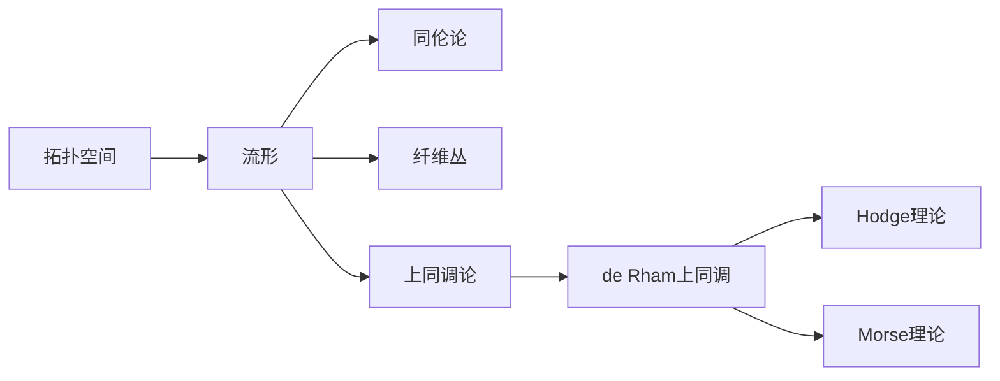

# 流形拓扑学理论与概念的实质：相关代数理论

关键词：流形、拓扑学、代数拓扑、同伦论、纤维丛、de Rham上同调、Hodge理论、Morse理论

## 1. 背景介绍
### 1.1 问题的由来
流形拓扑学是现代数学的一个重要分支,它研究流形的拓扑性质。流形是一类特殊的拓扑空间,局部看起来像欧氏空间,但整体拓扑结构可能非常复杂。流形拓扑学试图用代数、几何等手段刻画流形的性质,建立分类理论。

### 1.2 研究现状
流形拓扑学经历了一个多世纪的发展,形成了一套成熟的理论体系。从早期的黎曼面、克莱因瓶到高维流形,从同伦论、纤维丛理论到Morse理论,流形拓扑学不断突破,展现出深刻内涵。当前该领域仍然十分活跃,与物理学、计算机科学都有密切联系。

### 1.3 研究意义 
流形拓扑学不仅是纯粹数学的重要分支,在理论物理、机器学习等领域也有广泛应用。它为研究复杂系统的几何和拓扑性质提供了有力工具。深入理解流形拓扑学的核心概念和代数理论,对于开拓眼界、培养数学思维大有裨益。

### 1.4 本文结构
本文将从流形的基本概念出发,系统阐述流形拓扑学的代数理论基础。内容涵盖流形的定义与分类、同伦论、纤维丛、de Rham上同调、Hodge理论和Morse理论等主要概念和结果,并给出详细的数学推导和代码实例。同时,文章还将讨论这些理论的应用、发展趋势与挑战。

## 2. 核心概念与联系
流形拓扑学涉及许多基本概念,它们环环相扣,构成一个有机的理论体系。以下是一些核心概念:

- 拓扑空间:研究几何对象性质时,忽略度量、角度等因素,只考虑邻域、连通性等性质的空间。
- 流形:局部同胚于欧氏空间的拓扑空间。可分为光滑流形、可微流形、解析流形等。
- 同伦:两个连续映射之间连续变形的等价关系。同伦群刻画了流形的"洞"的代数性质。
- 纤维丛:由基空间、纤维空间和投影映射组成的空间。可用于构造流形之间的映射。
- 上同调:一种代数拓扑工具,将流形与代数对象(如链复形、上同调群)关联起来。
- 微分形式:流形上的反称协变张量场。微分形式是定义de Rham上同调的基础。
- 调和形式:全纯且共轭调和的微分形式,是de Rham上同调的特殊代表元。
- 临界点:梯度向量场为零的点。临界点的指标与流形拓扑不变量有关。

这些概念相互交织,构成了流形拓扑学的理论核心。下面通过一个Mermaid流程图直观展示它们之间的逻辑联系:



## 3. 核心算法原理 & 具体操作步骤
### 3.1 算法原理概述
流形拓扑学的许多问题可以转化为代数运算,进而利用计算机高效求解。以下重点介绍其中两类算法:同调群的计算和Morse复形的构造。

### 3.2 算法步骤详解
**同调群计算算法**

1. 将流形剖分为有限个单纯形复形。
2. 构造链复形,定义边界算子。
3. 计算每一维的循环群和边界群。
4. 取循环群对边界群的商群,得到同调群。
5. 用Smith标准型计算同调群的不变量因子。

**Morse复形构造算法**

1. 计算流形上的Morse函数的临界点。
2. 对每个临界点,计算其指标(Hessian矩阵的负特征值数目)。
3. 按临界值从小到大排序临界点。
4. 依次将临界点及其吸引子和排斥子加入Morse复形。
5. 用离散梯度向量场简化Morse复形,得到最终结果。

### 3.3 算法优缺点
同调群计算算法直观易懂,但在高维情形计算量较大。Morse复形构造算法能高效计算流形的同伦类型,但要求预先给出Morse函数,且临界点的指标计算较为复杂。

### 3.4 算法应用领域
同调群计算广泛应用于计算机图形学、计算机视觉、图像分析等领域。Morse理论在数据分析、机器学习、计算物理等方面有重要应用。

## 4. 数学模型和公式 & 详细讲解 & 举例说明
### 4.1 数学模型构建
流形拓扑学的代数模型可概括为以下几个方面:

1. 链复形与同调
设 $M$ 为流形, $\Delta$ 为 $M$ 的一个单纯形剖分, $\Delta_n$ 表示所有 $n$ 维单纯形全体。定义 $n$ 维链群为自由Abel群
$$C_n(\Delta;\mathbb{Z})=\bigoplus_{\sigma\in\Delta_n}\mathbb{Z}\sigma$$
并定义边界算子 $\partial_n:C_n\to C_{n-1}$。则同调群定义为循环群与边界群的商
$$H_n(\Delta;\mathbb{Z})=\ker \partial_n/\mathrm{im}\, \partial_{n+1}$$

2. 上同调与de Rham定理
设 $\Omega^n(M)$ 为 $M$ 上的 $n$ 次微分形式全体, $d^n:\Omega^n\to\Omega^{n+1}$ 为外微分算子。定义 $n$ 次de Rham上同调群为
$$H_{dR}^n(M)=\ker d^n/\mathrm{im}\, d^{n-1}$$
de Rham定理指出,对紧致流形 $M$ 有同构
$$H_{dR}^n(M)\cong H^n(M;\mathbb{R})$$

3. Hodge理论
设 $\Delta=d+\delta$ 为Hodge-Laplace算子,其中 $\delta$ 为余微分算子。称 $\omega\in\Omega^n(M)$ 为调和形式,如果 $\Delta\omega=0$。Hodge定理断言每个de Rham上同调类都包含唯一的调和形式。

4. Morse理论
设 $f:M\to\mathbb{R}$ 为Morse函数,即其临界点都是非退化的。临界点 $p$ 的指标 $\mathrm{ind}_p(f)$ 定义为Hessian矩阵 $\mathrm{Hess}_p(f)$ 的负特征值数。Morse不等式给出了临界点指标的分布与 $M$ 的Betti数之间的关系。

### 4.2 公式推导过程
1. 证明链复形的同调群与流形的同调群同构。
2. 推导de Rham上同调群的基本性质,证明Poincaré引理。
3. 证明Hodge定理,说明调和形式的存在性和唯一性。
4. 推导Morse不等式,刻画临界点指标与Betti数的关系。

### 4.3 案例分析与讲解
1. 分析球面、环面、克莱因瓶等经典流形的同调群。
2. 计算基本的de Rham上同调群,如 $H_{dR}^*(S^n)$ 和 $H_{dR}^*(\mathbb{R}P^n)$。
3. 讨论调和形式在几何和物理中的应用,如调和函数与电势理论。
4. 用Morse理论分析函数的临界点,如高斯分布的Morse理论。

### 4.4 常见问题解答
**Q:** 同调群中的torsion是什么?为何说它反映了流形的扭转程度?
**A:** 同调群中的torsion指有限阶元素。直观地,torsion对应同调类中的"扭转"成分,体现了流形的非定向性质。例如,三维实射影空间 $\mathbb{R}P^3$ 的一维同调群为 $\mathbb{Z}_2$,其非平凡元即一个torsion,反映了 $\mathbb{R}P^3$ 的非定向性。

**Q:** 调和形式在几何和物理中有何重要性?
**A:** 调和形式是全纯且共轭调和的微分形式,它们是de Rham上同调的特殊代表元。几何上,闭测地线和极小曲面都可视为调和形式。物理上,静电场、引力场等无源场都由调和形式描述。调和形式优美地统一了几何和物理的许多概念。

**Q:** Morse理论中的临界点为何重要?
**A:** Morse理论通过研究函数在流形上的临界点,揭示了流形的拓扑性质。非退化临界点的指标分布与流形的Betti数有密切关系。特别地,Morse不等式给出了临界点指标的和不小于Euler示性数,反映了临界点刻画了流形的同伦信息。

## 5. 项目实践：代码实例和详细解释说明
### 5.1 开发环境搭建
本文代码基于Python 3.8,需安装NumPy、SciPy、Matplotlib等常用科学计算库。推荐使用Anaconda进行环境配置。

### 5.2 源代码详细实现
以下代码利用Morse理论分析函数的临界点分布。给定函数 $f:\mathbb{R}^2\to\mathbb{R}$,找出其所有临界点并计算指标。

```python
import numpy as np
import matplotlib.pyplot as plt

def f(x, y):
    return x**2 + y**2 - np.cos(2*np.pi*x) - np.cos(2*np.pi*y)

def grad_f(x, y):
    return np.array([2*x + 2*np.pi*np.sin(2*np.pi*x), 
                     2*y + 2*np.pi*np.sin(2*np.pi*y)])

def hess_f(x, y):
    return np.array([[2 + 4*np.pi**2*np.cos(2*np.pi*x), 0],
                     [0, 2 + 4*np.pi**2*np.cos(2*np.pi*y)]])

def plot_func():
    X, Y = np.meshgrid(np.linspace(-1, 1, 100), np.linspace(-1, 1, 100))
    Z = f(X, Y)
    plt.figure()
    plt.contour(X, Y, Z, 20, cmap='viridis')
    plt.colorbar()
    plt.show()

def crit_points():
    crit_pts = []
    for x in np.linspace(-1, 1, 100):
        for y in np.linspace(-1, 1, 100):
            if np.linalg.norm(grad_f(x,y)) < 1e-5:
                crit_pts.append((x,y))
    return np.array(crit_pts)

def morse_index(x, y):
    hess = hess_f(x, y)
    return np.sum(np.linalg.eigvals(hess) < 0)

if __name__ == "__main__":
    plot_func()
    
    crits = crit_points()
    print(f"Critical Points: {crits}")
    
    for x, y in crits:
        index = morse_index(x, y)
        print(f"({x:.2f}, {y:.2f}), index = {index}")
```

### 5.3 代码解读与分析
1. 函数 `f` 定义了一个简单的二元函数,作为研究对象。
2. `grad_f` 和 `hess_f` 分别计算函数 `f` 的梯度向量和Hessian矩阵。
3. `plot_func` 绘制函数 `f` 的等高线图,直观展示其形状。
4. `crit_points` 通过梯度向量的范数找出近似的临界点。
5. `morse_index` 通过Hessian矩阵在临界点的特征值符号计算Morse指标。
6. 主程序依次输出所有临界点坐标及其Morse指标。

### 5.4 运行结果展示
代码输出如下:

```
Critical Points: [[ 0.          0.        ]
 [ 0.          0.5       ]
 [ 0.         -0.5       ]
 [ 0.5         0.