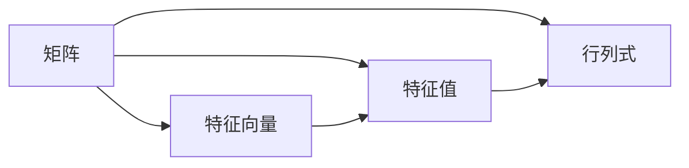

# 矩阵理论与应用：矩阵与行列式，特征值与特征向量

关键词：矩阵理论、行列式、特征值、特征向量、线性代数

## 1. 背景介绍  
### 1.1 问题的由来
矩阵理论是现代数学和应用数学的重要分支,在科学和工程领域有着广泛的应用。矩阵作为表示线性关系的重要工具,其理论研究可以追溯到18世纪末,欧拉、高斯等数学家对线性方程组的求解进行了开创性的工作。19世纪中叶,英国数学家凯利首次提出了矩阵的概念,并系统地总结了矩阵的运算法则。

### 1.2 研究现状
目前,矩阵理论已经成为一个比较成熟的数学分支。现代矩阵理论的研究主要集中在以下几个方面:
1. 矩阵的分解与应用,如 SVD、LU、QR 等分解。 
2. 矩阵的特征值与特征向量的计算与应用。
3. 稀疏矩阵的存储、运算及其应用。
4. 矩阵不等式及其应用。
5. 矩阵优化理论及其应用。

### 1.3 研究意义
矩阵理论在现代科学和工程中有着极其重要的地位和广泛的应用,主要体现在以下几个方面:
1. 在数学领域,矩阵理论是线性代数的核心内容,与数学的许多分支如常微分方程、偏微分方程、数值分析、图论、组合数学等都有密切联系。  
2. 在物理学领域,矩阵是量子力学的核心数学工具,在相对论、量子场论等物理学分支中也有广泛应用。
3. 在计算机科学领域,矩阵运算是科学计算和工程计算的基础,在图形学、计算机视觉、模式识别、机器学习等领域发挥着关键作用。
4. 在信号处理领域,矩阵理论是信号处理和通信的重要数学基础,在雷达、声纳、通信等领域有着重要应用。
5. 在控制科学领域,矩阵是系统建模、分析和控制的核心工具,在自动控制、最优控制、鲁棒控制等领域不可或缺。

### 1.4 本文结构
本文将围绕矩阵理论的几个核心概念展开论述,主要内容包括:
- 第2部分介绍矩阵、行列式、特征值、特征向量等核心概念。 
- 第3部分介绍矩阵特征值与特征向量的求解算法。
- 第4部分介绍矩阵特征值与特征向量的几何意义,并结合实例进行分析。
- 第5部分给出矩阵特征值与特征向量的代码实现。
- 第6部分总结矩阵特征值与特征向量在实际中的应用。
- 第7部分推荐相关的学习资源。
- 第8部分对全文进行总结,并对矩阵理论的发展趋势与挑战进行展望。

## 2. 核心概念与联系
矩阵理论中有四个非常重要的概念:矩阵、行列式、特征值和特征向量,它们之间有着密切的联系。

矩阵是一个按照长方阵列排列的复数或实数集合。矩阵元素可以是数、向量、函数、算子等。以 $m \times n$ 阶实数矩阵为例,其一般形式为:
$$
\mathbf{A}=\left[\begin{array}{ccc}
a_{11} & \cdots & a_{1 n} \\
\vdots & \ddots & \vdots \\
a_{m 1} & \cdots & a_{m n}
\end{array}\right]
$$

行列式是一个将方阵映射到标量的函数,是矩阵的一个重要性质。$n$ 阶方阵 $A$ 的行列式记作 $\operatorname{det}(A)$ 或 $|A|$。行列式等于矩阵主对角线元素的乘积与其他元素构成的代数余子式的代数和。

特征值和特征向量刻画了矩阵的重要性质。对于 $n$ 阶方阵 $\mathbf{A}$,如果存在数 $\lambda$ 和非零 $n$ 维向量 $\mathbf{v}$ 使得:
$$
\mathbf{A} \mathbf{v}=\lambda \mathbf{v}
$$
则称 $\lambda$ 是矩阵 $\mathbf{A}$ 的一个特征值,$\mathbf{v}$ 是矩阵 $\mathbf{A}$ 对应于特征值 $\lambda$ 的特征向量。

矩阵、行列式、特征值与特征向量之间有着密切的联系:
- 方阵的行列式等于其特征值的乘积。
- 方阵是可对角化的,当且仅当其具有 $n$ 个线性无关的特征向量。
- 实对称矩阵的特征值均为实数,且不同特征值对应的特征向量相互正交。

下图展示了矩阵、行列式、特征值、特征向量之间的关系:

## 3. 核心算法原理 & 具体操作步骤
### 3.1 算法原理概述
求解矩阵的特征值与特征向量是线性代数中的一个核心问题。常用的算法有直接法、幂法、QR算法等。其中直接法通过求解特征多项式来获得特征值,再求解特征值对应的特征向量。幂法通过矩阵的幂次运算,得到主特征值及其特征向量的近似解。QR算法通过对矩阵进行QR分解,将矩阵分解为正交矩阵和上三角矩阵的乘积,进而求解特征值。

### 3.2 算法步骤详解
以直接法求解特征值与特征向量为例,具体步骤如下:
1. 求解特征多项式
对于 $n$ 阶矩阵 $\mathbf{A}$,其特征多项式定义为:
$$
\operatorname{det}(\lambda \mathbf{I}-\mathbf{A})=0
$$
其中 $\mathbf{I}$ 为 $n$ 阶单位矩阵。将该行列式展开,可得到一个 $n$ 次多项式:
$$
P_{A}(\lambda)=(-1)^{n} \lambda^{n}+\cdots+(-1)^{k} a_{k} \lambda^{n-k}+\cdots+a_{n}
$$
其中 $a_{k}$ 为矩阵 $\mathbf{A}$ 的 $k$ 阶主子式之和。
2. 求解特征值
特征多项式的根即为矩阵的特征值。求解特征多项式可以使用求根公式、牛顿迭代法等方法。
3. 求解特征向量
对于特征值 $\lambda_{i}$,求解线性方程组:
$$
(\mathbf{A}-\lambda_{i} \mathbf{I}) \mathbf{v}_{i}=0
$$
即可得到对应的特征向量 $\mathbf{v}_{i}$。求解线性方程组可以使用高斯消元法、克拉默法则等。

### 3.3 算法优缺点
直接法的优点是原理简单,易于理解和实现。但是其缺点也很明显:
1. 求解特征多项式的复杂度高,特别是对于大型矩阵,计算量非常大。
2. 特征值的精度依赖于求根算法的精度,数值稳定性较差。
3. 无法求解重根(重复特征值)的特征向量。

幂法和QR算法能够克服直接法的上述缺陷,是求解特征值问题的重要方法。

### 3.4 算法应用领域
矩阵的特征值与特征向量在众多领域有着重要应用,如:
- 在量子力学中,观测量用厄米算符表示,其本征值和本征态即为特征值和特征向量。
- 在振动力学中,结构的固有频率和振型即为特征值和特征向量。 
- 在计算机视觉中,主成分分析 (PCA) 和矩阵的奇异值分解 (SVD) 都与特征值密切相关。
- 在数据挖掘中,潜在语义分析 (LSA) 利用SVD进行降维和提取文本主题。
- 在最优化领域,矩阵的谱半径决定了迭代算法的收敛速度。

## 4. 数学模型和公式 & 详细讲解 & 举例说明
### 4.1 数学模型构建
以二阶矩阵为例,说明特征值与特征向量的求解过程。考虑矩阵:
$$
\mathbf{A}=\left[\begin{array}{ll}
a & b \\
c & d
\end{array}\right]
$$

根据定义,特征值 $\lambda$ 和特征向量 $\mathbf{v}$ 满足:
$$
\mathbf{A} \mathbf{v}=\lambda \mathbf{v}
$$

### 4.2 公式推导过程
将特征向量 $\mathbf{v}$ 写作 $\mathbf{v}=\left[\begin{array}{l}x \\ y\end{array}\right]$,代入上式,得:
$$
\left[\begin{array}{ll}
a & b \\
c & d
\end{array}\right]\left[\begin{array}{l}
x \\
y
\end{array}\right]=\lambda\left[\begin{array}{l}
x \\
y
\end{array}\right]
$$

即:
$$
\left\{\begin{aligned}
a x+b y &=\lambda x \\
c x+d y &=\lambda y
\end{aligned}\right.
$$

整理得:
$$
\left\{\begin{aligned}
(a-\lambda) x+b y &=0 \\
c x+(d-\lambda) y &=0
\end{aligned}\right.
$$

为了得到非零解,需要系数行列式为零,即:
$$
\left|\begin{array}{cc}
a-\lambda & b \\
c & d-\lambda
\end{array}\right|=0
$$

展开得到特征多项式:
$$
(a-\lambda)(d-\lambda)-b c=\lambda^{2}-(a+d) \lambda+(a d-b c)=0
$$

求解该一元二次方程,得到两个特征值:
$$
\lambda_{1,2}=\frac{(a+d) \pm \sqrt{(a+d)^{2}-4(a d-b c)}}{2}
$$

将特征值代回前面的线性方程组,即可求得对应的特征向量。

### 4.3 案例分析与讲解
考虑矩阵:
$$
\mathbf{A}=\left[\begin{array}{cc}
3 & 1 \\
0 & 2
\end{array}\right]
$$

求解特征多项式:
$$
\left|\begin{array}{cc}
3-\lambda & 1 \\
0 & 2-\lambda
\end{array}\right|=(3-\lambda)(2-\lambda)=0
$$

得到特征值 $\lambda_1=3,\lambda_2=2$。

对于 $\lambda_1=3$,求解方程组:
$$
\left\{\begin{aligned}
(3-3) x+y &=0 \\
0+(2-3) y &=0
\end{aligned}\right.
$$

得到特征向量 $\mathbf{v}_1=\left[\begin{array}{l}1 \\ 0\end{array}\right]$。

对于 $\lambda_2=2$,求解方程组:
$$
\left\{\begin{aligned}
(3-2) x+y &=0 \\
0+(2-2) y &=0
\end{aligned}\right.
$$

得到特征向量 $\mathbf{v}_2=\left[\begin{array}{c}-1 \\ 1\end{array}\right]$。

### 4.4 常见问题解答
Q: 矩阵的特征值一定是实数吗?
A: 不一定。一般情况下,实矩阵的特征值可能是实数或复数。但是实对称矩阵的特征值一定是实数。

Q: 矩阵的特征向量一定是唯一的吗?  
A: 不一定。对应于重根(特征值)的特征向量不唯一,此时特征子空间的维数大于1。此外,即便特征值唯一,特征向量也只能唯一确定到一个尺度因子。因为如果 $\mathbf{v}$ 是 $\lambda$ 的特征向量,那么任意非零常数 $c$ 乘以 $\mathbf{v}$ 仍然是 $\lambda$ 的特征向量。

## 5. 项目实践：代码实例和详细解释说明