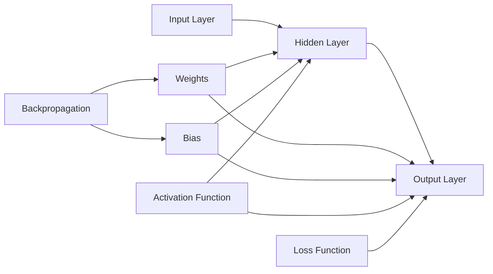
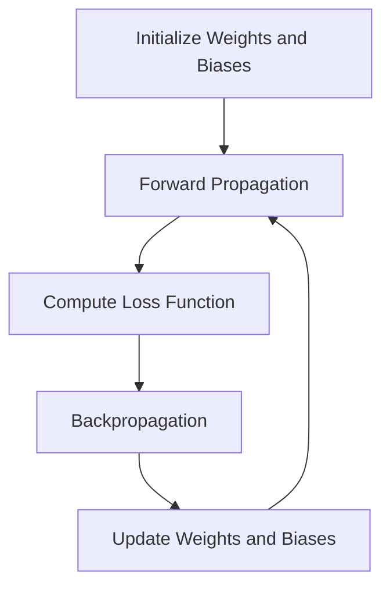

# 神经网络原理与代码实例讲解

作者：禅与计算机程序设计艺术 / Zen and the Art of Computer Programming 

关键词：神经网络、深度学习、反向传播、梯度下降、TensorFlow

## 1. 背景介绍
### 1.1  问题的由来
人工智能(Artificial Intelligence, AI)是计算机科学的一个分支,它致力于研究如何让计算机模拟甚至超越人类的智能。而机器学习(Machine Learning, ML)则是实现人工智能的一种手段。在机器学习的众多算法中,神经网络(Neural Network,NN)因其强大的非线性拟合能力和并行计算能力而备受关注。

神经网络是一种模仿生物神经网络(动物的中枢神经系统,特别是大脑)的结构和功能的数学模型或计算模型。神经网络由大量的人工神经元相互连接进行计算,在机器学习和认知科学领域被用来对函数进行估计或近似。

### 1.2  研究现状
近年来,随着大数据和计算能力的快速发展,神经网络,尤其是深度神经网络(Deep Neural Network, DNN)在计算机视觉、语音识别、自然语言处理等领域取得了突破性的进展,甚至在某些任务上已经超越了人类的表现。

一些著名的神经网络架构如 AlexNet、VGGNet、GoogLeNet、ResNet 等在 ImageNet 大规模视觉识别挑战赛(ILSVRC)中取得了骄人的成绩。而在自然语言处理领域,基于 Transformer 架构的语言模型如 BERT、GPT 等也取得了令人瞩目的成果。

### 1.3  研究意义
神经网络强大的学习和泛化能力使其在人工智能领域具有广阔的应用前景。深入理解神经网络的原理,掌握其实现方法,对于推动人工智能技术的发展具有重要意义。

同时,神经网络本身也是一个值得研究的课题。探索神经网络的理论基础,改进其结构和训练算法,对于提升神经网络的性能和效率,解决其可解释性差、泛化能力不足等问题具有重要意义。

### 1.4  本文结构
本文将从以下几个方面对神经网络进行介绍和讲解：

- 第2部分介绍神经网络的核心概念及其联系
- 第3部分讲解神经网络的核心算法原理及具体操作步骤
- 第4部分介绍神经网络涉及的数学模型和公式,并进行详细讲解和举例说明
- 第5部分给出神经网络的代码实例,并对其进行详细解释说明
- 第6部分探讨神经网络的实际应用场景
- 第7部分推荐神经网络相关的学习资源、开发工具和论文
- 第8部分对全文进行总结,并对神经网络的未来发展趋势和面临的挑战进行展望
- 第9部分列出神经网络领域的一些常见问题及其解答

## 2. 核心概念与联系

在讨论神经网络的原理和实现之前,我们首先需要了解一些核心概念：

- 神经元(Neuron):神经网络的基本单元。每个神经元接收一些输入,对其进行加权求和,然后通过激活函数产生输出。生物神经元通过突触连接,而人工神经元通过数值权重连接。

- 层(Layer):神经元的集合。一个神经网络通常由输入层、隐藏层和输出层组成。每一层中的神经元通常具有相同的激活函数。

- 权重(Weight)和偏置(Bias):神经元之间连接的强度。权重决定了每个输入对神经元的影响程度,偏置则是神经元的一个固有属性,可以看作一个始终为1的输入的权重。

- 激活函数(Activation Function):一个非线性函数,决定了神经元如何对输入进行响应。常见的激活函数包括 Sigmoid、Tanh、ReLU 等。

- 前向传播(Forward Propagation):信息从输入层经过隐藏层到达输出层的过程。每个神经元的输出通过权重传递到下一层的神经元。

- 损失函数(Loss Function):衡量神经网络输出与真实值之间差异的函数。常见的损失函数包括均方误差(MSE)、交叉熵(Cross-entropy)等。

- 反向传播(Backpropagation):一种用于计算神经网络中每个参数梯度的算法。通过梯度下降等优化算法,根据梯度调整权重和偏置,使损失函数最小化。

- 梯度下降(Gradient Descent):一种优化算法,通过沿着损失函数梯度的反方向调整参数,寻找损失函数的最小值。

下图展示了一个简单的神经网络结构及其核心概念之间的联系:

## 3. 核心算法原理 & 具体操作步骤
### 3.1  算法原理概述
神经网络的核心算法主要包括前向传播和反向传播两个过程。

前向传播是信息从输入层经过隐藏层到达输出层的过程。每个神经元接收来自上一层神经元的输入,对其进行加权求和,再通过激活函数产生输出,并将输出传递到下一层神经元。这个过程可以用下面的公式表示:

$$
z_j^l = \sum_i w_{ij}^l a_i^{l-1} + b_j^l \\
a_j^l = \sigma(z_j^l)
$$

其中,$z_j^l$表示第$l$层第$j$个神经元的加权输入,$w_{ij}^l$表示第$l-1$层第$i$个神经元到第$l$层第$j$个神经元的权重,$a_i^{l-1}$表示第$l-1$层第$i$个神经元的输出,$b_j^l$表示第$l$层第$j$个神经元的偏置,$\sigma$表示激活函数,$a_j^l$表示第$l$层第$j$个神经元的输出。

反向传播是一种用于计算神经网络中每个参数梯度的算法。首先,根据损失函数计算出输出层的误差。然后,利用链式法则,将误差逐层向前传播,计算出每个参数的梯度。最后,根据梯度使用优化算法(如梯度下降)调整权重和偏置,使损失函数最小化。反向传播的核心公式如下:

$$
\delta_j^l = 
\begin{cases}
\frac{\partial C}{\partial a_j^L} \sigma'(z_j^L) & \text{if } l = L \\
(\sum_k w_{kj}^{l+1} \delta_k^{l+1}) \sigma'(z_j^l) & \text{if } l < L
\end{cases}
$$

$$
\frac{\partial C}{\partial w_{ij}^l} = a_i^{l-1} \delta_j^l \\
\frac{\partial C}{\partial b_j^l} = \delta_j^l
$$

其中,$C$表示损失函数,$\delta_j^l$表示第$l$层第$j$个神经元的误差,$L$表示输出层。$\frac{\partial C}{\partial w_{ij}^l}$和$\frac{\partial C}{\partial b_j^l}$分别表示损失函数对权重$w_{ij}^l$和偏置$b_j^l$的偏导数,即梯度。

### 3.2  算法步骤详解

神经网络的训练过程可以分为以下几个步骤:

1. 初始化权重和偏置。通常使用随机值进行初始化。

2. 前向传播。将输入数据传递到神经网络,计算每个神经元的输出,直到得到输出层的结果。

3. 计算损失函数。将输出层的结果与真实值进行比较,计算损失函数的值。

4. 反向传播。根据损失函数,计算输出层的误差,然后逐层向前传播误差,计算每个参数的梯度。

5. 更新权重和偏置。使用优化算法(如梯度下降)根据梯度更新权重和偏置,使损失函数最小化。

6. 重复步骤2-5,直到损失函数收敛或达到预设的迭代次数。

下图展示了神经网络的训练过程:

### 3.3  算法优缺点

神经网络算法的优点包括:

- 强大的非线性拟合能力,可以处理复杂的模式识别和预测任务。
- 并行计算能力,可以高效地处理大规模数据。
- 具有自适应性和容错性,可以适应不同的输入和噪声。

神经网络算法的缺点包括:

- 训练过程需要大量的数据和计算资源。
- 模型可解释性差,难以理解神经网络的决策过程。
- 容易出现过拟合,泛化能力不足。

### 3.4  算法应用领域

神经网络算法在许多领域都有广泛的应用,包括:

- 计算机视觉:图像分类、目标检测、语义分割等。
- 语音识别:语音转文本、说话人识别等。
- 自然语言处理:机器翻译、情感分析、文本分类等。
- 推荐系统:个性化推荐、协同过滤等。
- 游戏人工智能:下棋、对战等。
- 金融预测:股票预测、信用风险评估等。

## 4. 数学模型和公式 & 详细讲解 & 举例说明
### 4.1  数学模型构建
神经网络可以看作一个复合函数,将输入映射到输出。假设一个神经网络有$L$层,每层有$n_l$个神经元。我们用$a_j^l$表示第$l$层第$j$个神经元的输出,用$w_{ij}^l$表示第$l-1$层第$i$个神经元到第$l$层第$j$个神经元的权重,用$b_j^l$表示第$l$层第$j$个神经元的偏置。那么,神经网络的数学模型可以表示为:

$$
a_j^l = \sigma(\sum_i w_{ij}^l a_i^{l-1} + b_j^l)
$$

其中,$\sigma$表示激活函数。常见的激活函数包括:

- Sigmoid函数:$\sigma(x) = \frac{1}{1+e^{-x}}$
- Tanh函数:$\tanh(x) = \frac{e^x - e^{-x}}{e^x + e^{-x}}$
- ReLU函数:$\text{ReLU}(x) = \max(0, x)$

神经网络的训练目标是找到一组权重和偏置,使得神经网络的输出与真实值尽可能接近。这可以通过最小化损失函数来实现。常见的损失函数包括:

- 均方误差(MSE):$C = \frac{1}{2n} \sum_x \lVert y(x) - a^L(x) \rVert^2$
- 交叉熵(Cross-entropy):$C = -\frac{1}{n} \sum_x [y(x) \ln a^L(x) + (1-y(x)) \ln (1-a^L(x))]$

其中,$n$表示样本数,$y(x)$表示样本$x$的真实值,$a^L(x)$表示神经网络对样本$x$的输出。

### 4.2  公式推导过程
下面我们以均方误差为例,推导反向传播算法中的核心公式。

首先,我们计算输出层的误差:

$$
\delta_j^L = \frac{\partial C}{\partial a_j^L} \sigma'(z_j^L)
$$

其中,$z_j^L = \sum_i w_{ij}^L a_i^{L-1} + b_j^L$。对于均方误差,有:

$$
\frac{\partial C}{\partial a_j^L} = \frac{1}{n} (a_j^L - y_j)
$$

因此,输出层的误差为:

$$
\delta_j^L = \frac{1}{n} (a_j^L - y_j) \sigma'(z_j^L)
$$

接下来,我们推导隐藏层的误差。根据链式法则