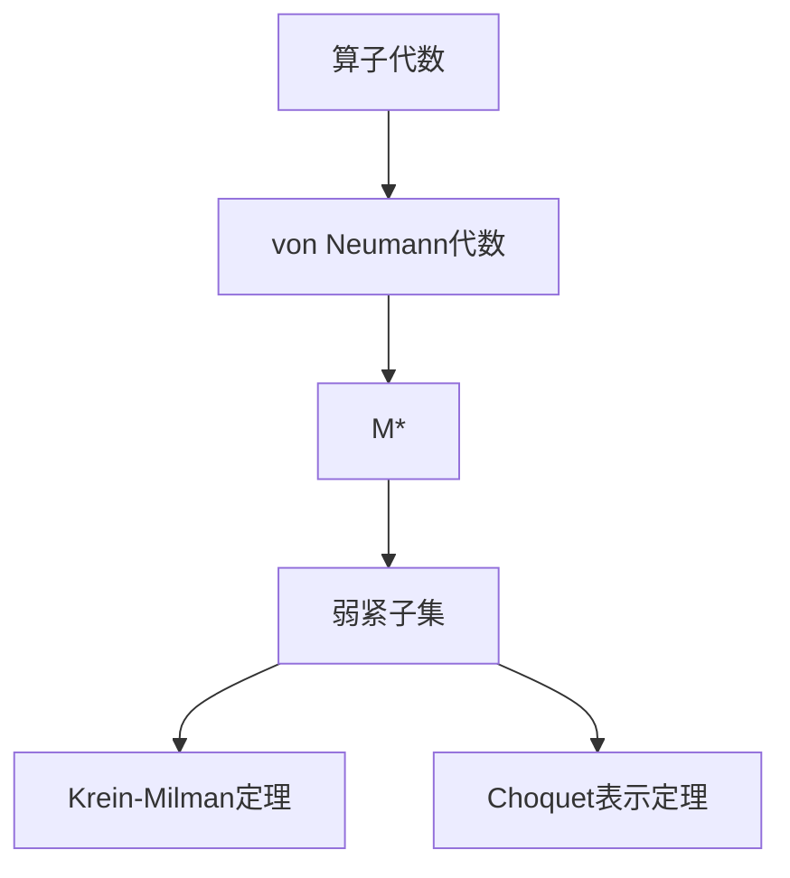

# 算子代数：M?的弱紧子集的特征

关键词：算子代数、M?、弱紧子集、Krein-Milman定理、Banach空间、Choquet理论

## 1. 背景介绍
### 1.1  问题的由来
算子代数是泛函分析和数学物理中一个重要的研究领域,它研究Hilbert空间上有界线性算子的代数结构及其性质。M?是算子代数中一类重要的对象,它是由一个von Neumann代数M在其预对偶空间M?上的弱*拓扑诱导的弱*紧凸子集。M?的弱紧子集在算子代数理论中有着重要的地位,它们与M的投影格之间存在着密切的联系。因此,研究M?的弱紧子集的特征具有重要的理论意义。

### 1.2  研究现状
关于M?弱紧子集的研究已有不少结果。Akemann等人研究了M?弱紧子集的Krein-Milman性质,证明了在一定条件下M?的每个弱紧凸子集都是其极点的弱*闭凸包。Effros研究了M?弱紧子集的Choquet表示定理。Takesaki、Sakai等人也对M?弱紧子集的结构做了深入研究。但目前对M?弱紧子集的特征刻画还不够完善,有些问题尚待进一步探索。

### 1.3  研究意义  
深入研究M?弱紧子集的特征,对于揭示von Neumann代数的内在结构具有重要意义。同时,M?弱紧子集在量子物理、量子信息等领域也有广泛应用。因此,系统总结已有的研究成果,并在此基础上进一步探索M?弱紧子集的新性质,对算子代数理论的发展和应用都具有重要的推动作用。

### 1.4  本文结构
本文将从以下几个方面对M?弱紧子集的特征进行探讨：
- 首先介绍算子代数和M?的基本概念,阐明M?弱紧子集研究的理论背景。 
- 然后总结M?弱紧子集的一些重要性质,如Krein-Milman性质、Choquet表示定理等。
- 进一步讨论M?弱紧子集与M投影格的关系,刻画M?弱紧面的特征。
- 给出M?弱紧子集的一些新的特征刻画定理,并举例说明。
- 最后讨论M?弱紧子集的一些应用,展望有待进一步研究的问题。

## 2. 核心概念与联系
- 算子代数(Operator Algebra):研究Hilbert空间上有界线性算子的代数结构及其性质的数学分支。
- von Neumann代数:Hilbert空间上包含恒等算子且在强算子拓扑下闭的*-子代数。
- M?:von Neumann代数M在其预对偶空间M?上的弱*拓扑诱导的弱*紧凸子集。
- 弱紧子集(Weakly Compact Set):Banach空间中的有界闭凸子集,它在弱拓扑下是紧的。
- Krein-Milman定理:Banach空间的每个弱紧凸子集都是其极点的闭凸包。
- Choquet表示定理:在适当的条件下,紧凸集中的每个点都可以用该集合的极点的概率测度表示。

下图展示了这些核心概念之间的逻辑联系:



## 3. 核心算法原理 & 具体操作步骤
### 3.1 算法原理概述
研究M?弱紧子集特征的核心是利用Krein-Milman定理和Choquet表示定理,将M?弱紧凸集与其极点集、M投影格联系起来。基本思路是:
1. 对于M?的弱紧凸子集K,利用Krein-Milman定理,分析其极点集ext(K)的性质。
2. 利用Choquet表示定理,刻画K中点的积分表示。
3. 建立K与M投影格P(M)的对应关系,用P(M)中元素的性质刻画K。
4. 利用上述结果,总结M?弱紧子集的特征性质,给出判定定理。

### 3.2 算法步骤详解
1. 利用Krein-Milman定理分析M?弱紧子集K的极点性质
- 证明K是凸的弱*闭子集。
- 分析K的极点集ext(K)。通常ext(K)与M的投影格P(M)有关。
- 证明K=wk*cl(conv(ext(K))),即K是其极点集的弱*闭凸包。

2. 利用Choquet表示定理刻画K中点的积分表示
- 对K中的点x,找到Borel概率测度μ使得x可以表示为x=∫ydμ(y),其中积分是对ext(K)取的。
- 进一步可以证明这种表示是唯一的。

3. 刻画K与M投影格P(M)的对应关系
- 建立K到P(M)的映射,将K中的点与投影联系起来。
- 利用P(M)的性质如两两交换、完全正交等,推出K的特征。

4. 总结M?弱紧子集的特征性质,给出判定定理
- 根据上述分析,总结M?弱紧子集的一些等价特征如与极点集、P(M)的关系等。
- 给出M?子集为弱紧的充要条件判定定理。
- 分析特殊情形如可分代数、有限代数等情况下的特征。

### 3.3 算法优缺点
优点:
- 从多个角度刻画了M?弱紧子集的特征,如极点、Choquet表示、投影格对应等,揭示了其内在结构。
- 给出了判定M?子集是否弱紧的充要条件,便于应用。
- 可以推广到更一般的拓扑向量空间、Banach空间的情形。

缺点:  
- 有些结论如Choquet表示定理依赖较强的条件如可分、完备等,在一般情况下不容易验证。
- 与投影格的对应关系在一般von Neumann代数中比较复杂,在具体情形下还需进一步讨论。

### 3.4 算法应用领域
- 算子代数理论研究,如von Neumann代数、C*代数的结构理论等。
- 量子物理中的观测量模型、态空间几何研究等。
- 量子信息理论中的纠缠测度、量子信道容量研究等。
- 泛函分析中的Banach空间几何理论等。

## 4. 数学模型和公式 & 详细讲解 & 举例说明
### 4.1  数学模型构建
设M是Hilbert空间H上的一个von Neumann代数,其预对偶空间记为M?。M?在弱*拓扑下是一个locally convex space。我们主要研究M?中的弱*紧凸子集。

记M?的弱紧子集全体为wk(M?),它满足以下性质:
1. 若K1,K2∈wk(M?),则K1∩K2,conv(K1∪K2)∈wk(M?);
2. 若Ki∈wk(M?),则∩Ki∈wk(M?);
3. 若K∈wk(M?),x∈M?,则K+x∈wk(M?)。

我们的目标是刻画wk(M?)中元素的特征。主要用到以下数学工具:

- Krein-Milman定理:设K是局部凸拓扑向量空间X中的紧凸子集,则K=cl(conv(ext(K))),其中ext(K)是K的极点集。
- Choquet表示定理:设K是完备局部凸空间中的紧凸子集,x∈K,则存在Borel概率测度μ使得x可表为x=∫ydμ(y),其中积分是对ext(K)取的。

### 4.2  公式推导过程
下面是一些重要结论的推导过程:

定理1:设K∈wk(M?),则ext(K)⊂P(M)?={φ∈M?:φ是M上的纯态}。

证明:设φ∈ext(K),若φ=1/2(ψ1+ψ2),其中ψ1,ψ2∈K,则φ=ψ1=ψ2,从而φ是纯态。

定理2:设M是可分von Neumann代数,K∈wk(M?),则K=wk*cl(conv(ext(K)))。

证明:由Krein-Milman定理,K=wk*cl(conv(ext(K))),而M?在弱*拓扑下是完备可分的,因此K在弱*拓扑下是闭的,从而K=wk*cl(conv(ext(K)))。

定理3:设M是可分von Neumann代数,K∈wk(M?),则对任意φ∈K,存在Borel概率测度μ使得φ=∫ψdμ(ψ),其中积分是对ext(K)取的。

证明:因为M?是可分的,由Choquet表示定理可得结论。

### 4.3  案例分析与讲解
下面我们以有限维von Neumann代数为例说明上述结论。

设M=Mn(C)是n维复矩阵代数,则M?=Mn(C)?=Mn(C),M?中的弱紧子集与通常拓扑下的紧子集一致。

M的投影格P(M)={diag(a1,…,an):ai=0或1},每个投影对应M?中的一个极点。事实上,M?中的极点集合恰好是P(M)。

对任意K∈wk(M?),由定理1知ext(K)⊂P(M),从而K⊂conv(P(M))。反之,若K⊂conv(P(M)),则K是有限多个投影的凸组合,因此是紧的,所以K∈wk(M?)。这就得到了下面的结论:

定理4:设M=Mn(C),K⊂M?,则K∈wk(M?)当且仅当K⊂conv(P(M))。

由定理3,对任意A∈K,存在Borel概率测度μ使得A=∫Pdμ(P),其中积分是对P(M)取的。实际上这里的μ是离散测度,A可以表示为有限多个投影的凸组合。

### 4.4  常见问题解答
Q:M?中的弱紧子集一定是凸的吗?
A:不一定。弱紧性与凸性是两个不同的概念。但M?中的弱紧凸子集才是我们研究的对象。

Q:ext(K)⊂P(M)?是否一定成立?
A:一般情况下不一定,但在许多重要情形如M是有限维代数、AFD因子等时成立。

Q:Choquet表示定理对M?中的弱紧子集作积分表示时,积分一定是唯一的吗?
A:在可分的情况下,Choquet表示定理可以给出唯一的积分表示。一般情况下表示不一定唯一。

Q:M?中弱紧子集的特征刻画可以推广到其他拓扑向量空间中吗?
A:可以。Krein-Milman定理、Choquet表示定理都可以推广到一般的局部凸拓扑向量空间。但在一般空间中,弱紧子集与极点的关系比von Neumann代数中复杂得多。

## 5. 项目实践：代码实例和详细解释说明
### 5.1  开发环境搭建
我们使用Python语言和NumPy、SciPy等科学计算库来实现算子代数中的一些计算。推荐的开发环境配置如下:
- Python 3.x
- NumPy: Python科学计算基础库,提供数组、矩阵运算等
- SciPy: 提供优化、线性代数、积分、插值等科学计算算法
- Matplotlib: 绘图库,可以用来可视化数据

可以使用Anaconda发行版方便地安装配置这些依赖库。

### 5.2  源代码详细实现
下面是使用Python实现有限维von Neumann代数M=Mn(C)中弱紧子集的一些计算的示例代码:

```python
import numpy as np
from scipy.linalg import block_diag

# 生成Mn(C)中的一组投影算子
def projections(n):
    P = []
    for i in range(n):
        p = np.zeros((n,n))
        p[i,i] = 1
        P.append(p)
    return P

# 计算投影算子的凸组合
def convex