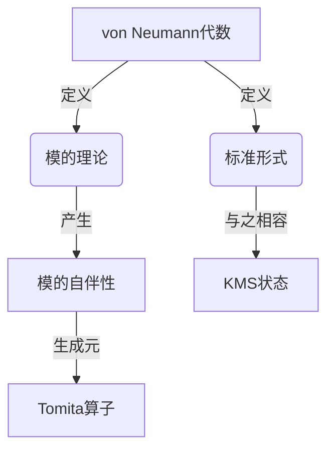

# 算子代数：Tomita-Takesaki理论

## 1. 背景介绍

### 1.1 问题的由来

算子代数是研究无限维线性空间上的有界线性算子的代数结构。它在数学物理、量子力学和功能分析等领域扮演着重要角色。然而,传统的算子代数理论主要关注有界算子,而对于无界算子的研究则相对较少。

20世纪60年代,日本数学家富田耕生(Minoru Tomita)和武仲稔(Masamichi Takesaki)开创性地提出了Tomita-Takesaki理论,为研究无界算子奠定了基础。他们的工作极大地推动了算子代数理论的发展,并在数学物理和量子论等领域产生了深远影响。

### 1.2 研究现状

Tomita-Takesaki理论的核心是模的理论(Modular Theory)和标准形式(Standard Form)。模的理论为无界算子提供了一种代数结构,而标准形式则给出了将无界算子分解为有界部分和无界部分的方法。

该理论的应用广泛且深入,包括:

- 在数学物理中,它为研究量子场论和统计力学提供了强有力的工具。
- 在算子代数中,它为von Neumann代数的结构理论和表示论做出了重大贡献。
- 在函数分析中,它与调和分析和微分几何等领域有着密切联系。

尽管Tomita-Takesaki理论已经存在60多年,但它依然是当代数学研究的活跃领域之一,不断有新的发展和应用被开拓出来。

### 1.3 研究意义

Tomita-Takesaki理论的重要意义在于:

1. 理论意义:它将无界算子纳入了算子代数的框架,极大地拓展了算子代数理论的范围和深度。
2. 应用意义:它为量子论、统计力学等领域提供了有力的数学工具,推动了这些领域的发展。
3. 交叉意义:它将算子代数、函数分析、微分几何等不同领域联系起来,促进了不同数学分支的交叉和融合。

### 1.4 本文结构

本文将全面介绍Tomita-Takesaki理论的核心内容和最新进展。我们将从理论的背景和动机出发,系统地阐述模的理论、标准形式以及相关的数学工具。此外,我们还将探讨该理论在数学物理、量子论等领域的应用,并展望其未来的发展方向和挑战。

## 2. 核心概念与联系

Tomita-Takesaki理论的核心概念包括:

1. **von Neumann代数**: 一个算子代数,由有界线性算子在强算子拓扑下的闭包构成。
2. **模的理论(Modular Theory)**: 研究von Neumann代数与其对应的模的代数之间的代数结构和性质。
3. **标准形式(Standard Form)**: 一种将无界算子分解为有界部分和无界部分的方法。
4. **模的自伴性(Modular Automorphism Group)**: 一个单参数群,描述了von Neumann代数与其对应模的代数之间的代数同构。
5. **Tomita算子(Tomita Operator)**: 模的自伴性的生成元,是一个无界算子。
6. **KMS状态(KMS State)**: 一类与模的自伴性相容的von Neumann代数上的状态。

这些概念相互关联,共同构成了Tomita-Takesaki理论的理论框架。其中,模的理论和标准形式是理论的两大支柱,而模的自伴性、Tomita算子和KMS状态则是理论的核心工具。

## 3. 核心算法原理 & 具体操作步骤

### 3.1 算法原理概述

Tomita-Takesaki理论的核心算法是标准形式(Standard Form),它将无界算子分解为有界部分和无界部分。具体来说,对于一个von Neumann代数$\mathcal{M}$及其对应的模的代数$\mathcal{M}'$,如果存在一个向量$\Omega$满足:

$$
\mathcal{M}\Omega = \mathcal{M}'\Omega
$$

则对于任意$x\in\mathcal{M}$,存在唯一的$\delta(x)\in\mathcal{M}$和$\gamma(x)\in\ker(\pi_\Omega)^\perp$,使得:

$$
x\Omega = \delta(x)\Omega + \gamma(x)
$$

其中$\pi_\Omega$是$\mathcal{M}$在$\Omega$上的表示,而$\ker(\pi_\Omega)^\perp$是其核的直交补空间。这就是标准形式的本质:将无界算子$x$分解为有界部分$\delta(x)$和无界部分$\gamma(x)$。

### 3.2 算法步骤详解

标准形式算法的具体步骤如下:

1. 给定von Neumann代数$\mathcal{M}$及其对应的模的代数$\mathcal{M}'$。
2. 找到一个向量$\Omega$,使得$\mathcal{M}\Omega = \mathcal{M}'\Omega$成立。这个$\Omega$被称为循环与分离向量。
3. 对于$\mathcal{M}$中的任意元素$x$,计算$x\Omega$。
4. 由于$x\Omega\in\overline{\mathcal{M}\Omega}=\overline{\mathcal{M}'\Omega}$,所以存在唯一的$\delta(x)\in\mathcal{M}$和$\gamma(x)\in\ker(\pi_\Omega)^\perp$,使得$x\Omega = \delta(x)\Omega + \gamma(x)$。
5. 这样,我们就得到了$x$的标准形式分解:$x = \delta(x) + \gamma(x)$,其中$\delta(x)$是有界部分,而$\gamma(x)$是无界部分。

需要注意的是,步骤2中寻找循环与分离向量$\Omega$是整个算法的关键。一旦找到了合适的$\Omega$,后续的计算就相对容易了。

### 3.3 算法优缺点

标准形式算法的优点在于:

1. 将无界算子纳入了算子代数的框架,极大拓展了算子代数理论的范围。
2. 为研究无界算子提供了一种有效的方法,使得无界算子也可以在代数结构中进行研究。
3. 在数学物理和量子论等领域有着广泛的应用,是一种强有力的数学工具。

然而,该算法也存在一些缺点:

1. 寻找循环与分离向量$\Omega$往往是一个很大的挑战,在具体情况中可能很难找到合适的$\Omega$。
2. 算法的计算过程可能会变得相当复杂,尤其是当处理无限维线性空间时。
3. 标准形式分解并不是唯一的,存在一定的自由度,这可能会带来一些不确定性。

### 3.4 算法应用领域

标准形式算法在以下领域有着广泛的应用:

1. **数学物理**: 在研究量子场论、统计力学等领域时,标准形式算法提供了有力的数学工具。
2. **算子代数**: 标准形式算法是研究von Neumann代数结构和表示论的重要手段。
3. **量子论**: 在量子信息论、量子计算等领域,标准形式算法被用于研究量子态的结构和性质。
4. **函数分析**: 标准形式算法与调和分析、微分几何等领域有着密切联系。
5. **概率论**: 在研究随机过程、斯托克斯过程等领域,标准形式算法也发挥着重要作用。

总的来说,标准形式算法是一种极其通用和强大的数学工具,在许多数学和物理领域都有着广泛的应用。

## 4. 数学模型和公式 & 详细讲解 & 举例说明

### 4.1 数学模型构建

在构建Tomita-Takesaki理论的数学模型时,我们需要引入以下基本概念:

1. **von Neumann代数**
   
   设$\mathcal{H}$是一个复separable Hilbert空间。von Neumann代数$\mathcal{M}$是$\mathcal{B}(\mathcal{H})$中的一个*-子代数,并且在强算子拓扑下是闭的。

2. **模的代数**

   对于von Neumann代数$\mathcal{M}$,我们定义它的对合代数(模的代数)为:
   
   $$
   \mathcal{M}' = \{x\in\mathcal{B}(\mathcal{H})\ |\ xy = yx,\ \forall y\in\mathcal{M}\}
   $$
   
   $\mathcal{M}'$也是一个von Neumann代数。

3. **循环与分离向量**

   对于von Neumann代数$\mathcal{M}$,如果存在一个向量$\Omega\in\mathcal{H}$满足:
   
   - $\Omega$是循环的,即$\overline{\mathcal{M}\Omega} = \mathcal{H}$;
   - $\Omega$是分离的,即$x\Omega = 0\Rightarrow x = 0,\ \forall x\in\mathcal{M}$;
   
   那么我们称$\Omega$是$\mathcal{M}$的循环与分离向量。

有了这些基本概念,我们就可以构建Tomita-Takesaki理论的数学模型了。

### 4.2 公式推导过程

现在,我们来推导标准形式的具体公式。假设$\Omega$是von Neumann代数$\mathcal{M}$的循环与分离向量,对于任意$x\in\mathcal{M}$,我们有:

$$
x\Omega \in \overline{\mathcal{M}\Omega} = \overline{\mathcal{M}'\Omega}
$$

由于$\Omega$是循环的,所以存在唯一的$\delta(x)\in\mathcal{M}$和$\gamma(x)\in\ker(\pi_\Omega)^\perp$,使得:

$$
x\Omega = \delta(x)\Omega + \gamma(x)
$$

其中$\pi_\Omega$是$\mathcal{M}$在$\Omega$上的表示,而$\ker(\pi_\Omega)^\perp$是其核的直交补空间。这就是标准形式的本质:将无界算子$x$分解为有界部分$\delta(x)$和无界部分$\gamma(x)$。

接下来,我们来推导$\delta$和$\gamma$的一些性质。首先,由于$\Omega$是分离的,所以映射$\delta$是单射。其次,我们有:

$$
\begin{aligned}
\delta(xy)\Omega &= xy\Omega \\
&= x(\delta(y)\Omega + \gamma(y)) \\
&= x\delta(y)\Omega \\
&= \delta(x)\delta(y)\Omega
\end{aligned}
$$

这表明$\delta$是一个*-同构映射,即$\delta(xy) = \delta(x)\delta(y)$且$\delta(x^*) = \delta(x)^*$。

类似地,我们可以证明$\gamma$也是一个*-表示,即$\gamma(xy) = \gamma(x)\gamma(y)$且$\gamma(x^*) = \gamma(x)^*$。

最后,我们定义Tomita算子$S$为:

$$
S = \delta^{-1}\circ\gamma
$$

$S$是一个无界算子,它在标准形式中扮演着核心角色。事实上,Tomita算子$S$生成了模的自伴性群$\{\sigma_t\}_{t\in\mathbb{R}}$,其中:

$$
\sigma_t(x) = \Delta^{it}x\Delta^{-it},\ \Delta = S^*S
$$

模的自伴性群描述了von Neumann代数$\mathcal{M}$与其对应的模的代数$\mathcal{M}'$之间的代数同构。

### 4.3 案例分析与讲解

为了更好地理解标准形式,我们来看一个具体的例子。考虑在复separable Hilbert空间$L^2(\mathbb{R})$上的von Neumann代数$\mathcal{M} = L^\infty(\mathbb{R})$,它由所有有界可测函数构成。

取$\Omega = 1$作为循环与分离向量,对于任意$f\in L^\infty(\mathbb{R})$,我们有:

$$
f\Omega = f\cdot 1 = f
$$

根据标准形式,存在唯一的$\delta(f)\in L^\infty(\