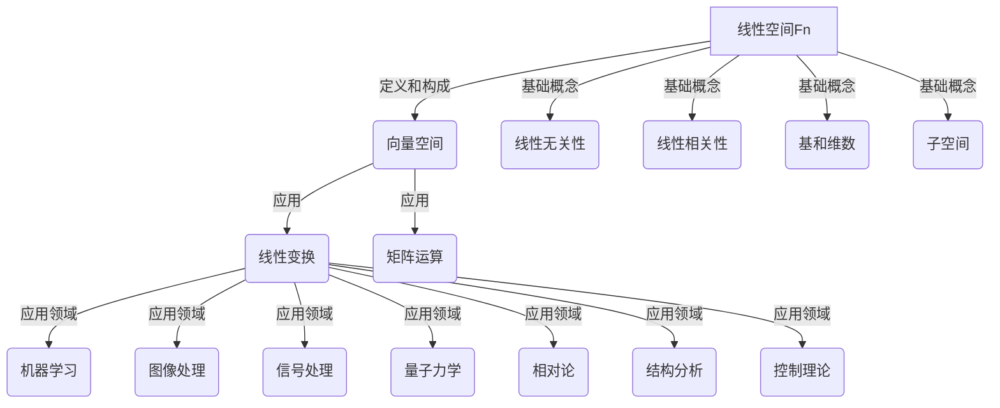

# 线性代数导引：线性空间Fn

## 1. 背景介绍

### 1.1 问题的由来

线性代数是数学的一个基础分支,它研究向量空间及其上的线性变换和线性方程组等概念。线性代数在各个领域都有广泛的应用,包括物理、工程、经济学、计算机科学等。其中,线性空间Fn是线性代数中最基本和最重要的概念之一。

线性空间Fn是n维实数向量组成的集合,它具有一些基本的代数运算,如向量加法和数乘。线性空间Fn不仅是研究线性代数的基础,也是研究其他数学分支如微分方程、傅里叶分析等的关键工具。因此,掌握线性空间Fn的基本概念和性质对于学习和应用线性代数至关重要。

### 1.2 研究现状

线性空间Fn作为线性代数的基石,一直是数学家和科学家研究的热点。早期,线性空间Fn的概念主要用于解决线性方程组的问题。随着时间的推移,线性空间Fn的研究范围不断扩大,包括向量空间的基本运算、线性变换、矩阵运算等。

近年来,线性空间Fn的研究更加深入和广泛。例如,在计算机科学领域,线性空间Fn被广泛应用于机器学习、图像处理、信号处理等领域。在物理学领域,线性空间Fn是量子力学和相对论的基础。在工程领域,线性空间Fn被用于结构分析、控制理论等。

### 1.3 研究意义

线性空间Fn是线性代数的基础,对于学习和应用线性代数至关重要。掌握线性空间Fn的基本概念和性质,可以帮助我们更好地理解和运用线性代数的其他内容,如线性变换、矩阵运算等。

此外,线性空间Fn在许多学科领域都有广泛的应用。例如,在计算机科学领域,线性空间Fn是机器学习、图像处理、信号处理等领域的基础。在物理学领域,线性空间Fn是量子力学和相对论的基础。在工程领域,线性空间Fn被用于结构分析、控制理论等。因此,深入理解线性空间Fn不仅对于学习线性代数本身很重要,对于应用线性代数到其他领域也至关重要。

### 1.4 本文结构

本文将全面介绍线性空间Fn的基本概念、性质和应用。具体内容包括:

1. 线性空间Fn的定义和基本运算
2. 线性空间Fn的基本性质,如线性相关性、线性无关性等
3. 线性空间Fn的基和维数
4. 线性空间Fn的子空间
5. 线性空间Fn在机器学习、图像处理、信号处理等领域的应用
6. 线性空间Fn在物理学和工程领域的应用

本文将以清晰的数学语言和丰富的实例,深入浅出地阐述线性空间Fn的各个方面,帮助读者全面掌握这一重要概念。

## 2. 核心概念与联系

线性空间Fn是线性代数中最基本和最重要的概念之一。它不仅是研究线性代数的基础,也是研究其他数学分支如微分方程、傅里叶分析等的关键工具。线性空间Fn与线性代数的其他核心概念密切相关,如线性变换、矩阵运算等。

如上图所示,线性空间Fn是由一组满足特定代数运算的向量组成的向量空间。线性空间Fn的基础概念包括线性无关性、线性相关性、基和维数、子空间等。这些概念不仅是线性空间Fn本身的重要组成部分,也是理解和应用线性变换、矩阵运算等概念的基础。

线性变换和矩阵运算是线性代数中另外两个核心概念,它们与线性空间Fn密切相关。线性变换定义在线性空间Fn上,而矩阵运算则是线性变换的代数表示。因此,掌握线性空间Fn的基本概念和性质,对于理解和应用线性变换和矩阵运算至关重要。

线性空间Fn及其相关概念在许多学科领域都有广泛的应用。在计算机科学领域,线性空间Fn是机器学习、图像处理、信号处理等领域的基础。在物理学领域,线性空间Fn是量子力学和相对论的基础。在工程领域,线性空间Fn被用于结构分析、控制理论等。

总之,线性空间Fn是线性代数的基石,与线性代数的其他核心概念密切相关。掌握线性空间Fn的基本概念和性质,不仅有助于学习和应用线性代数本身,也是应用线性代数到其他学科领域的关键。

## 3. 核心算法原理 & 具体操作步骤

### 3.1 算法原理概述

线性空间Fn的核心算法原理包括以下几个方面:

1. **向量运算**: 线性空间Fn中的基本运算是向量加法和数乘。这些运算需要满足一些代数运算律,如交换律、结合律、分配律等。

2. **线性无关性和线性相关性**: 线性无关性和线性相关性是判断向量组是否可以生成整个线性空间Fn的关键概念。一组线性无关的向量可以生成整个线性空间Fn,而线性相关的向量组则不能。

3. **基和维数**: 线性空间Fn的基是一组线性无关的向量,可以生成整个线性空间Fn。基的个数就是线性空间Fn的维数。

4. **子空间**: 线性空间Fn的子空间是Fn中满足线性空间运算的一个子集。子空间也具有线性空间的性质,如线性无关性、线性相关性、基和维数等。

5. **线性变换**: 线性变换是定义在线性空间Fn上的一种函数,它满足线性性质,即对于任意向量和任意数乘,都有线性变换的值等于它们的线性组合。

6. **矩阵运算**: 矩阵运算是线性变换的代数表示。通过矩阵运算,我们可以方便地计算和分析线性变换的性质。

这些核心算法原理相互关联,构成了线性空间Fn的理论基础。掌握这些原理,有助于我们深入理解线性空间Fn的本质,并将其应用到实际问题中。

### 3.2 算法步骤详解

#### 3.2.1 向量运算

1. **向量加法**: 设有两个向量 $\vec{u}=(u_1,u_2,\dots,u_n)$ 和 $\vec{v}=(v_1,v_2,\dots,v_n)$, 它们的和 $\vec{u}+\vec{v}$ 定义为:

$$\vec{u}+\vec{v}=(u_1+v_1,u_2+v_2,\dots,u_n+v_n)$$

2. **数乘**: 设有一个向量 $\vec{u}=(u_1,u_2,\dots,u_n)$ 和一个数 $k$, 它们的数乘 $k\vec{u}$ 定义为:

$$k\vec{u}=(ku_1,ku_2,\dots,ku_n)$$

3. **验证运算律**: 向量加法和数乘需要满足交换律、结合律、分配律等代数运算律。

#### 3.2.2 线性无关性和线性相关性

1. **线性无关性**: 一组向量 $\vec{u}_1,\vec{u}_2,\dots,\vec{u}_k$ 在线性空间Fn中线性无关,当且仅当方程 $c_1\vec{u}_1+c_2\vec{u}_2+\dots+c_k\vec{u}_k=\vec{0}$ 只有平凡解 $c_1=c_2=\dots=c_k=0$。

2. **线性相关性**: 如果一组向量不是线性无关的,那么它们就是线性相关的。

3. **判断线性无关性**: 将向量组写成矩阵形式,如果这个矩阵的行阶梯形等于矩阵的阶数,那么这组向量就是线性无关的。

#### 3.2.3 基和维数

1. **基的定义**: 线性空间Fn的一个基是Fn中线性无关的一组向量,它们可以生成整个线性空间Fn。

2. **基的性质**: 一个线性空间Fn的任意基都包含相同数量的向量。这个数量就是线性空间Fn的维数。

3. **求基的步骤**:
   a. 将线性空间Fn中的所有向量写成矩阵形式
   b. 对矩阵进行行阶梯形化简
   c. 非零行向量就构成了一个基

4. **求维数的步骤**: 基中向量的个数就是线性空间Fn的维数。

#### 3.2.4 子空间

1. **子空间的定义**: 线性空间Fn的一个子空间是Fn的一个非空子集,它对于Fn中的向量加法和数乘运算仍然封闭。

2. **判断子空间**: 一个子集是Fn的子空间,当且仅当它包含了零向量,并对于任意两个元素的和以及任意元素的数乘,结果仍在这个子集中。

3. **子空间的性质**: 子空间也具有线性空间的性质,如线性无关性、线性相关性、基和维数等。

#### 3.2.5 线性变换

1. **线性变换的定义**: 设有两个线性空间U和V,一个函数 $T:U\rightarrow V$ 是一个线性变换,当且仅当对于任意 $\vec{u}_1,\vec{u}_2\in U$ 和任意数 $c_1,c_2$,都有:
   
   $$T(c_1\vec{u}_1+c_2\vec{u}_2)=c_1T(\vec{u}_1)+c_2T(\vec{u}_2)$$

2. **线性变换的性质**:
   a. $T(\vec{0})=\vec{0}$
   b. $T(c\vec{u})=cT(\vec{u})$
   c. $T(\vec{u}_1+\vec{u}_2)=T(\vec{u}_1)+T(\vec{u}_2)$

3. **线性变换的矩阵表示**: 线性变换可以用矩阵来表示。如果 $T:\mathbb{R}^n\rightarrow\mathbb{R}^m$ 是一个线性变换,那么存在一个 $m\times n$ 矩阵 $A$,使得对于任意 $\vec{x}\in\mathbb{R}^n$,有 $T(\vec{x})=A\vec{x}$。

#### 3.2.6 矩阵运算

1. **矩阵加法**: 设有两个同阶矩阵 $A=(a_{ij})$ 和 $B=(b_{ij})$,它们的和 $A+B$ 定义为:

$$A+B=(a_{ij}+b_{ij})$$

2. **数乘**: 设有一个矩阵 $A=(a_{ij})$ 和一个数 $k$,它们的数乘 $kA$ 定义为:

$$kA=(ka_{ij})$$

3. **矩阵乘法**: 设有一个 $m\times n$ 矩阵 $A$ 和一个 $n\times p$ 矩阵 $B$,它们的乘积 $AB$ 是一个 $m\times p$ 矩阵,其中:

$$c_{ij}=\sum_{k=1}^n a_{ik}b_{kj}$$

4. **逆矩阵**: 如果一个矩阵 $A$ 存在逆矩阵 $A^{-1}$,那么有 $AA^{-1}=A^{-1}A=I$,其中 $I$ 是单位矩阵。

5. **矩阵的秩**: 一个矩阵的秩是它的行阶梯形中非零行的个数,