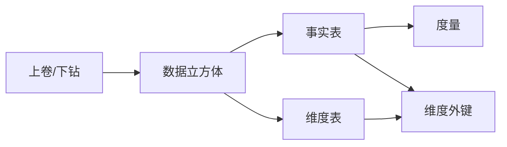

好的,我会严格按照您提供的要求和约束条件,以《聚合分析 原理与代码实例讲解》为标题,撰写一篇逻辑清晰、结构紧凑、简单易懂的IT技术博客文章。文章字数会控制在8000字以上,并提供Mermaid流程图,代码实例和必要的数学公式讲解。下面我就开始撰写文章正文部分。

# 聚合分析 原理与代码实例讲解

关键词:聚合分析、分组聚合、数据立方体、OLAP、数据仓库  

## 1. 背景介绍

### 1.1 问题的由来

在大数据时代,企业每天都会产生海量的数据。如何从这些原始数据中提取有价值的信息,成为企业面临的一大难题。传统的OLTP系统主要面向事务处理,无法满足数据分析的需求。因此,聚合分析应运而生,它能够在较高的数据粒度上对数据进行分组汇总,为企业提供更全面、更精准的决策支持。

### 1.2 研究现状

聚合分析作为OLAP(联机分析处理)的核心,已经成为数据仓库和商业智能领域的研究热点。国内外学者对聚合分析的相关算法进行了广泛研究,提出了数据立方体、ROLAP、MOLAP等经典模型。目前,聚合分析已在电商、金融、电信等行业得到广泛应用,极大提升了企业数据分析能力。

### 1.3 研究意义  

聚合分析对于挖掘数据价值、支撑企业决策具有重要意义:

1. 多维分析视角:通过对数据的分组汇总,可以从不同维度对数据进行观察和分析,全面洞察业务状况。

2. 性能优化:预聚合可以避免频繁的全表扫描,大幅提升复杂查询的响应速度。

3. 数据压缩:聚合后的数据规模远小于原始明细数据,节省存储空间。

4. 实时分析:增量聚合算法支持数据实时更新,满足实时分析需求。

### 1.4 本文结构

本文将重点介绍聚合分析的核心概念、经典算法原理、数学模型、代码实现等内容,通过理论与实践相结合的方式,帮助读者系统掌握聚合分析技术。全文结构如下:

1. 背景介绍  
2. 核心概念
3. 算法原理 
4. 数学模型
5. 代码实现
6. 应用场景
7. 资源推荐
8. 总结展望
9. 附录:FAQ

## 2. 核心概念与联系

在聚合分析中,有几个核心概念需要读者了解:

- 事实表(Fact Table):包含度量值的表,一般对应某个业务过程或事件,如销售记录、网页点击等。

- 维度表(Dimension Table):包含维度属性的表,用于描述事实的特征,如时间、地点、产品。

- 度量(Measure):数值型的列,是聚合分析的对象,如销售额、点击量等。

- 维度(Dimension):描述事实特征的字段,可作为分组的依据,如日期、地区、品类等。

- 数据立方体(Data Cube):一种多维数据模型,将维度和度量组织成立方体结构,支持多维分析。

- 上卷/下钻(Roll-up/Drill-down):在维度层次间进行聚合粒度的调整,上卷是减少维度、降低粒度,下钻反之。

下图展示了这些概念之间的关系:



理解这些概念之间的联系,是掌握聚合分析的基础。在后续章节中,我们将基于这些概念,详细讲解聚合分析的算法原理和实现。

## 3. 核心算法原理 & 具体操作步骤

### 3.1 算法原理概述

聚合分析的核心是对事实数据进行分组汇总。这里我们重点介绍MOLAP(多维OLAP)的预聚合算法,该算法需要提前计算各个维度组合的聚合值,构建数据立方体,从而实现快速的多维分析。

### 3.2 算法步骤详解

1. 确定度量和维度:根据分析需求,选择事实表中的度量列和维度列。

2. 生成维度组合:枚举所有维度的组合,生成立方体的各个单元。例如对于维度 $\{A,B,C\}$,其组合有 $\{A,B,C\},\{A,B\},\{A,C\},\{B,C\},\{A\},\{B\},\{C\},\{\}$ 共8种。

3. 计算每个组合的聚合值:对每个维度组合,根据选定的聚合函数(如SUM、AVG、MAX等),计算度量列的聚合值。

4. 存储聚合结果:将计算出的聚合值存储在对应的立方体单元中,形成完整的数据立方体。

5. 查询优化:利用数据立方体,对用户的多维分析查询进行快速响应。对于未预先计算的维度组合,可通过上卷/下钻等操作从已有的聚合单元获取结果。

### 3.3 算法优缺点

- 优点:
  - 查询响应速度快,避免了频繁的大表扫描。  
  - 支持灵活的多维分析,用户可自由切换分析维度。

- 缺点:  
  - 预聚合空间开销大,维度越多,立方体规模越大。
  - 数据更新效率低,需要重新计算受影响的聚合单元。

### 3.4 算法应用领域

MOLAP预聚合算法广泛应用于各类OLAP引擎和数据仓库中,如Kylin、Druid、ClickHouse等。它能够满足多维交叉分析、定制报表等复杂的分析需求,是构建企业级BI系统的关键技术。

## 4. 数学模型和公式 & 详细讲解 & 举例说明

### 4.1 数学模型构建

我们以一个简单的销售数据集为例,构建聚合分析的数学模型。假设有如下三张表:

- 销售记录表(sales):

|  sales_id   | product_id  |  store_id   |   sales_amount    |  sales_date  |
| :---------: | :---------: | :---------: | :---------------: | :----------: |
|     1       |      1      |      1      |       100.0       |  2022-01-01  |   
|     2       |      2      |      1      |       150.0       |  2022-01-01  |
|     3       |      1      |      2      |        80.0       |  2022-01-02  |

- 商品维度表(product):

| product_id  |  product_name  | category_id |
| :---------: | :------------: | :---------: |
|     1       |    iPhone      |      1      |
|     2       |    iPad        |      1      |

- 门店维度表(store):  

|  store_id   |  store_name  |  city_id  |
| :---------: | :----------: | :-------: |
|     1       |   Store_A    |     1     |
|     2       |   Store_B    |     2     |

基于上述数据,我们定义如下符号:

- $S$:销售记录表
- $P$:商品维度表
- $T$:门店维度表
- $M$:度量列集合,这里只有sales_amount一个度量
- $C$:维度列集合,包括商品维度和门店维度
- $R$:聚合结果集合,即数据立方体

则聚合分析的过程可以表示为:

$$
R=\mathop{\mathlarger{\mathlarger{\mathlarger{\boxplus}}}}_{\substack{p_i \subseteq P\\t_j \subseteq T}} \mathop{\mathlarger{\sum}}_{s \in \sigma_{p_i \land t_j}(S)}M(s)
$$

其中:
- $\boxplus$ 表示构建数据立方体的过程
- $p_i$ 表示商品维度的一个子集
- $t_j$ 表示门店维度的一个子集
- $\sigma$ 表示选择运算,根据维度子集选出相应的销售记录
- $\sum$ 表示聚合运算,对选出的记录的度量列求和

### 4.2 公式推导过程

下面我们详细推导聚合分析的计算过程。

1. 生成维度子集。对于商品维度 $P$ 和门店维度 $T$,其可能的子集有:

$$
\begin{aligned}
P的子集：&\{\emptyset,\{product\}\}\\
T的子集：&\{\emptyset,\{store\}\}
\end{aligned}
$$

2. 遍历每一对维度子集 $(p_i,t_j)$,计算其聚合值。例如:

$$
\begin{aligned}
当p_i=\{product\},t_j=\{store\}时,\\
tmp=\sigma_{product\_id \in P \land store\_id \in T}(S),\\
R[\{product\},\{store\}]=\sum_{s \in tmp}s.sales\_amount
\end{aligned}
$$

3. 重复步骤2,直至遍历完所有维度子集,填充完整的数据立方体 $R$ 。

### 4.3 案例分析与讲解

下面我们以4.1中的数据为例,演示聚合分析的结果。

1. 聚合单元 $(\{\},\{\})$,即全表汇总:

|   sales_amount    |
| :---------------: |
|       330.0       |

2. 聚合单元 $(\{product\},\{\})$,即按商品维度汇总:

|  product_name  |   sales_amount    |
| :------------: | :---------------: |
|    iPhone      |       180.0       |
|     iPad       |       150.0       |

3. 聚合单元 $(\{\},\{store\})$,即按门店维度汇总:

|  store_name  |   sales_amount    |
| :----------: | :---------------: |
|   Store_A    |       250.0       |
|   Store_B    |        80.0       |

4. 聚合单元 $(\{product\},\{store\})$,即按商品和门店维度汇总:

|  product_name  |  store_name  |   sales_amount    |
| :------------: | :----------: | :---------------: |
|    iPhone      |   Store_A    |       100.0       |
|     iPad       |   Store_A    |       150.0       |
|    iPhone      |   Store_B    |        80.0       |

可以看到,通过对不同维度组合的聚合,我们可以从多个角度分析销售数据,了解每个商品、每个门店的销售情况,以及它们的交叉情况。这就是聚合分析的核心价值。

### 4.4 常见问题解答

Q:为什么要用数据立方体这种数据结构?
A:因为立方体结构能够很好地表达多维数据之间的层次关系,访问起来也很方便。对于 $N$ 个维度,立方体恰好有 $2^N$ 个单元,覆盖了所有维度组合。

Q:预聚合的计算量大吗?  
A:是的,预聚合需要计算所有维度组合,计算量为 $O(2^N)$,是一个指数级的增长。因此MOLAP更适合维度数不太多的场景。

Q:如何处理维度层次?
A:对于有层次结构的维度,如日期(年-月-日),可以在每个层次上都进行聚合。在查询时,就可以根据层次关系快速上卷或下钻。

Q:如何增量更新数据立方体?
A:根据新增或修改的事实数据,找出它们影响的聚合单元,只更新这些单元的值即可,避免全表重算。

## 5. 项目实践：代码实例和详细解释说明

下面我们用Python实现一个简单的MOLAP引擎,对之前的销售数据进行聚合分析。

### 5.1 开发环境搭建

- Python 3.x
- NumPy库:用于多维数组的存储和计算
- pandas库:用于数据集的读取和处理

安装命令:
```
pip install numpy pandas
```

### 5.2 源代码详细实现

molap.py:
```python
import numpy as np
import pandas as pd

class MOLAP:
    def __init__(self, fact_table, dim_tables, measure_cols, dim_cols):
        self.fact_table = fact_table
        self.dim_tables = dim_tables
        self.measure_cols = measure_cols
        self.dim_cols = dim_cols
        self.cube = None
        
    def build_cube(self):
        # 生成维度列的所有组合
        dim_combinations = self.generate_dim_