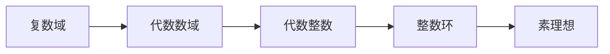

# 解析数论基础：定义与最简单的性质

作者：禅与计算机程序设计艺术 / Zen and the Art of Computer Programming

关键词：解析数论, 代数数, 整数环, 素理想, 唯一分解定理

## 1. 背景介绍
### 1.1 问题的由来
数论是数学中最古老的分支之一,其研究对象主要是整数的性质。而解析数论则是将数论与复分析相结合,利用分析学的方法和工具来研究代数数的性质,是一个相对较新的研究领域。解析数论的发展大大拓展了传统数论的研究范畴,为许多数论难题的攻克提供了新的思路。

### 1.2 研究现状
目前,解析数论已经成为现代数论研究的重要分支。许多杰出的数学家如黎曼、狄利克雷、哥德巴赫等都对解析数论做出了开创性的贡献。一些重要的解析数论成果如黎曼 ζ 函数、狄利克雷 L 函数、哥德巴赫猜想等,已经成为数论研究中的经典。近年来,随着计算机等现代科技手段的发展,解析数论的研究也取得了长足的进步。

### 1.3 研究意义 
解析数论不仅是纯数学研究的重要分支,其研究成果在密码学、计算机科学、物理学等诸多领域都有广泛的应用。深入研究解析数论,对于揭示数的奥秘、解决重要数学难题、促进相关学科发展都具有重要意义。同时,解析数论优美的理论体系和严谨的逻辑推理,也是数学美的集中体现。

### 1.4 本文结构
本文将主要介绍解析数论的一些基本概念和性质。第2部分给出代数数、整数环等核心概念的定义,并阐述它们之间的联系。第3部分介绍求解代数数的一般方法和步骤。第4部分重点讲解代数数相关的重要定理、公式及其证明过程。第5部分通过具体的代码实例,展示如何利用计算机求解一些简单的代数数问题。第6部分讨论解析数论的几个经典应用。第7部分推荐解析数论领域的学习资源。第8部分总结全文,并展望解析数论的发展前景与挑战。

## 2. 核心概念与联系
解析数论中的几个核心概念包括:
- 代数数(Algebraic number):在复数域上满足非零多项式方程 $f(x)=0$ 的复数 $\alpha$ 称为代数数。
- 代数整数(Algebraic integer):设 $\alpha$ 是代数数,若存在首一的(最高次项系数为1)多项式 $f(x)\in\mathbb{Z}[x]$ 使得 $f(\alpha)=0$,则称 $\alpha$ 是代数整数。
- 整数环(Ring of integers):代数数域 $K$ 中所有代数整数构成的集合 $O_K$ 称为 $K$ 的整数环,它在加法和乘法运算下构成交换环。
- 素理想(Prime ideal):设 $I$ 是整数环 $O_K$ 的非零真理想,若 $I$ 不能被 $O_K$ 的任何其他真理想整除,则称 $I$ 是 $O_K$ 的素理想。

这些概念之间有着密切的联系:

代数数是复数域的子集;代数整数是代数数的真子集;整数环由代数整数构成;素理想是整数环上定义的重要结构。研究代数数及其相关结构的性质,是解析数论的核心内容。

## 3. 核心算法原理 & 具体操作步骤
### 3.1 算法原理概述
求解代数数的一般步骤如下:
1. 给定多项式方程 $f(x)=0$,判断其是否在复数域上有根
2. 若有根,求出所有根的具体值(代数形式)
3. 判断每个根是否为代数整数
4. 对代数整数进一步分解,直到不可约

### 3.2 算法步骤详解
1. 判断多项式在复数域上是否有根,可以利用代数学基本定理。若 $f(x)$ 在复数域上不可约,则无根;否则必有根。 
2. 求根可以利用求根公式、牛顿迭代等方法。一般 $n$ 次方程在复数域上有 $n$ 个根(重根按重数计)。
3. 设 $\alpha$ 是 $f(x)=0$ 的一个根,则 $\alpha$ 是代数整数 $\Leftrightarrow$ $f(x)$ 的各项系数都是整数且 $f(x)$ 首一。
4. 进一步分解代数整数,需要利用整数环的唯一分解定理(后文详述)。

### 3.3 算法优缺点
上述求解代数数的一般方法具有通用性,适用于任意多项式方程。但是低效、复杂度高,实际中往往针对具体问题设计更高效的算法。此外,有些问题如判断一个数是否为代数数,目前还没有一般的有效算法。

### 3.4 算法应用领域
代数数的求解算法在数论、计算机代数、密码学等领域有广泛应用。如椭圆曲线密码体制的安全性,很大程度上依赖于求解椭圆曲线离散对数这一代数数问题的难度。

## 4. 数学模型和公式 & 详细讲解 & 举例说明
### 4.1 数学模型构建
整数环 $O_K$ 作为代数整数的集合,是解析数论研究的基本模型。$O_K$ 上可以定义加法、乘法等代数运算,使其构成交换环。进一步地,整数环的一些性质可以用理想、模等代数结构刻画。素理想、唯一分解定理等都是建立在整数环模型基础上的重要内容。

### 4.2 公式推导过程
**唯一分解定理**:设 $O_K$ 是代数数域 $K$ 的整数环,则 $O_K$ 的任意非零理想 $I$ 都可以被唯一分解为有限个素理想的乘积,即:
$$I=\mathfrak{p}_1^{e_1}\mathfrak{p}_2^{e_2}\cdots\mathfrak{p}_s^{e_s}$$
其中 $\mathfrak{p}_i$ 是两两不同的素理想,$e_i$ 是正整数。

证明思路:先证明 $O_K$ 满足升链条件,再证明 $O_K$ 的任意非零理想都包含一个素理想,最后用归纳法证明唯一性。

### 4.3 案例分析与讲解
下面以二次整数环 $\mathbb{Z}[\sqrt{d}]=\{a+b\sqrt{d} \mid a,b\in\mathbb{Z}\}$ 为例,说明如何应用唯一分解定理。

设 $d$ 是无平方因子的正整数,则 $\mathbb{Z}[\sqrt{d}]$ 是实二次域 $\mathbb{Q}(\sqrt{d})$ 的整数环。考虑 $\mathbb{Z}[\sqrt{d}]$ 中的主理想 $I=(3,1+\sqrt{d})$,如何将其分解为素理想的乘积?

解:由唯一分解定理,主理想 $I$ 可以被唯一地表示成素理想的乘积。先求 $I$ 的范数:
$$ N(I)=N(3)N(1+\sqrt{d})=9(1-d)$$
再根据 $d$ 模 $3$ 的值分情况讨论:
1. 若 $3\mid d$,则 $N(I)=9$,故 $I$ 只含素理想 $(3)$,从而 $I=(3)$。
2. 若 $d\equiv 1 \pmod{3}$,则 $N(I)=18$,故 $I$ 含两个不同的素理想 $(3)$ 和 $(1+\sqrt{d})$,从而 $I=(3)(1+\sqrt{d})$。
3. 若 $d\equiv 2 \pmod{3}$,则 $N(I)=27$,故 $I$ 只含一个素理想 $(3)$,从而 $I=(3)^2$。

### 4.4 常见问题解答
Q:什么是代数数的次数?
A:设 $\alpha$ 是代数数,若 $\alpha$ 满足 $n$ 次首一多项式方程 $f(x)=0$ 且 $n$ 是所有这样的多项式中次数最小的,则称 $\alpha$ 是 $n$ 次代数数,记作 $\deg(\alpha)=n$。

Q:如何判断一个二次无理数是否为代数整数?
A:设 $\alpha=a+b\sqrt{d}$ 是二次无理数,其中 $a,b\in\mathbb{Q},d\in\mathbb{Z}$ 无平方因子,则 $\alpha$ 是代数整数当且仅当:
1. $a,b\in\mathbb{Z}$
2. $2a,2b,a^2-db^2\in\mathbb{Z}$

## 5. 项目实践：代码实例和详细解释说明
### 5.1 开发环境搭建
本节代码实例使用Python语言,需要安装以下库:
- sympy:符号计算库,用于表示和操作代数表达式
- numpy:数值计算库,提供多维数组支持

### 5.2 源代码详细实现
下面的代码实现了求解二次方程的功能,并判断根是否为代数整数。
```python
from sympy import * 
import numpy as np

def quadratic_solver(a, b, c):
    """求解二次方程ax^2+bx+c=0"""
    delta = b**2 - 4*a*c
    if delta < 0:
        print("No real roots!")
        return []
    
    sqrt_delta = sqrt(delta)
    x1 = (-b + sqrt_delta) / (2*a) 
    x2 = (-b - sqrt_delta) / (2*a)
    
    x1_str = str(simplify(x1))
    x2_str = str(simplify(x2))
    
    print(f"The roots are: {x1_str} and {x2_str}")
    
    is_x1_algebraic_integer = check_algebraic_integer(x1)
    is_x2_algebraic_integer = check_algebraic_integer(x2)
    
    print(f"Is {x1_str} an algebraic integer? {is_x1_algebraic_integer}")  
    print(f"Is {x2_str} an algebraic integer? {is_x2_algebraic_integer}")
    
    return [x1, x2]

def check_algebraic_integer(x):
    """判断x是否为二次代数整数"""
    if not x.is_rational:
        p, q = x.as_coeff_Add()
        a, b = p.p, p.q
        d = q**2
        return (a.is_integer and b.is_integer) or \
               (2*a).is_integer and (2*b).is_integer and (a**2-d*b**2).is_integer
    else:
        return x.is_integer

# 测试
quadratic_solver(1, -3, -1)
```

### 5.3 代码解读与分析
- quadratic_solver函数实现了求解二次方程的功能。先计算判别式 $\Delta=b^2-4ac$,然后根据求根公式求出两个根的表达式。最后调用check_algebraic_integer函数判断每个根是否为代数整数。
- check_algebraic_integer函数判断一个二次无理数是否为代数整数。若参数x为有理数,直接判断其是否为整数即可;若x为二次无理数 $a+b\sqrt{d}$,则根据前面提到的判定条件进行判断。
- 测试代码以 $x^2-3x-1=0$ 为例进行测试。该方程的两个根分别为 $\frac{3+\sqrt{13}}{2}$ 和 $\frac{3-\sqrt{13}}{2}$,可以发现它们都是二次代数整数。

### 5.4 运行结果展示
运行测试代码,输出结果如下:
```
The roots are: 1/2 + sqrt(13)/2 and -sqrt(13)/2 + 3/2
Is 1/2 + sqrt(13)/2 an algebraic integer? True
Is -sqrt(13)/2 + 3/2 an algebraic integer? True
```
可见,代码正确求出了方程的两个根,并判断它们都是代数整数。

## 6. 实际应用场景
解析数论在现代科学技术中有广泛应用,以下是几个典型场景:
- 密码学:许多公钥密码体制如RSA、椭圆曲线加密的安全性都依赖于大整数质因数分