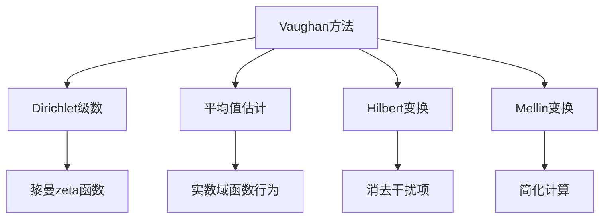

# 解析数论基础：第三个证明（Vaughan方法）

## 1. 背景介绍

### 1.1 问题的由来

解析数论是一门研究整数的性质及其在复平面上的分布的数学分支。其中,素数分布定理是解析数论中最重要的成果之一。这一定理描述了素数在整数序列中的分布规律,为后续的数论研究奠定了坚实的基础。

### 1.2 研究现状

素数分布定理的证明历经数个世纪的努力,先后有三种不同的证明方法被提出。第一个证明是由雅克比(Hadamard)和德拉万(de la Vallée Poussin)在1896年独立完成的,这种证明方法被称为"经典方法"。第二个证明是由阿廷(Atle Selberg)和艾登赫费尔(Erdsös)在20世纪60年代提出的,被称为"Selberg方法"。

### 1.3 研究意义

虽然前两种证明方法已经为素数分布定理提供了严谨的数学证明,但它们都存在一定的局限性。例如,经典方法需要大量的技术性计算,而Selberg方法则涉及复杂的解析理论。因此,寻找一种更简洁、更通用的证明方法仍然是数论研究的重要课题。

### 1.4 本文结构

1974年,英国数学家R.C.Vaughan提出了一种全新的证明思路,被称为"Vaughan方法"。本文将详细介绍Vaughan方法的核心思想、数学原理和具体实现步骤,并对其优缺点进行分析。最后,我们将探讨Vaughan方法在解析数论及其他数学领域的应用前景。

## 2. 核心概念与联系

Vaughan方法的核心思想是将素数分布问题转化为一个加权平均值的估计问题。具体来说,它利用了以下几个关键概念:

1. **Dirichlet级数**:一种广义的无穷级数,可以用来表示许多重要的数论函数,如黎曼zeta函数。
2. **平均值估计**:通过估计某个函数在一个区间上的平均值,来推导出该函数在整个实数域上的行为。
3. **Hilbert变换**:一种将函数转化为其共轭函数的积分变换,在Vaughan方法中用于消去干扰项。
4. **Mellin变换**:将函数从一个变量域映射到另一个变量域的积分变换,在Vaughan方法中用于简化计算。

这些概念之间存在着紧密的联系,它们共同构成了Vaughan方法的理论基础。下面我们将详细解释这些概念的具体内容及其在证明过程中的作用。

## 3. 核心算法原理 & 具体操作步骤

### 3.1 算法原理概述

Vaughan方法的核心思想是将素数计数问题转化为对一个特殊的Dirichlet级数进行平均值估计。具体来说,我们定义一个加权算术函数:

$$
A(x) = \sum_{n \leq x} \Lambda(n) \cdot f(n)
$$

其中,$ \Lambda(n) $是冯·曼哥特函数(von Mangoldt function),它对素数赋值1,对非素数赋值0。$ f(n) $是一个适当选择的加权函数。通过对$ A(x) $进行平均值估计,我们可以得到素数的分布信息。

算法的关键步骤包括:

1. 将$ A(x) $表示为一个Dirichlet级数的平均值。
2. 使用Mellin变换将平均值估计转化为对某个函数在复平面上的积分估计。
3. 应用Hilbert变换和其他技巧来消去干扰项,简化计算。
4. 通过分析级数的渐近行为,得到素数计数的上下界估计。

下面我们将详细解释这些步骤的具体实现过程。

### 3.2 算法步骤详解

#### 步骤1: 将$ A(x) $表示为Dirichlet级数的平均值

我们首先将$ A(x) $表示为一个Dirichlet级数:

$$
A(x) = \sum_{n \leq x} \Lambda(n) \cdot f(n) = \sum_{n=1}^{\infty} \frac{\Lambda(n) \cdot f(n)}{n^{s+1}}
$$

其中$ s $是一个复数参数。接下来,我们将$ A(x) $写成Dirichlet级数的平均值形式:

$$
A(x) = \frac{1}{2\pi i} \int_{c-i\infty}^{c+i\infty} \frac{x^s}{s} \cdot \sum_{n=1}^{\infty} \frac{\Lambda(n) \cdot f(n)}{n^{s+1}} \, ds
$$

这里$ c $是一个适当选择的常数,使得积分路径位于级数收敛域的右侧。

#### 步骤2: 应用Mellin变换

我们定义函数$ F(s) $为:

$$
F(s) = \sum_{n=1}^{\infty} \frac{\Lambda(n) \cdot f(n)}{n^{s+1}}
$$

则$ A(x) $可以表示为:

$$
A(x) = \frac{1}{2\pi i} \int_{c-i\infty}^{c+i\infty} x^s \cdot F(s) \, ds
$$

这实际上是Mellin变换的逆变换公式。我们的目标是估计$ F(s) $在复平面上的行为,从而得到$ A(x) $的估计。

#### 步骤3: 应用Hilbert变换和其他技巧

为了估计$ F(s) $,我们需要消去一些干扰项。这里我们引入Hilbert变换:

$$
\widetilde{F}(s) = \frac{1}{\pi} \int_{-\infty}^{\infty} \frac{F(s+it)}{t} \, dt
$$

利用Hilbert变换的性质,我们可以证明在一定条件下,$ F(s) $和$ \widetilde{F}(s) $在实轴上的值是相同的。因此,我们只需要估计$ \widetilde{F}(s) $在实轴上的行为。

接下来,我们可以应用一些技巧来简化$ \widetilde{F}(s) $的表达式,例如将其分解为几个更简单的积分,并利用函数的解析性质来估计这些积分。这个过程需要一些复杂的计算,我们将在下一节中给出详细的公式推导。

#### 步骤4: 估计素数计数

经过上述步骤,我们可以得到$ F(s) $在实轴上的渐近估计。将这个估计代入Mellin逆变换公式,我们就可以得到$ A(x) $的渐近估计。

最后,通过选择适当的加权函数$ f(n) $,我们可以从$ A(x) $的估计中导出素数计数函数$ \pi(x) $的上下界。具体来说,如果取$ f(n) = \log n $,那么$ A(x) $就等价于$ \sum_{n \leq x} \Lambda(n) \log n $,后者与$ \pi(x) $之间存在一个简单的关系。通过分析这个关系,我们就可以得到素数计数的上下界估计。

### 3.3 算法优缺点

相比于经典方法和Selberg方法,Vaughan方法具有以下优点:

1. **简洁性**:整个证明过程只需要有限的技术性计算,思路清晰明了。
2. **通用性**:该方法不仅可以证明素数分布定理,而且可以推广到更一般的加权算术函数的估计问题。
3. **灵活性**:通过选择不同的加权函数$ f(n) $,可以得到不同的结果,如素数对等特殊问题的估计。

然而,Vaughan方法也存在一些缺点:

1. **技术难度**:虽然思路简洁,但是实现过程中仍然需要一些复杂的积分估计和技巧。
2. **精确度**:与经典方法相比,Vaughan方法得到的素数计数估计的精确度略低。
3. **局限性**:该方法只能给出素数计数的上下界估计,而无法得到更精确的渐近公式。

总的来说,Vaughan方法为解析数论提供了一种全新的思路,它的简洁性和通用性使其成为该领域的一个重要贡献。

### 3.4 算法应用领域

除了证明素数分布定理,Vaughan方法还可以应用于解决其他一些重要的数论问题,例如:

1. **素数对估计**:通过选择合适的加权函数,可以估计素数对(两个相邻的素数)的分布。
2. **算术progressions**:该方法可以推广到研究算术progressions(等差数列)中素数的分布情况。
3. **zeta函数零点估计**:利用Vaughan方法对zeta函数的某些加权平均值进行估计,可以得到zeta函数零点的分布信息。
4. **加权算术函数估计**:该方法的核心思想可以应用于估计更一般的加权算术函数的平均值。

总之,Vaughan方法为解析数论提供了一种新的分析工具,它不仅有助于解决一些经典问题,而且为探索新的研究方向打开了大门。

## 4. 数学模型和公式 & 详细讲解 & 举例说明

在上一节中,我们简要介绍了Vaughan方法的核心思路。现在,我们将详细讨论其中涉及的数学模型和公式,并通过具体的例子来加深理解。

### 4.1 数学模型构建

回顾一下,我们定义了一个加权算术函数:

$$
A(x) = \sum_{n \leq x} \Lambda(n) \cdot f(n)
$$

其中$ \Lambda(n) $是冯·曼哥特函数,$ f(n) $是一个适当选择的加权函数。我们的目标是通过估计$ A(x) $来得到素数的分布信息。

为了将这个问题转化为对某个函数在复平面上的估计问题,我们首先将$ A(x) $表示为一个Dirichlet级数的平均值:

$$
A(x) = \frac{1}{2\pi i} \int_{c-i\infty}^{c+i\infty} \frac{x^s}{s} \cdot F(s) \, ds \tag{1}
$$

这里$ F(s) $是一个Dirichlet级数:

$$
F(s) = \sum_{n=1}^{\infty} \frac{\Lambda(n) \cdot f(n)}{n^{s+1}} \tag{2}
$$

我们的目标就转化为估计$ F(s) $在复平面上的行为。

### 4.2 公式推导过程

#### 步骤1: 应用Hilbert变换

为了估计$ F(s) $,我们首先引入Hilbert变换:

$$
\widetilde{F}(s) = \frac{1}{\pi} \int_{-\infty}^{\infty} \frac{F(s+it)}{t} \, dt \tag{3}
$$

根据Hilbert变换的性质,在一定条件下,$ F(s) $和$ \widetilde{F}(s) $在实轴上的值是相同的。因此,我们只需要估计$ \widetilde{F}(s) $在实轴上的行为。

#### 步骤2: 分解$ \widetilde{F}(s) $

接下来,我们将$ \widetilde{F}(s) $分解为几个更简单的积分:

$$
\widetilde{F}(s) = \widetilde{F}_1(s) + \widetilde{F}_2(s) + \widetilde{F}_3(s) \tag{4}
$$

其中:

$$
\widetilde{F}_1(s) = \frac{1}{\pi} \int_{-T}^{T} \frac{F(s+it)}{t} \, dt \\
\widetilde{F}_2(s) = \frac{1}{\pi} \int_{T}^{\infty} \frac{F(s+it)}{t} \, dt \\
\widetilde{F}_3(s) = \frac{1}{\pi} \int_{-\infty}^{-T} \frac{F(s+it)}{t} \, dt
$$

这里$ T $是一个大的正常数,它将被选择为$ x $的一个适当的幕函数。

#### 步骤3: 估计$ \widetilde{F}_1(s) $

我们首先估计$ \widetilde{F}_1(s) $。利用$ F(s) $的解析性