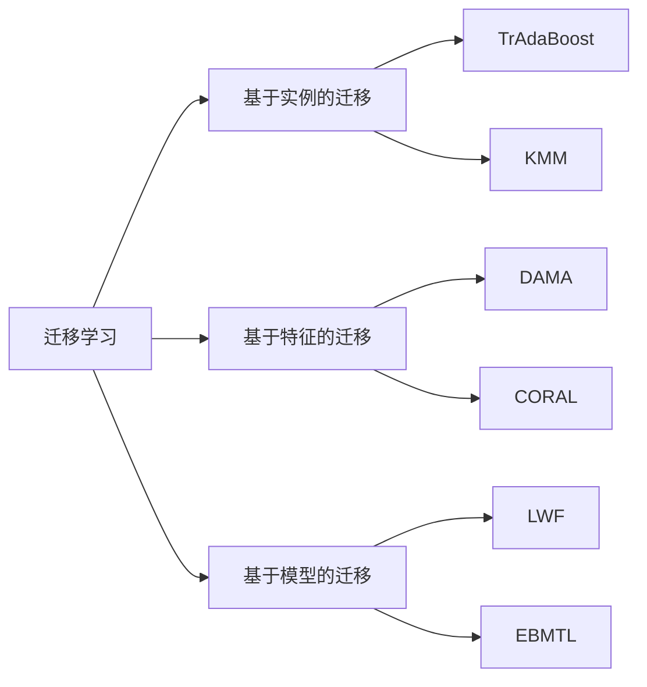

# 迁移学习 (Transfer Learning) 原理与代码实例讲解

关键词：迁移学习、深度学习、机器学习、神经网络、领域适应

## 1. 背景介绍
### 1.1 问题的由来
在传统的机器学习范式中,我们通常假设训练数据和测试数据来自相同的特征空间和分布。然而,在许多现实应用中,这一假设很难满足。例如,我们希望将一个在大量标注数据上训练好的模型应用到一个新的领域,但在新领域中只有很少或没有标注数据。此时,如果直接在新领域的数据上重新训练模型,效果往往会大打折扣,因为新领域的数据量太少,难以训练出一个性能良好的模型。迁移学习正是为解决这一问题而提出的。

### 1.2 研究现状
迁移学习近年来在学术界和工业界得到了广泛关注和应用。许多顶级会议如NIPS、ICML、AAAI等都设有专门的迁移学习workshop。在工业界,谷歌、微软、Facebook、百度等公司也都在迁移学习领域投入了大量研究,并应用到了诸如计算机视觉、自然语言处理、语音识别、推荐系统等方向的实际产品中。

### 1.3 研究意义
迁移学习让我们可以利用已有的标注数据,去解决那些缺乏标注训练数据的新问题,大大拓宽了机器学习的应用范围。通过迁移学习,即使在缺乏大规模标注数据的情况下,我们也有望训练出性能优越的模型,为人工智能落地提供了新的途径。此外,迁移学习还有利于知识的复用和泛化,让知识在不同问题间得以迁移和共享,提升了机器学习的智能水平。

### 1.4 本文结构
本文将分为以下几个部分展开:
- 第2部分介绍迁移学习的核心概念与不同类型方法之间的联系
- 第3部分重点阐述迁移学习的核心算法原理,并给出具体操作步骤
- 第4部分从数学角度对迁移学习的模型和公式进行详细推导和讲解
- 第5部分给出迁移学习的代码实例,并进行细致的注释解释  
- 第6部分讨论迁移学习的实际应用场景
- 第7部分推荐迁移学习相关的工具、资源和论文
- 第8部分对全文进行总结,并展望迁移学习的未来发展趋势和挑战
- 第9部分的附录中列出了一些常见问题与解答

## 2. 核心概念与联系
迁移学习的核心思想是利用已有的知识来辅助目标问题的学习。根据源领域和目标领域间的相似性,以及所要迁移的知识类型,迁移学习可以分为以下三大类:

1. 基于实例的迁移学习(Instance-based Transfer Learning):通过对源领域中的标注数据进行重用,来辅助目标领域的学习。典型方法包括TrAdaBoost、KMM等。

2. 基于特征的迁移学习(Feature-based Transfer Learning):通过学习源领域和目标领域之间的共享特征表示,减小两个领域间的分布差异。典型方法包括DAMA、CORAL等。

3. 基于模型的迁移学习(Model-based Transfer Learning):通过迁移源领域学到的模型参数,来辅助目标领域的模型学习。典型方法包括LWF、EBMTL等。

下图给出了这三类迁移学习方法之间的联系与区别:

可以看出,三类迁移学习分别从数据、特征、模型三个层面,来减小源领域和目标领域之间的差异,达到迁移学习的目的。在实际应用中,我们往往会将多种类型的迁移学习方法进行组合,以达到最佳的学习效果。

## 3. 核心算法原理 & 具体操作步骤
### 3.1 算法原理概述
这里我们以基于特征的迁移学习中的DAMA算法为例,对迁移学习的核心算法原理进行阐述。DAMA的全称是Domain Adaptation using Manifold Alignment,其核心思想是通过流形对齐来学习一个跨领域的特征变换,使得变换后的源领域和目标领域数据能够落在同一流形上,从而减小了两个领域的分布差异。

### 3.2 算法步骤详解
DAMA算法可以分为以下几个步骤:

1. 构建源领域和目标领域的流形:使用某种无监督学习方法如LPP、LLE等,分别对源领域数据 $\{X^s\}$ 和目标领域数据 $\{X^t\}$ 进行降维,得到它们各自的低维流形嵌入 $\{Z^s\}$ 和 $\{Z^t\}$。

2. 学习跨领域特征变换矩阵: 构建源领域流形 $\{Z^s\}$ 和目标领域流形 $\{Z^t\}$ 之间的对应关系,得到一个二部图 $G$。通过优化以下目标函数求解最优的特征变换矩阵 $W$:

$$\min_{W} \sum_{ij} \|W^T x_i^s - W^T x_j^t\|^2 M_{ij} + \lambda \|W\|_F^2 \quad s.t. W^TXL_sX^TW = I$$

其中 $X=[X^s, X^t]$ 表示源领域和目标领域数据的联合矩阵,$M$ 是根据流形对应关系 $G$ 构建的二部图邻接矩阵, $L_s$ 是源领域数据的拉普拉斯矩阵, $\lambda$ 是正则化参数, $\|\cdot\|_F$ 表示矩阵的Frobenius范数。

3. 变换数据:利用学到的变换矩阵 $W$ 将源领域和目标领域数据映射到共享空间,得到 $\{Z^s=W^TX^s\}$ 和 $\{Z^t=W^TX^t\}$。

4. 在共享空间训练分类器:在变换后的源领域数据 $\{Z^s\}$ 上训练分类器,然后直接用于目标领域数据 $\{Z^t\}$ 的预测。

### 3.3 算法优缺点
DAMA算法的优点在于:
- 可以有效利用源领域和目标领域的几何结构信息,学习到一个跨领域的特征变换
- 对源领域和目标领域的流形结构进行了对齐,减小了两个领域间的分布差异
- 算法可解释性强,每一步都有明确的物理意义

但DAMA算法也存在一些局限:  
- 当源领域和目标领域差异很大时,通过简单的线性变换可能难以对齐它们的流形结构
- 算法需要源领域数据和目标领域数据共存,不适用于源领域数据不可用的情形
- 算法计算量较大,难以应用到大规模数据场景

### 3.4 算法应用领域
基于特征的迁移学习可应用于多种机器学习任务,如分类、回归、聚类等。在计算机视觉、自然语言处理、语音识别、行为识别、生物信息等领域都有广泛应用。典型的应用场景包括:
- 利用标注的普通场景图像训练模型,迁移到特定场景如医学图像、卫星图像的识别任务
- 利用源语言的语料训练词向量模型,迁移到资源稀缺的目标语言
- 利用成人语音数据训练声学模型,迁移到儿童语音识别任务
- 利用实验室环境采集的行为数据训练模型,迁移到真实世界环境下的行为识别
- 利用模式生物的基因数据训练模型,迁移到对其他物种的基因功能进行预测

## 4. 数学模型和公式 & 详细讲解 & 举例说明
### 4.1 数学模型构建
这里我们对DAMA算法的数学模型进行更加细致的讲解。记源领域数据为 $\mathcal{D}_s=\{(x_i^s,y_i^s)\}_{i=1}^{n_s}$,目标领域数据为 $\mathcal{D}_t=\{x_j^t\}_{j=1}^{n_t}$,其中 $x_i^s,x_j^t \in \mathbb{R}^d$ 为 $d$ 维特征向量, $y_i^s$ 为源领域数据的标签。

我们的目标是学习一个特征变换矩阵 $W\in \mathbb{R}^{d\times r}$ ($r \leq d$),将源领域和目标领域数据映射到一个 $r$ 维的共享子空间,使得变换后的特征在源领域和目标领域上的分布差异最小。

令 $X^s=[x_1^s,\cdots,x_{n_s}^s] \in \mathbb{R}^{d \times n_s}$, $X^t=[x_1^t,\cdots,x_{n_t}^t] \in \mathbb{R}^{d \times n_t}$ 分别表示源领域和目标领域的数据矩阵,则变换后的源领域和目标领域数据矩阵为:

$$
Z^s = W^T X^s, \quad Z^t = W^T X^t
$$

为了减小源领域和目标领域间的分布差异,我们希望对应样本对 $(x_i^s,x_j^t)$ 在共享空间中的距离 $\|z_i^s-z_j^t\|$ 尽可能小。同时,为了保持领域内样本的流形结构,我们希望在共享空间中,相似样本的距离要小,不同样本的距离要大。因此,DAMA的优化目标可以定义为:

$$
\min_{W} \sum_{ij} \|W^T x_i^s - W^T x_j^t\|^2 M_{ij} + \lambda \sum_{ij} \|W^T x_i^s - W^T x_j^s\|^2 S_{ij}^s + \lambda \sum_{ij} \|W^T x_i^t - W^T x_j^t\|^2 S_{ij}^t
$$

其中, $M \in \mathbb{R}^{n_s \times n_t}$ 是根据流形对应关系 $G$ 构建的二部图邻接矩阵:

$$
M_{ij} = 
\begin{cases}
1, & \text{if } (x_i^s, x_j^t) \in G \\
0, & \text{otherwise}
\end{cases}
$$

$S^s \in \mathbb{R}^{n_s \times n_s}$ 和 $S^t \in \mathbb{R}^{n_t \times n_t}$ 分别是源领域和目标领域的相似度矩阵:

$$
S_{ij}^s = 
\begin{cases}
\exp(-\|x_i^s-x_j^s\|^2/2\sigma^2), & \text{if }x_i^s \in \mathcal{N}_k(x_j^s) \text{ or } x_j^s \in \mathcal{N}_k(x_i^s)  \\
0, & \text{otherwise}
\end{cases}
$$

$$
S_{ij}^t = 
\begin{cases}
\exp(-\|x_i^t-x_j^t\|^2/2\sigma^2), & \text{if }x_i^t \in \mathcal{N}_k(x_j^t) \text{ or } x_j^t \in \mathcal{N}_k(x_i^t) \\
0, & \text{otherwise}
\end{cases}
$$

其中 $\mathcal{N}_k(x)$ 表示 $x$ 的 $k$ 近邻样本集合。

### 4.2 公式推导过程 
对于式(1)的第一项,我们可以将其改写为矩阵的迹(trace)形式:

$$
\sum_{ij} \|W^T x_i^s - W^T x_j^t\|^2 M_{ij} = 2\text{tr}(W^TX^s(D_s-M)(X^t)^TW)
$$

其中 $D_s \in \mathbb{R}^{n_s \times n_s}$ 是矩阵 $M$ 的行和组成的对角矩阵,即 $D_{ii}^s=\sum_j M_{