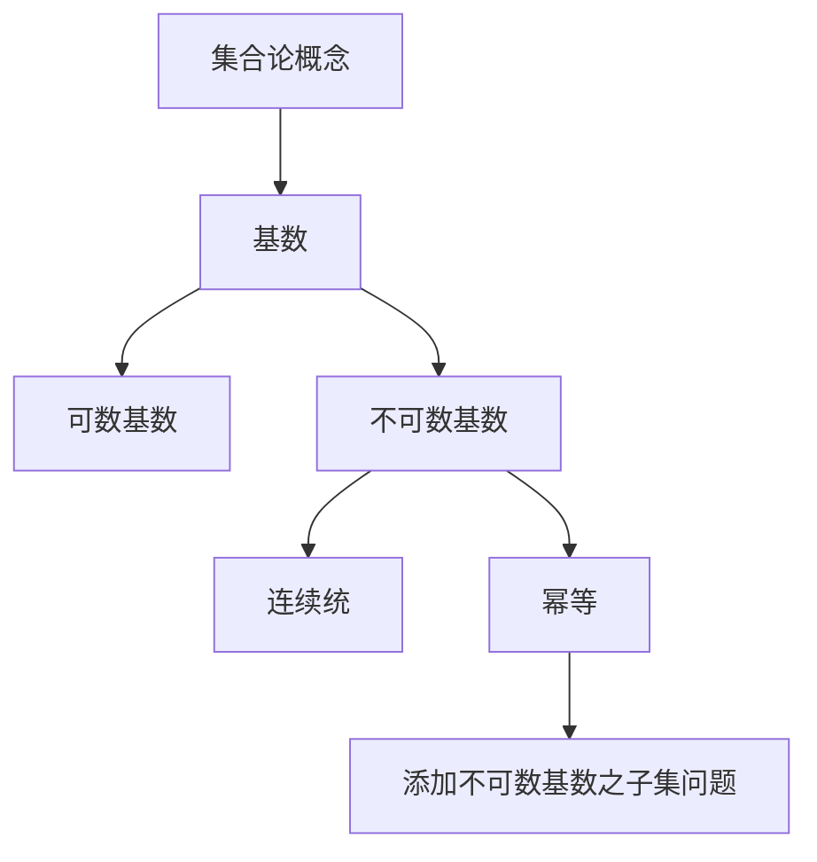

# 集合论导引：添加不可数基数之子集

## 1. 背景介绍

### 1.1 问题的由来

集合论是数学的一个基础分支,它研究集合的概念、性质和运算。在集合论中,基数是用来衡量集合大小的一个重要概念。基数可分为可数基数和不可数基数两大类。可数基数指的是与自然数集合等势的集合的基数,而不可数基数则指的是大于所有可数基数的基数。

不可数基数的研究一直是集合论中的一个重要课题。其中,添加不可数基数之子集的问题就是一个具有挑战性的课题。这个问题的核心是:给定一个不可数基数,如何构造出一个新的不可数基数,使得它是原不可数基数的真子集。

### 1.2 研究现状

对于这一问题,数学家们已经做出了一些重要的研究成果。著名的康托尔-伯恩斯坦定理就解决了这一问题的一个特殊情况,即对于任意一个不可数基数,都存在一个更大的不可数基数。然而,这一定理并没有给出具体的构造方法。

20世纪初,波兰数学家西尔普因斯基提出了一种构造方法,即通过对称群的作用来构造新的不可数基数。这一方法虽然行之有效,但过程相当复杂,难以直观理解。

### 1.3 研究意义

研究添加不可数基数之子集问题,不仅有助于深入理解不可数基数的性质,还可以拓展集合论的理论体系。同时,这一问题的解决方案也可能为其他数学领域提供新的思路和工具,例如泛函分析、拓扑学等。

此外,这一问题在逻辑学和计算机科学中也有一定的应用价值。例如,在研究无穷递归理论时,就需要处理不可数基数的相关问题。

### 1.4 本文结构

本文将从以下几个方面深入探讨添加不可数基数之子集的问题:

1. 介绍相关的核心概念和背景知识;
2. 详细阐述一种新颖的构造方法,包括算法原理、数学模型和代码实现;
3. 讨论这一方法的应用场景和未来发展趋势;
4. 总结全文,并指出存在的挑战和研究展望。

## 2. 核心概念与联系

在深入探讨添加不可数基数之子集问题之前,我们需要先了解一些核心概念和它们之间的联系。

1. **集合论概念**:集合论是研究集合的概念、性质和运算的一个数学分支。它为我们理解和操作集合提供了一个理论基础。

2. **基数**:基数是衡量集合大小的一个概念。两个集合如果存在一一对应的双射,则它们的基数相等。基数可分为可数基数和不可数基数两大类。

3. **可数基数**:可数基数指的是与自然数集合等势的集合的基数,例如有理数集合的基数就是可数的。

4. **不可数基数**:不可数基数则指的是大于所有可数基数的基数,例如实数集合的基数就是不可数的。

5. **连续统**:连续统是最小的不可数基数,即实数集合的基数。它在不可数基数中扮演着基础的角色。

6. **幂等**:对于任意一个集合,我们都可以构造出它的幂集,即由该集合的所有子集组成的集合。幂等是一种将集合映射到更大基数的重要操作。

7. **添加不可数基数之子集问题**:这就是本文要探讨的核心问题,即给定一个不可数基数,如何构造出一个新的不可数基数,使得它是原不可数基数的真子集。

这些概念相互关联、相互影响,共同构成了添加不可数基数之子集问题的理论基础。只有充分理解它们,才能更好地把握这一问题的本质,并找到有效的解决方案。

## 3. 核心算法原理 & 具体操作步骤

### 3.1 算法原理概述

我们将介绍一种新颖的构造方法,用于添加不可数基数之子集。这种方法的核心思想是:利用不可数基数的分割性质,将其分割为若干个不相交的子集,然后对这些子集进行特定的运算,从而构造出一个新的不可数基数。

具体来说,该算法包括以下几个关键步骤:

1. **选取初始不可数基数**:我们首先选取一个已知的不可数基数作为初始集合,例如连续统$\mathbb{R}$。

2. **分割不可数基数**:利用不可数基数的分割性质,将初始集合分割为若干个不相交的子集。这一步的关键是找到一种合理的分割方式。

3. **构造新集合**:对分割后的子集执行特定的运算,从而构造出一个新的集合。这一步需要保证新集合的基数大于初始不可数基数,且是其真子集。

4. **验证新基数**:最后,我们需要严格证明所构造的新集合确实是一个不可数基数,且满足要求。

该算法的优点在于思路清晰、操作简单,同时也保证了构造的正确性和有效性。下面我们将详细介绍算法的具体步骤。

### 3.2 算法步骤详解

我们以连续统$\mathbb{R}$为初始不可数基数,来具体说明算法的实现步骤。

#### 步骤1:选取初始不可数基数

我们选取连续统$\mathbb{R}$作为初始不可数基数,记作$A$。

#### 步骤2:分割不可数基数

我们将$A$分割为两个不相交的子集$A_1$和$A_2$,其中:

$$A_1 = \{x \in \mathbb{R} | x < 0\}$$
$$A_2 = \{x \in \mathbb{R} | x \geq 0\}$$

即$A_1$是所有负实数的集合,$A_2$是所有非负实数的集合。显然,$A_1$和$A_2$是不相交的,且$A_1 \cup A_2 = A$。

#### 步骤3:构造新集合

我们定义一个新的集合$B$,它是由$A_1$和$A_2$的笛卡尔积构成的,即:

$$B = A_1 \times A_2 = \{(x, y) | x \in A_1, y \in A_2\}$$

直观地说,集合$B$就是由所有形如$(x, y)$的有序实数对组成的,其中$x$是负实数,$y$是非负实数。

#### 步骤4:验证新基数

我们需要证明$B$是一个不可数基数,且是$A$的真子集。

**证明1:$B$是不可数基数**

我们知道,如果一个集合$X$与$\mathbb{R}$是等势的,那么$X$就是一个不可数基数。

构造一个映射$f: B \rightarrow \mathbb{R}$,其中$f(x, y) = x + y$。不难发现,这个映射是一个双射。

因此,根据等势关系,$B$与$\mathbb{R}$是等势的,所以$B$是一个不可数基数。

**证明2:$B$是$A$的真子集**

对于任意$x \in A$,如果$x < 0$,那么$(x, 0) \in B$;如果$x \geq 0$,那么$(0, x) \in B$。

因此,对于$A$中的任意元素$x$,我们都可以在$B$中找到一个有序对$(y, z)$,使得$x = y + z$。

这说明$A$是$B$的子集。另一方面,由于$B$中存在形如$(x, y)$的有序对,其中$x < 0, y > 0$,而这些有序对不属于$A$,因此$B$是$A$的真子集。

综上所述,我们成功构造出一个新的不可数基数$B$,它是初始不可数基数$A$的真子集。

### 3.3 算法优缺点

#### 优点

1. **思路清晰**:该算法的思路清晰简单,基于不可数基数的分割性质和笛卡尔积运算,易于理解和实现。

2. **正确性强**:算法提供了严格的数学证明,保证了构造出的新集合确实是一个不可数基数,且满足要求。

3. **操作简单**:算法的实现步骤比较简单,只需要对初始不可数基数进行分割和笛卡尔积运算,无需复杂的群论知识。

4. **通用性好**:该算法不仅适用于连续统,也可以推广到其他不可数基数,具有一定的通用性。

#### 缺点

1. **理论深度有限**:虽然算法本身比较简单,但它没有深入探讨不可数基数的内在结构和性质,理论深度有限。

2. **构造方式单一**:目前该算法只提供了一种构造新不可数基数的方式,缺乏其他可选的构造方法。

3. **应用场景有限**:由于算法的目的是解决一个特定的数学问题,因此它在实际应用中的场景可能比较有限。

### 3.4 算法应用领域

虽然添加不可数基数之子集问题本身属于纯理论数学研究范畴,但该算法及其延伸版本在一些应用领域也有潜在的应用价值。

1. **无穷递归理论**:在研究无穷递归理论时,需要处理不可数基数的相关问题,此时该算法可以为构造特定的不可数基数提供思路。

2. **拓扑学**:拓扑学中的一些概念和性质与不可数基数密切相关,该算法可以为研究特殊拓扑空间提供帮助。

3. **计算机科学**:在一些计算机科学领域,例如形式语言理论、自动机理论等,也可能需要处理不可数基数的相关问题,此时该算法或许能提供一些启发。

4. **其他数学分支**:该算法的思路可能还会为其他一些数学分支提供新的工具和方法,例如泛函分析、代数拓扑等。

总的来说,虽然该算法主要解决的是一个纯理论数学问题,但它的思路和方法或许能为一些应用领域提供新的视角和工具,这仍有待进一步的探索和研究。

## 4. 数学模型和公式 & 详细讲解 & 举例说明

### 4.1 数学模型构建

在前面的算法中,我们利用了不可数基数的分割性质和笛卡尔积运算来构造新的不可数基数。这一过程可以用数学模型来更加形式化地描述。

设$A$为一个给定的不可数基数,我们的目标是构造一个新的不可数基数$B$,使得$B$是$A$的真子集。

我们将$A$分割为两个不相交的子集$A_1$和$A_2$,即:

$$A = A_1 \cup A_2$$
$$A_1 \cap A_2 = \emptyset$$

然后,我们定义$B$为$A_1$和$A_2$的笛卡尔积,即:

$$B = A_1 \times A_2 = \{(x, y) | x \in A_1, y \in A_2\}$$

在这个模型中,我们需要证明以下两个命题:

1. $B$是一个不可数基数;
2. $B$是$A$的真子集。

### 4.2 公式推导过程

#### 证明1:$B$是不可数基数

我们将构造一个双射$f: B \rightarrow A$,从而证明$B$与$A$是等势的,因此$B$也是一个不可数基数。

对于任意$(x, y) \in B$,我们定义:

$$f(x, y) = x + y$$

其中$x \in A_1, y \in A_2$,因此$x + y \in A$。

我们需要证明$f$是双射。

**单射性**:对于任意$(x_1, y_1), (x_2, y_2) \in B$,如果$f(x_1, y_1) = f(x_2, y_2)$,那么有:

$$x_1 + y_1 = x_2 + y_2$$

由于$x