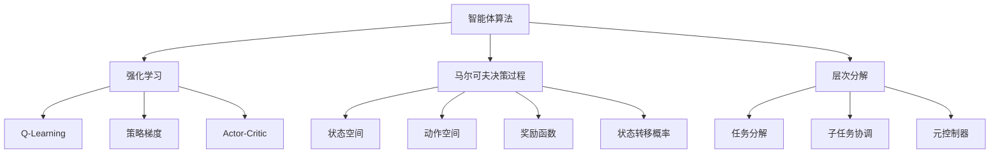

# AI Agent: AI的下一个风口 从ChatGPT到智能体

## 1. 背景介绍

### 1.1 问题的由来

人工智能(AI)的发展一直是科技领域的重点关注方向。近年来,随着深度学习、大数据和计算能力的飞速发展,AI技术取得了长足的进步,尤其是在自然语言处理(NLP)、计算机视觉和决策系统等领域。而最近,由OpenAI推出的ChatGPT大型语言模型引发了全球关注,展示了令人惊叹的对话能力和内容生成能力,被视为AI发展的一个重要里程碑。

然而,ChatGPT只是一个强大的语言模型,它缺乏真正的理解和推理能力,无法与现实世界进行有意义的交互。为了实现真正的人工通用智能(AGI),我们需要构建具有感知、学习、推理、决策和行动能力的智能体(Agent)系统。智能体不仅能够理解和生成自然语言,还能够感知和理解环境,做出决策并采取行动,从而与人类和环境进行实际交互。

### 1.2 研究现状

智能体的概念源于人工智能和机器人领域,旨在构建能够感知环境、学习知识、做出决策并执行行动的自主系统。近年来,随着深度强化学习、多智能体系统和人工生命等领域的发展,智能体技术也取得了重要进展。

目前,智能体系统主要应用于游戏、机器人控制、交通管理和智能家居等领域。例如,DeepMind的AlphaGo系统通过强化学习算法成功战胜了人类顶尖棋手,展示了智能体在复杂决策领域的巨大潜力。此外,智能体技术也被应用于自动驾驶、智能制造和智能助手等领域,为实现更智能化的系统奠定了基础。

### 1.3 研究意义

构建智能体系统是实现人工通用智能(AGI)的关键一步,具有重大的理论和应用价值。从理论层面来看,智能体技术需要整合感知、学习、推理、决策和行动等多个AI子领域,是一个极具挑战性的综合性问题。成功构建智能体系统将推动AI理论和方法的深入发展,为实现AGI奠定坚实基础。

从应用层面来看,智能体技术将极大提升人工智能系统的自主性和交互能力,使其能够更好地服务于现实世界的复杂场景。智能体可以广泛应用于机器人控制、智能制造、智能交通、智能家居、智能助手等多个领域,提高系统的智能化水平,促进社会的可持续发展。

### 1.4 本文结构

本文将全面探讨智能体技术的核心概念、关键算法、数学模型、实践应用和未来发展趋势。文章首先介绍智能体的基本概念和与其他AI技术的关系,然后深入剖析智能体系统的核心算法原理和数学模型,并通过代码实例和案例分析加深读者的理解。接下来,文章将探讨智能体在不同领域的实际应用场景,并推荐相关的工具和学习资源。最后,文章将总结智能体技术的研究成果,展望未来的发展趋势和面临的挑战,为读者提供全面的技术视角和洞见。

## 2. 核心概念与联系

智能体(Agent)是人工智能领域的一个核心概念,指的是能够感知环境、学习知识、做出决策并采取行动的自主系统。智能体需要具备以下几个关键能力:

1. **感知(Perception)**: 通过传感器获取环境信息,形成对环境的理解和表征。
2. **学习(Learning)**: 基于感知到的环境信息和反馈,不断优化和更新内部知识模型。
3. **推理(Reasoning)**: 基于已有知识和当前状态,进行逻辑推理和决策。
4. **决策(Decision Making)**: 根据推理结果,选择最优行动策略。
5. **行动(Action)**: 通过执行器对环境产生影响,实现与环境的交互。

智能体与其他AI技术有着密切的联系,可以看作是将多个AI子领域整合的综合系统。例如:

- **机器学习(Machine Learning)**: 智能体需要通过机器学习算法从数据中获取知识,不断优化其决策模型。
- **计算机视觉(Computer Vision)**: 智能体需要通过计算机视觉技术对视觉信息进行感知和理解。
- **自然语言处理(Natural Language Processing)**: 智能体需要通过NLP技术理解和生成自然语言,实现人机交互。
- **规划与决策(Planning and Decision Making)**: 智能体需要基于推理和规划算法做出最优决策。
- **控制理论(Control Theory)**: 智能体需要通过控制理论实现稳定和高效的行动执行。
- **多智能体系统(Multi-Agent Systems)**: 多个智能体之间需要协调和互动,形成复杂的多智能体系统。

智能体技术的发展需要整合多个AI子领域的理论和方法,是一个极具挑战性的综合性问题。成功构建智能体系统将推动AI理论和技术的全面发展,为实现人工通用智能(AGI)奠定坚实基础。

## 3. 核心算法原理 & 具体操作步骤

### 3.1 算法原理概述

智能体系统的核心算法主要包括强化学习(Reinforcement Learning)、马尔可夫决策过程(Markov Decision Process, MDP)和层次分解(Hierarchical Decomposition)等。

1. **强化学习(Reinforcement Learning)**:智能体通过与环境的交互,不断接收反馈信号(奖励或惩罚),并根据这些反馈调整其决策策略,从而学习到最优行为。强化学习算法包括Q-Learning、策略梯度(Policy Gradient)和Actor-Critic等。

2. **马尔可夫决策过程(Markov Decision Process, MDP)**:MDP为智能体提供了一个数学框架,用于描述环境的状态空间、动作空间、奖励函数和状态转移概率,并在此基础上进行决策和规划。

3. **层次分解(Hierarchical Decomposition)**:由于现实世界问题的复杂性,智能体需要将整体任务分解为多个子任务,并通过层次化的方式协调不同子任务的执行,从而简化决策过程。

### 3.2 算法步骤详解

以Q-Learning算法为例,智能体的学习过程可分为以下几个步骤:

1. **初始化**:定义状态空间、动作空间和Q值表(Q-table)。Q值表用于存储每个状态-动作对的期望累积奖励。
2. **观测环境**:智能体观测当前环境状态 $s_t$。
3. **选择动作**:根据Q值表和探索策略(如$\epsilon$-贪婪策略)选择一个动作 $a_t$。
4. **执行动作**:智能体执行选择的动作 $a_t$,环境转移到新状态 $s_{t+1}$,并返回即时奖励 $r_{t+1}$。
5. **更新Q值**:根据下式更新Q值表中 $(s_t, a_t)$ 对应的Q值:

$$Q(s_t, a_t) \leftarrow Q(s_t, a_t) + \alpha \left[ r_{t+1} + \gamma \max_a Q(s_{t+1}, a) - Q(s_t, a_t) \right]$$

其中 $\alpha$ 为学习率, $\gamma$ 为折现因子。
6. **迭代学习**:重复步骤2-5,直到收敛或达到预设条件。

通过不断与环境交互并更新Q值表,智能体最终能够学习到一个近似最优的策略,即在每个状态下选择能够maximizeize期望累积奖励的动作。

### 3.3 算法优缺点

强化学习算法的优点包括:

1. **无需监督**:不需要提前标注的训练数据,智能体可以通过与环境交互自主学习。
2. **通用性强**:可以应用于各种决策和控制问题,包括机器人控制、游戏AI、资源调度等。
3. **在线学习**:智能体可以在与环境交互的同时持续学习和优化策略。

但强化学习也存在一些缺点和挑战:

1. **样本效率低**:需要大量的交互数据才能收敛到一个好的策略。
2. **奖励稀疏**:在许多实际问题中,奖励信号非常稀疏,导致学习缓慢。
3. **维数灾难**:状态空间和动作空间过大时,算法收敛性能会急剧下降。
4. **探索与利用权衡**:需要在探索新策略和利用已学习策略之间做出权衡。

为了解决这些挑战,研究人员提出了多种改进算法,如深度强化学习(Deep Reinforcement Learning)、分层强化学习(Hierarchical Reinforcement Learning)、多智能体强化学习(Multi-Agent Reinforcement Learning)等。

### 3.4 算法应用领域

强化学习算法已被广泛应用于多个领域,包括:

1. **游戏AI**: DeepMind的AlphaGo/AlphaZero等系统展示了强化学习在复杂游戏领域的卓越表现。
2. **机器人控制**: 强化学习可用于训练机器人完成各种操作任务,如机械臂控制、行走控制等。
3. **自动驾驶**: 自动驾驶系统需要根据实时环境做出决策,强化学习可用于训练决策模块。
4. **智能调度**: 在资源调度、网络路由等领域,强化学习可用于优化调度策略。
5. **智能制造**: 在智能制造过程中,强化学习可优化生产流程和产品质量控制。
6. **金融决策**: 在投资组合优化、交易决策等金融领域,强化学习可提供决策支持。

总的来说,强化学习为构建智能体系统提供了有力的算法支持,在诸多领域展现出巨大的应用潜力。

## 4. 数学模型和公式 & 详细讲解 & 举例说明

### 4.1 数学模型构建

智能体系统的数学模型通常基于马尔可夫决策过程(MDP)框架。MDP由一个五元组 $(S, A, P, R, \gamma)$ 定义:

- $S$ 是有限的离散状态空间
- $A$ 是有限的离散动作空间
- $P(s' | s, a)$ 是状态转移概率,表示在状态 $s$ 下执行动作 $a$ 后转移到状态 $s'$ 的概率
- $R(s, a, s')$ 是奖励函数,表示在状态 $s$ 下执行动作 $a$ 后转移到状态 $s'$ 获得的即时奖励
- $\gamma \in [0, 1)$ 是折现因子,用于权衡即时奖励和长期累积奖励

在MDP框架下,智能体的目标是学习一个策略 $\pi: S \rightarrow A$,使得期望的累积折现奖励最大化:

$$\max_\pi \mathbb{E}_\pi \left[ \sum_{t=0}^\infty \gamma^t R(s_t, a_t, s_{t+1}) \right]$$

其中 $s_0$ 是初始状态, $a_t \sim \pi(s_t)$ 是根据策略 $\pi$ 在状态 $s_t$ 下选择的动作。

### 4.2 公式推导过程

在强化学习中,我们通常使用价值函数 $V(s)$ 和动作价值函数 $Q(s, a)$ 来表示策略的期望累积奖励。它们的定义如下:

$$V^\pi(s) = \mathbb{E}_\pi \left[ \sum_{t=0}^\infty \gamma^t R(s_t, a_t, s_{t+1}) | s_0 = s \right]$$

$$Q^\pi(s, a) = \mathbb{E}_\pi \left[ \sum_{t=0}^\infty \gamma^t R(s_t,