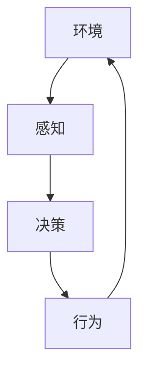
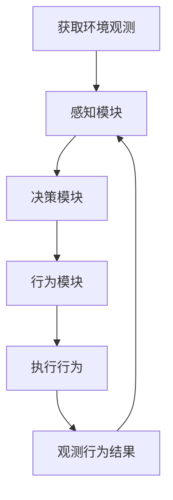

以下是标题为《AI Agent: AI的下一个风口 具身智能的核心概念》的技术博客文章正文内容：

# AI Agent: AI的下一个风口 具身智能的核心概念

## 1. 背景介绍

### 1.1 问题的由来

在过去几十年中,人工智能(AI)取得了长足的进步,尤其是在机器学习和深度学习领域。然而,大多数现有的AI系统都是基于软件的,缺乏与现实世界的紧密交互和embodied(具身)的能力。这种"脱离现实"的局限性阻碍了AI系统在复杂环境中的实际应用。

### 1.2 研究现状  

为了克服这一挑战,embodied AI(具身智能)应运而生。具身智能旨在赋予AI系统以物理形态,使其能够通过感知器与环境进行实时交互,并基于感知信息作出决策和行动。这种新型AI范式已经在机器人、虚拟现实和计算机游戏等领域展现出巨大的潜力。

### 1.3 研究意义

具身智能的关键在于将感知、决策和行为紧密集成,使AI系统能够像人类一样通过身体与环境互动来获取知识和经验。这不仅有助于提高AI系统的智能水平,还能促进人机协作,扩展AI在现实世界中的应用场景。

### 1.4 本文结构

本文将首先介绍具身智能的核心概念,包括感知、决策和行为等关键组成部分。接下来,我们将深入探讨具身智能的核心算法原理、数学模型和公式推导。然后,通过实际项目案例,演示具身智能系统的开发实践。最后,我们将分析具身智能在各领域的应用前景,并讨论其未来发展趋势和面临的挑战。

## 2. 核心概念与联系

具身智能系统由三个核心组成部分构成:感知(Perception)、决策(Decision Making)和行为(Action)。这三个部分相互关联,共同驱动着智能体与环境的交互过程。



1. **感知(Perception)**: 通过各种传感器(如摄像头、雷达等)获取环境信息,构建对环境的理解和表征。这是具身智能系统与外部世界交互的入口。

2. **决策(Decision Making)**: 基于感知获得的信息,智能体需要做出合理的决策,以确定应该执行何种行为。决策过程通常涉及规划、推理和学习等复杂的认知功能。

3. **行为(Action)**: 根据决策的结果,智能体通过执行器(如机械臂、推进器等)与环境进行实际交互,产生有意义的行为输出。行为的结果又将反馈到感知模块,形成一个闭环过程。

这三个组成部分紧密协作,相互影响和制约,共同驱动着具身智能系统与环境的动态交互。只有将感知、决策和行为有机融合,才能实现真正的具身智能。

## 3. 核心算法原理 & 具体操作步骤

### 3.1 算法原理概述

具身智能系统的核心算法原理可概括为"感知-决策-行为"闭环过程。具体而言,算法需要解决以下三个关键问题:

1. **如何从环境中获取有用的信息?** (感知问题)
2. **如何基于感知信息做出明智的决策?** (决策问题) 
3. **如何将决策转化为合理的行为?** (行为问题)

为了解决这三个问题,具身智能算法通常采用以下几种主要方法:

- **机器学习**: 使用监督学习、强化学习等技术从数据中学习感知、决策和行为策略。
- **规划与控制**: 基于环境模型和约束条件,生成满足目标的行为序列。
- **知识表示与推理**: 构建环境知识库,并通过逻辑推理指导决策和行为。

### 3.2 算法步骤详解  

一种典型的具身智能算法流程如下:



1. **获取环境观测**: 通过传感器获取环境的原始数据,如图像、声音、深度等。

2. **感知模块**: 对原始数据进行处理和特征提取,构建对环境的表征,如物体检测、语义分割等。

3. **决策模块**: 基于感知模块的输出,结合目标和约束条件,通过规划、推理或学习等方法做出决策。

4. **行为模块**: 将决策转化为可执行的行为序列,并发送到执行器。

5. **执行行为**: 智能体根据行为序列与环境进行交互,如机器人移动、机械臂操作等。

6. **观测行为结果**: 监测行为执行的结果,获取新的环境观测,回到第一步,重复上述过程。

该算法通过不断迭代上述闭环,使智能体能够持续地从环境中获取信息、做出决策并执行相应的行为,逐步完成预定的任务。

### 3.3 算法优缺点

具身智能算法的主要优点包括:

- 能够直接与现实世界交互,获取丰富的环境信息。
- 通过行为与环境形成闭环,有助于持续学习和自我完善。
- 将感知、决策和行为有机结合,有利于发挥人工智能的整体能力。

同时,该算法也存在一些不足之处:

- 算法复杂度较高,需要同时处理感知、决策和行为三个环节。
- 受限于物理约束和现实环境的复杂性,存在一定的不确定性和风险。
- 需要大量的训练数据和计算资源,对硬件要求较高。

### 3.4 算法应用领域

具身智能算法可以应用于多个领域,包括但不限于:

- **服务机器人**: 协助人类完成家居、医疗、零售等各种服务任务。
- **自动驾驶**: 让汽车能够感知道路环境并自主驾驶。
- **智能制造**: 机器人自动化生产和装配。
- **虚拟现实/增强现实**: 提供身临其境的沉浸式体验。
- **视频游戏**: 创造智能化的虚拟角色与玩家互动。

## 4. 数学模型和公式 & 详细讲解 & 举例说明

### 4.1 数学模型构建

在具身智能系统中,我们通常需要构建数学模型来描述环境、智能体和它们之间的交互关系。一种常用的建模方法是马尔可夫决策过程(Markov Decision Process, MDP)。

MDP可以用一个五元组 $\langle \mathcal{S}, \mathcal{A}, \mathcal{P}, \mathcal{R}, \gamma \rangle$ 来表示,其中:

- $\mathcal{S}$ 是环境的状态集合
- $\mathcal{A}$ 是智能体可执行的行为集合
- $\mathcal{P}$ 是状态转移概率函数,表示在执行行为 $a \in \mathcal{A}$ 后,从状态 $s \in \mathcal{S}$ 转移到状态 $s' \in \mathcal{S}$ 的概率 $\mathcal{P}(s'|s,a)$
- $\mathcal{R}$ 是奖励函数,定义了在状态 $s$ 执行行为 $a$ 后获得的即时奖励 $\mathcal{R}(s,a)$
- $\gamma \in [0,1)$ 是折现因子,用于权衡即时奖励和长期回报

在 MDP 框架下,智能体的目标是找到一个策略 $\pi: \mathcal{S} \rightarrow \mathcal{A}$,使得期望的累积折现奖励最大化:

$$
\max_\pi \mathbb{E}\left[ \sum_{t=0}^\infty \gamma^t R(s_t, a_t) \right]
$$

其中 $s_t$ 和 $a_t$ 分别表示在时间步 $t$ 的状态和行为。

### 4.2 公式推导过程

为了解决上述最优化问题,我们可以使用动态规划或强化学习等方法。以 Q-Learning 算法为例,其目标是学习一个 Q 函数 $Q(s,a)$,表示在状态 $s$ 执行行为 $a$ 后可获得的期望累积奖励。Q 函数的更新规则为:

$$
Q(s_t, a_t) \leftarrow Q(s_t, a_t) + \alpha \left[ r_t + \gamma \max_{a'} Q(s_{t+1}, a') - Q(s_t, a_t) \right]
$$

其中 $\alpha$ 是学习率,控制着新信息对 Q 函数的影响程度。通过不断更新 Q 函数,最终可以得到一个近似最优的策略 $\pi^*(s) = \arg\max_a Q(s,a)$。

### 4.3 案例分析与讲解

考虑一个简单的网格世界环境,智能体(机器人)的目标是从起点移动到终点。每一步移动都会获得一定的负奖励(代价),到达终点会获得大的正奖励。

```python
import numpy as np

# 定义网格世界
WORLD = np.array([
    [0, 0, 0, 1],
    [0, -1, 0, 0],
    [0, 0, 0, 0]
])

# 状态空间大小
n_states = WORLD.size

# 动作空间 (上下左右)
ACTIONS = np.array([[-1, 0], [1, 0], [0, -1], [0, 1]])
n_actions = ACTIONS.shape[0]

# 初始 Q 函数
Q = np.zeros((n_states, n_actions))

# 超参数
ALPHA = 0.1  # 学习率
GAMMA = 0.9  # 折现因子
MAX_EPISODES = 1000  # 最大训练回合数
```

我们使用 Q-Learning 算法训练智能体,通过不断探索和更新 Q 函数,最终学习到一个近似最优的策略。下面是算法的核心部分:

```python
for episode in range(MAX_EPISODES):
    # 初始化状态
    state = ...
    while not is_terminal(state):
        # 选择行为 (探索 vs 利用)
        action = epsilon_greedy(Q[state], EPSILON)
        
        # 执行行为,获取下一状态和奖励
        next_state, reward = step(state, action)
        
        # 更新 Q 函数
        Q[state][action] += ALPHA * (reward + GAMMA * np.max(Q[next_state]) - Q[state][action])
        
        # 更新状态
        state = next_state
```

通过上述训练过程,智能体可以逐步学习到一个有效的策略,从起点安全地到达终点。我们可以将学习到的 Q 函数可视化,直观地观察智能体的决策过程。

### 4.4 常见问题解答

**Q: 为什么需要折现因子 $\gamma$?**

A: 折现因子 $\gamma$ 的作用是权衡即时奖励和长期回报。如果 $\gamma=0$,则智能体只关注当前的即时奖励;如果 $\gamma=1$,则智能体过于重视长期回报,可能会陷入局部最优。通常情况下,我们会选择一个中等值(如 0.9),使智能体能够权衡当前和未来的奖励。

**Q: 如何处理连续状态和行为空间?**

A: 对于连续的状态和行为空间,我们可以使用函数逼近的方法,如深度神经网络,来近似 Q 函数或策略函数。这种方法被称为深度强化学习(Deep Reinforcement Learning)。

**Q: 如何应对环境的部分可观测性?**

A: 在现实环境中,智能体通常无法获取全部的状态信息。一种解决方案是使用部分可观测马尔可夫决策过程(Partially Observable Markov Decision Process, POMDP)模型,并采用基于记忆的方法(如递归神经网络)来估计隐藏状态。

## 5. 项目实践:代码实例和详细解释说明

### 5.1 开发环境搭建

在实现具身智能系统之前,我们需要先搭建开发环境。以下是一些常用的工具和库:

- **Python**: 流行的编程语言,具有丰富的科学