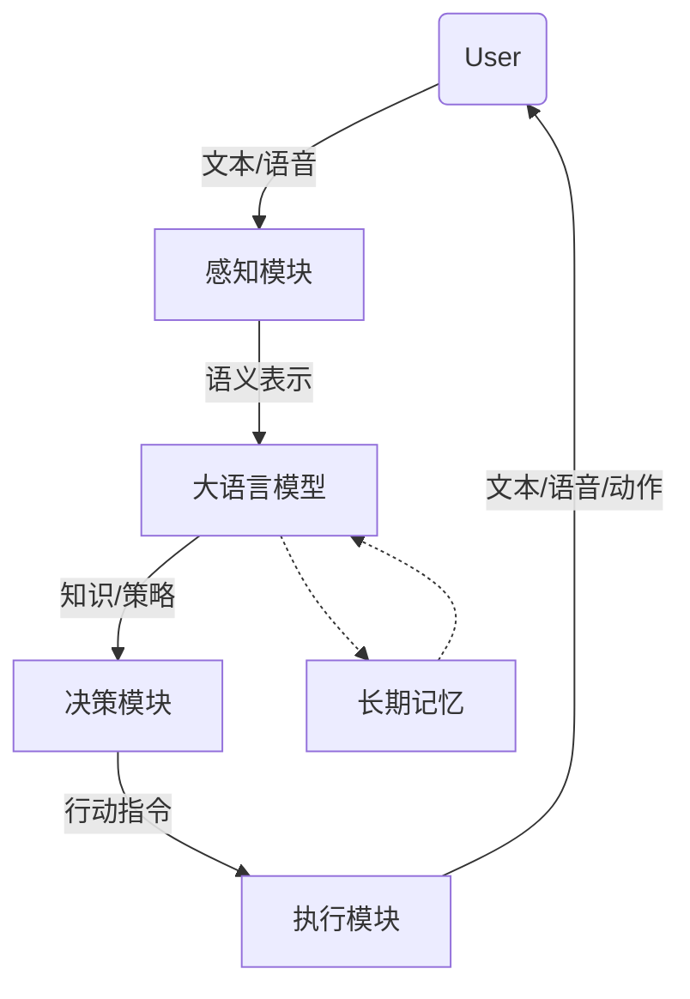

# AI Agent: AI的下一个风口 大模型时代的AI

## 1. 背景介绍
### 1.1 问题的由来
人工智能(Artificial Intelligence, AI)技术的快速发展正在深刻改变着我们的生活和工作方式。从智能助理、无人驾驶到智能制造，AI无处不在。然而，传统的AI系统大多是针对特定任务开发的，缺乏通用性和灵活性。近年来，以ChatGPT为代表的大语言模型(Large Language Model, LLM)掀起了AI领域的新浪潮。这些大模型展现出了令人惊叹的语言理解和生成能力，有望成为未来AI系统的基础设施。本文将深入探讨大模型时代下AI Agent的发展趋势和关键技术。

### 1.2 研究现状
目前，各大科技巨头如OpenAI、Google、Meta等都在大力投入大模型的研究。GPT-3、PaLM、OPT等大模型相继问世，在各类NLP任务上取得了突破性进展。研究人员正在探索如何将大模型应用于构建更加通用、灵活的AI Agent系统。一些初步的尝试包括InstructGPT[1]、ChatGPT[2]等，它们展示了大模型在对话交互、任务执行等方面的潜力。但目前的AI Agent系统还存在诸多局限性，距离真正意义上的通用人工智能还有很长的路要走。

### 1.3 研究意义 
大模型为构建新一代AI Agent系统提供了重要的技术基础。传统的AI系统往往只能处理特定的任务，缺乏灵活性和适应性。而基于大模型的AI Agent有望突破这一局限，实现更加通用和智能的人机交互。这不仅将极大提升AI系统的应用范围，也将为人类认知和智能的研究带来新的视角。此外，AI Agent技术的进步还将推动智能助理、智能客服等领域的发展，为人们的工作和生活带来便利。

### 1.4 本文结构
本文将围绕大模型时代下AI Agent的关键技术展开讨论。第2节介绍AI Agent的核心概念及其与大模型的关系。第3节重点阐述基于大模型构建AI Agent的核心算法原理和实现步骤。第4节从数学角度对相关模型和公式进行详细推导和分析。第5节给出了一个基于大模型的AI Agent项目的代码实例。第6节讨论AI Agent技术的实际应用场景。第7节推荐了一些相关的学习资源和开发工具。第8节总结全文并展望AI Agent技术的未来发展方向。

## 2. 核心概念与联系
AI Agent是一种能够感知环境、自主行动以实现特定目标的智能系统[3]。它通常由感知、决策和执行三大模块组成。传统的AI Agent系统大多基于规则或强化学习等方法，适用范围有限。而大模型为AI Agent的构建带来了新的可能性。

大模型是指参数量达到数亿、数百亿甚至更多的深度学习模型，尤其是自然语言处理领域的模型如Transformer[4]。这些模型在海量数据上进行预训练，习得了丰富的语言知识和世界知识，具备强大的语言理解和生成能力。将大模型与AI Agent结合，可以赋予Agent更加广泛和深入的认知智能。

具体而言，大模型可以作为AI Agent的"大脑"，负责语言理解、知识存储、推理决策等核心功能。Agent可以利用大模型习得的知识对用户输入进行理解和分析，生成恰当的回应或行动策略。此外，大模型还可以作为Agent的长期记忆，存储对话历史、任务上下文等重要信息，使Agent能够进行连贯的多轮交互。

下图展示了一个基于大模型的AI Agent系统的简要架构：



## 3. 核心算法原理 & 具体操作步骤
### 3.1 算法原理概述
基于大模型构建AI Agent的核心是利用大模型进行few-shot学习。传统的机器学习方法需要大量标注数据进行训练，而few-shot学习允许模型在很少样本的情况下快速适应新任务[5]。具体而言，我们可以将任务描述、少量示例和提示(prompt)输入到大模型中，引导模型生成所需的响应。

### 3.2 算法步骤详解
1. 任务定义：明确AI Agent需要完成的任务，如对话、问答、任务规划等。
2. 提示设计：设计适当的提示模板，包括任务描述、输入示例、期望的输出格式等。提示的设计直接影响模型的表现。
3. 模型选择：选择合适的预训练大模型，如GPT-3、PaLM等。需要权衡模型的性能、计算开销等因素。
4. 推理生成：将设计好的提示输入到大模型中，生成AI Agent的响应。可以通过采样、束搜索等方法控制生成的多样性和质量。
5. 结果评估：评估生成的响应是否符合预期，是否能够完成任务。可以通过人工评估或自动度量(如BLEU、Rouge等)来评价。
6. 迭代优化：根据评估结果，迭代优化提示设计和生成策略，提升AI Agent的性能。可以引入强化学习等技术动态调整模型。

### 3.3 算法优缺点
基于大模型的few-shot学习具有以下优点：
- 无需大量标注数据，降低了数据收集和标注的成本。
- 可以快速适应新任务，具有很好的迁移能力和泛化能力。
- 生成的响应更加自然流畅，接近人类的语言表达。

但该方法也存在一些局限性：
- 对提示设计有较高要求，需要一定的先验知识和经验。
- 生成的响应质量不够稳定，可能出现幻觉或不一致的情况。
- 推理速度较慢，对计算资源要求较高。

### 3.4 算法应用领域
基于大模型的AI Agent技术可以应用于多个领域，包括：
- 智能客服：提供自动化的客户服务，解答常见问题。
- 虚拟助手：执行日程管理、信息检索等个人助理任务。
- 教育助手：辅助学生学习，提供个性化的教学服务。
- 医疗助手：协助医生进行诊断、提供医疗咨询等。

## 4. 数学模型和公式 & 详细讲解 & 举例说明
### 4.1 数学模型构建
大模型的核心是Transformer架构和自注意力机制。Transformer由编码器和解码器组成，每个编码器/解码器层包含自注意力(Self-Attention)和前馈(Feed Forward)两个子层[4]。

自注意力机制允许模型对输入序列中的每个位置计算注意力权重，捕捉位置之间的依赖关系。具体来说，对于输入序列$X=(x_1,\ldots,x_n)$，自注意力的计算过程如下：

$$
\begin{aligned}
Q &= XW^Q \\
K &= XW^K \\
V &= XW^V \\
\text{Attention}(Q,K,V) &= \text{softmax}(\frac{QK^T}{\sqrt{d_k}})V
\end{aligned}
$$

其中$Q$、$K$、$V$分别为查询、键、值矩阵，$W^Q$、$W^K$、$W^V$为可学习的参数矩阵，$d_k$为键向量的维度。

### 4.2 公式推导过程
Transformer的训练目标是最大化似然概率，即最小化负对数似然损失：

$$
\mathcal{L} = -\sum_{i=1}^N \log p(y_i|x_i;\theta)
$$

其中$x_i$、$y_i$分别为第$i$个样本的输入和输出序列，$\theta$为模型参数。

在推理阶段，我们希望生成概率最大的输出序列$\hat{y}$：

$$
\hat{y} = \arg\max_y p(y|x;\theta)
$$

但穷举所有可能的输出序列是不现实的。实际中常用的是贪心搜索(Greedy Search)或束搜索(Beam Search)等近似算法。以束搜索为例，每次保留概率最高的$k$个候选序列，直到生成完整的输出。

### 4.3 案例分析与讲解
以一个简单的对话任务为例，假设我们希望AI Agent能够对用户的问题给出合适的回答。我们可以设计如下的提示模板：

```
User: 你好，请问你是谁？
Assistant: 我是一名人工智能助手，我的名字叫Alice。很高兴认识你！有什么我可以帮助你的吗？
User: 你可以做什么？
Assistant: 作为一名AI助手，我可以协助你完成各种任务，例如：
1. 回答问题和提供信息：我拥有广泛的知识，可以就各种主题进行讨论和解答。
2. 帮助写作和编辑：我可以为你提供写作建议、帮你检查语法和修辞等。
3. 日程管理和提醒：我可以帮你记录和安排日程，适时提醒你重要事项。
4. 数据分析和可视化：我可以帮你分析和可视化数据，发现有价值的见解。
5. 代码辅助和调试：我可以为你提供编程方面的建议，帮你分析和调试代码。
我还在不断学习新的技能，希望未来能为你提供更多帮助。让我知道你需要什么帮助吧！
User: {用户输入}
Assistant:
```

将用户的输入填入{用户输入}占位符，然后将提示输入给模型，就可以得到AI Agent的回复。例如：

```
User: 你能为我推荐一些有趣的书吗？
Assistant: 当然可以！以下是我为你推荐的几本有趣的书：

1.《三体》 - 刘慈欣：一部宏大的科幻小说，探讨了人类文明在宇宙中的渺小和未知。故事跨越几个时间维度，展现了人类与外星文明的冲突。

2.《百年孤独》 - 加西亚·马尔克斯：一部魔幻现实主义经典，描绘了布恩迪亚家族几代人的传奇故事。作者将现实与魔幻元素完美融合，创造了独特的文学世界。

3.《追风筝的人》 - 卡勒德·胡赛尼：一个关于友谊、背叛与救赎的故事。小说跨越几十年，展现了阿富汗动荡历史下人性的善恶。感人至深的父子情和友情令人动容。

4.《活着》 - 余华：一部反映中国社会变革的小说，讲述了一个普通人在时代洪流中的坎坷命运。平实的语言背后是对生命的深刻思考。

5.《时间简史》 - 史蒂芬·霍金：一本深入浅出的科普著作，带你探索宇宙的奥秘。作者用通俗易懂的语言解释了相对论、量子力学、黑洞等复杂概念。

这些书涵盖了科幻、魔幻、历史、现实等多个主题，相信总有一本能引起你的兴趣。希望你能从中找到心仪的读物，享受阅读的乐趣！
```

### 4.4 常见问题解答
Q: 提示工程(Prompt Engineering)在构建AI Agent中有什么作用？
A: 提示工程是设计和优化输入给语言模型的提示的过程，对基于大模型的AI Agent至关重要。一个设计良好的提示可以引导模型生成符合预期的输出，减少无关或有害的响应。提示工程需要考虑任务定义、上下文信息、期望的回答格式等多个因素。

Q: 如何控制AI Agent生成的多样性？
A: 可以通过调节生成过程中的温度(Temperature)参数来控制输出的多样性。温度越高，生成的结果越多样化；温度越低，生成的结果越确定和保守。此外，还可以通过Top-k采