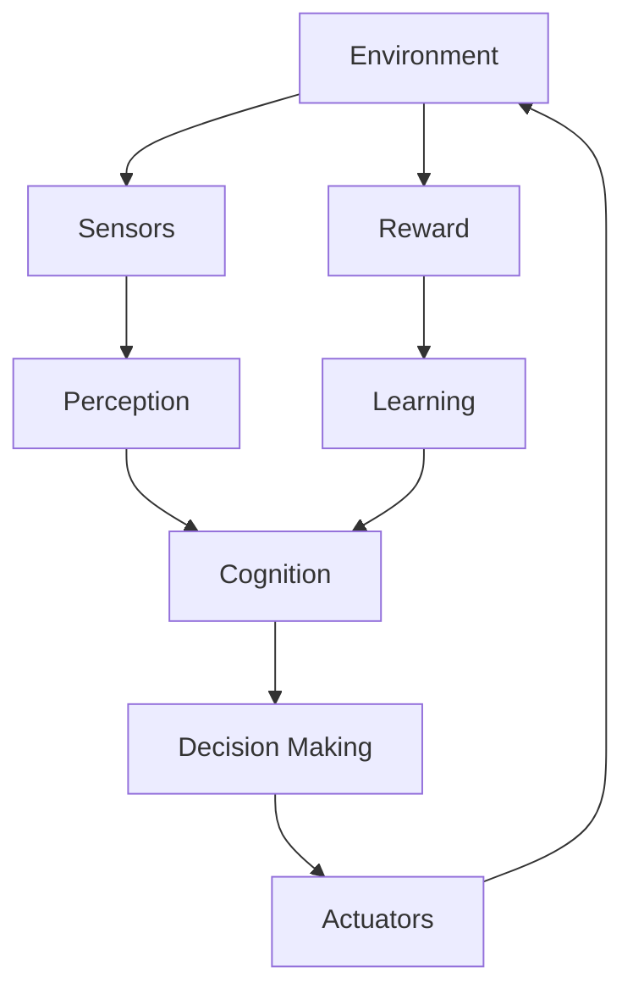

# AI Agent: AI的下一个风口 对未来的启示

关键词：AI Agent、人工智能、智能代理、自主学习、多模态交互、知识图谱、强化学习、自然语言处理、计算机视觉、人机协作

## 1. 背景介绍
### 1.1  问题的由来
人工智能(Artificial Intelligence, AI)技术的飞速发展,正在深刻改变着人类社会的方方面面。从自然语言处理、计算机视觉到机器人和自动驾驶,AI无处不在。然而,当前的AI系统大多是专用于特定任务的,缺乏通用性和自主学习能力。如何构建能够像人一样自主学习、推理、解决问题的AI Agent,成为了AI领域的一个重要研究方向。

### 1.2  研究现状
近年来,AI Agent的研究取得了长足进展。DeepMind的AlphaGo系列算法在围棋领域达到了超人的水平；OpenAI的GPT语言模型展现了惊人的自然语言理解和生成能力；谷歌的Pathways项目致力于打造具备广泛认知能力的AI系统。尽管如此,当前的AI Agent在通用性、鲁棒性、可解释性等方面仍存在不足,离真正意义上的Artificial General Intelligence(AGI)还有很长的路要走。

### 1.3  研究意义
AI Agent代表了AI技术的未来发展方向。一个理想的AI Agent应该具备感知、学习、推理、规划等多方面的认知能力,能够与人自然交互,完成复杂的任务。这不仅将极大提升AI系统的实用价值,也将推动认知科学、心理学等基础学科的发展。此外,AI Agent的研究对于探索机器意识、机器伦理等哲学问题也具有重要意义。

### 1.4  本文结构
本文将重点探讨AI Agent的核心概念、关键技术以及未来发展趋势。第2节介绍AI Agent的定义和特征；第3节阐述AI Agent的核心算法原理；第4节建立AI Agent的数学模型；第5节给出一个基于强化学习的AI Agent代码实例；第6节分析AI Agent的应用场景；第7节推荐相关学习资源；第8节总结全文并展望AI Agent的未来。

## 2. 核心概念与联系
AI Agent是一个能够感知环境、自主学习和决策、执行任务的人工智能系统。它包含感知、认知、决策、执行等多个模块,通过内部的信息处理和外部的环境交互来不断提升自身的性能,以完成特定的目标。

AI Agent的核心概念包括:
- **感知(Perception)**: 通过传感器获取外部环境信息,如视觉、语音、触觉等。
- **认知(Cognition)**: 对感知信息进行理解、推理、规划和学习,构建内部的世界模型。 
- **决策(Decision Making)**: 根据认知结果和目标,选择最优的行动策略。
- **执行(Execution)**: 通过执行器(如电机、语音合成器)来实施所选策略,影响外部环境。
- **学习(Learning)**: 根据环境反馈,调整内部模型和决策机制,不断提升适应性和性能。
- **交互(Interaction)**: 与环境、人和其他Agent进行信息交换,协同完成任务。

这些概念环环相扣,共同定义了一个完整的感知-决策-行动闭环。如下图所示的是一个典型的AI Agent系统架构:



## 3. 核心算法原理 & 具体操作步骤
### 3.1  算法原理概述
AI Agent的核心算法包括机器学习、深度学习、强化学习、自然语言处理、计算机视觉等。其中,强化学习(Reinforcement Learning, RL)是实现Agent自主学习和决策的关键。RL通过智能体(Agent)与环境的交互,根据环境反馈(奖励或惩罚)来优化行为策略,以获得最大的累积奖励。这一过程可以用马尔可夫决策过程(Markov Decision Process, MDP)来建模。

### 3.2  算法步骤详解 
RL的基本算法流程如下:
1. 初始化Q值函数Q(s,a),状态s,行动a
2. 重复:
   1. 根据某个策略(如ε-greedy)选择在状态s下的行动a  
   2. 执行行动a,观察奖励r和新状态s'
   3. 更新Q值: 
   $$Q(s,a) \leftarrow Q(s,a) + \alpha [r + \gamma \max_{a'} Q(s',a') - Q(s,a)]$$
   其中,α是学习率,γ是折扣因子
   4. s ← s'
3. 直到达到终止状态

常见的RL算法包括Q-Learning、SARSA、DQN等。DQN引入了深度神经网络来逼近Q值函数,极大地提升了RL在复杂环境下的决策能力。

### 3.3  算法优缺点
RL的优点在于:
- 通过自主学习获得最优策略,不需要人工设计
- 能够处理延迟奖励和部分可观测环境
- 具有一定的泛化和迁移能力

但RL也存在一些局限:
- 训练效率较低,需要大量的环境交互
- 对奖励函数的设计较为敏感  
- 在高维、连续状态和行动空间下性能受限

### 3.4  算法应用领域
RL已在多个领域取得突破,如:
- 游戏AI:国际象棋、围棋、星际争霸等
- 机器人控制:机械臂操纵、四足机器人等  
- 自动驾驶:端到端驾驶策略学习
- 推荐系统:在线广告投放、个性化推荐等

## 4. 数学模型和公式 & 详细讲解 & 举例说明
### 4.1  数学模型构建
如前所述,RL问题可用MDP来建模。一个MDP由一个五元组<S,A,P,R,γ>定义:
- S是有限的状态集
- A是有限的行动集
- P是状态转移概率矩阵,P(s'|s,a)表示在状态s下执行行动a后转移到状态s'的概率
- R是奖励函数,R(s,a)表示在状态s下执行行动a获得的即时奖励
- γ∈[0,1]是折扣因子,表示未来奖励的重要程度

在MDP中,策略π(a|s)定义为在状态s下选择行动a的概率。RL的目标就是寻找最优策略π*,使得期望累积奖励最大化:

$$\pi^* = \arg\max_\pi E[\sum_{t=0}^{\infty} \gamma^t R(s_t,a_t) | \pi]$$

### 4.2  公式推导过程
为了求解最优策略,需要引入价值函数的概念。状态价值函数V^π(s)表示从状态s开始,遵循策略π所能获得的期望累积奖励:

$$V^\pi(s) = E[\sum_{t=0}^{\infty} \gamma^t R(s_t,a_t) | s_0=s, \pi]$$

类似地,动作价值函数Q^π(s,a)表示在状态s下选择行动a,遵循策略π所能获得的期望累积奖励:

$$Q^\pi(s,a) = E[\sum_{t=0}^{\infty} \gamma^t R(s_t,a_t) | s_0=s, a_0=a, \pi]$$

根据贝尔曼方程,价值函数满足如下递推关系:

$$V^\pi(s) = \sum_a \pi(a|s) \sum_{s'} P(s'|s,a) [R(s,a) + \gamma V^\pi(s')]$$

$$Q^\pi(s,a) = \sum_{s'} P(s'|s,a) [R(s,a) + \gamma \sum_{a'} \pi(a'|s') Q^\pi(s',a')]$$

最优价值函数V^*(s)和Q^*(s,a)满足贝尔曼最优方程:

$$V^*(s) = \max_a \sum_{s'} P(s'|s,a) [R(s,a) + \gamma V^*(s')]$$

$$Q^*(s,a) = \sum_{s'} P(s'|s,a) [R(s,a) + \gamma \max_{a'} Q^*(s',a')]$$

求解上述方程即可得到最优策略:

$$\pi^*(a|s) = \arg\max_a Q^*(s,a)$$

### 4.3  案例分析与讲解
考虑一个简单的迷宫问题,如下图所示:

```
+---+---+---+
| S |   |   |
+---+---+---+
|   | X | G |
+---+---+---+
```

其中,S为起点,G为终点,X为障碍。状态空间S={S,(1,2),(1,3),G},行动空间A={上,下,左,右}。当Agent撞墙或遇到障碍时,状态保持不变。转移到非终点状态的奖励为-1,转移到终点的奖励为+10。

我们可以用Q-Learning算法来求解这个问题。初始化Q值为0,设置学习率α=0.1,折扣因子γ=0.9,按照以下过程迭代:

1. 初始化状态s=S
2. 重复:
   1. 根据ε-greedy策略选择行动a (ε=0.1)
   2. 执行行动a,观察奖励r和新状态s'
   3. 更新Q值: Q(s,a) ← Q(s,a) + 0.1 [r + 0.9 max_a' Q(s',a') - Q(s,a)]
   4. s ← s'
3. 直到达到终点G

经过多轮迭代,Q值最终收敛,得到最优策略:在起点S选择向右,在(1,2)选择向下,在(1,3)选择向右,即可到达终点G。

### 4.4  常见问题解答
**Q: RL能否处理连续状态和行动空间?**

A: 传统的Q-Learning等算法只适用于离散空间。对于连续空间,可以使用函数逼近的方法,如将价值函数表示为线性函数或神经网络。另一类方法是Actor-Critic算法,它直接学习策略函数,而不是价值函数。

**Q: RL如何处理部分可观测环境?**

A: 部分可观测马尔可夫决策过程(POMDP)可以建模Agent只能获得状态的部分观测值的情况。求解POMDP的方法包括将其转化为MDP(如维护置信状态)、直接学习观测值到行动的映射等。近年来,基于RNN的RL方法在POMDP上取得了良好效果。

**Q: 多个Agent之间如何协作?**

A: 多Agent强化学习(MARL)考虑多个Agent在同一环境中学习和协作的问题。MARL可分为合作、竞争和混合三类。常见的MARL算法包括博弈论方法、集中式学习分布式执行(CLDE)、分布式Q-Learning等。此外,多Agent间的通信也是一个重要的研究问题。

## 5. 项目实践：代码实例和详细解释说明
### 5.1  开发环境搭建
我们使用Python和PyTorch来实现一个简单的基于DQN的AI Agent。首先安装必要的依赖包:

```bash
pip install torch gym numpy matplotlib
```

其中,torch是PyTorch库,gym是OpenAI开发的强化学习环境库,numpy和matplotlib用于数据处理和可视化。

### 5.2  源代码详细实现
下面给出了DQN算法的核心代码:

```python
import torch
import torch.nn as nn
import torch.optim as optim
import random
import numpy as np
from collections import deque

class DQN(nn.Module):
    def __init__(self, state_size, action_size):
        super(DQN, self).__init__()
        self.fc1 = nn.Linear(state_size, 64)
        self.fc2 = nn.Linear(64, 64)
        self.fc3 = nn.Linear(64, action_size)

    def forward(self, x):
        x = torch.relu(self.fc1(x))
        x = torch.relu(self.fc2(x))
        x = self.fc3(x)
        return x

class Agent:
    def __init__(self, state_size, action_size):
        self.state_size = state_size
        self.action_size = action_size
        self.memory = deque(maxlen=2000)
        self.gamma = 0.95  # discount factor
        self.epsilon = 1.0  # exploration rate
        self.epsilon_min = 0.01
        self.epsilon_