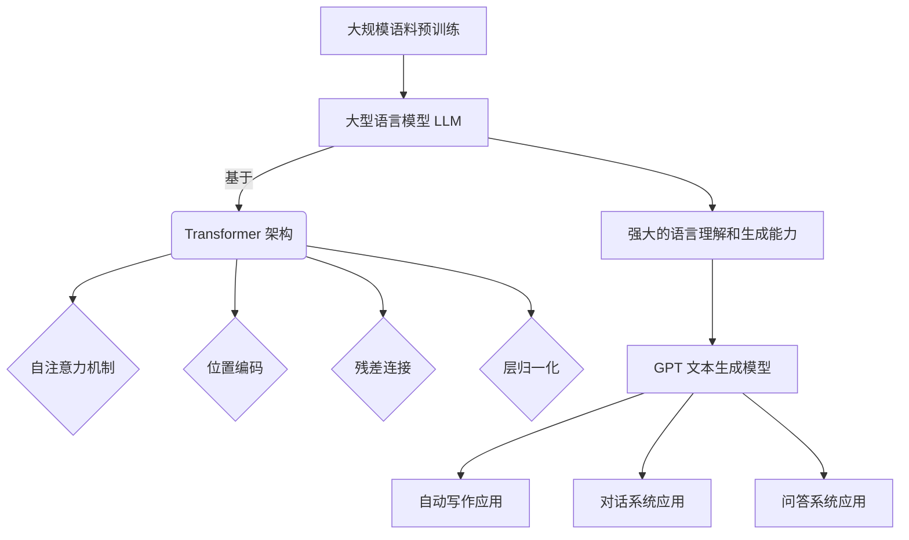

以下是根据要求撰写的技术博客文章正文：

# AI LLM如何重塑新闻产业：自动生成文章

## 1. 背景介绍

### 1.1 问题的由来

在当今快节奏的数字时代,新闻行业面临着前所未有的挑战。传统的新闻采编流程往往耗时耗力,难以满足读者对即时性和个性化内容的渴求。与此同时,人工智能技术的飞速发展为新闻生产提供了新的可能性。

大型语言模型(LLM)作为当前人工智能领域的一股重要力量,展现出令人惊叹的自然语言生成能力。它们可以根据给定的提示和上下文,生成看似人类水平的连贯、流畅、内容丰富的文本输出。这种能力为新闻行业自动化内容生成带来了全新的契机。

### 1.2 研究现状  

目前,一些新闻机构已开始探索使用LLM生成新闻文章的可能性。OpenAI的GPT-3等大型语言模型被应用于自动撰写新闻稿、体育赛事报道、商业分析报告等领域,取得了初步成效。但同时也存在一些挑战,如生成内容的客观性、准确性、多样性等方面仍有待提高。

此外,LLM在新闻领域的应用远未完全开发和利用。如何有效结合LLM和人工编辑的优势,建立高效、可控的自动化新闻生产流程,是一个亟待解决的问题。

### 1.3 研究意义

成功应用LLM自动生成新闻内容,不仅能大幅提高新闻生产效率,满足读者对实时内容的需求,还能为新闻从业者释放更多创造力,专注于深度报道和分析类内容的创作。同时,个性化的LLM模型能根据用户兴趣和阅读习惯,定制生成符合其需求的新闻内容,提升用户体验。

从更广阔的视角来看,LLM在新闻领域的应用是人工智能技术赋能传统行业的一个缩影。它有望为传统行业注入新的活力,提升生产力,并催生新的商业模式和就业形态。因此,研究LLM在新闻生成方面的应用具有重要的现实意义。

### 1.4 本文结构

本文将全面探讨LLM在新闻自动生成领域的应用。我们首先介绍LLM的核心概念与新闻生成的关联。接下来详细阐述LLM新闻生成的算法原理、数学模型和实现方法。然后通过实际案例分析LLM在不同新闻场景下的应用,并对未来发展趋势和面临的挑战进行展望和讨论。最后,我们还将推荐一些有助于读者学习和实践的工具和资源。

## 2. 核心概念与联系

大型语言模型(LLM)是当前自然语言处理(NLP)领域的核心技术之一。它基于深度学习的Transformer架构,通过在大规模文本语料上进行预训练,学习捕捉文本中的语义和上下文信息,从而获得强大的语言理解和生成能力。

常见的LLM有GPT、BERT、XLNet、T5等。其中,GPT(Generative Pre-trained Transformer)系列模型在文本生成任务上表现出色,被广泛应用于自动写作、对话系统、问答系统等场景。



将LLM应用于新闻自动生成,主要利用了其强大的文本生成能力。根据给定的新闻主题、关键信息等提示,LLM可以生成看似人工写作的连贯、流畅、信息丰富的新闻文章。

与传统的基于规则或模板的自动新闻写作系统不同,LLM能够生成更加自然、多样的文本内容,减少了对人工编写规则的依赖。同时,通过对LLM进行针对性的微调(fine-tuning),可以使其生成的新闻文章更加贴合特定领域、风格和质量要求。

## 3. 核心算法原理 & 具体操作步骤

### 3.1 算法原理概述

LLM应用于新闻自动生成的核心算法原理,可以概括为以下三个主要步骤:

1. **预训练(Pre-training)**: 在大规模通用语料上预训练LLM,使其学习捕获通用的语言知识。这一步通常由LLM模型提供方(如OpenAI、Google等)完成。

2. **微调(Fine-tuning)**: 在新闻语料上对通用LLM进行进一步的微调训练,使其学习新闻领域的特定知识和写作风格。

3. **生成(Generation)**: 对于给定的新闻主题、关键信息等输入,利用微调后的LLM生成新闻文章。

### 3.2 算法步骤详解

1. **预训练步骤**:
   - 收集大规模通用语料,如网页文本、书籍等
   - 构建基于Transformer的LLM架构
   - 在通用语料上训练LLM,目标是最大化语言模型的概率
   - 使用自监督学习方法,如蒙版语言模型(Masked LM)等

2. **微调步骤**:
   - 收集新闻语料,包括各类新闻文本及其元数据(主题、关键词等)
   - 在新闻语料上对通用LLM进行进一步的监督微调训练
   - 微调目标是最大化生成的新闻文本与真实新闻文本的相似度
   - 可使用序列到序列(Seq2Seq)学习框架进行训练

3. **生成步骤**:
   - 输入新闻主题、关键信息等提示
   - 利用微调后的LLM对给定提示生成新闻文章初稿
   - 可使用Beam Search、Top-k/Top-p采样等策略提高生成质量
   - 对生成结果进行人工审核、修改、优化

### 3.3 算法优缺点

**优点**:

- 高效性:LLM能快速生成大量新闻文本,大幅提高新闻生产效率
- 多样性:生成内容多样,避免传统模板化写作的单一性
- 可扩展性:只需更换预训练语料,LLM可应用于不同领域的新闻生成

**缺点**:

- 准确性:生成内容的准确性和客观性仍有待提高
- 知识限制:LLM知识来自训练语料,对于热点新闻可能缺乏足够背景知识
- 可解释性:LLM内部工作机理复杂,生成结果缺乏可解释性

### 3.4 算法应用领域

LLM新闻自动生成算法可广泛应用于以下新闻领域:

- 时政新闻、财经新闻等热点新闻的快速生成
- 体育赛事新闻、天气预报等结构化数据驱动的新闻生成  
- 个性化新闻推荐系统,根据用户兴趣生成定制新闻
- 多语种新闻生成,通过多语言LLM支持跨语言新闻写作
- 新闻摘要生成、标题生成等新闻辅助任务

## 4. 数学模型和公式 & 详细讲解 & 举例说明

### 4.1 数学模型构建

LLM在新闻生成任务中的数学模型,可以形式化为一个条件语言模型(Conditional Language Model)。给定新闻主题、关键信息等条件输入 $X$,目标是生成条件概率 $P(Y|X)$ 最大的新闻文本 $Y$。

具体来说,LLM被训练为最大化条件对数似然:

$$\begin{aligned}
\mathcal{L}(\theta) &= \sum_{(x,y) \in \mathcal{D}} \log P_\theta(y|x) \\
                   &= \sum_{(x,y)} \sum_{t=1}^{|y|} \log P_\theta(y_t|y_{<t}, x)
\end{aligned}$$

其中 $\theta$ 表示LLM的模型参数, $\mathcal{D}$ 是训练语料, $(x, y)$ 是新闻条件输入和文本对。

对于Transformer模型,条件概率可以进一步分解为:

$$P_\theta(y_t|y_{<t}, x) = \textrm{Transformer}_\theta(y_{<t}, x)_t$$

即由Transformer模型的输出计算得到。

### 4.2 公式推导过程

我们以GPT语言模型为例,推导其目标函数是如何优化的。

GPT模型将语言模型任务看作是一个序列到序列(Seq2Seq)的问题。对于长度为 $n$ 的文本序列 $\boldsymbol{x} = (x_1, x_2, \ldots, x_n)$,目标是最大化生成该序列的条件概率:

$$\begin{aligned}
P(\boldsymbol{x}) &= \prod_{t=1}^n P(x_t | x_{<t}) \\
                 &= \prod_{t=1}^n P_\textrm{model}(x_t | x_1, \ldots, x_{t-1})
\end{aligned}$$

对数似然目标函数为:

$$\mathcal{L}_1 = \sum_{t=1}^n \log P_\textrm{model}(x_t | x_{<t})$$

在预训练阶段,GPT在大规模语料上最大化上式。在微调阶段,对于新闻生成任务,GPT以 $\boldsymbol{x} = ([X], y_1, y_2, \ldots, y_m)$ 的形式建模,其中 $[X]$ 是新闻条件输入的表示,$(y_1, \ldots, y_m)$ 是目标新闻文本。此时目标函数变为:

$$\begin{aligned}
\mathcal{L}_2 &= \sum_{t=1}^{m+1} \log P_\textrm{model}(x_t | x_{<t}, [X]) \\
              &= \log P_\textrm{model}([X]) + \sum_{t=1}^m \log P_\textrm{model}(y_t | [X], y_{<t})
\end{aligned}$$

通过最大化 $\mathcal{L}_2$,GPT可以学习生成满足新闻条件输入的高质量文本。

### 4.3 案例分析与讲解

我们以一个真实的新闻生成案例来说明LLM是如何工作的。

**输入**:
- 主题: 2023年6月1日发生的加州山火事件
- 关键信息:
    - 地点: 洛杉矶北部山区
    - 起火时间: 2023年6月1日上午11点
    - 燃烧面积: 5000英亩
    - 疏散人数: 8000人
    - 救援人员: 1500人
    - 失控原因: 大风助燃

**LLM生成结果**:

```
2023年6月1日,一场大火在洛杉矶北部山区燃起,迅速蔓延。起火时间是上午11点,初步统计,这场大火已经烧毁了5000英亩土地。

大风助长了火势,使火情一度失控。当地政府紧急出动1500名消防员前往灭火救援。同时,约8000名民众被迫撤离家园,寻求安全庇护。

消防人员不遗余力,经过一天一夜的艰苦奋战,终于在6月2日上午将大火控制住。不过,这场山火给当地居民的生命财产造成了巨大损失,重建家园任重道远。

专家分析,这次山火是由于持续的干旱高温天气,加上当天的强风肆虐导致的。气候变化加剧了野火风险,未来加州地区可能会面临更多此类灾难性事件。当务之急是加强森林防火措施,提高公众防灾意识。
```

**解读分析**:

1. LLM能够根据给定的主题和关键信息,生成内容丰富、结构完整的新闻报道文本。
2. 生成内容包含了事件起因、过程、影响、分析和建议等新闻报道的基本要素。
3. 文本语言通顺流畅,行