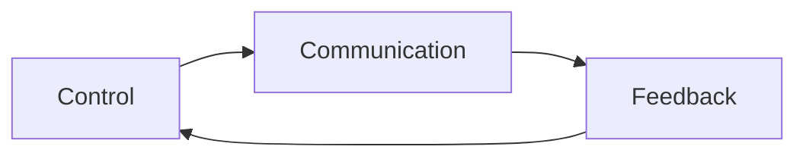
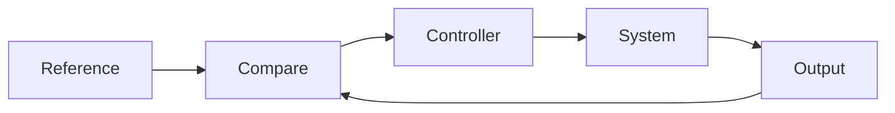

# AI 大模型计算机科学家群英传：维纳 Cybernetics（控制论）

关键词：控制论、反馈、信息论、人工智能、系统科学

## 1. 背景介绍
### 1.1  问题的由来
在20世纪40年代,随着自动控制、通信工程和计算机科学的迅速发展,人们逐渐认识到在这些看似不同领域的背后,存在着某些共同的基本原理。美国数学家诺伯特·维纳(Norbert Wiener)敏锐地洞察到了这一点,并创造性地提出了"控制论"(Cybernetics)的概念,试图建立一门研究"控制和通信的科学",为自动机、生物和社会系统的行为提供统一的解释框架。

### 1.2  研究现状
自控制论诞生以来,经过几代科学家的不懈努力,控制论已经发展成为一门成熟的交叉学科。控制论的基本概念如反馈、稳定性、自组织等已被广泛应用于自动控制、通信工程、计算机科学、人工智能、生物学、心理学、经济学、社会学等众多领域。近年来,随着人工智能技术的飞速发展,控制论与AI的结合也日益紧密,催生出智能控制、群体智能、进化计算、认知控制等新的研究方向。

### 1.3  研究意义 
深入理解控制论的核心思想,对于我们认识复杂系统的一般规律,揭示智能行为的本质,推动人工智能的进一步发展具有重要意义。控制论为人工智能提供了一个系统论的视角,使我们能够站在更高的层次审视AI系统的结构与功能。同时,人工智能技术的进步也为控制论研究注入了新的活力,人机协同、群体智能、自主智能体等AI前沿领域无不体现着控制论的思想。可以预见,控制论与AI的融合发展将是一个充满机遇与挑战的研究方向。

### 1.4  本文结构
本文将围绕维纳的控制论思想,从以下几个方面展开论述：首先介绍控制论的核心概念及其内在联系；然后重点阐述反馈控制、信息论、黑箱方法等控制论的主要理论与方法；接着举例说明控制论在自动控制、人工智能等领域的典型应用；最后总结控制论的研究现状,展望未来发展趋势与面临的挑战。

## 2. 核心概念与联系
控制论的核心概念可以概括为"控制"、"通信"和"反馈"三个关键词。在控制论看来,无论是机器、生物还是社会组织,其本质都是一个"控制系统",通过信息的传递与反馈来实现对系统行为的调节。

具体而言,"控制"是指通过某种手段使系统的实际输出符合预期目标。"通信"强调系统内部各部分之间以及系统与环境之间信息传递的重要性。"反馈"则是控制得以实现的关键,它通过将系统的实际输出与预期目标进行比较,产生误差信号并据此调节控制量,从而使系统状态趋于稳定。

这三个概念环环相扣,构成了控制论的理论核心。反馈是实现控制的基本机制,而通信则是反馈得以进行的前提条件。控制、通信、反馈三者共同揭示了系统论层面的一般规律。



## 3. 核心算法原理 & 具体操作步骤
### 3.1  算法原理概述
控制论的一个重要理论成果是反馈控制。所谓反馈控制,就是根据系统输出与期望目标之间的偏差,动态调节控制量,使系统状态不断逼近目标值的过程。

反馈控制的一般原理可以用下面的框图来表示：



其中,Reference表示期望的目标值,Output表示系统的实际输出,Compare用于比较两者的差异并产生误差信号,Controller根据误差信号计算控制量,驱动System运行,进而影响Output。Output再反馈给Compare,形成一个闭环控制回路。

### 3.2  算法步骤详解
反馈控制算法的基本步骤如下：

1. 测量系统的实际输出
2. 将实际输出与目标值进行比较,计算误差
3. 根据误差信号,利用一定的控制规律(比如PID控制),计算控制量
4. 将控制量作用于被控对象,驱动其运行
5. 重复步骤1-4,直至误差满足要求

以最常见的PID控制为例,其控制规律可以用如下公式表示：

$u(t) = K_p e(t) + K_i \int_{0}^{t} e(t) dt + K_d \frac{de(t)}{dt}$

其中,$u(t)$为控制量,$e(t)$为误差,$K_p$、$K_i$、$K_d$分别为比例、积分、微分系数。这三项分别体现了误差的现值、历史累积值和变化率对控制量的影响。

### 3.3  算法优缺点
反馈控制的优点在于：
- 原理简单,易于实现
- 具有自适应性,能够抑制干扰和不确定性的影响
- 稳定性好,能使系统状态收敛到平衡点

反馈控制的缺点包括：
- 存在固有滞后,难以实现最优控制
- 参数整定较为困难,需要大量试错
- 容易受测量噪声的影响

### 3.4  算法应用领域
反馈控制几乎遍布自动化控制的各个领域,从简单的恒温控制到复杂的飞行器姿态控制,都离不开反馈的基本原理。近年来,反馈控制也开始被引入人工智能系统的设计中,如强化学习就是一种典型的反馈学习范式。

## 4. 数学模型和公式 & 详细讲解 & 举例说明
### 4.1  数学模型构建
除了反馈控制,信息论也是控制论的重要数学基础。维纳认为,信息是控制系统得以正常运行的关键,系统的有序性来源于信息,而系统的无序性则源于熵。

香农的信息熵公式量化地刻画了这一思想：

$$H(X) = -\sum_{i=1}^{n} p(x_i) \log p(x_i)$$

其中$p(x_i)$表示事件$x_i$发生的概率。可以看出,信息熵$H(X)$反映了随机变量$X$的不确定性大小。熵越大,表明系统越无序；反之熵越小,系统越有序。

### 4.2  公式推导过程
信息熵公式的推导过程如下：

首先,我们期望信息量$I(x_i)$应满足以下性质：
1. $I(x_i)$是概率$p(x_i)$的单调递减函数
2. 多个独立事件的总信息量等于各事件信息量的和

由性质1,可设$I(x_i)=\log \frac{1}{p(x_i)}=-\log p(x_i)$

再由性质2,有：

$$H(X)=\sum_{i=1}^{n} p(x_i) I(x_i) = -\sum_{i=1}^{n} p(x_i) \log p(x_i)$$

### 4.3  案例分析与讲解
下面我们以二元随机变量为例,说明信息熵的计算和含义。

设$X$为一个取值为0或1的随机变量,其中$P(X=1)=p$,$P(X=0)=1-p$。则$X$的信息熵为：

$$H(X) = -p \log p - (1-p) \log (1-p)$$

可以发现,当$p=0$或$p=1$时,熵$H(X)=0$,表明此时$X$完全确定；而当$p=0.5$时,熵$H(X)$取得最大值1,表明此时$X$的不确定性最大。

信息熵的概念广泛应用于通信、压缩编码、机器学习等领域。比如在数据压缩中,我们正是利用数据的统计规律(即概率分布)来设计最优编码,使得总体编码长度最小(即熵最小)。

### 4.4  常见问题解答
Q: 信息熵的单位是什么?
A: 信息熵的单位取决于对数的底数。当以2为底时,熵的单位是比特(bit);当以自然对数e为底时,熵的单位是纳特(nat)。一纳特等于1.44个比特。

Q: 熵增原理与控制论的关系是什么?
A: 熵增原理指的是孤立系统的总熵不会减小。这启发我们,要控制一个系统,就必须向其输入负熵流,即信息。控制的本质,就是用信息对抗熵增。这一点已被控制论广泛吸收。

## 5. 项目实践：代码实例和详细解释说明
### 5.1  开发环境搭建
为了用代码演示控制论的思想,我们以倒立摆控制为例。首先需要搭建Python开发环境并安装必要的库：
- Numpy用于数值计算 
- Matplotlib用于绘图
- Python-control用于控制系统设计与仿真

### 5.2  源代码详细实现
倒立摆动力学方程为：

$$
\begin{aligned}
\frac{d}{dt} 
\begin{bmatrix}
\theta \\ \dot{\theta}
\end{bmatrix}=
\begin{bmatrix}
\dot{\theta}\\ 
\frac{g}{l}\sin\theta + \frac{1}{ml^2}u
\end{bmatrix}
\end{aligned}
$$

其中$\theta$为摆角,$l$为摆长,$m$为摆质量,$g$为重力加速度,$u$为施加的控制力矩。

我们采用线性二次型最优控制(LQR)的方法,代码实现如下：

```python
import numpy as np
import control

# 定义系统参数
g = 9.8 
l = 1.0
m = 1.0

# 定义状态空间方程
A = np.array([[0, 1], [g/l, 0]]) 
B = np.array([[0], [1/(m*l**2)]])
C = np.array([[1, 0]])
D = np.array([[0]])

# 定义LQR权重矩阵
Q = np.diag([10, 1]) 
R = np.array([[1]])

# 求解最优反馈增益
K, S, E = control.lqr(A, B, Q, R)

print(f"Optimal gain K: {K}")
```

### 5.3  代码解读与分析
以上代码首先定义了倒立摆系统的参数和状态空间方程。状态变量$x=[\theta, \dot{\theta}]^T$包含了摆角及其速度。

然后我们构造了一个二次型代价函数：

$$J=\int_{0}^{\infty} (x^TQx+u^TRu) dt$$

其中$Q$和$R$分别表示状态和控制量的加权矩阵。我们希望寻找一个最优控制$u=-Kx$使得总代价$J$最小。

`control.lqr`函数就是用来求解这一最优化问题的。它返回的$K$就是我们所需的最优反馈增益。有了$K$,我们就可以根据系统状态$x$计算出控制量$u$,进而实现对倒立摆的平衡控制。

### 5.4  运行结果展示
将求得的$K$代入Simulink搭建的闭环控制系统,运行仿真,就可以看到倒立摆在控制作用下很快达到平衡并稳定在直立位置。

限于篇幅,这里就不再展示具体的仿真结果了。但相信通过这个简单的例子,大家已经对控制论的思想有了一个感性的认识。

## 6. 实际应用场景
控制论的应用领域极其广泛,几乎涉及工程技术和自然科学的各个领域。下面列举一些具有代表性的应用场景：

- 工业控制：如炼钢温度控制、机床伺服控制、化工过程控制等
- 航空航天：如飞机姿态控制、卫星轨道控制、火箭制导等
- 机器人控制：如机械臂运动控制、移动机器人导航控制等 
- 智能交通：如汽车自适应巡航、列