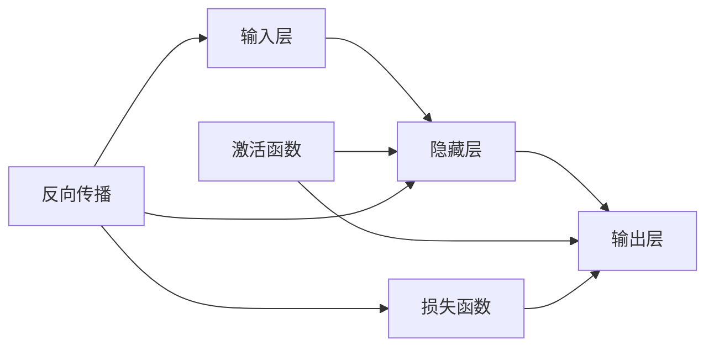

# AI 神经网络计算艺术之禅：结构仿脑、功能类脑、性能超脑

作者：禅与计算机程序设计艺术 / Zen and the Art of Computer Programming

关键词：人工智能, 神经网络, 深度学习, 仿脑计算, 类脑智能, 超脑性能

## 1. 背景介绍

### 1.1 问题的由来

人工智能(Artificial Intelligence, AI)作为计算机科学的一个重要分支,其目标是研究如何让计算机模拟甚至超越人类的智能。而神经网络(Neural Networks, NN)作为实现人工智能的一种重要方法,其灵感正是来源于人脑神经元网络的结构和工作机制。近年来,随着深度学习(Deep Learning, DL)的兴起,神经网络已成为当前人工智能领域最为热门和成功的技术之一。

### 1.2 研究现状

目前,神经网络和深度学习已在计算机视觉、语音识别、自然语言处理等多个领域取得了突破性进展,大幅超越了传统方法,甚至在某些特定任务上达到或超过了人类的水平。但是,现有的神经网络模型与人脑相比,无论是在结构、功能还是性能上都还有较大差距。因此,如何从生物学角度出发,借鉴脑科学的研究成果,构建出结构更加仿脑、功能更加类脑、性能更加超脑的神经网络模型,是当前亟待解决的重要问题。

### 1.3 研究意义 

神经网络作为连接人工智能和脑科学的桥梁,对其进行仿脑、类脑、超脑方面的研究具有重要意义:

1. 推动人工智能的发展。通过借鉴脑科学的研究成果,有望突破当前深度学习所面临的数据依赖、可解释性差、泛化能力弱等瓶颈,实现人工智能的跨越式发展。

2. 加深对人脑工作机制的理解。通过构建仿脑的计算模型,可以从信息处理的角度来研究人脑的工作机制,加深我们对大脑认知功能的理解,并为脑科学研究提供新的视角和方法。

3. 促进类脑芯片和超级计算机的研制。通过探索高效的类脑计算架构,为研制出功能更强、能效更高的类脑芯片和超级计算机奠定理论和技术基础,推动计算技术的革命性发展。

### 1.4 本文结构

本文将围绕神经网络的仿脑结构、类脑功能和超脑性能这三个方面展开论述。第2节介绍相关的核心概念;第3节重点阐述仿脑神经网络的核心算法原理和具体操作步骤;第4节给出相应的数学模型和公式推导;第5节通过代码实例进行详细的讲解说明;第6节分析其实际应用场景;第7节推荐相关的学习资源和开发工具;第8节对全文进行总结,并对未来的发展趋势和挑战进行展望;第9节的附录部分给出了一些常见问题与解答。

## 2. 核心概念与联系

在探讨仿脑神经网络之前,我们首先需要明确以下几个核心概念:

- 神经元(Neuron):神经网络的基本单元,类似于人脑中的神经元细胞,负责接收、处理和传递信息。

- 突触(Synapse):神经元之间的连接,类似于大脑神经元之间的突触,负责调节信号的传递效率。

- 激活函数(Activation Function):用于决定神经元是否被激活以及激活强度,常见的有 Sigmoid、Tanh、ReLU 等。 

- 损失函数(Loss Function):用于衡量神经网络的预测输出与真实值之间的差距,常见的有均方误差、交叉熵等。

- 反向传播(Backpropagation):一种高效的神经网络训练算法,通过计算损失函数对各参数的梯度,并使用梯度下降法对参数进行更新。

下图给出了这些核心概念之间的联系:

## 3. 核心算法原理 & 具体操作步骤

### 3.1 算法原理概述

仿脑神经网络的核心思想是模拟大脑的信息处理机制,通过构建多层次的神经元网络结构,并使用反向传播算法进行训练,从而使网络具备从数据中自主学习和提取特征的能力。下面我们对其核心算法原理进行概述:

1. 前向传播:信息从输入层开始,经过隐藏层逐层传递,最终到达输出层并给出预测结果。其中,每个神经元的输出由其所有输入的加权和经过激活函数变换而得。

2. 损失计算:将输出层的预测结果与真实标签进行比较,通过损失函数来量化二者之间的差距。常用的损失函数包括均方误差和交叉熵等。

3. 反向传播:从输出层开始,将损失函数对神经元加权系数和偏置项的梯度逐层向前传播,直到输入层。其中使用了链式法则来高效计算复合函数的梯度。 

4. 参数更新:使用梯度下降等优化算法,根据反向传播得到的梯度信息对神经网络的参数(权重和偏置)进行更新,从而最小化损失函数,提高网络的预测性能。

通过多次迭代上述前向传播、损失计算、反向传播和参数更新的过程,神经网络可以逐步学习到数据中蕴含的规律和模式,从而具备了智能化的特征提取和决策能力。

### 3.2 算法步骤详解

下面我们对仿脑神经网络算法的具体步骤进行详细阐述:

**输入数据预处理**

1. 对原始输入数据进行清洗,剔除噪声和异常值。
2. 对数据进行归一化或标准化处理,使其分布在合适的范围内。
3. 如果输入是图像等高维数据,通常需要进行平铺操作,将其转化为一维向量。

**网络结构设计与初始化**

1. 根据任务的复杂程度和数据的特点,选择合适的网络层数和每层的神经元数量。
2. 选择恰当的激活函数,如 ReLU、Sigmoid 等。
3. 对网络参数(权重和偏置)进行随机初始化,如使用 Xavier 初始化方法。

**前向传播**

对于第 $l$ 层第 $j$ 个神经元,其输出 $a_j^l$ 的计算公式为:

$$a_j^l = f(\sum_{i=1}^{n_{l-1}} w_{ij}^l a_i^{l-1} + b_j^l)$$

其中,$f$ 为激活函数,$w_{ij}^l$ 为第 $l-1$ 层第 $i$ 个神经元到第 $l$ 层第 $j$ 个神经元的连接权重,$b_j^l$ 为第 $l$ 层第 $j$ 个神经元的偏置项。

前向传播从输入层($l=0$)开始,逐层计算直到输出层($l=L$),得到网络的预测输出。

**损失计算**

使用损失函数度量网络预测输出与真实标签之间的差距。以均方误差损失函数为例,其计算公式为:

$$J(w,b) = \frac{1}{2m} \sum_{k=1}^m (h_{w,b}(x^k) - y^k)^2$$

其中,$m$ 为训练样本数量,$h_{w,b}(x^k)$ 为网络对第 $k$ 个输入样本 $x^k$ 的预测输出,$y^k$ 为 $x^k$ 对应的真实标签。

**反向传播**

1. 计算损失函数 $J(w,b)$ 关于输出层神经元的梯度:

$$\frac{\partial J(w,b)}{\partial a_j^L} = \frac{1}{m} \sum_{k=1}^m (h_{w,b}(x^k) - y^k) \cdot f'(z_j^L)$$

2. 逐层向前传播,计算损失函数关于隐藏层神经元的梯度:

$$\frac{\partial J(w,b)}{\partial a_j^l} = (\sum_{i=1}^{n_{l+1}} w_{ji}^{l+1} \frac{\partial J(w,b)}{\partial a_i^{l+1}}) \cdot f'(z_j^l)$$

3. 计算损失函数关于网络参数的梯度:

$$\frac{\partial J(w,b)}{\partial w_{ij}^l} = \frac{1}{m} \sum_{k=1}^m a_i^{l-1} \cdot \frac{\partial J(w,b)}{\partial a_j^l}$$

$$\frac{\partial J(w,b)}{\partial b_{j}^l} = \frac{1}{m} \sum_{k=1}^m \frac{\partial J(w,b)}{\partial a_j^l}$$

**参数更新**

使用梯度下降法,根据反向传播计算得到的梯度对网络参数进行更新,以最小化损失函数:

$$w_{ij}^l := w_{ij}^l - \alpha \frac{\partial J(w,b)}{\partial w_{ij}^l}$$

$$b_j^l := b_j^l - \alpha \frac{\partial J(w,b)}{\partial b_j^l}$$

其中,$\alpha$ 为学习率,控制每次更新的步长。

**迭代训练**

重复执行前向传播、损失计算、反向传播和参数更新的过程,直到损失函数收敛或达到预设的训练轮数。

**模型评估与优化**

1. 使用测试集数据评估训练得到的模型性能,如准确率、召回率、F1 值等。
2. 如果模型性能不够理想,可以通过调整网络结构、优化超参数、增加正则化项等方法进行改进。

### 3.3 算法优缺点

仿脑神经网络算法的优点包括:

1. 强大的非线性拟合能力,可以应对复杂的模式识别和决策任务。
2. 具备端到端的学习能力,无需人工设计特征,降低了对专家知识的依赖。
3. 模型具有一定的可解释性,可视化网络结构有助于理解其决策过程。

但是,仿脑神经网络算法也存在以下不足:

1. 需要大量的标注数据进行训练,获取成本较高。
2. 模型训练时间长,计算资源消耗大。
3. 模型的泛化能力有待进一步提升,容易过拟合。
4. 超参数调优需要一定的经验和技巧,对初学者不够友好。

### 3.4 算法应用领域

仿脑神经网络算法已在多个领域取得了广泛应用,包括:

1. 计算机视觉:图像分类、目标检测、语义分割等。
2. 语音识别:语音转文本、说话人识别等。
3. 自然语言处理:机器翻译、情感分析、问答系统等。
4. 推荐系统:个性化推荐、用户画像等。
5. 生物信息学:蛋白质结构预测、基因表达分析等。
6. 金融科技:风险评估、反欺诈、量化交易等。

未来,仿脑神经网络有望在自动驾驶、智能医疗、脑机接口等前沿领域实现更大的突破。

## 4. 数学模型和公式 & 详细讲解 & 举例说明

### 4.1 数学模型构建

我们以一个简单的三层全连接神经网络为例,阐述其数学模型的构建过程。

假设输入层有 $n_0$ 个神经元,隐藏层有 $n_1$ 个神经元,输出层有 $n_2$ 个神经元。我们用 $a_i^l$ 表示第 $l$ 层第 $i$ 个神经元的输出,用 $z_i^l$ 表示其加权输入,即:

$$z_i^l = \sum_{j=1}^{n_{l-1}} w_{ij}^l a_j^{l-1} + b_i^l$$

$$a_i^l = f(z_i^l)$$

其中,$f$ 为激活函数。整个神经网络的前向传播过程可以表示为:

$$a^1