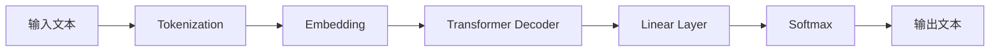

# AIGC从入门到实战：只缘身在此山中：GPT 模型靠什么取胜和"出圈"？

## 1. 背景介绍

### 1.1 问题的由来

近年来，人工智能生成内容（AIGC）技术取得了突飞猛进的发展，尤其是基于 GPT（Generative Pre-trained Transformer）模型的自然语言处理技术，在各个领域掀起了一股 AI 热潮。GPT 模型以其强大的语言理解和生成能力，在问答、对话、写作等任务中表现出色，受到了学术界和工业界的广泛关注。

### 1.2 研究现状

目前，GPT 模型已经发展到了第三代（GPT-3），其参数量高达 1750 亿，是当前最大的语言模型之一。GPT-3 在各种自然语言处理任务上取得了令人瞩目的成绩，甚至在某些任务上已经接近或超过了人类的表现。然而，GPT 模型的成功并非一蹴而就，而是经过了多年的研究和改进，其背后蕴含着深厚的理论基础和技术积累。

### 1.3 研究意义

深入研究 GPT 模型的原理和实现，对于推动 AIGC 技术的发展具有重要意义。一方面，通过分析 GPT 模型的优势和局限性，可以为后续的模型改进提供思路和方向；另一方面，GPT 模型的成功经验也可以为其他类型的 AIGC 模型的设计和训练提供借鉴和启示。此外，探讨 GPT 模型在实际应用中的场景和挑战，有助于推动 AIGC 技术在各个领域的落地和创新。

### 1.4 本文结构

本文将从以下几个方面对 GPT 模型进行深入探讨：

1. 介绍 GPT 模型的核心概念和原理
2. 详细讲解 GPT 模型的训练算法和实现细节
3. 分析 GPT 模型的数学基础和理论支撑
4. 通过代码实例演示 GPT 模型的实际应用
5. 探讨 GPT 模型在不同领域的应用场景和案例
6. 总结 GPT 模型的发展历程和未来趋势
7. 提供学习 GPT 模型的资源和工具推荐

## 2. 核心概念与联系

GPT 模型的核心是基于 Transformer 架构的语言模型。Transformer 是一种基于自注意力机制（Self-Attention）的神经网络架构，它摒弃了传统的循环神经网络（RNN）和卷积神经网络（CNN）的局限性，能够并行处理输入序列，大大提高了训练效率。

GPT 模型采用了 Transformer 的解码器（Decoder）结构，通过自回归（Self-Regression）的方式，根据前面的词预测下一个词，从而生成连贯的文本。与传统的语言模型不同，GPT 引入了预训练（Pre-training）的思想，在大规模无标注语料上进行自监督学习，学习语言的通用表示。预训练后的模型可以通过微调（Fine-tuning）的方式，快速适应下游的具体任务。

下图展示了 GPT 模型的整体架构和工作流程：

## 3. 核心算法原理 & 具体操作步骤

### 3.1 算法原理概述

GPT 模型的训练过程可以分为两个阶段：预训练阶段和微调阶段。

在预训练阶段，模型在大规模无标注语料上进行自监督学习，通过最大化下一个词的概率来优化模型参数。具体而言，给定一个长度为 T 的文本序列 $X=(x_1,x_2,...,x_T)$，模型的目标是最大化如下的似然函数：

$$L(X)=\sum_{t=1}^{T} \log P(x_t|x_1,x_2,...,x_{t-1})$$

其中，$P(x_t|x_1,x_2,...,x_{t-1})$ 表示在给定前 $t-1$ 个词的情况下，第 $t$ 个词为 $x_t$ 的条件概率。

在微调阶段，模型在下游任务的标注数据上进行监督学习，通过最小化任务的损失函数来调整模型参数。常见的微调任务包括文本分类、命名实体识别、问答等。

### 3.2 算法步骤详解

1. 预训练阶段
   1. 数据准备：收集大规模无标注语料，进行清洗和预处理
   2. 分词（Tokenization）：将文本转换为模型可以处理的离散token序列
   3. 嵌入（Embedding）：将token映射为连续的向量表示
   4. 构建模型：搭建 GPT 模型的 Transformer Decoder 结构
   5. 定义损失函数：使用负对数似然函数作为损失函数
   6. 训练模型：使用随机梯度下降等优化算法训练模型参数

2. 微调阶段
   1. 数据准备：收集下游任务的标注数据，进行清洗和预处理
   2. 加载预训练模型：加载预训练阶段得到的模型参数
   3. 定义任务的输入输出：根据具体任务设计输入和输出的格式
   4. 定义损失函数：根据任务类型选择合适的损失函数，如交叉熵损失
   5. 训练模型：使用较小的学习率在标注数据上微调模型参数

### 3.3 算法优缺点

GPT 模型的优点包括：

- 强大的语言理解和生成能力，可以处理各种自然语言处理任务
- 通过预训练和微调的方式，可以快速适应新的任务，减少对标注数据的依赖
- Transformer 架构的并行化能力，可以高效处理长文本序列

GPT 模型的缺点包括：

- 模型参数量巨大，训练和推理成本高，对计算资源要求较高
- 容易产生有偏见或不符合事实的生成结果，需要引入额外的约束和过滤机制
- 对于一些需要外部知识和推理能力的任务，表现还有待提高

### 3.4 算法应用领域

GPT 模型在自然语言处理的各个领域都有广泛应用，包括但不限于：

- 文本生成：如新闻写作、对话生成、故事创作等
- 文本分类：如情感分析、垃圾邮件检测、主题分类等
- 命名实体识别：如识别文本中的人名、地名、机构名等
- 问答系统：根据给定的问题生成相应的答案
- 机器翻译：将一种语言的文本翻译成另一种语言
- 文本摘要：自动生成文本的摘要或关键句

## 4. 数学模型和公式 & 详细讲解 & 举例说明

### 4.1 数学模型构建

GPT 模型的数学基础是 Transformer 架构和自注意力机制。Transformer 的核心思想是使用自注意力机制来计算序列中元素之间的依赖关系，从而捕捉文本的上下文信息。

给定一个长度为 $n$ 的输入序列 $X=(x_1,x_2,...,x_n)$，其中每个 $x_i$ 是一个 $d$ 维的向量。Transformer 首先通过三个线性变换将 $X$ 映射为 Query、Key 和 Value 矩阵：

$$Q=XW_Q, K=XW_K, V=XW_V$$

其中，$W_Q, W_K, W_V$ 是可学习的参数矩阵，维度分别为 $d \times d_k, d \times d_k, d \times d_v$。

然后，通过计算 Query 和 Key 的点积并归一化，得到注意力权重矩阵 $A$：

$$A=\text{softmax}(\frac{QK^T}{\sqrt{d_k}})$$

最后，将注意力权重矩阵与 Value 矩阵相乘，得到输出序列 $Z$：

$$Z=AV$$

通过多头自注意力机制和前馈神经网络的堆叠，Transformer 可以建模序列中的长距离依赖关系，并提取高层次的特征表示。

### 4.2 公式推导过程

以下是 Transformer 中自注意力机制的详细公式推导过程：

1. 输入序列 $X$ 的维度为 $n \times d$，其中 $n$ 是序列长度，$d$ 是向量维度。

2. 通过线性变换得到 Query、Key 和 Value 矩阵：
   $$Q=XW_Q, K=XW_K, V=XW_V$$
   其中，$W_Q, W_K, W_V$ 的维度分别为 $d \times d_k, d \times d_k, d \times d_v$。

3. 计算 Query 和 Key 的点积，得到 $n \times n$ 的矩阵：
   $$QK^T=\begin{bmatrix}
   q_1k_1^T & q_1k_2^T & \cdots & q_1k_n^T \\
   q_2k_1^T & q_2k_2^T & \cdots & q_2k_n^T \\
   \vdots & \vdots & \ddots & \vdots \\
   q_nk_1^T & q_nk_2^T & \cdots & q_nk_n^T
   \end{bmatrix}$$

4. 对点积矩阵进行缩放，除以 $\sqrt{d_k}$：
   $$\frac{QK^T}{\sqrt{d_k}}=\begin{bmatrix}
   \frac{q_1k_1^T}{\sqrt{d_k}} & \frac{q_1k_2^T}{\sqrt{d_k}} & \cdots & \frac{q_1k_n^T}{\sqrt{d_k}} \\
   \frac{q_2k_1^T}{\sqrt{d_k}} & \frac{q_2k_2^T}{\sqrt{d_k}} & \cdots & \frac{q_2k_n^T}{\sqrt{d_k}} \\
   \vdots & \vdots & \ddots & \vdots \\
   \frac{q_nk_1^T}{\sqrt{d_k}} & \frac{q_nk_2^T}{\sqrt{d_k}} & \cdots & \frac{q_nk_n^T}{\sqrt{d_k}}
   \end{bmatrix}$$

5. 对缩放后的矩阵应用 softmax 函数，得到注意力权重矩阵 $A$：
   $$A=\text{softmax}(\frac{QK^T}{\sqrt{d_k}})=\begin{bmatrix}
   a_{11} & a_{12} & \cdots & a_{1n} \\
   a_{21} & a_{22} & \cdots & a_{2n} \\
   \vdots & \vdots & \ddots & \vdots \\
   a_{n1} & a_{n2} & \cdots & a_{nn}
   \end{bmatrix}$$
   其中，$a_{ij}$ 表示第 $i$ 个位置对第 $j$ 个位置的注意力权重。

6. 将注意力权重矩阵 $A$ 与 Value 矩阵 $V$ 相乘，得到输出序列 $Z$：
   $$Z=AV=\begin{bmatrix}
   \sum_{j=1}^n a_{1j}v_j \\
   \sum_{j=1}^n a_{2j}v_j \\
   \vdots \\
   \sum_{j=1}^n a_{nj}v_j
   \end{bmatrix}$$
   其中，$v_j$ 是 Value 矩阵的第 $j$ 列。

通过以上步骤，Transformer 的自注意力机制可以计算出输入序列中每个位置与其他位置的依赖关系，并生成相应的输出表示。

### 4.3 案例分析与讲解

下面以一个简单的句子"The cat sat on the mat"为例，演示 GPT 模型的工作原理。

首先，将句子转换为 token 序列：["The", "cat", "sat", "on", "the", "mat"]。

然后，通过嵌入层将每个 token 映射为一个 $d$ 维的向量，得到输入矩阵 $X$：

$$X=\begin{bmatrix}
x_{\text{The}} \\
x_{\text{cat}} \\
x_{\text{sat}} \\
x_{\text{on}} \\
x_{\text{the}} \\
x_{\text{mat}}
\end{bmatrix}$$

接下来，通过自注意力机制计算每个位置与其他位置的依赖关系。以位置 "sat" 为例，它