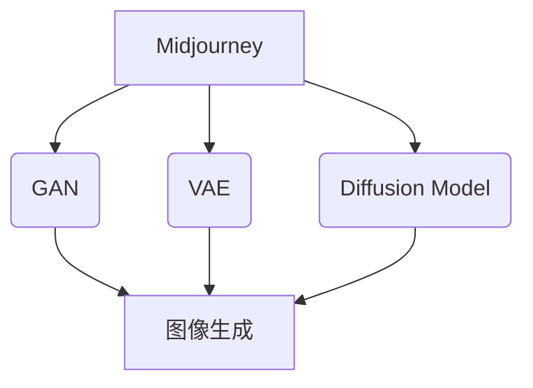
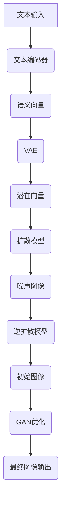

# AIGC从入门到实战：启动AIGC工具中的明星产品Midjourney

## 1. 背景介绍

### 1.1 问题的由来

在过去的几年里,人工智能生成内容(AIGC)技术取得了长足的进步,尤其是在视觉创作领域。传统的图像生成方式需要专业的设计师和繁琐的操作流程,而AIGC工具则可以通过简单的文本输入,快速生成高质量的图像、插画、3D模型等视觉内容。这种创新的方式极大地降低了视觉内容的制作门槛,为各行业带来了全新的机遇。

### 1.2 研究现状 

目前,AIGC工具主要基于生成式对抗网络(GAN)和扩散模型(Diffusion Model)等深度学习技术。代表性的AIGC工具包括Midjourney、DALL-E 2、Stable Diffusion等。其中,Midjourney因其出色的图像质量和创意表现力,成为了AIGC工具中的明星产品。

### 1.3 研究意义

AIGC技术的兴起正在重塑视觉内容的创作模式,为各行业带来了巨大的创新机遇。深入研究Midjourney等AIGC工具的原理和应用,对于把握技术发展趋势、探索新的商业模式和创意表达方式具有重要意义。

### 1.4 本文结构

本文将全面介绍Midjourney的核心概念、算法原理、数学模型、代码实现、应用场景等内容。读者将获得对Midjourney的深入理解,并掌握如何将其应用于实际项目中。

## 2. 核心概念与联系

Midjourney是一款基于人工智能的文本到图像生成工具,它利用了多种先进的深度学习技术,如生成式对抗网络(GAN)、变分自编码器(VAE)和扩散模型(Diffusion Model)等。

1. **生成式对抗网络(GAN)**:GAN由一个生成器(Generator)和一个判别器(Discriminator)组成。生成器负责从随机噪声中生成图像,而判别器则判断生成的图像是真实的还是伪造的。通过生成器和判别器的不断对抗训练,GAN可以生成逼真的图像。

2. **变分自编码器(VAE)**:VAE是一种无监督学习模型,它可以从数据中学习潜在的分布,并用于生成新的数据样本。在Midjourney中,VAE用于从文本描述中捕获语义信息,并将其编码为潜在空间中的向量表示。

3. **扩散模型(Diffusion Model)**:扩散模型是一种新兴的生成模型,它通过逆向扩散过程从噪声中生成图像。Midjourney利用扩散模型从文本描述和潜在向量中生成高质量的图像。

这些技术相互配合,使Midjourney能够根据自然语言描述生成具有创意和细节的图像。

## 3. 核心算法原理与具体操作步骤

### 3.1 算法原理概述

Midjourney的核心算法原理可以概括为以下几个主要步骤:

1. **文本编码**:利用预训练的文本编码器(如CLIP)将输入的自然语言描述编码为语义向量表示。
2. **潜在空间映射**:将语义向量通过VAE映射到潜在空间中的一个起始向量。
3. **扩散过程**:将起始向量作为条件,利用扩散模型生成一系列噪声图像。
4. **逆扩散过程**:从噪声图像出发,通过逆扩散过程逐步去噪,生成清晰的目标图像。
5. **GAN优化**:利用GAN对生成的图像进行进一步优化,提高图像质量和细节。

### 3.2 算法步骤详解

1. **文本编码**

   Midjourney使用预训练的大型语言模型(如CLIP)将输入的自然语言描述编码为语义向量表示。这个向量捕获了描述中的视觉概念和细节信息。

   假设输入的文本描述为"A beautiful sunset over the ocean with a sailboat in the distance"。CLIP模型会将其编码为一个768维的语义向量,表示该描述的语义含义。

2. **潜在空间映射**

   接下来,Midjourney使用VAE将语义向量映射到一个潜在空间中的起始向量。这个潜在向量捕获了生成图像所需的高级语义和视觉信息。

   设VAE的编码器为$f_\phi$,解码器为$g_\theta$,则潜在向量$z$可以通过以下公式获得:

   $$z = f_\phi(CLIP(text))$$

   其中,$CLIP(text)$表示文本的语义向量表示。

3. **扩散过程**

   有了潜在向量$z$作为条件,Midjourney利用扩散模型生成一系列噪声图像。扩散模型的基本思想是将一张清晰的图像逐步添加高斯噪声,直到完全变为纯噪声图像。这个过程被称为"扩散过程"。

   设扩散过程的步数为$T$,则第$t$步的噪声图像$x_t$可以表示为:

   $$x_t = \sqrt{\alpha_t}x_{t-1} + \sqrt{1 - \alpha_t}\epsilon_t$$

   其中,$\alpha_t$是一个预定义的扩散系数,$\epsilon_t$是一个随机噪声项。最终,我们得到一系列噪声图像$\{x_1, x_2, ..., x_T\}$。

4. **逆扩散过程**

   逆扩散过程的目标是从纯噪声图像$x_T$出发,逐步去噪,最终生成清晰的目标图像。这个过程利用了条件扩散模型,将潜在向量$z$作为条件,引导图像生成过程朝着所需的语义方向发展。

   在每一步,模型需要预测出去噪后的图像$\hat{x}_{t-1}$,并将其作为下一步的输入。具体来说,在第$t$步,模型的目标是最小化以下损失函数:

   $$\mathcal{L}_t = \mathbb{E}_{x_0, \epsilon} \left[\left\lVert \epsilon - \epsilon_\theta(x_t, z) \right\rVert_2^2\right]$$

   其中,$\epsilon_\theta$是一个神经网络,它根据当前的噪声图像$x_t$和条件$z$预测去噪后的图像。通过最小化这个损失函数,模型可以学习到一个良好的去噪映射。

   经过$T$步的迭代,我们最终得到了目标图像$\hat{x}_0$。

5. **GAN优化**

   为了进一步提高生成图像的质量和细节,Midjourney采用了GAN的思路对图像进行优化。具体来说,它使用一个生成器网络$G$和一个判别器网络$D$,目标是让$G$生成的图像足够逼真,以骗过$D$。

   生成器$G$的输入是潜在向量$z$和初始图像$\hat{x}_0$,输出是优化后的图像$G(z, \hat{x}_0)$。判别器$D$则需要判断$G$生成的图像是真实的还是伪造的。

   $G$和$D$通过下面的对抗损失函数进行训练:

   $$\min_G \max_D \mathbb{E}_{x \sim p_\text{data}}[\log D(x)] + \mathbb{E}_{z \sim p_z}[\log(1 - D(G(z, \hat{x}_0)))]$$

   通过这种对抗训练,生成器$G$可以学会生成更加逼真、细节丰富的图像,从而提高Midjourney的图像质量。

### 3.3 算法优缺点

**优点**:

1. 生成质量高:Midjourney生成的图像质量出众,细节丰富,能够捕捉输入描述的关键信息。
2. 创意表现力强:通过文本描述,用户可以自由发挥创意,探索各种视觉概念和风格。
3. 操作简单:只需输入自然语言描述,无需专业的设计技能,降低了创作门槛。

**缺点**:

1. 计算资源需求高:训练和推理过程需要大量的计算资源,对硬件要求较高。
2. 潜在版权风险:生成的图像可能会涉及版权问题,需要谨慎使用。
3. 控制精度有限:虽然可以通过文本描述控制图像内容,但对细节的控制仍然有限。

### 3.4 算法应用领域

Midjourney的文本到图像生成技术可以应用于多个领域,包括但不限于:

1. **设计和创意行业**:为设计师、插画师、概念艺术家等提供创意辅助和视觉探索工具。
2. **营销和广告**:快速生成各种视觉内容,如产品图像、海报设计等,提高营销效率。
3. **娱乐和媒体**:为游戏、电影、动画等创作视觉元素,丰富内容表现形式。
4. **教育和科研**:生成教学示例、可视化数据等,辅助教学和研究工作。
5. **电子商务**:自动生成产品图像,提高在线购物体验。

## 4. 数学模型和公式详细讲解与举例说明

### 4.1 数学模型构建

Midjourney的核心数学模型是基于变分自编码器(VAE)和扩散模型(Diffusion Model)的组合。我们先介绍VAE的数学模型。

VAE由一个编码器$q_\phi(z|x)$和一个解码器$p_\theta(x|z)$组成,目标是最大化边际对数似然:

$$\log p_\theta(x) = \mathbb{E}_{q_\phi(z|x)}[\log p_\theta(x|z)] - D_\text{KL}(q_\phi(z|x) \| p(z))$$

其中,$D_\text{KL}$表示KL散度,用于测量$q_\phi(z|x)$与先验分布$p(z)$的差异。

为了优化这个目标函数,我们需要最小化重构损失$\mathcal{L}_\text{rec}$和KL散度项$\mathcal{L}_\text{KL}$:

$$\mathcal{L}_\text{VAE} = \mathcal{L}_\text{rec} + \mathcal{L}_\text{KL}$$

$$\mathcal{L}_\text{rec} = \mathbb{E}_{q_\phi(z|x)}[-\log p_\theta(x|z)]$$

$$\mathcal{L}_\text{KL} = D_\text{KL}(q_\phi(z|x) \| p(z))$$

通过训练VAE,我们可以获得一个良好的潜在空间表示$z$,用于生成新的图像样本。

### 4.2 公式推导过程

接下来,我们介绍扩散模型的数学原理。扩散模型的目标是从纯噪声图像出发,通过逆扩散过程生成目标图像。

假设我们有一个马尔可夫链,其状态转移过程如下:

$$q(x_{t-1}|x_t, x_0) = \mathcal{N}(x_{t-1}; \sqrt{1 - \beta_t}x_t + \sqrt{\beta_t}x_0, \beta_t\mathbf{I})$$

其中,$\beta_t$是一个预定义的扩散系数,$x_0$是原始的清晰图像,$x_T$是纯噪声图像。

我们的目标是学习一个逆过程$p_\theta(x_{t-1}|x_t)$,使得$p_\theta(x_0|x_T) = q(x_T|x_0)p_\theta(x_0)$。通过贝叶斯公式,我们可以得到:

$$p_\theta(x_{t-1}|x_t, x_0) = \frac{q(x_t|x_{t-1}, x_0)p_\theta(x_{t-1}|x_0)}{q(x_t|x_0)}$$

进一步推导,我们可以得到:

$$p