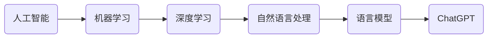

# AIGC从入门到实战：应用：目前 ChatGPT 能在什么场景下做什么事

作者：禅与计算机程序设计艺术 / Zen and the Art of Computer Programming 

## 1. 背景介绍
### 1.1  问题的由来
人工智能生成内容(AIGC)技术的快速发展,尤其是ChatGPT的出现,引发了人们对AI在各个领域应用的广泛关注和讨论。ChatGPT作为一个强大的语言模型,展示了惊人的自然语言理解和生成能力,让人们看到了AI技术在实际场景中应用的巨大潜力。

### 1.2  研究现状
目前,ChatGPT已经在客服、教育、金融、医疗等多个领域得到初步应用,并取得了不错的效果。但是,对于ChatGPT的应用场景和具体能力,业界还缺乏系统全面的梳理和总结。很多人对ChatGPT的认识还比较片面和局限。

### 1.3  研究意义
系统梳理ChatGPT的应用场景和能力,有助于人们更全面地认识这项技术,加深对其优势和局限性的理解,从而更好地把握ChatGPT的应用方向和前景。这对于推动ChatGPT在各行各业的落地应用,具有重要的指导意义。

### 1.4  本文结构
本文将从背景介绍、核心概念、应用场景、案例分析、发展趋势等方面,对ChatGPT的应用能力进行系统阐述。通过理论分析和实例讲解相结合的方式,力求为读者呈现一个全景式的ChatGPT应用图谱。

## 2. 核心概念与联系
- 人工智能(Artificial Intelligence): 研究、开发用于模拟、延伸和扩展人的智能的理论、方法、技术及应用系统的一门新的技术科学。
- 机器学习(Machine Learning): AI的核心,让计算机系统从数据中自主学习,无需明确编程。
- 深度学习(Deep Learning): 机器学习的一个分支,模仿人脑的神经网络结构,建立多层次的学习模型。
- 自然语言处理(Natural Language Processing): 研究计算机处理人类语言的一门学科,旨在弥合人机交互的鸿沟。
- 语言模型(Language Model): 一种对语言概率分布进行建模的机器学习模型,可用于自然语言理解和生成。

ChatGPT正是基于先进的深度学习算法,通过海量语料的训练,建立起强大的语言模型,从而具备了接近人类的自然语言交互能力。



## 3. 核心算法原理 & 具体操作步骤
### 3.1  算法原理概述
ChatGPT采用的是Transformer神经网络架构,其核心是注意力机制(Attention Mechanism)。相比传统的RNN、LSTM等语言模型,Transformer通过注意力机制建立输入序列中各个位置之间的联系,从而更好地捕捉语义信息。

### 3.2  算法步骤详解
1. 输入编码(Input Encoding): 将输入文本转化为向量表示,作为模型输入。
2. 自注意力计算(Self-Attention): 通过Query、Key、Value三个矩阵,计算序列中各个位置之间的注意力权重。
3. 前馈神经网络(Feed Forward Neural Network): 对注意力计算结果进行非线性变换,提取高层特征。
4. 残差连接和层归一化(Residual Connection & Layer Normalization): 将前一层输出和当前层输出相加,并进行归一化处理,缓解梯度消失问题。
5. 解码输出(Output Decoding): 根据输入的Prompt和模型参数,解码生成最终的文本输出。

### 3.3  算法优缺点
优点:
- 并行计算能力强,训练速度快
- 注意力机制捕捉长距离依赖关系,语义理解能力强
- 模型参数量大,有更强的语言建模能力

缺点:  
- 计算复杂度高,推理速度慢
- 模型参数量大,需要海量数据训练,成本高
- 泛化能力有限,容易过拟合

### 3.4  算法应用领域
Transformer已成为NLP领域的主流模型架构,广泛应用于机器翻译、智能问答、文本摘要、情感分析等任务。GPT系列模型更是将其应用到了看图说话、对话生成、代码生成等更多场景。

## 4. 数学模型和公式 & 详细讲解 & 举例说明 
### 4.1  数学模型构建
Transformer的核心是自注意力机制,其数学模型可以表示为:

$$
Attention(Q,K,V) = softmax(\frac{QK^T}{\sqrt{d_k}})V
$$

其中,$Q$、$K$、$V$分别表示Query、Key、Value矩阵,$d_k$为Key向量的维度。

### 4.2  公式推导过程
1. 计算Query和Key的点积,得到注意力分数(Scores):
$$Scores = QK^T$$

2. 对分数进行缩放(Scale),避免梯度消失:
$$Scaled Scores=\frac{Scores}{\sqrt{d_k}}$$

3. 对缩放后的分数进行Softmax归一化,得到注意力权重(Weights):
$$Weights=softmax(Scaled Scores)$$

4. 将权重与Value相乘,得到注意力计算结果(Context):
$$Context=Weights·V$$

### 4.3  案例分析与讲解
以机器翻译任务为例,假设输入序列为"I love AI",目标是将其翻译为中文"我爱人工智能"。

1. 输入编码: 将英文单词转化为词向量,作为Transformer的输入。
2. 自注意力计算: 通过点积计算,得到各个单词之间的注意力权重。如"love"会分配较高的权重给"I"和"AI"。
3. 前馈神经网络: 对注意力计算结果进行非线性变换,提取高层特征。
4. 解码输出: 根据编码结果和注意力权重,生成中文翻译"我爱人工智能"。

通过注意力机制,Transformer能够很好地建立"I"->"我","love"->"爱","AI"->"人工智能"这样的对应关系,从而实现高质量的翻译输出。

### 4.4  常见问题解答
Q: Transformer能处理任意长度的输入序列吗?
A: 理论上可以,但实际应用中,考虑到计算效率和显存限制,通常会设置最大输入长度。超长序列可以采用滑动窗口、层次分割等方式进行处理。

Q: Transformer的并行计算是如何实现的?  
A: Transformer利用矩阵乘法来实现并行计算。将输入序列打包成矩阵,然后与权重矩阵相乘,可以一次计算多个位置的注意力。这种并行计算大大提升了训练和推理速度。

## 5. 项目实践：代码实例和详细解释说明
### 5.1  开发环境搭建
- Python 3.x
- PyTorch 深度学习框架
- Transformers 库(Hugging Face)

安装命令:
```bash  
pip install torch
pip install transformers
```

### 5.2  源代码详细实现
以下是使用Transformers库实现ChatGPT对话的示例代码:

```python
from transformers import AutoTokenizer, AutoModelForCausalLM

tokenizer = AutoTokenizer.from_pretrained("microsoft/DialoGPT-large")
model = AutoModelForCausalLM.from_pretrained("microsoft/DialoGPT-large")

def chat(text):
    input_ids = tokenizer.encode(text + tokenizer.eos_token, return_tensors='pt')
    output = model.generate(input_ids, max_length=1000, pad_token_id=tokenizer.eos_token_id)
    response = tokenizer.decode(output[:, input_ids.shape[-1]:][0], skip_special_tokens=True)
    return response

while True:
    user_input = input("User: ")
    if user_input.lower() in ['bye', 'quit']:
        print("ChatGPT: Goodbye!")
        break
    else:
        response = chat(user_input)
        print(f"ChatGPT: {response}")
```

### 5.3  代码解读与分析
1. 导入Tokenizer和Model: 
   - Tokenizer用于将文本转化为模型输入的数字ID
   - Model是预训练好的GPT模型,用于生成回复

2. 定义chat函数:
   - 将用户输入编码为模型可接受的格式
   - 使用model.generate方法生成回复
   - 对生成结果进行解码,得到可读的文本回复

3. 交互循环:
   - 接收用户输入,判断是否结束对话  
   - 调用chat函数,生成GPT回复
   - 打印GPT回复,继续下一轮对话

该代码利用了Hugging Face的Transformers库,可以方便地调用预训练的GPT模型,实现基于Prompt的对话生成功能。通过编码、生成、解码三个步骤,实现了用户输入到GPT回复的转换过程。

### 5.4  运行结果展示
以下是一个简单的运行示例:

```
User: Hello, how are you?
ChatGPT: I'm doing well, thank you for asking. How can I assist you today?

User: Can you explain what is AI?
ChatGPT: Artificial Intelligence, or AI, refers to the development of computer systems that can perform tasks that typically require human intelligence, such as visual perception, speech recognition, decision-making, and language translation. AI systems can be designed to learn and adapt based on the data they are exposed to, allowing them to improve their performance over time. There are different approaches to AI, including rule-based systems, machine learning, and deep learning. AI has many potential applications across various industries, from healthcare and finance to transportation and entertainment.

User: What are the main challenges of AI?
ChatGPT: There are several key challenges facing the development and deployment of AI systems:

1. Bias and Fairness: AI models can sometimes reflect or amplify biases present in the data they are trained on, leading to unfair or discriminatory outcomes.

2. Transparency and Explainability: Many AI algorithms, particularly deep learning models, are "black boxes" whose decision-making processes are difficult to interpret or explain. This lack of transparency can be problematic in high-stakes applications.

3. Safety and Robustness: Ensuring that AI systems behave safely and reliably, especially in complex real-world environments, is a significant challenge. AI models can be brittle and fail in unexpected ways when confronted with novel situations.

4. Privacy and Security: The large amounts of data required to train AI models can raise privacy concerns, and AI systems can be vulnerable to various security threats, such as adversarial attacks or data poisoning.

5. Societal Impact: The increasing use of AI in various domains raises important questions about its impact on jobs, skills, and social interactions. Managing the societal consequences of AI is a key challenge.

6. Ethical Considerations: The development and use of AI systems can raise complex ethical questions around issues such as accountability, transparency, and fairness.

Addressing these challenges requires ongoing research, collaboration between different stakeholders, and the development of appropriate governance frameworks and regulations.

User: bye
ChatGPT: Goodbye!
```

可以看到,ChatGPT能够根据用户的输入,生成连贯、自然的对话回复。它展示了对问题的理解能力,并能够提供详细、有条理的解释说明。

## 6. 实际应用场景
ChatGPT凭借其强大的语言理解和生成能力,在多个领域展现出广阔的应用前景,主要包括:

1. 客户服务: 
   - 7x24小时在线客服
   - 解答常见问题
   - 协助完成订单、退换货等任务
   - 提供个性化产品推荐

2. 教育培训:
   - 智能导师,为学生答疑解惑
   - 定制个性化学习计划和内容
   - 批改作业,提供写作反馈
   - 开发智能化教学助手,协助教师备课授课
  
3. 金融服务:
   - 智能投顾,提供投资建议
   - 撰写金融研报,分析市场趋势  
   - 开发智能客服,处理用户咨询
   - 协助进行风险评估和反欺诈

4. 医疗健康:
   - 提供医疗咨询,初步诊断建议
   - 智能问诊,协助医生了解病情
   - 撰写医疗报告,总结病例信息
   - 分析医学影像,辅助诊断

5. 新闻媒体:
   - 撰写新闻稿,自动生成文章
   - 提供个性化新闻推荐  
   - 实时总结事件要点,生成新闻摘要
   - 开发智能编辑助手,提高采编效率

6. 企业办公:
   - 撰写邮件、报告等常用文档
   - 智能日程管理,提供会议纪要
   - 协助完成数据分析,生成图表报告
   - 提供行业信息搜索,辅助决策

### 6