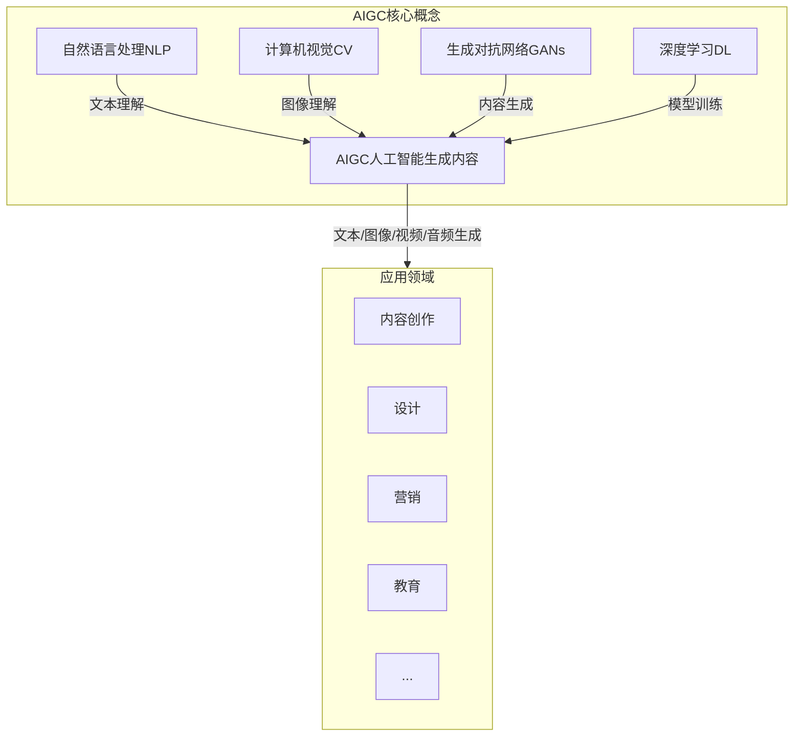
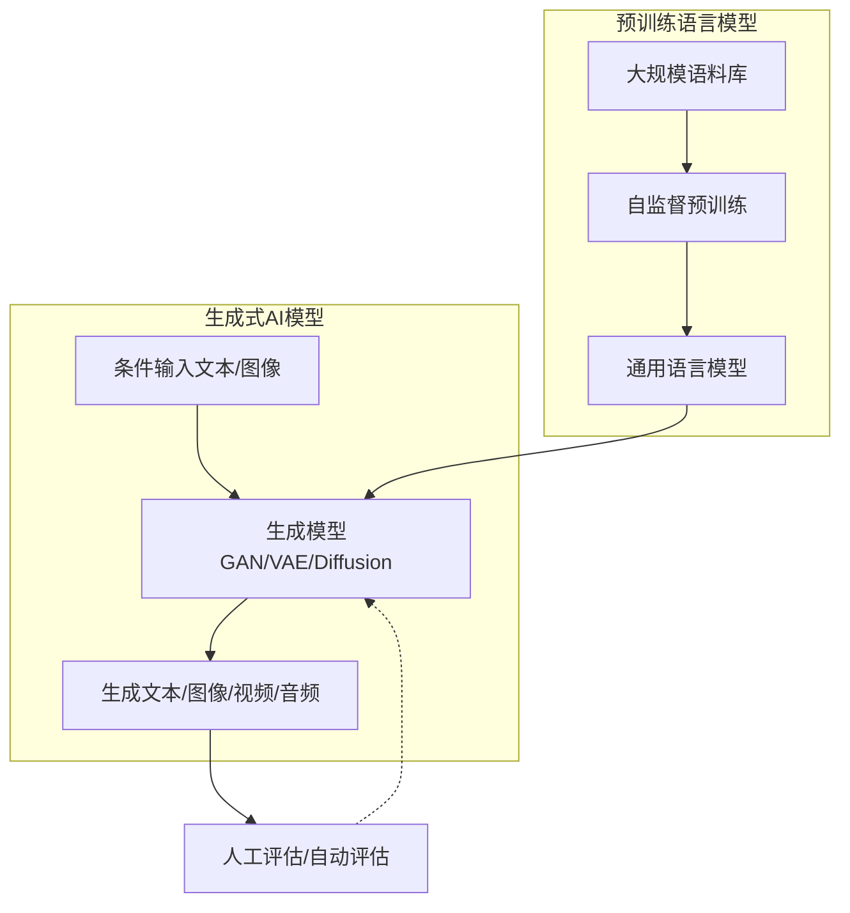
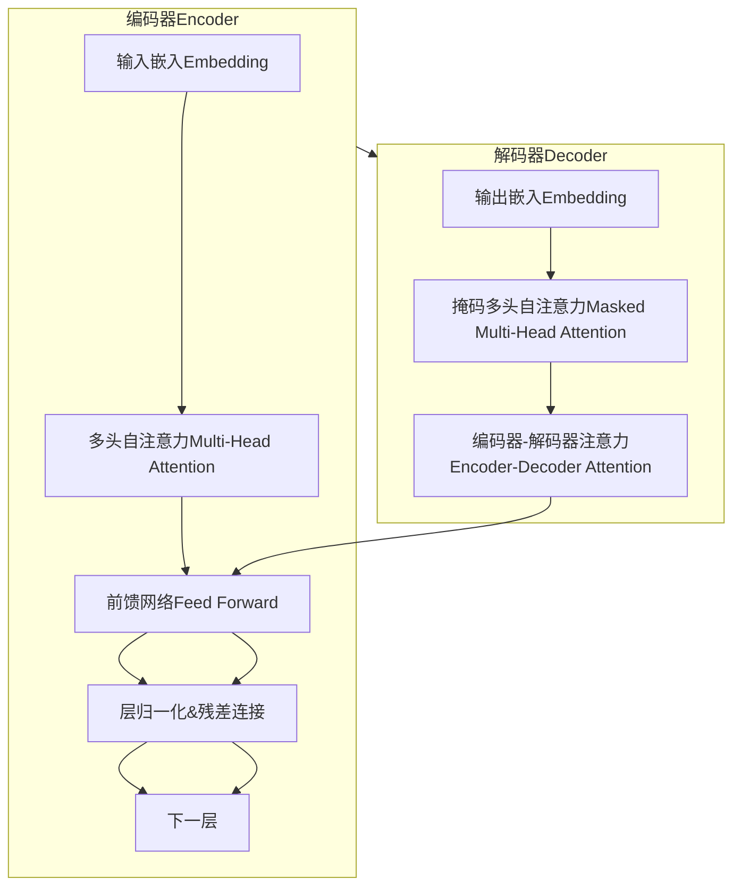

以下是标题为《AIGC从入门到实战：涌现：人工智能的应用》的技术博客文章正文内容：

# AIGC从入门到实战：涌现：人工智能的应用

## 1. 背景介绍

### 1.1 问题的由来

在过去几十年中，人工智能(AI)技术取得了长足的进步,尤其是近年来,AI在诸多领域的应用越来越广泛,给人类社会带来了深刻的影响。而最近,一种新兴的人工智能技术——AIGC(AI Generated Content,人工智能生成内容)开始引起广泛关注。

AIGC技术利用自然语言处理(NLP)、计算机视觉(CV)、生成对抗网络(GAN)等多种人工智能算法,能够根据人类的文本、图像或音频输入,自动生成高质量的内容输出,如文字、图像、视频、音频等。这种能力使得AIGC在内容创作、设计、营销等多个领域展现出巨大的应用潜力。

### 1.2 研究现状

目前,主流的AIGC模型主要包括OpenAI的GPT-3、谷歌的LaMDA、DeepMind的Gopher、Meta的Llama等。这些模型通过在大规模语料库上进行预训练,获得了强大的自然语言理解和生成能力。

除了文本生成,AIGC也能生成高质量的图像、视频等多媒体内容。例如OpenAI的DALL-E 2、谷歌的Imagen、DeepMind的Diffusion模型等,都展现出了令人惊叹的图像生成能力。

此外,AIGC还能结合多模态输入进行内容生成,如Anthropic的Claude模型能够根据文本和图像双重输入生成相应的文字或图像输出。

### 1.3 研究意义

AIGC技术的兴起将为内容创作、设计、营销等领域带来革命性的变化。它能够极大提高内容生产的效率,降低成本,为企业和个人创作者提供强有力的辅助工具。同时,AIGC也可能给某些传统行业带来颠覆性的冲击。

因此,深入研究AIGC技术的原理、算法和应用,具有重要的理论意义和现实价值。全面掌握AIGC,把握其发展趋势和应用场景,将有助于个人和企业抓住这一新兴技术带来的机遇。

### 1.4 本文结构

本文将从以下几个方面全面介绍AIGC技术:

- 核心概念与联系
- 核心算法原理与具体步骤 
- 数学模型与公式推导
- 项目实践与代码解读
- 实际应用场景分析
- 工具和学习资源推荐
- 未来发展趋势与挑战探讨

接下来,我们首先从AIGC的核心概念入手,了解这一领域的基本知识。

## 2. 核心概念与联系

AIGC技术涉及多个人工智能领域的核心概念,包括自然语言处理(NLP)、计算机视觉(CV)、生成式人工智能等,它们之间存在着紧密的联系。我们用一个流程图来直观地展示这些概念之间的关系:

1. **自然语言处理(NLP)**：NLP技术能够对文本进行理解和生成,是AIGC中处理文本输入输出的核心。常用的NLP模型包括BERT、GPT、T5等。

2. **计算机视觉(CV)**：CV技术则负责对图像、视频等视觉数据的理解和生成,是AIGC处理视觉输入输出的关键。如目标检测、图像分类、图像生成等。

3. **生成式人工智能**：生成式AI模型如生成对抗网络(GANs)、变分自编码器(VAEs)、扩散模型等,是AIGC进行内容生成的核心算法。

4. **深度学习(DL)**：深度学习为AIGC提供了强大的模型训练和优化能力,是AIGC模型获得优秀性能的基础。

这些概念相互关联、相辅相成,共同构建了AIGC技术的理论基础和技术支撑。AIGC能够综合利用这些技术,实现多模态输入到多模态输出的内容生成过程。生成的内容可广泛应用于内容创作、设计、营销、教育等诸多领域。

## 3. 核心算法原理与具体操作步骤

### 3.1 算法原理概述

AIGC的核心算法主要包括两个部分:

1. **预训练语言模型**
2. **生成式AI模型**

这两部分算法相互配合,共同实现了AIGC的内容生成能力。我们用一个流程图来概括AIGC的核心算法原理:

1. **预训练语言模型**：利用自监督学习方法(如掩码语言模型)在大规模语料库上对通用语言模型(如BERT、GPT等)进行预训练,获得对自然语言的深度理解能力。

2. **生成式AI模型**：将预训练语言模型与生成对抗网络(GAN)、变分自编码器(VAE)、扩散模型等生成式AI模型相结合,根据文本或图像等条件输入,生成相应的文本、图像、视频或音频输出。

3. **评估与优化**：对生成的内容输出进行人工评估或自动评估,并将评估反馈回生成模型,持续优化模型性能。

接下来,我们详细介绍这两部分算法的具体操作步骤。

### 3.2 算法步骤详解

#### 3.2.1 预训练语言模型

1. **数据准备**:收集大规模的文本语料库,如网页、书籍、维基百科等。对语料进行必要的预处理,如分词、去重、过滤等。

2. **模型选择**:选择合适的预训练语言模型架构,如BERT、GPT、T5等。这些模型基于Transformer编码器-解码器结构。

3. **自监督预训练**:采用自监督学习方法,如掩码语言模型(MLM)、下一句预测(NSP)等,在语料库上对模型进行预训练。

4. **模型微调**:可根据下游任务,在预训练模型的基础上进行进一步的微调,提高模型在特定任务上的性能。

通过预训练,语言模型能够获得对自然语言的深度理解能力,为生成高质量内容奠定基础。

#### 3.2.2 生成式AI模型

1. **条件输入**:根据需求确定生成任务的条件输入,可以是文本描述、图像等单模态或多模态输入。

2. **模型选择**:选择合适的生成式AI模型,如GAN、VAE、Diffusion等。不同模型适用于不同类型的生成任务。

3. **模型训练**:将预训练语言模型与生成模型相结合,在配对的输入-输出数据集上进行训练,学习生成所需内容的映射关系。

4. **内容生成**:输入条件,利用训练好的生成模型进行采样,生成所需的文本、图像、视频或音频内容输出。

5. **评估与优化**:对生成内容的质量进行评估,可采用人工评估或自动评估指标。根据评估反馈,持续优化生成模型。

通过这一系列步骤,AIGC模型能够根据输入条件,生成高质量、多样化的内容输出,满足不同领域的应用需求。

### 3.3 算法优缺点

AIGC算法具有以下优缺点:

**优点**:

1. 高效性:AIGC能够极大提高内容生产效率,降低人力成本。
2. 多样性:AIGC可生成多种形式的内容,包括文本、图像、视频、音频等。
3. 个性化:根据不同的输入条件,AIGC可生成个性化、定制化的内容输出。
4. 创新性:AIGC有助于激发人类的创造力,为内容创作提供新的思路和灵感。

**缺点**:

1. 偏差与不确定性:AIGC生成的内容可能存在偏差或不确定性,需要人工审核和调整。
2. 版权与伦理问题:AIGC内容的版权归属、知识产权保护以及伦理审查等问题有待解决。
3. 计算资源需求大:训练AIGC模型需要大量的计算资源,成本较高。
4. 数据质量依赖:AIGC模型的性能很大程度上依赖于训练数据的质量和量。

总的来说,AIGC算法为内容生产带来了革命性的变化,但也面临一些需要解决的挑战。

### 3.4 算法应用领域

AIGC算法的应用领域非常广泛,包括但不限于:

1. **内容创作**:辅助创作文学作品、新闻报道、营销文案、脚本、教材等。
2. **设计**:生成图像、图标、插画、UI界面、3D模型等设计元素。
3. **营销**:制作个性化的广告文案、视频广告等营销内容。
4. **教育**:自动生成教学资料、习题、教案等教育内容。
5. **娱乐**:创作虚拟人物形象、视频特效、游戏场景等。
6. **科研**:辅助写作论文、报告,生成可视化图表等。
7. **客服**:生成自动问答系统的对话内容。
8. **翻译**:机器翻译、多语种内容生成等。

AIGC技术的不断发展和完善,必将为更多领域带来革新,催生新的商业模式和应用场景。

## 4. 数学模型和公式详细讲解与举例说明

### 4.1 数学模型构建

AIGC技术中的核心数学模型是**Transformer**,它是一种基于Self-Attention机制的序列到序列(Seq2Seq)模型。Transformer模型架构如下图所示:

Transformer模型主要由编码器(Encoder)和解码器(Decoder)两部分组成:

1. **编码器(Encoder)**:将输入序列(如文本)通过嵌入层映射为向量表示,然后使用多层的Multi-Head Attention和前馈网络对输入进行编码,捕获输入序列的上下文信息。

2. **解码器(Decoder)**:首先对目标序列(如需生成的文本)进行掩码处理,使用Maske