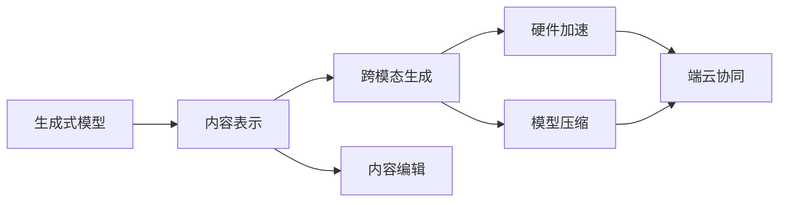

# AIGC从入门到实战：进行硬件部署和运行工程源码

关键词：AIGC、硬件部署、工程实践、模型训练、推理加速

## 1. 背景介绍
### 1.1  问题的由来
人工智能生成内容(AIGC)技术的快速发展,使得AI在生成图像、视频、音频、文本等多模态内容方面取得了突破性进展。然而,目前AIGC技术主要还停留在算法研究和云端部署阶段,在端侧设备的硬件部署和工程实践方面仍然面临诸多挑战。

### 1.2  研究现状
当前,AIGC相关研究主要集中在以下几个方面:
1. 基础模型的创新,如扩散模型、生成式对抗网络等新型生成模型的提出。
2. 大规模预训练和多模态学习,通过海量数据预训练和多模态信息融合提升生成效果。 
3. 应用场景拓展,如文本到图像、视频到视频、音频到图像等跨模态内容生成。
4. 内容编辑和交互,研究内容的可编辑性和人机交互方式。

但在实际落地部署方面,特别是在资源受限的端侧设备上进行AIGC的工程实践还有待进一步探索。

### 1.3  研究意义
将AIGC能力从云端拓展到端侧,对于拓宽AIGC的应用场景、提升用户体验、保护数据隐私等方面具有重要意义:
1. 端云协同,根据具体任务在云端和端侧灵活调度AIGC能力。
2. 本地实时生成,降低时延,提升交互体验。
3. 隐私保护,敏感数据无需上传云端。
4. 个性化定制,根据端侧反馈动态调整生成策略。

因此,亟需开展AIGC在端侧设备上的硬件部署和工程实践研究,探索端云协同的AIGC全流程解决方案。

### 1.4  本文结构
本文将重点围绕AIGC在端侧设备上的硬件部署和工程实践展开,内容安排如下:
- 第2节介绍AIGC中的核心概念及其内在联系。 
- 第3节重点阐述AIGC的核心算法原理和具体操作步骤。
- 第4节给出AIGC中常用的数学模型和公式,并结合案例进行详细讲解。
- 第5节以一个实际项目为例,展示AIGC工程实践的完整流程,包括环境搭建、代码实现、结果分析等。
- 第6节总结AIGC技术的实际应用场景和未来发展趋势。
- 第7节推荐AIGC相关的学习资源、开发工具和参考文献。
- 第8节对全文进行总结,讨论AIGC未来的机遇与挑战。
- 第9节列举AIGC领域常见问题解答。

## 2. 核心概念与联系

在AIGC领域,有几个核心概念需要重点关注:

- **生成式模型(Generative Models)**: 能够学习数据分布,并生成与训练数据相似的新样本的模型。代表模型包括VAE、GAN、扩散模型等。它们是AIGC的理论基础。

- **内容表示(Content Representation)**: 将不同模态的内容映射到一个统一的向量空间进行表示,是实现多模态内容生成的关键。常用的表示学习方法有CLIP、DALL·E等。

- **跨模态生成(Cross-modal Generation)**: 根据某一模态的内容(如文本)生成另一模态的内容(如图像),是AIGC的主要应用形式。代表工作如Stable Diffusion、Midjourney等。

- **内容编辑(Content Editing)**: 在保持原有内容语义的基础上,对生成的内容进行编辑修改,如风格迁移、属性编辑等。内容编辑赋予了AIGC更多可控性。

- **硬件加速(Hardware Acceleration)**: 利用GPU、NPU等专用硬件对AIGC进行加速,提升生成效率。当前主流的加速方案有CUDA、TensorRT、ONNX Runtime等。

- **模型压缩(Model Compression)**: 在保持生成效果的前提下,对AIGC模型进行压缩,降低部署资源开销。常用的模型压缩技术包括量化、剪枝、知识蒸馏等。

- **端云协同(Edge-cloud Collaboration)**: 根据具体任务需求,灵活调度云端和端侧的AIGC能力,实现端云协同。需要结合具体场景设计调度策略。

以上概念之间的内在联系可以总结为:

生成式模型是AIGC的理论基础,通过内容表示学习实现跨模态内容生成和编辑。为了让AIGC能够在端侧实时运行,需要利用硬件加速和模型压缩技术对其进行优化,并根据任务需求设计端云协同方案。掌握这些概念之间的联系,有助于理解AIGC端侧部署的全局。

## 3. 核心算法原理 & 具体操作步骤
### 3.1  算法原理概述
AIGC的核心算法主要包括基于扩散模型(Diffusion Models)和生成式对抗网络(GANs)的方法。

扩散模型通过迭代的去噪过程生成内容。具体来说,它首先在原始数据上叠加高斯噪声,然后学习一个去噪网络,逐步去除噪声恢复原始数据。生成时,从纯高斯噪声出发,反复调用去噪网络生成内容。代表工作如DDPM、Latent Diffusion等。

GANs则通过一个生成器和一个判别器的对抗学习生成内容。生成器试图生成以假乱真的样本,判别器则要区分真假样本。两者不断博弈,最终生成器可生成高质量的内容。代表工作如StyleGAN、BigGAN等。

### 3.2  算法步骤详解
以Stable Diffusion为例,其算法步骤可概括为:

1. 训练图像编码器将图像压缩为隐空间表示。
2. 训练文本编码器将文本嵌入映射到隐空间。
3. 训练一个基于隐空间的扩散模型:
   - 迭代叠加噪声,构建扩散过程。
   - 训练去噪网络学习逆向生成过程。
4. 推理时,用文本嵌入作为条件,从噪声出发迭代去噪,生成对应图像。
5. 对生成图像进行后处理,如超分辨率、修补等。

其核心在于扩散模型的训练和推理。训练时构建加噪过程,学习去噪网络。推理时控制去噪过程,条件化生成图像。

### 3.3  算法优缺点
扩散模型的优点在于:
- 样本质量高,能生成高分辨率、高保真度的图像。
- 支持多种条件控制,如文本引导、风格迁移等。
- 泛化能力强,一个模型可适应多个领域。

缺点包括:
- 推理速度慢,生成一张图像需要上百步迭代。
- 资源消耗大,需要较大的内存和算力。

GANs的优点有:
- 生成速度快,一次前向传播即可生成图像。
- 训练稳定性好,损失函数清晰。

缺点为:
- 训练难度大,需要仔细平衡生成器和判别器。
- 生成多样性不足,容易模式崩溃。

### 3.4  算法应用领域
AIGC算法已在多个领域得到应用,例如:
- 计算机视觉:图像生成、编辑、动画合成等。
- 自然语言处理:文本生成、对话、写作助手等。
- 语音处理:语音合成、音乐生成等。
- 游戏:程序化内容生成、AI辅助设计等。
- 设计:辅助服装设计、工业造型设计等。

随着算法的不断进步,AIGC有望在更广泛的领域发挥价值。

## 4. 数学模型和公式 & 详细讲解 & 举例说明
### 4.1  数学模型构建
以DDPM为例,其数学模型可描述为:

正向扩散过程:
$$q(x_t|x_{t-1}) = \mathcal{N}(x_t; \sqrt{1-\beta_t} x_{t-1}, \beta_t \mathbf{I})$$

反向去噪过程:
$$p_\theta(x_{t-1}|x_t) = \mathcal{N}(x_{t-1}; \mu_\theta(x_t, t), \sigma_\theta(x_t, t)^2\mathbf{I})$$

其中, $x_t$ 表示 $t$ 时刻的图像, $\beta_t$ 控制扩散速度, $\theta$ 为去噪网络参数。

训练目标是优化去噪网络 $\theta$ 以最大化似然:
$$\max_\theta \mathbb{E}_{x_0, \epsilon \sim \mathcal{N}(0,\mathbf{I}), t} [\log p_\theta(x_{t-1}|x_t)]$$

### 4.2  公式推导过程
正向扩散过程可由下式递推得到:

$$q(x_t|x_0) = \mathcal{N}(x_t; \sqrt{\bar{\alpha}_t} x_0, (1-\bar{\alpha}_t)\mathbf{I})$$

其中, $\alpha_t = 1- \beta_t$, $\bar{\alpha}_t = \prod_{s=1}^t \alpha_s$。

反向去噪过程中,均值项 $\mu_\theta(x_t,t)$ 可由下式估计:

$$\mu_\theta(x_t, t) = \frac{1}{\sqrt{\alpha_t}} \left(x_t - \frac{\beta_t}{\sqrt{1-\bar{\alpha}_t}} \epsilon_\theta(x_t, t) \right)$$

方差项 $\sigma_\theta$ 可设为常数或由网络预测。

### 4.3  案例分析与讲解
下面以一个简单的二维高斯分布为例,直观展示DDPM的扩散和生成过程。

假设原始数据服从标准高斯分布 $\mathcal{N}(0, \mathbf{I})$,扩散过程中 $\beta_t$ 设为常数 $\beta$。

经过 $T$ 步扩散后,数据分布为 $\mathcal{N}(0, (1-\bar{\alpha}_T)\mathbf{I})$,接近纯高斯噪声。

反向去噪时,假设去噪网络可以完美地预测噪声:

$$\epsilon_\theta(x_t, t) = \frac{1}{\sqrt{1-\bar{\alpha}_t}} (x_t - \sqrt{\bar{\alpha}_t} x_0)$$

代入均值估计公式,可得:

$$\mu_\theta(x_t, t) = \sqrt{\bar{\alpha}_{t-1}} x_0$$

即每一步去噪将数据分布向原始分布 $\mathcal{N}(0, \mathbf{I})$ 逼近,最终恢复数据。

下图展示了这一过程的直观效果:

经过 $T=1000$ 步扩散,数据由绿色分布逐渐向红色高斯噪声扩散。反向去噪时,数据分布逐步向原分布收缩,最终基本恢复(蓝色)。

### 4.4  常见问题解答
Q: 扩散模型容易发生"鬼影"等伪影,如何解决?
A: 可通过提高分辨率、增大扩散步数、采用级联模型等方法缓解。

Q: 去噪网络预测噪声和预测像素值,哪种方式更好?
A: 预测噪声通常效果更好,收敛更稳定。

Q: 如何权衡扩散模型的生成质量和推理速度?
A: 可通过调整扩散步数、采用加速推理算法如DDIM等手段平衡。

Q: DDPM和Latent Diffusion有何区别?
A: Latent Diffusion在隐空间上做扩散,显著降低了内存和计算开销。

## 5. 项目实践：代码实例和详细解释说明
### 5.1  开发环境搭建
首先,我们需要搭建AIGC模型的开发环境。以PyTorch版Stable Diffusion为例:

1