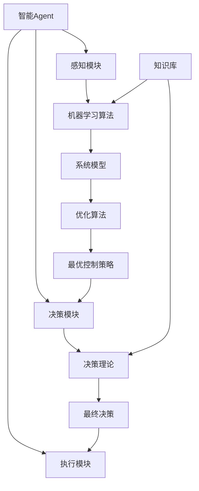

# AI人工智能 Agent：在节能减排中的应用

## 1. 背景介绍

### 1.1 问题的由来

随着全球气候变化问题日益严峻，节能减排已经成为当前社会可持续发展的重中之重。工业生产、交通运输、建筑能耗等领域都是能源消耗和温室气体排放的主要来源。如何在这些领域中实现高效节能、减少碳排放,已经成为全球性的挑战。

传统的节能减排方式主要依赖于人工管理和控制,但由于复杂的系统环境和大量的变量参数,人工方式往往效率低下、成本高昂。因此,迫切需要一种智能化、自动化的解决方案,来优化能源利用、降低碳排放。

### 1.2 研究现状

近年来,人工智能(AI)技术在节能减排领域展现出巨大的潜力和应用前景。AI系统可以通过学习大量的历史数据,建立精确的能源消耗模型,并基于这些模型进行优化决策,从而实现精细化的能源管理和控制。

目前,AI技术在工业节能、建筑节能、交通节能等领域已经取得了一些初步的研究成果和应用实践。例如,利用机器学习算法对工业生产过程进行能耗优化;使用强化学习控制建筑的供热供冷系统;应用深度学习预测交通流量,优化交通信号灯时序等。

### 1.3 研究意义

AI技术在节能减排领域的应用,可以带来诸多重要意义:

1. 提高能源利用效率,降低能源消耗;
2. 减少温室气体排放,缓解气候变化;
3. 降低企业运营成本,提高经济效益;
4. 促进可持续发展,实现环境友好;
5. 推动智能化技术在节能领域的创新应用。

总的来说,AI技术为解决节能减排问题提供了一种全新的思路和手段,具有重要的理论意义和现实应用价值。

### 1.4 本文结构

本文将全面介绍AI技术在节能减排领域的应用。首先阐述核心概念和技术,包括智能Agent、机器学习、优化算法等;其次详细解释相关算法原理和数学模型;再次给出具体的项目实践案例;最后总结现状并展望未来发展趋势和挑战。

## 2. 核心概念与联系

在节能减排领域应用AI技术的核心,是基于智能Agent的自主决策和优化控制。所谓智能Agent,是指具有感知环境、学习能力和行为选择能力的软件实体。

智能Agent通过感知当前系统的运行状态(如能源消耗、温度、工艺参数等),并结合过去学习到的经验知识,选择最优的行为方案(如调节设备参数),从而达到节能减排的目的。

实现这一过程需要综合运用多种AI技术,包括:

1. **机器学习算法**:用于从历史数据中学习系统模型,如能耗预测模型、控制模型等;
2. **优化算法**:基于建立的系统模型,求解最优控制策略,如遗传算法、蚁群算法等;
3. **决策理论**:根据优化结果作出最终的决策,如马尔可夫决策过程、强化学习等;
4. **知识库**:存储领域知识和经验,如节能专家知识库、最佳实践案例库等。

上述各项技术相互配合、环环相扣,共同构建出智能化的节能减排解决方案。

## 3. 核心算法原理及具体操作步骤

### 3.1 算法原理概述  

AI在节能减排中的应用,主要基于机器学习、优化算法和决策理论等技术。其核心思想是:

1. 利用机器学习算法,从海量历史数据中学习能源系统的运行模式,建立精确的数学模型;
2. 基于所建模型,使用优化算法求解最优控制参数,获得节能减排的最佳方案;
3. 将优化结果输入决策理论模型,综合考虑其他约束,作出最终的执行决策;
4. 智能Agent根据决策,自动调节相关设备参数,实现节能减排。

该过程还包括在线学习和决策优化等环节,形成了一个自主闭环的智能控制系统。

### 3.2 算法步骤详解

具体的算法步骤如下:

1. **数据采集**:收集能源系统的运行数据,包括能耗、温度、工艺参数等; 

2. **数据预处理**:对原始数据进行清洗、去噪、标准化等预处理,确保数据质量;

3. **特征工程**:从预处理后的数据中提取合适的特征变量,作为模型的输入;

4. **模型训练**:选择合适的机器学习算法(如神经网络、决策树等),使用训练数据构建能耗预测模型;

5. **模型评估**:在测试数据集上评估模型的准确性,必要时进行调参和模型优化; 

6. **优化求解**:将训练好的模型与优化算法(如遗传算法、蚁群算法等)相结合,求解最优控制参数;

7. **决策输出**:将优化结果输入决策模型(如马尔可夫决策过程),融合其他约束,作出最终的执行决策;

8. **参数调节**:智能Agent根据决策结果,自动调节相关设备的控制参数;

9. **在线学习**:在实际运行过程中,持续采集新的运行数据,以更新模型,不断优化决策;

10. **反馈迭代**:将运行效果反馈至前面的环节,形成闭环控制,持续改进系统性能。

### 3.3 算法优缺点

上述AI算法在节能减排领域的应用具有以下优缺点:

**优点**:

1. 自动化程度高,减轻人工管理压力; 
2. 智能化决策,可发现人工难以觉察的节能机会;
3. 持续学习优化,系统性能不断提升;
4. 可处理复杂环境,应对多变量和动态条件。

**缺点**:  

1. 算法性能依赖于训练数据的质量和量;
2. 模型训练和优化计算有一定的时间开销; 
3. 决策过程是一个黑箱,缺乏可解释性;
4. 系统部署和维护有一定的技术门槛。

### 3.4 算法应用领域

上述AI算法可广泛应用于工业、建筑、交通等领域的节能减排:

1. **工业节能**:优化工业生产流程,提高能源利用效率;
2. **建筑节能**:自动控制供热供冷系统,降低建筑能耗; 
3. **交通节能**:预测交通流量,优化交通信号时序和路线规划;
4. **智能家居**:根据用户习惯,自动调节家电设备,节省能源;
5. **可再生能源**:优化太阳能、风能等可再生能源的利用效率。

## 4. 数学模型和公式及详细讲解和举例说明

### 4.1 数学模型构建

在AI算法的节能减排应用中,需要构建描述能源系统运行的数学模型。常用的模型有:

1. **回归模型**:用于预测连续型的能耗值,如线性回归、决策树回归等;

2. **分类模型**:用于对能耗状态进行离散分类,如逻辑回归、支持向量机等;

3. **时序模型**:描述能耗随时间变化的动态过程,如自回归模型、神经网络等;

4. **控制模型**:刻画控制参数与能耗之间的映射关系,如PID控制模型等。

以下以一个简单的线性回归模型为例,介绍模型的构建过程。

假设系统的能耗y与控制参数x之间存在线性关系:

$$y = \theta_0 + \theta_1 x + \epsilon$$

其中$\theta_0$和$\theta_1$是模型参数,需要从数据中估计得到;$\epsilon$是随机误差项。

我们可以使用最小二乘法来估计模型参数,目标是最小化残差平方和:

$$\min\limits_{\theta_0,\theta_1} \sum\limits_{i=1}^{n}(y_i - \theta_0 - \theta_1 x_i)^2$$

对该目标函数求导、令导数等于0,可以得到模型参数的解析解:

$$\begin{aligned}
\theta_1 &= \frac{\sum\limits_{i=1}^{n}(x_i - \bar{x})(y_i - \bar{y})}{\sum\limits_{i=1}^{n}(x_i - \bar{x})^2} \\
\theta_0 &= \bar{y} - \theta_1 \bar{x}
\end{aligned}$$

其中$\bar{x}$和$\bar{y}$分别表示$x$和$y$的均值。

通过上述公式,我们就可以从历史数据中估计出模型参数,得到能耗与控制参数之间的线性映射关系。

### 4.2 公式推导过程

接下来,我们给出线性回归模型参数解析解的推导过程:

最小二乘法的目标函数为:

$$J(\theta_0, \theta_1) = \sum\limits_{i=1}^{n}(y_i - \theta_0 - \theta_1 x_i)^2$$

对$\theta_0$和$\theta_1$分别求偏导数:

$$\begin{aligned}
\frac{\partial J}{\partial \theta_0} &= 2\sum\limits_{i=1}^{n}(y_i - \theta_0 - \theta_1 x_i)(-1) = 0\\
\frac{\partial J}{\partial \theta_1} &= 2\sum\limits_{i=1}^{n}(y_i - \theta_0 - \theta_1 x_i)(-x_i) = 0
\end{aligned}$$

将导数等于0,可解得:

$$\begin{aligned}
\sum\limits_{i=1}^{n}(y_i - \theta_0 - \theta_1 x_i) &= 0\\
\sum\limits_{i=1}^{n}(y_i - \theta_0 - \theta_1 x_i)x_i &= 0
\end{aligned}$$

进一步整理可得:

$$\begin{aligned}
n\theta_0 + \theta_1\sum\limits_{i=1}^{n}x_i &= \sum\limits_{i=1}^{n}y_i\\
\theta_0\sum\limits_{i=1}^{n}x_i + \theta_1\sum\limits_{i=1}^{n}x_i^2 &= \sum\limits_{i=1}^{n}x_iy_i
\end{aligned}$$

令$\bar{x} = \frac{1}{n}\sum\limits_{i=1}^{n}x_i$和$\bar{y} = \frac{1}{n}\sum\limits_{i=1}^{n}y_i$,代入上式可得:

$$\begin{aligned}
n\theta_0 + n\theta_1\bar{x} &= n\bar{y}\\
n\theta_0\bar{x} + \theta_1\sum\limits_{i=1}^{n}(x_i - \bar{x})^2 &= \sum\limits_{i=1}^{n}(x_i - \bar{x})(y_i - \bar{y})
\end{aligned}$$

将第一个方程的$\theta_0$代入第二个方程,可解得:

$$\theta_1 = \frac{\sum\limits_{i=1}^{n}(x_i - \bar{x})(y_i - \bar{y})}{\sum\limits_{i=1}^{n}(x_i - \bar{x})^2}$$

将$\theta_1$代回第一个方程,即可得到$\theta_0$的解析解:

$$\theta_0 = \bar{y} - \theta_1\bar{x}$$

这就是线性回归模型参数的最小二乘估计公式的推导过程。

### 4.3 案例分析与讲解

现在,我们用一个实际案例来分析和讲解线性回归模型在节能减排中的应用。

假设我们要优化一个工业锅炉的运行,目标是在满足生产需求的前提下,降低锅炉的燃料消耗。经过数据收