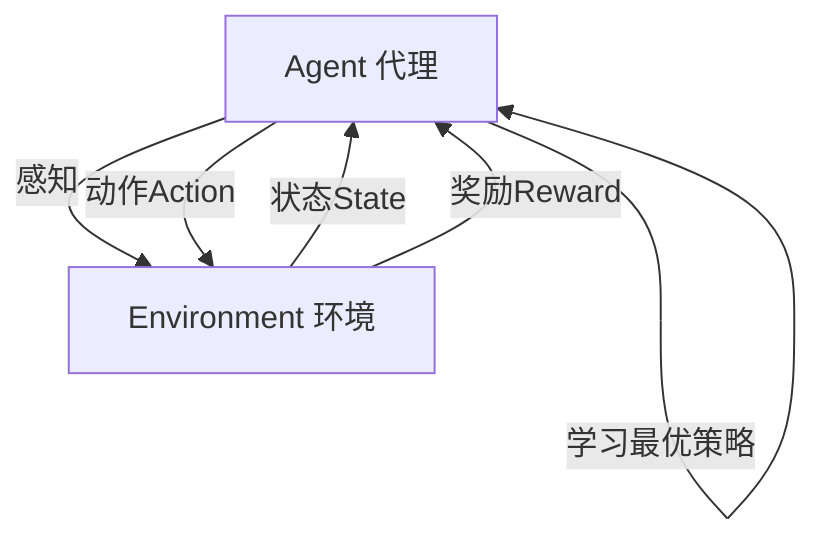

# AI人工智能代理工作流 AI Agent WorkFlow：动作的选择与执行

作者：禅与计算机程序设计艺术 / Zen and the Art of Computer Programming

关键词：人工智能、智能代理、工作流、决策、动作选择、动作执行

## 1. 背景介绍

### 1.1 问题的由来

随着人工智能技术的飞速发展,智能代理(Intelligent Agent)作为一个重要的研究领域受到了广泛关注。智能代理是一种能够感知环境,并根据环境做出自主决策和行动的计算机程序。在复杂多变的环境中,如何让智能代理高效、准确地选择和执行动作,成为了一个亟待解决的关键问题。

### 1.2 研究现状

目前,针对智能代理的动作选择与执行,学术界已经开展了大量研究。主流的方法包括基于规则的方法、基于知识的方法、基于学习的方法等。基于规则的方法通过预先定义好的规则来选择动作,但灵活性和适应性较差。基于知识的方法利用知识库进行推理决策,但构建完备的知识库很困难。基于学习的方法通过机器学习算法来学习动作策略,具有较好的适应性,是当前的研究热点。

### 1.3 研究意义

研究智能代理的动作选择与执行,对于推动人工智能在实际场景中的应用具有重要意义。高效准确的动作决策与执行,能够大幅提升智能代理完成任务的能力,拓展其应用范围。同时,相关研究也有助于加深对智能代理内部工作机制的理解,促进人工智能基础理论的发展。

### 1.4 本文结构

本文将围绕智能代理的动作选择与执行展开深入探讨。第2部分介绍相关的核心概念及其联系；第3部分重点阐述智能代理动作决策的核心算法原理与具体操作步骤；第4部分从数学角度对相关模型与公式进行详细讲解；第5部分给出项目实践的代码实例与解释说明；第6部分分析实际应用场景；第7部分推荐相关工具和学习资源；第8部分总结全文,并对未来发展趋势与挑战进行展望；第9部分的附录给出常见问题解答。

## 2. 核心概念与联系

在探讨智能代理的动作选择与执行之前,首先需要明确几个核心概念：

- 智能代理(Intelligent Agent):能够感知环境并做出自主决策和行动的计算机程序。
- 环境(Environment):智能代理所处的外部环境,提供观察信息,接收代理的动作。
- 状态(State):环境在某一时刻的完整描述,代理可以通过感知获得部分或全部状态信息。
- 动作(Action):代理对环境施加的影响,改变环境状态。
- 策略(Policy):将状态映射到动作的函数,指导代理的决策。
- 奖励(Reward):环境对代理动作的即时反馈,用于评估动作的好坏。
- 价值(Value):衡量状态或动作长期累积奖励的期望。

这些概念相互关联,共同构成了智能代理与环境交互的基本框架。代理通过感知获得环境状态信息,根据策略选择动作,动作改变环境状态,同时获得环境的奖励反馈。代理的目标是学习最优策略,在各种状态下选择长期累积奖励最大化的动作。

下图使用 Mermaid 流程图展示了智能代理与环境交互的核心流程:



## 3. 核心算法原理 & 具体操作步骤

### 3.1 算法原理概述

智能代理的动作选择主要依赖于策略学习算法。目前主流的策略学习算法包括值函数方法(如 Q-learning)和策略梯度方法(如 REINFORCE)。

值函数方法通过学习状态-动作值函数 Q(s,a),评估在状态 s 下采取动作 a 的长期累积奖励期望。每次决策时,代理选择具有最大 Q 值的动作。Q 函数可以用查表法存储,也可以用函数近似的方法(如神经网络)来表示。

策略梯度方法则直接学习参数化的策略函数 $\pi_{\theta}(a|s)$,表示在状态 s 下选择动作 a 的概率。学习目标是最大化期望累积奖励。通过采样轨迹,计算梯度并更新策略参数,使得好的动作被赋予更高的概率。

### 3.2 算法步骤详解

以 Q-learning 为例,具体算法步骤如下:

1. 初始化 Q 表格 Q(s,a),对所有状态-动作对初始化为0。
2. 设置学习率 $\alpha$,折扣因子 $\gamma$,探索概率 $\epsilon$。 
3. 重复下述步骤直到收敛:
   1) 代理处于当前状态 s。
   2) 以 $\epsilon$ 的概率随机选择动作,或选择 Q 值最大的动作 $a=\arg\max_{a}Q(s,a)$。
   3) 执行动作 a,环境进入下一状态 s',并反馈奖励 r。
   4) 更新 Q 值:
      $$Q(s,a) \leftarrow Q(s,a) + \alpha [r + \gamma \max_{a'}Q(s',a') - Q(s,a)]$$
   5) 更新当前状态 $s \leftarrow s'$。

其中,Q 值更新公式反映了时序差分学习的思想。新的估计值是老估计值与目标值之差的加权平均,目标值由即时奖励和下一状态的最大 Q 值折扣累加而成。

### 3.3 算法优缺点

Q-learning 的优点是简单易实现,通过异步更新 Q 值,可以实现单步的在线学习。但其缺点是需要存储大量的 Q 值,对状态空间较大的问题难以处理。此外,Q-learning 还面临探索-利用窘境,需要权衡探索新动作和利用已知最优动作。

策略梯度方法的优点是可以直接处理连续动作空间,学到确定性策略。但其缺点是方差较大,样本效率较低,学习速度慢。

### 3.4 算法应用领域

强化学习算法在智能代理领域有广泛应用,如博弈(国际象棋、围棋)、自动控制(自动驾驶、机器人控制)、推荐系统(广告投放)、自然语言处理(对话系统)等。近年来,结合深度学习的深度强化学习(DRL)取得了显著进展,进一步拓展了应用范围。

## 4. 数学模型和公式 & 详细讲解 & 举例说明

### 4.1 数学模型构建

马尔可夫决策过程(MDP)是对智能代理与环境交互的经典数学建模。MDP 由以下元素构成:

- 状态空间 $\mathcal{S}$,包含所有可能的环境状态。
- 动作空间 $\mathcal{A}$,包含代理的所有可能动作。
- 转移概率 $\mathcal{P}_{ss'}^{a}$,表示在状态 s 下采取动作 a 后进入状态 s' 的概率。
- 奖励函数 $\mathcal{R}_{s}^{a}$,表示在状态 s 下采取动作 a 获得的即时奖励。
- 折扣因子 $\gamma \in [0,1]$,表示未来奖励的折算率。

MDP 的优化目标是寻找最优策略 $\pi^{*}$,使得从任意状态出发,采取该策略能获得的期望累积奖励最大化:

$$\pi^{*}=\arg\max_{\pi} \mathbb{E}[\sum_{t=0}^{\infty} \gamma^{t} r_{t} | \pi]$$

其中 $r_{t}$ 表示 t 时刻获得的奖励。

### 4.2 公式推导过程

Q-learning 的核心是值函数近似与贝尔曼方程。Q 函数定义为在状态 s 下采取动作 a,并在之后都遵循策略 $\pi$ 的期望累积奖励:

$$Q^{\pi}(s,a)=\mathbb{E}[\sum_{t=0}^{\infty} \gamma^{t} r_{t} | s_{0}=s, a_{0}=a, \pi]$$

最优 Q 函数 $Q^{*}(s,a)$ 满足贝尔曼最优方程:

$$Q^{*}(s,a)=\mathcal{R}_{s}^{a}+\gamma \sum_{s' \in \mathcal{S}} \mathcal{P}_{ss'}^{a} \max_{a'} Q^{*}(s',a')$$

Q-learning 通过随机采样更新来逼近 $Q^{*}$,可以证明只要每个状态-动作对被无限次访问,Q 值就会收敛到 $Q^{*}$。

### 4.3 案例分析与讲解

考虑一个简单的迷宫寻路问题。如下图所示,代理(A)需要从起点(S)移动到目标点(G),同时避开障碍物(X)。

```
SXXX
X XG
XA X
```

我们可以将这个问题建模为 MDP:

- 状态是代理所在的网格坐标(x,y)。
- 动作包括上下左右四个方向。
- 转移概率在可行方向上为1,其他为0。
- 到达目标点的奖励为+10,碰到障碍物为-5,其他为-1。
- 折扣因子设为0.9。

应用 Q-learning 算法,代理通过反复试错,逐步更新 Q 值,最终学会最优路径,如下所示:

```
S>>>
  ^G
^ A 
```

### 4.4 常见问题解答

Q: Q-learning 能否处理连续状态和动作空间?

A: 原始的 Q-learning 通过查表难以处理连续空间。一种解决方案是使用函数近似(如神经网络)来表示 Q 函数,将连续状态作为网络输入,输出各个动作的 Q 值。这就是著名的 DQN 算法。

Q: 如何平衡探索和利用?

A: $\epsilon$-贪心策略是常用的平衡方法。代理以 $\epsilon$ 的概率随机探索,以 $1-\epsilon$ 的概率利用当前最优动作。此外还有一些更高级的探索策略,如 UCB、汤普森采样等。

Q: 如何评估一个策略的好坏?

A: 可以通过蒙特卡洛方法对策略进行评估。在环境中采样多条轨迹,计算平均累积奖励作为策略的评分。对于复杂环境,还可以在模拟器中进行评估。

## 5. 项目实践：代码实例和详细解释说明

### 5.1 开发环境搭建

本节我们使用 Python 语言和 OpenAI Gym 库来实现一个简单的 Q-learning 智能体。首先安装所需库:

```
pip install numpy matplotlib gym
```

### 5.2 源代码详细实现

下面给出 Q-learning 智能体在 CliffWalking 环境中学习的完整代码:

```python
import gym
import numpy as np
import matplotlib.pyplot as plt

env = gym.make("CliffWalking-v0")  # 创建环境
n_states = env.observation_space.n  # 状态空间大小
n_actions = env.action_space.n  # 动作空间大小

# 超参数设置
alpha = 0.1  # 学习率
gamma = 0.9  # 折扣因子
epsilon = 0.1  # 探索概率

Q = np.zeros((n_states, n_actions))  # Q表格初始化

n_episodes = 500  # 训练轮数
return_list = []  # 记录每轮累积奖励

for i in range(n_episodes):
    ep_return = 0  # 当前轮累积奖励
    state = env.reset()  # 重置环境,开始新回合
    done = False
    while not done:
        if np.random.uniform(0, 1) < epsilon:  # epsilon-贪心探索策略
            action = env.action_space.sample()  # 随机选择动作
        else:
            action = np.argmax(Q[state, :])  # 选择Q值最大的动作
        next_state, reward, done, _ = env.step(action)  # 执行动作
        # 