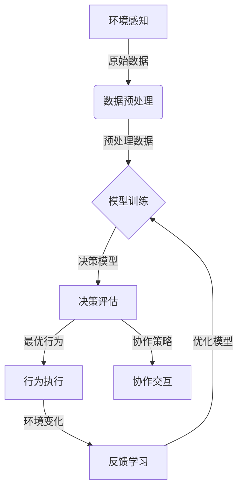

# AI人工智能代理工作流AI Agent WorkFlow：AI代理在物联网场景的应用

## 1. 背景介绍

### 1.1 问题的由来

随着物联网(IoT)技术的快速发展,越来越多的设备和系统被连接到互联网上。这些设备产生的海量数据需要被高效地处理和利用。然而,传统的集中式处理方式已经无法满足物联网场景下的实时性、可扩展性和隐私保护等需求。因此,需要一种新的分布式智能系统来解决这些挑战。

### 1.2 研究现状

近年来,人工智能(AI)代理技术作为一种新兴的分布式智能系统,受到了广泛关注。AI代理是一种具有自主性、响应性和主动性的软件实体,可以根据环境的变化做出智能决策和行为。AI代理可以部署在边缘设备上,实现数据的本地处理和决策,从而减轻了中央服务器的压力,提高了系统的响应速度和隐私保护能力。

### 1.3 研究意义

AI代理在物联网场景中的应用具有重要意义:

1. **实时响应**:AI代理可以在本地设备上进行实时数据处理和决策,避免了数据传输延迟,提高了系统的响应速度。
2. **隐私保护**:AI代理可以在本地设备上处理敏感数据,减少了数据传输过程中的隐私泄露风险。
3. **可扩展性**:AI代理可以在分布式环境中协同工作,实现系统的高度可扩展性。
4. **智能决策**:AI代理可以基于机器学习算法进行智能决策,提高了系统的自适应能力和决策质量。

### 1.4 本文结构

本文将全面介绍AI代理在物联网场景中的应用,包括以下几个方面:

1. AI代理的核心概念和工作原理
2. AI代理工作流中的关键算法和数学模型
3. AI代理在物联网场景中的实际应用案例
4. AI代理的未来发展趋势和挑战

## 2. 核心概念与联系

在介绍AI代理工作流之前,我们需要先了解一些核心概念:

1. **智能代理(Intelligent Agent)**:智能代理是一种具有自主性、响应性和主动性的软件实体,可以感知环境、处理信息、做出决策并执行相应的行为。

2. **多智能体系统(Multi-Agent System, MAS)**:多智能体系统是由多个智能代理组成的分布式系统,这些代理可以相互协作或竞争,共同完成复杂的任务。

3. **物联网(Internet of Things, IoT)**:物联网是一种将各种物理设备(如传感器、执行器等)连接到互联网的技术,实现了物物相连和人机交互。

4. **边缘计算(Edge Computing)**:边缘计算是一种将计算资源和数据处理能力部署在网络边缘的技术,可以减轻中央服务器的压力,提高系统的响应速度和隐私保护能力。

AI代理工作流是将AI代理技术应用于物联网场景的一种解决方案。在这种工作流中,AI代理被部署在边缘设备上,负责收集和处理本地数据,并基于机器学习算法做出智能决策。多个AI代理可以通过协作或竞争的方式,共同完成复杂的任务。

AI代理工作流的核心优势在于:

1. **分布式处理**:通过将AI代理部署在边缘设备上,可以实现数据的本地处理,减轻中央服务器的压力。
2. **实时响应**:AI代理可以在本地设备上进行实时数据处理和决策,提高系统的响应速度。
3. **隐私保护**:敏感数据可以在本地设备上进行处理,减少了数据传输过程中的隐私泄露风险。
4. **智能决策**:AI代理可以基于机器学习算法进行智能决策,提高了系统的自适应能力和决策质量。
5. **可扩展性**:多个AI代理可以通过协作或竞争的方式,共同完成复杂的任务,实现系统的高度可扩展性。

## 3. 核心算法原理 & 具体操作步骤

### 3.1 算法原理概述

AI代理工作流中的核心算法主要包括以下几个方面:

1. **环境感知算法**:用于从物联网设备中获取数据,并对数据进行预处理和特征提取。
2. **机器学习算法**:用于训练AI代理的决策模型,包括监督学习、非监督学习和强化学习等算法。
3. **决策算法**:根据训练好的决策模型,对当前环境状态进行评估,并选择最优的行为。
4. **协作算法**:多个AI代理之间的协作策略,包括任务分配、信息共享和行为协调等。

这些算法相互配合,构成了AI代理工作流的核心算法框架。

### 3.2 算法步骤详解

AI代理工作流的具体算法步骤如下:

1. **环境感知**:AI代理从物联网设备中获取原始数据,如传感器数据、图像数据、语音数据等。然后对这些数据进行预处理,如去噪、标准化、特征提取等。

2. **模型训练**:使用预处理后的数据,基于机器学习算法(如深度学习、决策树等)训练AI代理的决策模型。这个过程可以是监督学习、非监督学习或强化学习。

3. **决策评估**:AI代理根据当前环境状态和训练好的决策模型,评估各种可能的行为,并选择最优的行为。

4. **行为执行**:AI代理执行选定的行为,如控制执行器、发送指令等。

5. **反馈学习**:AI代理观察行为执行后的环境变化,并将这些反馈数据用于模型的持续优化和学习。

6. **协作交互**:如果存在多个AI代理,它们可以通过协作算法进行任务分配、信息共享和行为协调,以完成更复杂的任务。

这个过程是一个循环的过程,AI代理不断地感知环境、学习决策模型、执行行为,并根据反馈进行持续优化。

### 3.3 算法优缺点

AI代理工作流算法的优点包括:

1. **分布式处理**:通过将AI代理部署在边缘设备上,可以实现数据的本地处理,减轻中央服务器的压力。
2. **实时响应**:AI代理可以在本地设备上进行实时数据处理和决策,提高系统的响应速度。
3. **隐私保护**:敏感数据可以在本地设备上进行处理,减少了数据传输过程中的隐私泄露风险。
4. **智能决策**:AI代理可以基于机器学习算法进行智能决策,提高了系统的自适应能力和决策质量。
5. **可扩展性**:多个AI代理可以通过协作或竞争的方式,共同完成复杂的任务,实现系统的高度可扩展性。

缺点包括:

1. **计算资源限制**:边缘设备通常计算资源有限,可能无法支持复杂的机器学习模型和算法。
2. **数据质量问题**:边缘设备收集的数据可能存在噪声、缺失或偏差,影响模型的训练效果。
3. **安全隐患**:分布式系统中的数据传输和协作过程可能存在安全隐患,需要采取有效的加密和认证措施。
4. **算法复杂度**:协作算法和决策算法的复杂度较高,需要精心设计和优化。

### 3.4 算法应用领域

AI代理工作流算法可以应用于多个物联网场景,包括但不限于:

1. **智能家居**:AI代理可以控制家中的各种设备,如照明、空调、安防等,实现智能化管理。
2. **智能城市**:AI代理可以用于交通管理、环境监测、能源优化等城市运营领域。
3. **智能制造**:AI代理可以优化工厂的生产流程,提高效率和产品质量。
4. **智能农业**:AI代理可以监测农田环境,优化灌溉和施肥策略。
5. **智能医疗**:AI代理可以用于远程监控患者状况,提供智能化诊断和治疗建议。

## 4. 数学模型和公式 & 详细讲解 & 举例说明

在AI代理工作流中,常见的数学模型和公式包括:

### 4.1 数学模型构建

1. **马尔可夫决策过程(Markov Decision Process, MDP)**

马尔可夫决策过程是一种描述决策过程的数学模型,常用于强化学习算法中。它由以下几个要素组成:

- 状态集合 $S$
- 行为集合 $A$
- 转移概率 $P(s'|s,a)$,表示在状态 $s$ 下执行行为 $a$ 后,转移到状态 $s'$ 的概率
- 奖励函数 $R(s,a,s')$,表示在状态 $s$ 下执行行为 $a$ 后,转移到状态 $s'$ 的即时奖励

目标是找到一个策略 $\pi$,使得期望累积奖励最大化:

$$\max_\pi \mathbb{E}\left[\sum_{t=0}^\infty \gamma^t R(s_t,a_t,s_{t+1})\right]$$

其中 $\gamma \in [0,1]$ 是折现因子,用于权衡即时奖励和长期奖励的重要性。

2. **多智能体马尔可夫游戏(Multi-Agent Markov Game)**

多智能体马尔可夫游戏是马尔可夫决策过程的扩展,用于描述多个智能体之间的互动过程。它由以下要素组成:

- 状态集合 $S$
- 行为集合 $A_1, A_2, \ldots, A_n$,分别对应 $n$ 个智能体
- 转移概率 $P(s'|s,a_1,a_2,\ldots,a_n)$,表示在状态 $s$ 下,各个智能体执行行为 $a_1,a_2,\ldots,a_n$ 后,转移到状态 $s'$ 的概率
- 奖励函数 $R_i(s,a_1,a_2,\ldots,a_n,s')$,表示第 $i$ 个智能体在状态 $s$ 下,各个智能体执行行为 $a_1,a_2,\ldots,a_n$ 后,转移到状态 $s'$ 的即时奖励

目标是找到一个策略组合 $\pi_1,\pi_2,\ldots,\pi_n$,使得每个智能体的期望累积奖励最大化。

### 4.2 公式推导过程

1. **Q-Learning算法**

Q-Learning是一种常见的强化学习算法,用于求解马尔可夫决策过程中的最优策略。它的核心思想是通过不断更新状态-行为值函数 $Q(s,a)$,逼近最优的 $Q^*(s,a)$。

$Q(s,a)$ 表示在状态 $s$ 下执行行为 $a$,之后能获得的期望累积奖励。更新公式如下:

$$Q(s_t,a_t) \leftarrow Q(s_t,a_t) + \alpha \left[ r_t + \gamma \max_{a'} Q(s_{t+1},a') - Q(s_t,a_t) \right]$$

其中 $\alpha$ 是学习率, $\gamma$ 是折现因子, $r_t$ 是即时奖励, $\max_{a'} Q(s_{t+1},a')$ 是下一状态下的最大期望累积奖励。

通过不断更新 $Q(s,a)$,最终可以收敛到最优的 $Q^*(s,a)$,从而得到最优策略 $\pi^*(s) = \arg\max_a Q^*(s,a)$。

2. **协作Q-Learning算法**

协作Q-Learning是一种用于求解多智能体马尔可夫游戏中最优策略组合的算法。它的核心思想是将每个智能体的状态-行为值函数 $