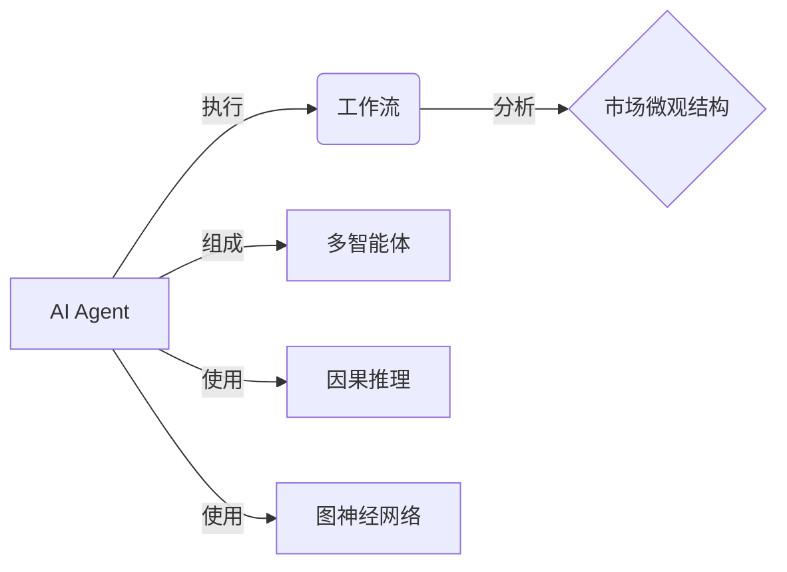

# AI人工智能代理工作流AI Agent WorkFlow：AI代理在股市分析的应用

关键词：AI代理、工作流、股市分析、机器学习、深度学习、强化学习、知识图谱、自然语言处理

## 1. 背景介绍
### 1.1  问题的由来
随着人工智能技术的飞速发展,AI已经开始在金融领域得到广泛应用。特别是在股票市场分析和预测方面,AI技术展现出了巨大的潜力。传统的股市分析主要依赖人工,存在效率低下、主观性强等问题。利用AI技术,可以快速处理海量金融数据,挖掘隐藏在数据背后的规律和趋势,为投资者提供更加精准、客观的决策支持。

### 1.2  研究现状 
目前,国内外已有不少学者开始研究AI在股市分析中的应用。一些研究利用机器学习算法如SVM、随机森林等对股票走势进行预测[1]；也有研究尝试使用深度学习模型如LSTM、GRU等对股票价格进行建模[2]；还有学者将强化学习与股票交易相结合,让AI通过模拟交易来学习最优投资策略[3]。此外,知识图谱、情感分析等技术也被引入到股市分析中,以期获得更全面的市场洞见[4]。

### 1.3  研究意义
将AI Agent工作流应用到股市分析领域,有望显著提升分析效率和精度,为投资者节省时间和精力。通过构建端到端的AI分析系统,实现金融数据的自动化处理、建模预测、策略优化、决策支持等功能,使得整个投资分析流程更加智能化。同时AI Agent能够7x24小时不间断运行,大大扩展了分析的时间和空间尺度。研究成果不仅能够为量化投资机构所用,也可以惠及广大个人投资者,具有重要的理论意义和实用价值。

### 1.4  本文结构
本文将重点介绍一种基于AI Agent工作流的股市分析方法。第2部分阐述了若干核心概念,包括AI Agent、工作流、市场微观结构等。第3部分详细讲解了该方法的核心算法原理和具体操作步骤。第4部分建立了相应的数学模型,并给出公式推导和案例分析。第5部分提供了一个项目实践,展示核心代码实现和效果演示。第6部分论述了该方法的实际应用场景和未来发展潜力。第7部分推荐了一些有用的工具和学习资源。第8部分对全文进行了总结,并对未来的研究方向进行了展望。

## 2. 核心概念与联系
- AI Agent:能够感知环境,并据此行动的人工智能系统,具有自主性和社会性。本文的AI Agent专指用于股市分析的智能体。
- 工作流:由一系列任务组成的业务流程。将 AI 分析功能组织成工作流,可以提高分析效率和质量。
- 市场微观结构:指市场参与者、交易机制、信息流等市场运行的微观层面。了解市场微观结构有助于设计更有效的交易策略。
- 多智能体:由多个 AI Agent 协同完成复杂任务的系统。在分析系统中引入多个 Agent,能够实现功能解耦和并行处理。
- 因果推理:通过分析事件之间的因果关系,对未来做出预测。本文利用因果推理来预测股价变化。
- 图神经网络:一种处理图结构数据的深度学习模型。使用图神经网络可以建模股票市场中的复杂关系。

这些概念之间的关系如下:

## 3. 核心算法原理 & 具体操作步骤
### 3.1 算法原理概述
本文采用的核心算法包括:
1. 数据预处理:使用 Pandas 对原始金融数据进行清洗、对齐、归一化等操作,为后续建模做好准备。 
2. 特征工程:从原始数据中构建高阶交易特征如价格动量、波动率、交易量等,刻画股票的多维属性。
3. 关系挖掘:通过相关性分析、因果推断等方法,发掘不同股票、行业之间的内在联系,构建市场关系图谱。
4. 图神经网络:使用图卷积等操作聚合节点信息,对图结构数据进行表征学习,挖掘深层交互模式。  
5. 时间序列预测:将股票视为时间序列,使用 LSTM、GRU 等模型对未来价格走势进行建模预测。
6. 强化学习:通过构建交易模拟环境,使用 DQN、PPO 等强化学习算法让 AI Agent 学习最优交易策略。
7. 多智能体协作:设计多个 Agent 分别负责数据处理、建模、交易等任务,通过通信协议实现分布式协同。

### 3.2 算法步骤详解
下面详细描述算法的执行步骤:
1. 数据采集:从 Tushare 等平台获取股票历史行情、财务、新闻等结构化和非结构化数据。
2. 数据预处理:
   - 缺失值填充:对缺失数据进行插值、删除或填充默认值。
   - 时间对齐:将不同来源、频率的数据对齐到统一的时间轴上。
   - 去极值:剔除异常值点,避免对模型产生干扰。
   - 归一化:将数据缩放到统一尺度,如 0-1 范围。
3. 特征工程:
   - 基本面特征:如市盈率、市净率、每股收益等。
   - 技术面特征:如 MACD、RSI、KDJ 等技术指标。
   - 情感特征:从新闻文本中提取情感倾向性分数。
   - 常见特征如下:
     - 收益率:反映股票盈利能力
     - 成交量:体现市场人气
     - 波动率:刻画股价波动风险
     - 换手率:反映股票流动性
   - 特征选择:使用方差分析、随机森林等方法挑选出信息量大的特征子集。
4. 关系挖掘:
   - 相关性分析:计算不同股票、行业的收益率相关系数矩阵。
   - 因果推断:使用 Granger 因果检验等方法判断不同金融事件之间的因果关系。
   - 知识图谱构建:将股票、概念、行业等实体以及它们之间的多种关系构建成异构图谱。
5. 图神经网络建模:
   - 节点表征:使用 Node2Vec 等方法学习节点的低维嵌入向量。
   - 图卷积:通过聚合节点邻居信息,提取高阶交互特征。
   - 图注意力:通过注意力机制自动学习不同邻居的重要性权重。
6. 时间序列预测:
   - 时间序列分解:将股价序列分解为长期趋势、季节性、随机噪声等成分。
   - 序列建模:使用 LSTM、GRU 等模型刻画股价的时间依赖关系,预测未来走势。
   - 多步预测:通过滚动预测的方式,对未来 n 个时间步的股价进行预测。
7. 强化学习交易:
   - 构建交易环境:模拟买卖股票的交易过程,计算收益率、夏普比率等回报指标。
   - 设计 Agent:使用 Policy Gradient、Actor-Critic 等模型学习最优交易策略。
   - 回测验证:使用历史数据对策略进行回测,评估其有效性和稳定性。
8. 多智能体协作:
   - 任务分解:将股市分析任务划分为数据、建模、交易等多个子任务。
   - Agent 设计:针对每个子任务设计专门的 Agent,赋予其明确的目标和权限。
   - 通信协议:设计 Agent 之间的通信协议,实现信息共享和行为协同。
   - 整体优化:设计多 Agent 系统的全局目标函数,如夏普比率最大化等。

### 3.3 算法优缺点
优点:
- 全面:涵盖了数据处理、建模、交易等各个环节,提供端到端的解决方案。
- 精准:融合了多源异构数据,从基本面、技术面、舆情面等角度入手建模,全景刻画股市运行规律。
- 高效:将复杂任务划分给多个 Agent 并行处理,充分发挥分布式计算的优势,大幅提升分析效率。
- 灵活:可以根据需求添加或删除 Agent,灵活扩展系统功能。

缺点:
- 复杂:涉及数据采集、存储、清洗、建模、部署等多个流程,系统复杂度高,实现难度大。
- 难调参:多智能体系统参数众多,涉及神经网络、强化学习等多种模型,调参难度大。
- 泛化性:股市行情瞬息万变,模型在未知市场环境中的泛化能力有待验证。
- 解释性:基于深度学习的 AI 模型通常是黑盒子,决策缺乏可解释性。

### 3.4 算法应用领域
- 量化投资:AI Agent 可作为自动化交易系统,根据市场信号进行策略交易。
- 风险管理:通过对股市风险因子进行建模刻画,AI 可以预警市场风险事件。
- 投顾服务:利用 AI 算法为投资者提供智能投顾服务,如个性化组合、风险评估等。
- 舆情监控:分析海量网络舆情数据,AI 可以实时监控市场动向,助力投资决策。

## 4. 数学模型和公式 & 详细讲解 & 举例说明
### 4.1 数学模型构建
为刻画股票价格的动态变化规律,我们构建如下数学模型:
$$
P_t = P_{t-1} + f(X_t) + \epsilon_t
$$
其中,$P_t$为 t 时刻股票价格,$X_t$为影响价格的特征向量,包含基本面、技术面等特征,$f$为待学习的价格变化函数,$\epsilon_t$为随机噪声项。我们的目标是通过学习历史数据,拟合出函数$f$,并用其对未来价格进行预测。

### 4.2 公式推导过程
对于函数$f$的形式,我们采用 LSTM 网络进行建模。LSTM 的前向传播公式如下:
$$
\begin{aligned}
f_t &= \sigma(W_f\cdot[h_{t-1},x_t] + b_f) \\
i_t &= \sigma(W_i\cdot[h_{t-1},x_t] + b_i) \\
o_t &= \sigma(W_o\cdot[h_{t-1},x_t] + b_o) \\
\tilde{C}_t &= tanh(W_C\cdot[h_{t-1},x_t] + b_C) \\
C_t &= f_t*C_{t-1} + i_t*\tilde{C}_t \\
h_t &= o_t*tanh(C_t)
\end{aligned}
$$
其中,$f_t,i_t,o_t$分别为遗忘门、输入门、输出门,$C_t$为记忆细胞,$W,b$为待学习参数。通过将$x_t$赋值为股票特征向量序列,即可学习到价格变化函数$f$。

在此基础上,我们加入注意力机制,对不同时间步的重要性进行自适应加权:
$$
\begin{aligned}
u_{t,i} &= tanh(W_w h_i + b_w) \\  
\alpha_{t,i} &= \frac{exp(u_{t,i}^\top u_w)}{\sum_j exp(u_{t,j}^\top u_w)} \\
s_t &= \sum_i \alpha_{t,i} h_i
\end{aligned}
$$
其中,$\alpha_{t,i}$为 t 时刻对 i 时刻的注意力权重,$s_t$为 t 时刻的注意力向量。将$s_t$作为时间序列模型的输入,可以更好地捕捉时间依赖关系。

### 4.3 案例分析与讲解
下面以某支股票为例,展示模型的预测效果。假