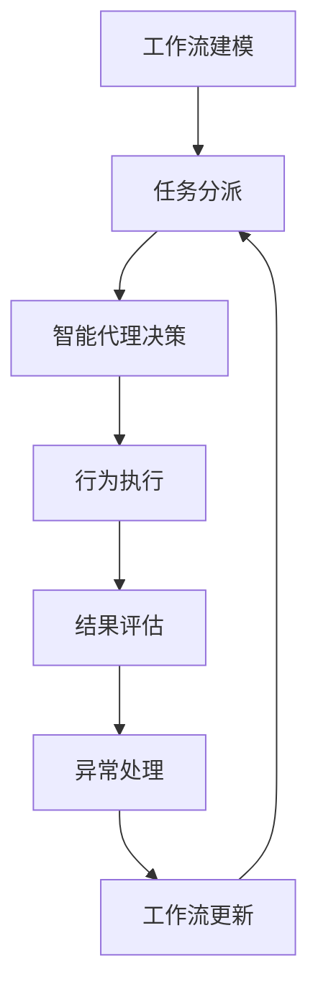

# AI人工智能代理工作流AI Agent WorkFlow：在健康医疗领域部署智能代理

## 1. 背景介绍

### 1.1 问题的由来

随着人工智能技术的飞速发展，智能代理系统在各个领域都有着广泛的应用前景。健康医疗领域作为一个关乎人类生命健康的重要领域,对智能代理系统的需求与日俱增。传统的医疗服务模式存在诸多痛点,如医患信息不对称、就医流程繁琐、医疗资源分布不均等,这些问题严重影响了医疗服务的质量和效率。

因此,将人工智能技术应用于医疗健康领域,开发智能代理系统来优化医疗服务流程、提高医疗资源利用率、增强医患互动体验,成为了当前的一个重要课题。

### 1.2 研究现状  

目前,在医疗健康领域已经有不少智能代理系统的应用案例,主要集中在以下几个方面:

1. 智能医疗助理
   - 如苹果的Siri、亚马逊的Alexa等,可以为用户提供基本的医疗健康咨询服务。

2. 智能影像辅助诊断
   - 利用深度学习等技术对医学影像数据进行分析,为医生提供辅助诊断建议。

3. 智能药物开发
   - 应用人工智能算法加速新药研发过程,优化分子结构设计。

4. 智能医疗机器人
   - 如手术机器人、护理机器人等,能够执行精准的手术操作或提供智能化的护理服务。

5. 智能健康监测
   - 基于可穿戴设备、物联网等技术,实现对个人健康数据的实时监测和分析。

虽然取得了一些进展,但现有的智能代理系统在医疗健康领域的应用还存在一些不足,比如缺乏端到端的工作流程支持、无法与现有医疗信息系统充分整合、对复杂场景的适应性不强等。因此,需要设计一种新的智能代理工作流框架,来更好地支撑医疗健康领域的智能化应用。

### 1.3 研究意义

设计并实现一种面向医疗健康领域的智能代理工作流框架,具有重要的理论意义和应用价值:

- 理论意义
  - 将人工智能、工作流技术与医疗健康领域相结合,是一个前沿的交叉研究课题。
  - 研究智能代理在复杂应用场景中的工作流程管理,可以推动人工智能技术的发展。
  - 探索智能代理与人类的协作模式,为未来智能系统的设计提供借鉴。

- 应用价值
  - 提高医疗服务的质量和效率,优化就医体验。
  - 促进医疗资源的合理分配和高效利用。  
  - 为医疗机构的智能化转型提供技术支撑。
  - 推动健康医疗行业的数字化、智能化进程。

### 1.4 本文结构  

本文将围绕"AI人工智能代理工作流"在健康医疗领域的应用展开讨论,具体内容安排如下:

- 第2部分介绍智能代理工作流的核心概念及其在医疗领域的应用需求。
- 第3部分阐述智能代理工作流的核心算法原理和具体实现步骤。
- 第4部分构建相关的数学模型,并给出公式推导和案例分析。
- 第5部分提供一个基于开源框架的项目实践,包括代码实现和运行效果。
- 第6部分探讨智能代理工作流在医疗领域的实际应用场景。
- 第7部分推荐相关的学习资源、开发工具和研究论文。
- 第8部分总结研究成果,并展望未来的发展趋势和挑战。
- 第9部分列出常见问题及解答,以便读者更好地理解和掌握相关内容。

## 2. 核心概念与联系

智能代理工作流(Intelligent Agent Workflow)是将人工智能技术与工作流管理相结合的一种新型系统架构。其核心思想是:

1. 将传统的工作流中的任务节点替换为智能代理。
2. 智能代理通过机器学习等AI技术实现自主决策和行为。
3. 智能代理之间通过工作流引擎协同完成复杂的业务流程。

在这个架构中,智能代理扮演着执行任务的主体角色,而工作流引擎负责调度和协调各个智能代理之间的执行顺序和转移条件,最终实现端到端的自动化流程。

将这一概念应用到医疗健康领域,可以构建出一种全新的智能化医疗服务模式。其中,智能代理可以承担诸如病历分析、治疗方案制定、手术执行、药物管理、患者随访等不同的医疗任务。通过工作流的协调,这些智能代理可以协同完成从就诊、诊断、治疗到康复的全流程,为患者提供连续且个性化的智能医疗服务。

智能代理工作流架构与传统的医疗信息系统相比,具有以下几个关键优势:

1. 高度智能化和自动化,减轻医务人员的工作负担。
2. 端到端的流程支持,确保医疗服务的连续性和一致性。 
3. 基于数据驱动的决策,提高医疗质量和准确性。
4. 灵活可扩展,能够适应复杂多变的医疗场景。
5. 与现有系统良好集成,实现平滑过渡和升级。

因此,智能代理工作流有望成为医疗健康领域实现智能化转型的关键技术路线。

## 3. 核心算法原理与具体操作步骤  

### 3.1 算法原理概述

智能代理工作流系统的核心算法主要包括两个部分:工作流引擎算法和智能代理决策算法。

**工作流引擎算法**负责管理和调度整个工作流的执行过程,包括:

1. 工作流建模
2. 任务分派与调度  
3. 异常处理与恢复

**智能代理决策算法**赋予每个智能代理自主学习和决策的能力,包括:

1. 领域知识学习
2. 规划与决策
3. 行为执行与反馈

两部分算法相互配合,构成了智能代理工作流系统的"大脑"和"肌肉"。其中,工作流引擎扮演着"大脑"的角色,负责制定总体流程和战略;而智能代理则相当于"肌肉",执行具体的任务操作。

### 3.2 算法步骤详解  

智能代理工作流系统的整体算法流程如下:

1. **工作流建模**
   - 根据特定的医疗场景,构建对应的工作流模型。
   - 将端到端的医疗服务流程拆分为多个可执行的任务节点。
   - 为每个任务节点分配合适的智能代理类型。
   - 设置任务节点之间的依赖关系和转移条件。

2. **任务分派与调度**
   - 工作流引擎根据模型,动态地为每个任务节点分配可用的智能代理实例。
   - 考虑智能代理的计算资源、专业领域、历史表现等因素进行调度。
   - 将任务的输入数据传递给被分派的智能代理。

3. **智能代理决策**
   - 智能代理获取领域知识和历史数据,通过机器学习算法进行知识建模。  
   - 基于知识模型和当前任务输入,运用规划算法生成候选方案。
   - 通过决策算法(如强化学习)评估不同方案,选择最优行为方案。

4. **行为执行与反馈**
   - 智能代理执行选定的行为方案,产生对应的输出结果。
   - 将结果反馈给工作流引擎,作为下一步任务的输入数据。
   - 同时将执行过程的数据记录存储,用于知识库更新和模型优化。

5. **结果评估与反馈**
   - 工作流引擎对任务的最终输出结果进行评估。
   - 将评估反馈给相关的智能代理,用于提高其决策能力。
   - 如果结果不满意,可以触发异常处理流程。

6. **异常处理与恢复**  
   - 对异常情况进行分析,判断异常原因和严重程度。
   - 根据异常类型执行不同的处理策略,如重新调度、人工干预等。
   - 必要时终止当前工作流,并根据记录的上下文数据进行中断恢复。

7. **工作流更新与优化**
   - 根据工作流的执行过程,持续优化工作流模型和参数。
   - 对智能代理的知识库和决策模型也进行在线更新。  
   - 形成闭环的自适应学习过程,不断提高系统的智能水平。

通过以上步骤,智能代理工作流系统可以动态地组织和管理智能代理的协作,实现高度智能化和自动化的医疗服务流程。

### 3.3 算法优缺点

**优点**:

1. 高度智能化和自动化,大幅提高医疗服务效率。
2. 端到端的流程支持,确保医疗服务质量和一致性。
3. 基于数据驱动决策,提高诊疗的准确性和科学性。
4. 具备自适应学习能力,可以持续优化和升级。
5. 工作流架构使系统具有良好的灵活性和扩展性。

**缺点**:

1. 算法复杂度较高,需要大量的计算资源。
2. 训练智能代理的知识库和模型需要大量高质量数据。
3. 不同领域的知识融合存在一定的技术挑战。
4. 存在一定的"黑盒"风险,决策过程缺乏透明度。
5. 需要解决与人类专家之间的协作和权责分工问题。

### 3.4 算法应用领域

智能代理工作流技术可以广泛应用于医疗健康领域的多个环节,包括但不限于:

1. **智能辅助诊断**
   - 利用影像分析、病历分析等技术,为医生提供辅助诊断建议。

2. **智能治疗方案制定**
   - 根据患者情况,自动生成个性化、循证的治疗方案。

3. **智能手术规划与导航**
   - 为手术医生提供术前规划、术中导航等智能辅助。

4. **智能药物管理**
   - 优化患者的用药方案,实现精准给药,减少不良反应。

5. **智能病况监测与随访**
   - 持续跟踪患者的康复状况,提供个性化的随访方案。

6. **智能健康管理**
   - 为普通人群提供健康风险评估、生活方式干预等服务。

7. **智能医疗质量控制**  
   - 监控医疗流程,发现潜在的医疗差错和风险点。

通过以上应用,智能代理工作流技术可以全方位地提升医疗服务的质量、效率和体验,促进医疗资源的优化配置,为实现"精准医疗"奠定基础。

## 4. 数学模型和公式详细讲解举例说明

### 4.1 数学模型构建

在智能代理工作流系统中,需要构建数学模型来描述和求解以下几个关键问题:

1. **工作流建模**
   - 使用网络模型(如Petri网)对医疗服务流程进行形式化描述。

2. **任务调度**
   - 将任务调度问题建模为资源约束的项目调度问题(RCPSP)。

3. **智能代理决策**
   - 使用马尔可夫决策过程(MDP)对智能代理的决策过程进行建模。
   - 将决策问题转化为最优控制问题,使用强化学习等方法求解。

4. **异常处理**
   - 使用统计模型(如高斯混合模型)对异常模式进行识别和分类。
   - 将异常处理建模为约束优