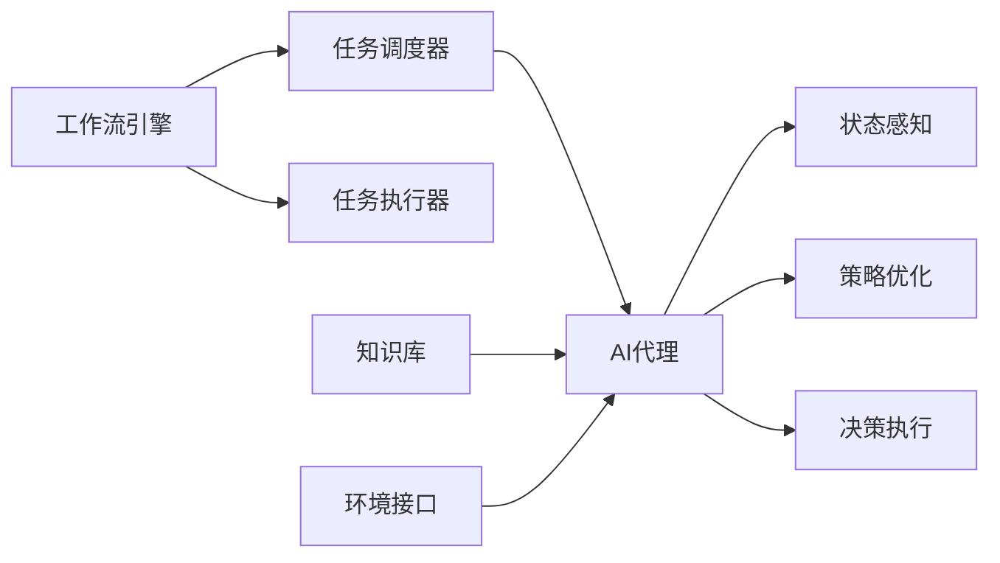

# AI人工智能代理工作流AI Agent WorkFlow：自适应工作流的AI代理调度策略

关键词：人工智能代理、工作流、自适应、调度策略、多智能体系统、强化学习、深度学习、知识图谱、任务分配、资源优化

## 1. 背景介绍

### 1.1 问题的由来

随着人工智能技术的飞速发展,越来越多的企业开始将AI应用于业务流程的自动化和优化。传统的工作流管理系统在面对复杂多变的业务场景时,往往缺乏灵活性和适应性。如何利用AI技术赋能工作流管理,实现智能化、自适应的任务调度和资源分配,成为了一个亟待解决的问题。

### 1.2 研究现状

目前,国内外已有不少学者开展了AI驱动的工作流管理研究。比如,麻省理工学院的研究者提出了一种基于强化学习的自适应工作流调度框架ADAPS[1],可以根据任务的优先级、资源的可用性等因素动态调整任务的执行顺序和资源分配。微软亚洲研究院的学者则探索了将知识图谱与工作流相结合的方法[2],利用领域知识辅助工作流的优化决策。但总的来说,将AI代理应用于工作流调度优化的研究还处于起步阶段,在建模方法、算法设计、系统实现等方面都有待进一步深入。

### 1.3 研究意义 

AI代理驱动的自适应工作流调度,有望在提升企业运营效率、降低人力成本、应对业务变化等方面发挥重要作用。一方面,引入AI代理可以减少人工干预,提高工作流执行的自动化程度；另一方面,自适应调度机制能够根据实时的业务状况和外部环境变化,动态优化资源配置,提升工作流的灵活性和鲁棒性。此外,AI驱动的工作流管理系统还可以不断从历史数据中学习,持续优化调度策略。总之,这一研究方向具有广阔的应用前景和理论意义。

### 1.4 本文结构

本文将重点探讨如何设计和实现一种基于AI代理的自适应工作流调度策略。第2部分介绍相关的核心概念；第3部分详细阐述AI代理调度的核心算法原理和操作步骤；第4部分建立AI代理调度的数学模型,并给出公式推导过程；第5部分展示一个简单的代码实现示例；第6部分分析AI代理调度在实际场景中的应用价值；第7部分推荐一些相关的学习资源和开发工具；第8部分总结全文,并展望未来的研究方向。

## 2. 核心概念与联系

在探讨AI代理工作流调度之前,我们有必要厘清几个核心概念：

- **工作流(Workflow)**：由一系列按照一定规则和顺序执行的任务组成的业务流程。工作流管理系统负责协调各个任务的执行,优化资源利用率。
- **AI代理(AI Agent)**：能够感知环境状态,根据一定的决策逻辑自主采取行动,并通过不断与环境交互来优化决策的智能体。常见的AI代理包括规则引擎、搜索算法、机器学习模型等。
- **自适应调度(Adaptive Scheduling)**：一种动态的任务调度机制,能够根据系统的实时状态和外部环境的变化,自主调整任务的优先级、执行顺序和资源分配,从而优化系统性能。
- **多智能体系统(Multi-Agent System,MAS)**：由多个AI代理组成的分布式智能系统。各个代理之间通过协作与竞争,共同完成复杂的任务,实现全局优化。

下图展示了一个典型的AI代理驱动的自适应工作流调度系统的架构。其中,工作流引擎负责任务的调度和执行；AI代理负责感知系统状态,优化调度策略；知识库提供领域知识和规则支持；环境接口负责与外部系统的交互。

## 3. 核心算法原理 & 具体操作步骤

### 3.1 算法原理概述

本文提出的AI代理工作流调度算法,核心思想是将工作流调度问题建模为一个马尔可夫决策过程(Markov Decision Process,MDP),并使用强化学习(Reinforcement Learning,RL)的方法来求解最优调度策略。

具体来说,我们将工作流的状态定义为各个任务的完成情况以及当前的资源使用情况；将AI代理的动作定义为对任务优先级、执行顺序、资源分配的调整；将奖励函数定义为工作流的整体执行效率和资源利用率。AI代理的目标就是通过不断尝试不同的调度策略,最大化累积奖励,从而找到最优的调度方案。

### 3.2 算法步骤详解

1. **状态空间定义**：设计一个状态特征向量,表示工作流的实时状态,包括各个任务的完成进度、资源的使用情况等。

2. **动作空间定义**：设计一组可供AI代理选择的原子调度动作,例如提高/降低某个任务的优先级,调整任务的执行顺序,增加/减少某个任务的资源分配等。

3. **奖励函数定义**：设计一个奖励函数,用于评估一个调度决策的效果。可以综合考虑任务完成时间、资源利用率、任务优先级满足度等多个因素。

4. **策略网络设计**：使用深度神经网络来拟合策略函数,将状态特征作为输入,输出每个动作的概率分布。可以使用主流的深度学习框架如TensorFlow、PyTorch等来搭建策略网络。

5. **训练过程**：使用强化学习算法如REINFORCE、Actor-Critic等,通过不断与工作流环境交互,生成大量的状态-动作-奖励数据,并用这些数据来训练策略网络,使其收敛到最优策略。

6. **执行过程**：当工作流调度系统接收到一个新的任务请求时,将当前的状态特征输入到已训练好的策略网络,得到一个调度动作的概率分布,选择概率最大的动作来执行调度。

7. **在线更新**：在工作流执行的过程中,持续收集新的状态-动作-奖励数据,定期对策略网络进行增量训练,使其能够适应工作流的动态变化。

### 3.3 算法优缺点

优点：
- 能够根据工作流的实时状态和历史数据,自主学习和优化调度策略,具有较强的自适应能力。
- 通过端到端的深度学习方法,可以挖掘调度过程中的隐含模式和关联关系,得到比人工设计更优的策略。
- 借助强化学习的探索机制,能够在一定程度上避免调度决策陷入局部最优。

缺点：
- 算法的训练过程需要大量的时间和计算资源,对于复杂的工作流,收敛速度可能较慢。  
- 神经网络模型的可解释性较差,无法直观地解释每个调度决策背后的逻辑。
- 面对工作流环境的剧烈变化,已训练好的模型可能难以快速适应,需要重新训练。

### 3.4 算法应用领域

本文提出的AI代理工作流调度算法,可以应用于以下几个领域：

- **企业业务流程管理**：用于优化企业内部的各种业务流程,如采购、生产、销售、财务等,提高业务效率和资源利用率。
- **科学工作流管理**：用于管理和调度科学计算、数据分析等领域的复杂工作流,加速科研进程。
- **云计算任务调度**：用于优化云计算平台上的各类任务和资源的调度,提高系统吞吐量和性价比。
- **物联网应用编排**：用于协调物联网设备之间的任务协同和数据流转,实现智能化的业务编排。

## 4. 数学模型和公式 & 详细讲解 & 举例说明

### 4.1 数学模型构建

我们使用马尔可夫决策过程(MDP)来对AI代理工作流调度问题进行建模。一个MDP由以下元素组成：

- 状态空间 $\mathcal{S}$：表示工作流的所有可能状态的集合。
- 动作空间 $\mathcal{A}$：表示AI代理可以采取的所有调度动作的集合。
- 状态转移概率 $\mathcal{P}(s'|s,a)$：表示在状态 $s$ 下采取动作 $a$ 后,转移到状态 $s'$ 的概率。
- 奖励函数 $\mathcal{R}(s,a)$：表示在状态 $s$ 下采取动作 $a$ 后,获得的即时奖励。
- 折扣因子 $\gamma$：表示对未来奖励的衰减程度,取值范围为 $[0,1]$。

MDP的目标是寻找一个最优策略 $\pi^*$,使得从任意初始状态出发,采取该策略后获得的期望累积奖励最大化：

$$
\pi^* = \arg\max_{\pi} \mathbb{E}\left[ \sum_{t=0}^{\infty} \gamma^t \mathcal{R}(s_t,a_t) | \pi \right]
$$

其中, $s_t$ 和 $a_t$ 分别表示 $t$ 时刻的状态和动作。

### 4.2 公式推导过程

为了求解最优策略 $\pi^*$,我们引入价值函数 $V^{\pi}(s)$ 和动作价值函数 $Q^{\pi}(s,a)$ 的概念。

**价值函数** $V^{\pi}(s)$ 表示从状态 $s$ 开始,一直执行策略 $\pi$ 的期望累积奖励：

$$
V^{\pi}(s) = \mathbb{E}\left[ \sum_{t=0}^{\infty} \gamma^t \mathcal{R}(s_t,a_t) | s_0=s, \pi \right]
$$

**动作价值函数** $Q^{\pi}(s,a)$ 表示在状态 $s$ 下采取动作 $a$,然后一直执行策略 $\pi$ 的期望累积奖励：

$$
Q^{\pi}(s,a) = \mathbb{E}\left[ \sum_{t=0}^{\infty} \gamma^t \mathcal{R}(s_t,a_t) | s_0=s, a_0=a, \pi \right]
$$

最优价值函数 $V^*(s)$ 和最优动作价值函数 $Q^*(s,a)$ 分别定义为在所有可能的策略中,能够达到的最大期望累积奖励：

$$
V^*(s) = \max_{\pi} V^{\pi}(s)
$$

$$
Q^*(s,a) = \max_{\pi} Q^{\pi}(s,a)
$$

根据Bellman最优性原理,最优价值函数和最优动作价值函数满足以下关系：

$$
V^*(s) = \max_{a \in \mathcal{A}} Q^*(s,a)
$$

$$
Q^*(s,a) = \mathcal{R}(s,a) + \gamma \sum_{s' \in \mathcal{S}} \mathcal{P}(s'|s,a) V^*(s')
$$

有了最优动作价值函数 $Q^*(s,a)$,我们就可以得到最优策略：

$$
\pi^*(s) = \arg\max_{a \in \mathcal{A}} Q^*(s,a)
$$

### 4.3 案例分析与讲解

下面我们以一个简单的工作流调度案例来说明上述MDP模型的应用。

假设有一个由3个任务 $T_1,T_2,T_3$ 组成的工作流,每个任务的执行时间分别为2、3、2个时间单位。任务之间存在依赖关系,其中 $T_2$ 依赖于 $T_1$。目前系统中有2个可用的资源 $R_1,R_2$,每个资源在一个时间单位内只能执行一个任务。

我们可以将系统状态定义为一个5维向量 $(t_1,t_2,t_3,r_1,r_2)$,其中 $t_i \in