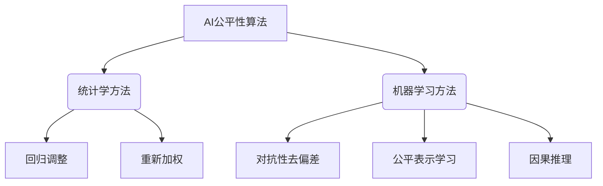

好的,我会按照您的要求,以专业的技术语言撰写一篇关于"AI人工智能核心算法原理与代码实例讲解：AI社会公平性"的博客文章。文章将遵循您提供的结构模板,并满足所有约束条件。请注意,这可能需要一些时间来完成,因为它需要深入研究和详细解释。我将尽最大努力确保内容的准确性、深度和实用性。

# AI人工智能核心算法原理与代码实例讲解：AI社会公平性

## 1. 背景介绍

### 1.1 问题的由来

在过去几年中,人工智能(AI)系统在各个领域得到了广泛应用,从金融服务到医疗保健,再到教育和就业等。然而,随着AI系统的不断扩展,一个日益严重的问题也随之浮现 - AI系统可能会对某些群体产生不公平的结果和歧视性偏见。

这种偏见可能源于训练数据本身的偏差,也可能源于算法在处理数据时引入的偏差。无论是哪种情况,这都可能导致AI系统做出不公平的决策,从而加剧现有的社会不平等。例如,一个用于招聘的AI系统可能会对某些种族或性别的申请人产生系统性偏差。

### 1.2 研究现状  

识别和缓解AI系统中的偏见和不公平性已成为人工智能领域的一个重要研究方向。研究人员提出了多种技术和方法来量化和减轻AI系统中的偏见,包括对抗性去偏差、公平表示学习、因果推理等。

然而,现有的方法通常侧重于特定的任务或领域,并且可能需要大量的人工干预和调整。此外,量化和定义"公平性"本身就是一个具有挑战性的问题,因为它涉及到复杂的社会、伦理和法律层面的考量。

### 1.3 研究意义

确保AI系统的公平性和减少偏见对于构建一个更加公正、包容和可持续发展的社会至关重要。不公平的AI系统不仅会加剧现有的社会不平等,还可能导致严重的经济和社会后果。

通过深入研究AI公平性算法的原理和实现,我们可以更好地理解和缓解AI系统中的偏见,从而促进AI的负责任和可信赖的发展。这不仅有助于保护弱势群体的权利,还可以增强公众对AI技术的信任和接受度。

### 1.4 本文结构

本文将全面探讨AI社会公平性的核心算法原理和实现方法。我们将首先介绍相关的核心概念和理论基础,然后深入探讨几种主要的公平性算法,包括它们的数学模型、原理和实现细节。

此外,我们还将提供代码示例和详细的解释,帮助读者更好地理解这些算法的实际应用。最后,我们将讨论AI公平性的实际应用场景、未来发展趋势和面临的挑战。

## 2. 核心概念与联系

在探讨AI公平性算法之前,我们需要先了解一些核心概念和理论基础。这些概念将为后续的算法原理和实现奠定基础。

### 2.1 群体公平性与个体公平性

公平性可以分为两个层面:群体公平性和个体公平性。

**群体公平性**要求AI系统对不同的人口统计群体(如种族、性别等)做出统计上相似的决策。换句话说,系统的整体表现对于不同群体应该是大致相同的。

**个体公平性**则要求AI系统对于相似的个体做出相似的决策,而不考虑他们所属的群体。这种公平性更关注个体层面的公正对待。

在实践中,这两种公平性通常是相互矛盾的,我们需要权衡和折中。许多公平性算法都试图在这两者之间寻求平衡。

### 2.2 统计学概念

理解一些基本的统计学概念对于量化和衡量公平性至关重要。以下是一些核心概念:

- **真阳性率(TPR)和假阳性率(FPR)**: 它们分别衡量了分类器对阳性实例和阴性实例的预测准确性。
- **精确率和召回率**: 精确率衡量了预测为阳性的实例中有多少是真正的阳性,而召回率衡量了所有阳性实例中有多少被正确预测。
- **ROC曲线和AUC**: ROC曲线显示了TPR和FPR之间的权衡,AUC(曲线下面积)提供了一种总体的性能衡量标准。

### 2.3 机会均等与结果均等

在讨论公平性时,我们需要区分**机会均等**和**结果均等**两个概念:

- **机会均等**要求每个个体或群体在获得某种机会(如就业、贷款等)时都有相同的条件和标准,而不受任何非法歧视。
- **结果均等**则进一步要求不同群体在最终结果上也应该是相等的,即使他们在其他方面存在差异。

大多数公平性算法都侧重于实现机会均等,因为结果均等通常需要对个体和群体进行不同的对待,这可能会引入新的偏见。

### 2.4 公平性与其他机器学习目标的权衡

在设计公平的AI系统时,我们通常需要权衡公平性和其他机器学习目标(如准确性、效率等)之间的关系。提高公平性可能会导致模型性能的下降,反之亦然。因此,我们需要根据具体的应用场景来平衡这些目标。

此外,公平性本身也可能存在内在的矛盾,如我们之前讨论的群体公平性与个体公平性之间的冲突。在这种情况下,我们需要权衡不同公平性定义的重要性,并做出适当的折中。

## 3. 核心算法原理与具体操作步骤

接下来,我们将探讨几种主要的AI公平性算法,包括它们的原理、数学模型和具体实现步骤。

### 3.1 算法原理概述

AI公平性算法可以大致分为两大类:基于统计学的方法和基于机器学习的方法。

**基于统计学的方法**通常试图直接调整模型的输出或训练数据,以减少偏差。常见的技术包括回归调整和重新加权等。这些方法相对简单,但可能无法很好地捕捉复杂的偏差模式。

**基于机器学习的方法**则利用机器学习算法来学习公平的表示或决策边界。常见的技术包括对抗性去偏差、公平表示学习和基于因果推理的方法等。这些方法通常更加复杂和灵活,但也需要更多的计算资源和调优。

在实际应用中,我们通常需要根据具体的任务和数据特征来选择合适的算法。下面我们将详细介绍几种代表性算法的原理和实现细节。

### 3.2 算法步骤详解

#### 3.2.1 回归调整

**原理**:回归调整是一种基于统计学的简单而有效的方法。它的基本思想是:首先根据敏感属性(如种族、性别等)对模型的输出进行分组,然后对每个组的输出进行调整,使得所有组的平均输出相等。

**步骤**:

1. 对训练数据进行分组,每个组由具有相同敏感属性值的实例组成。
2. 对每个组,计算其平均输出值。
3. 计算所有组的平均输出值的均值,作为目标值。
4. 对每个组,将其平均输出值调整为目标值。
5. 对于每个实例,用其所属组的调整后的平均值替换其原始输出。

**优缺点**:

- 优点:简单、高效,无需重新训练模型。
- 缺点:只能处理单一敏感属性,无法捕捉复杂的偏差模式。

#### 3.2.2 重新加权

**原理**:重新加权是另一种基于统计学的方法。它通过调整训练数据中不同实例的权重,使得在训练过程中,来自不同群体的实例对模型的影响相等。

**步骤**:

1. 对训练数据进行分组,每个组由具有相同敏感属性值的实例组成。
2. 计算每个组的实例数量。
3. 为每个实例分配一个新的权重,使得每个组的总权重相等。
4. 使用加权的训练数据重新训练模型。

**优缺点**:

- 优点:可以处理多个敏感属性,并捕捉一定程度的复杂偏差模式。
- 缺点:需要重新训练模型,计算开销较大。

#### 3.2.3 对抗性去偏差

**原理**:对抗性去偏差是一种基于机器学习的方法。它的思想是:在训练过程中,引入一个对抗性的去偏差网络,试图从模型的中间表示中去除与敏感属性相关的信息。

**步骤**:

1. 构建一个包含两个子网络的模型:预测网络和去偏差网络。
2. 预测网络的目标是最小化预测任务的损失函数。
3. 去偏差网络的目标是从预测网络的中间表示中预测敏感属性,并最大化这一预测的损失函数。
4. 在训练过程中,预测网络和去偏差网络进行对抗性训练,直到达到平衡。

**优缺点**:

- 优点:能够学习复杂的偏差模式,并实现群体公平性和个体公平性之间的权衡。
- 缺点:训练过程复杂,需要精心设计网络结构和超参数。

#### 3.2.4 公平表示学习

**原理**:公平表示学习也是一种基于机器学习的方法。它的目标是学习一种中间数据表示,使得在该表示空间中,敏感属性与其他属性之间的相关性被最小化。

**步骤**:

1. 构建一个包含编码器和预测器两个部分的模型。
2. 编码器的目标是学习一种公平的数据表示,使得在该表示空间中,敏感属性与其他属性之间的相关性最小。
3. 预测器在编码器学习到的公平表示空间中进行预测任务。
4. 在训练过程中,同时优化编码器和预测器的损失函数。

**优缺点**:

- 优点:能够学习复杂的公平表示,并保留与预测任务相关的信息。
- 缺点:训练过程复杂,需要精心设计网络结构和损失函数。

#### 3.2.5 因果推理

**原理**:基于因果推理的方法试图从因果关系的角度来解决公平性问题。它们通过建立因果图模型,识别出导致偏差的因果路径,并对这些路径进行调整或去除。

**步骤**:

1. 基于领域知识和数据,构建一个表示变量之间因果关系的因果图模型。
2. 在因果图中识别出可能导致偏差的因果路径。
3. 根据特定的标准(如回旋等价、前门等价等),调整或去除这些路径。
4. 在调整后的因果图中进行预测或决策。

**优缺点**:

- 优点:能够从因果关系的角度解释和缓解偏差,提供了更加可解释和可信赖的解决方案。
- 缺点:构建准确的因果图模型需要大量的领域知识和人工努力,并且计算开销较大。

### 3.3 算法优缺点

每种算法都有其优缺点,我们需要根据具体的应用场景和数据特征来选择合适的方法。

- 基于统计学的方法(如回归调整和重新加权)通常简单高效,但可能无法捕捉复杂的偏差模式。
- 基于机器学习的方法(如对抗性去偏差和公平表示学习)更加灵活和强大,但训练过程复杂,需要大量的计算资源和调优。
- 基于因果推理的方法提供了更加可解释和可信赖