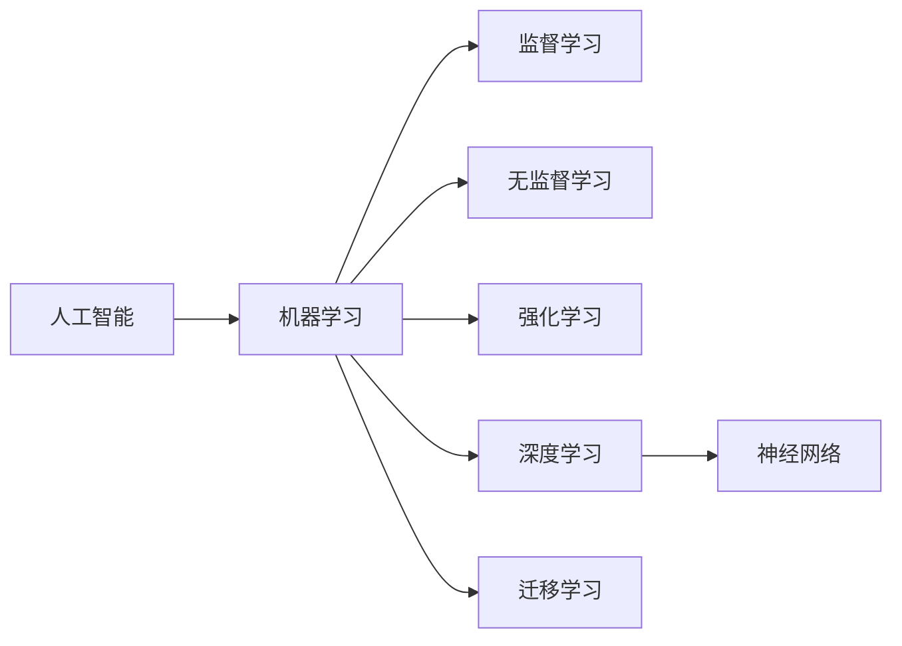

# AI人工智能核心算法原理与代码实例讲解：机器智能

作者：禅与计算机程序设计艺术 / Zen and the Art of Computer Programming

## 1. 背景介绍

### 1.1 问题的由来

人工智能(Artificial Intelligence, AI)是计算机科学领域中最令人着迷和充满挑战的分支之一。自从1956年达特茅斯会议首次提出"人工智能"的概念以来,AI经历了从早期的符号主义,到20世纪80年代的专家系统,再到如今的机器学习和深度学习,走过了一段漫长而曲折的发展历程。如今,以深度学习为代表的现代AI技术在计算机视觉、自然语言处理、语音识别、无人驾驶等领域取得了令人瞩目的成就,AI正在深刻影响和重塑人类社会的方方面面。

然而,尽管AI取得了巨大进展,我们对于智能的本质和机理的认识仍然非常有限。现有的AI系统更多是在特定领域内展现出色的性能,但缺乏通用智能和认知能力。如何突破当前AI技术的瓶颈,实现类人的通用人工智能(Artificial General Intelligence, AGI),是学术界和产业界孜孜以求的终极目标。这需要我们从算法、模型、架构等多个层面对AI的理论基础和关键技术进行系统性研究。

### 1.2 研究现状

当前AI领域的主流范式是以深度学习为核心的连接主义方法。深度学习通过构建多层神经网络,利用海量数据进行端到端的训练学习,在感知智能任务上取得了突破性进展。一系列里程碑式的成果,如AlexNet、AlphaGo、GPT-3等,展现了深度学习强大的特征提取和模式识别能力。

但深度学习也存在一些固有局限:如大规模标注数据的依赖、可解释性差、泛化能力不足、缺乏常识推理等。因此,学界开始关注结合符号主义与连接主义的混合范式,如神经符号(Neuro-Symbolic)系统、基于知识的神经网络等。还有研究者从认知科学角度提出类脑计算等仿生智能路线。

总的来说,现代AI正处于从"弱人工智能"向"强人工智能"过渡的关键时期。未来AI的突破需要算法创新与理论进展的协同推进,需要不同学科领域的交叉融合。这是一个极具挑战性但也充满机遇的研究方向。

### 1.3 研究意义

AI算法是人工智能的核心和基础。系统梳理和研究AI的关键算法,对于推动人工智能的理论创新和技术进步具有重要意义:

1. 有助于我们深入理解人工智能的内在机理,揭示机器如何感知、学习、推理和决策,为构建类人智能奠定理论基础。

2. 通过比较不同算法的优劣和适用场景,为实际应用选择合适的AI技术提供指导,提升人工智能系统的性能。 

3. 总结现有算法的局限性,为未来AI算法的改进和创新指明方向。只有不断突破算法瓶颈,人工智能才能取得革命性进展。

4. 普及人工智能算法知识,培养更多的AI算法人才。技术的发展离不开人才的积累,高水平的AI人才是推动人工智能事业的根本动力。

### 1.4 本文结构

本文将重点介绍人工智能的几类核心算法,包括机器学习算法、深度学习算法、强化学习算法、迁移学习算法等。内容涵盖这些算法的基本原理、数学模型、代码实现、应用场景等方面。通过理论与实践的结合,力求为读者呈现一个全面、系统、深入的AI算法知识框架。

全文的结构安排如下:

第2部分介绍人工智能领域的核心概念,厘清它们之间的联系。

第3部分重点讲解几类主要的机器学习算法,如监督学习、无监督学习、半监督学习等,并剖析它们的原理和步骤。

第4部分进一步深入探讨深度学习算法,包括前馈神经网络、卷积神经网络、循环神经网络等,结合数学推导和案例分析加以阐释。

第5部分通过代码实例,演示如何使用Python实现几种典型的机器学习和深度学习算法,并对代码进行解析。

第6部分讨论强化学习和迁移学习的场景应用,展望其发展前景。

第7部分推荐一些学习AI算法的工具、资源。

第8部分总结全文,评述AI算法未来的机遇和挑战。

附录部分列举AI算法相关的常见问题,并给出解答。

## 2. 核心概念与联系

在正式讨论AI算法之前,我们有必要先明确人工智能领域的一些核心概念:

- 人工智能(Artificial Intelligence): 研究、开发用于模拟、延伸和扩展人的智能的理论、方法、技术及应用系统的一门新的技术科学。

- 机器学习(Machine Learning): 人工智能的核心,是研究计算机怎样模拟或实现人类的学习行为,以获取新的知识或技能,重新组织已有的知识结构使之不断改善自身的性能。

- 深度学习(Deep Learning):机器学习的分支,基于对数据进行表征学习的算法。其核心是利用多层神经网络对数据进行特征的提取和变换,实现对数据的分类或预测。

- 神经网络(Neural Network):一种模仿生物神经网络(动物的中枢神经系统,特别是大脑)的结构和功能的数学模型或计算模型。神经网络由大量的人工神经元联结进行计算。

- 监督学习(Supervised Learning):从标注数据中学习预测模型的机器学习任务,如分类和回归。

- 无监督学习(Unsupervised Learning):从无标注数据中学习模型的机器学习任务,如聚类和降维。 

- 强化学习(Reinforcement Learning):智能体通过与环境的交互,根据反馈的奖励或惩罚来学习优化决策的机器学习范式。

- 迁移学习(Transfer Learning):将一个领域学习过的模型应用到另一个相似但不同的领域,实现知识的迁移和复用。

这些概念之间有着紧密的联系。人工智能是一个宏大的科学领域,机器学习是实现人工智能的主要途径。而深度学习作为机器学习的一个分支,以神经网络为主要模型,是当前AI领域最有影响力的技术方向。监督学习、无监督学习、强化学习是机器学习的三大范式,分别针对不同类型的任务。迁移学习是提高机器学习模型泛化能力的重要手段。理解这些概念之间的区别和联系,是掌握AI算法的基础。

## 3. 核心算法原理 & 具体操作步骤

### 3.1 算法原理概述

人工智能涉及的算法很多,本节重点介绍机器学习的三大类算法:监督学习、无监督学习和强化学习。

**监督学习**是最常见的机器学习范式。给定一组带标签的训练样本,监督学习算法通过学习输入和输出之间的映射关系,构建一个预测模型。这个模型可以对新的未知数据进行预测。监督学习主要分为分类和回归两大类任务。分类是指输出是离散的类别标签,如垃圾邮件识别。回归是指输出是连续的数值,如房价预测。常见的监督学习算法包括:线性回归、Logistic回归、决策树、支持向量机、K近邻、朴素贝叶斯、神经网络等。

**无监督学习**处理的数据没有标签。它的目标是发现数据中潜在的结构和关系,如聚类或降维。聚类把相似的样本自动归到一个类别,如用户画像。降维寻找数据中的低维表示,如主题模型。常见的无监督学习算法包括:K均值、层次聚类、DBSCAN、主成分分析、奇异值分解等。

**强化学习**的灵感来自于心理学中的"试错学习"。在强化学习中,智能体通过不断尝试与环境交互,根据环境的反馈(奖励或惩罚)来优化自己的决策,最终获得最大的累积奖励。强化学习特别适合序贯决策问题,在智能控制、自动驾驶、游戏AI等领域有广泛应用。代表性的强化学习算法有:Q学习、Sarsa、蒙特卡洛树搜索、策略梯度等。

### 3.2 算法步骤详解

下面以监督学习中的线性回归算法为例,详细讲解其步骤。

线性回归是一种简单但非常实用的算法。它的目标是找到自变量X和因变量y之间的线性关系:

$$
\hat{y} = w_1x_1 + w_2x_2 + ... + w_nx_n + b
$$

其中$w_1,w_2,...,w_n$是模型参数,称为权重(weight);$b$是偏置项(bias)。线性回归的任务就是通过训练数据学习出最优的权重和偏置,使得模型的预测值$\hat{y}$尽可能接近真实值$y$。

线性回归的一般步骤如下:

1. 数据准备:收集和清洗数据,划分训练集和测试集。

2. 模型定义:定义线性模型$\hat{y} = Xw + b$,其中$X$是输入特征矩阵,$w$是权重向量。

3. 损失函数:定义衡量预测值与真实值差异的损失函数,通常使用均方误差(MSE):

$$
J(w,b) = \frac{1}{2m}\sum_{i=1}^m(\hat{y}^{(i)} - y^{(i)})^2
$$

4. 优化算法:使用优化算法如梯度下降,通过迭代更新$w$和$b$来最小化损失函数:

$$
w := w - \alpha \frac{\partial J}{\partial w} \\
b := b - \alpha \frac{\partial J}{\partial b}
$$

其中$\alpha$是学习率,控制每次更新的步长。

5. 训练模型:把训练数据代入,迭代进行梯度下降,直到损失函数收敛或达到预设的迭代次数。

6. 测试模型:用学习到的模型对测试集进行预测,评估模型的性能。

7. 模型应用:使用训练好的线性回归模型对新样本进行预测。

### 3.3 算法优缺点

线性回归的优点是:
- 模型简单,易于理解和实现
- 计算开销小,训练速度快
- 适合处理连续型变量预测问题
- 模型具有很好的可解释性

但线性回归也有局限性:
- 只能拟合线性关系,对非线性数据拟合效果差
- 对异常点和离群点敏感
- 容易出现欠拟合,泛化能力较弱

### 3.4 算法应用领域

尽管有局限,线性回归在很多领域还是一个实用的工具,如:
- 经济预测:分析影响经济指标的因素
- 广告投放:预估广告的点击率
- 疾病诊断:根据症状预测疾病风险
- 能源需求:预测电力、燃气等的需求量

线性回归通常作为建模的基准和起点,再进一步考虑使用更高级的算法。

## 4. 数学模型和公式 & 详细讲解 & 举例说明

### 4.1 数学模型构建

监督学习可以表述为这样一个数学问题:假设输入空间$\mathcal{X} \subseteq \mathbb{R}^n$,输出空间$\mathcal{Y} \subseteq \mathbb{R}$。给定一个训练数据集:

$$
T = \{(x_1,y_1),(x_2,y_2),...,(x_N,y_N)\}
$$

其中,$x_i \in \mathcal{X}$是第$i$个样本的特征向量,$y_i \in \mathcal{Y}$是相应的标签