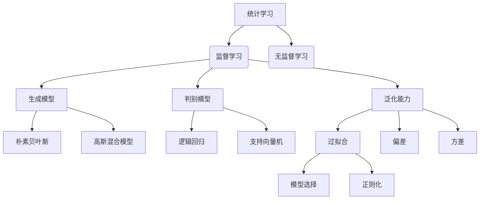

好的,我会严格按照您提供的要求和约束条件,以"AI人工智能核心算法原理与代码实例讲解：统计学习"为题,撰写一篇专业的技术博客文章。

# AI人工智能核心算法原理与代码实例讲解：统计学习

## 1. 背景介绍

### 1.1 问题的由来

在当今的数据时代,海量的数据无处不在。如何从这些原始数据中提取有价值的信息和知识,并将其应用于各种领域,成为了人工智能领域的一个核心挑战。统计学习作为机器学习和数据挖掘的理论基础,为解决这一挑战提供了强有力的工具和方法。

### 1.2 研究现状 

统计学习理论源于20世纪60年代,经过数十年的发展,已经形成了一个相对成熟且不断发展的理论体系。目前,统计学习方法已广泛应用于计算机视觉、自然语言处理、推荐系统、金融风险管理等诸多领域,取得了卓越的成就。

### 1.3 研究意义

掌握统计学习的核心算法原理及实现方法,对于从事人工智能相关工作的研究人员和工程师来说至关重要。深入理解这些算法,不仅能提高对机器学习模型的把控能力,还能促进创新性算法的产生,推动人工智能技术的发展。

### 1.4 本文结构

本文将从以下几个方面深入探讨统计学习的核心算法:

1. 核心概念与联系
2. 算法原理及具体操作步骤
3. 数学模型与公式推导
4. 项目实践:代码实例及解释
5. 实际应用场景
6. 工具和学习资源推荐
7. 未来发展趋势与挑战
8. 常见问题解答

## 2. 核心概念与联系

在深入讨论具体算法之前,我们先来了解一下统计学习的一些核心概念,以及它们之间的联系。

### 2.1 监督学习与无监督学习

根据训练数据是否带有标签,统计学习可分为监督学习和无监督学习两大类:

- **监督学习**:利用带有标签的训练数据,学习出一个模型,对新的数据进行预测或分类。常见的监督学习算法有回归、逻辑回归、支持向量机等。
- **无监督学习**:只利用无标签的训练数据,发现数据内在的模式和规律。常见的无监督学习算法有聚类、关联规则挖掘等。

### 2.2 泛化与过拟合

机器学习的目的是从有限的训练数据中学习出一个模型,使其能够很好地适应新的未见过的数据,这种能力被称为**泛化能力**。过于复杂的模型可能会过度拟合训练数据,导致泛化能力下降,这种现象被称为**过拟合**。

为了获得良好的泛化能力,需要在模型复杂度和训练数据拟合程度之间寻求平衡,这就涉及到**模型选择**和**正则化**等重要概念。

### 2.3 偏差与方差

**偏差**描述了学习算法的期望模型与真实模型之间的差异,**方差**描述了同一个学习算法在不同训练数据上得到的模型之间的差异。理想情况下,我们希望学习算法有较小的偏差和方差。

降低偏差和方差是统计学习算法设计的重要考虑因素。不同的算法对偏差-方差的权衡有不同的策略,从而适用于不同的学习场景。

### 2.4 生成模型与判别模型

根据模型的表达形式,统计学习模型可分为**生成模型**和**判别模型**:

- **生成模型**:直接对联合分布$P(X,Y)$建模,常见的生成模型有朴素贝叶斯、高斯混合模型等。
- **判别模型**:直接对条件分布$P(Y|X)$建模,常见的判别模型有逻辑回归、支持向量机等。

生成模型和判别模型各有优缺点,在实际应用中需要根据具体问题加以选择。

### 2.5 核心概念关系图

为了更好地理解上述核心概念之间的关系,我们使用Mermaid流程图进行可视化:

通过上图,我们可以清晰地看到统计学习的核心概念之间的关系,为后续算法原理的学习打下基础。

## 3. 核心算法原理及具体操作步骤

在这一部分,我们将重点介绍几种核心的统计学习算法,包括算法原理概述、具体操作步骤、优缺点分析以及应用领域。

### 3.1 线性回归

#### 3.1.1 算法原理概述

线性回归是一种常用的监督学习算法,主要用于解决回归问题。它试图学习出一个线性模型,使输出值$y$与输入特征$x$之间满足线性关系:

$$y = w^Tx + b$$

其中$w$和$b$是需要从训练数据中学习得到的模型参数。

线性回归的目标是最小化损失函数,即预测值与真实值之间的差异:

$$\min_{w,b} \sum_{i=1}^{N}(y_i - (w^Tx_i + b))^2$$

这可以通过最小二乘法或梯度下降法等优化算法来求解。

#### 3.1.2 算法步骤详解

1. **数据预处理**:对输入数据进行标准化或归一化处理,使特征值位于相似的数量级。
2. **构建损失函数**:根据最小二乘法原理,构建损失函数$J(w,b) = \frac{1}{2N}\sum_{i=1}^{N}(y_i - (w^Tx_i + b))^2$。
3. **选择优化算法**:常用的优化算法包括梯度下降法、normal方程法等。
4. **计算梯度**:对损失函数$J(w,b)$分别求$w$和$b$的梯度$\frac{\partial J}{\partial w}$和$\frac{\partial J}{\partial b}$。
5. **更新参数**:根据梯度下降公式$w := w - \alpha \frac{\partial J}{\partial w}$和$b := b - \alpha \frac{\partial J}{\partial b}$更新参数,其中$\alpha$为学习率。
6. **重复迭代**:重复执行步骤4和5,直到收敛或达到最大迭代次数。

#### 3.1.3 算法优缺点

**优点**:

- 模型简单,易于理解和解释
- 训练过程有解析解,计算高效
- 适用于输入特征与输出目标之间存在线性关系的问题

**缺点**:

- 对于非线性问题,拟合效果较差
- 对异常值敏感,需要进行数据预处理
- 特征之间不能存在多重共线性

#### 3.1.4 算法应用领域

线性回归广泛应用于以下领域:

- 金融领域:股票价格预测、风险评估等
- 经济领域:GDP增长率预测、通货膨胀预测等
- 工业领域:产品质量控制、工艺优化等
- 自然科学领域:物理实验数据拟合等

### 3.2 逻辑回归

#### 3.2.1 算法原理概述

逻辑回归是一种常用的监督学习算法,主要用于解决二分类问题。它通过学习一个逻辑斯蒂回归模型,将输入特征$x$映射到0到1之间的一个值,作为样本属于正类的概率估计:

$$P(Y=1|x) = \frac{1}{1 + e^{-(w^Tx + b)}}$$

其中$w$和$b$是需要从训练数据中学习得到的模型参数。

逻辑回归的目标是最大化似然函数,即正确分类的概率:

$$\max_{w,b} \prod_{i=1}^{N}P(y_i|x_i;w,b)$$

这可以通过梯度下降法等优化算法来求解。

#### 3.2.2 算法步骤详解

1. **数据预处理**:对输入数据进行标准化或归一化处理。
2. **构建似然函数**:根据逻辑斯蒂回归模型,构建似然函数$l(w,b) = \sum_{i=1}^{N}[y_i\log P(y_i|x_i;w,b) + (1-y_i)\log(1-P(y_i|x_i;w,b))]$。
3. **选择优化算法**:常用的优化算法包括梯度下降法、拟牛顿法等。
4. **计算梯度**:对似然函数$l(w,b)$分别求$w$和$b$的梯度$\frac{\partial l}{\partial w}$和$\frac{\partial l}{\partial b}$。
5. **更新参数**:根据梯度上升公式$w := w + \alpha \frac{\partial l}{\partial w}$和$b := b + \alpha \frac{\partial l}{\partial b}$更新参数,其中$\alpha$为学习率。
6. **重复迭代**:重复执行步骤4和5,直到收敛或达到最大迭代次数。
7. **分类决策**:对于新的样本$x'$,若$P(Y=1|x') \geq 0.5$,则分类为正类,否则为负类。

#### 3.2.3 算法优缺点

**优点**:

- 模型具有很好的解释性
- 能够有效处理离散型和连续型特征
- 分类决策直观,计算简单

**缺点**:

- 对于非线性问题,拟合效果较差
- 对异常值敏感,需要进行数据预处理
- 特征之间不能存在多重共线性

#### 3.2.4 算法应用领域

逻辑回归广泛应用于以下领域:

- 医疗领域:疾病诊断、药物反应预测等
- 金融领域:信用评分、欺诈检测等
- 市场营销领域:客户流失预测、广告点击预测等
- 自然语言处理领域:文本分类、情感分析等

### 3.3 决策树

#### 3.3.1 算法原理概述

决策树是一种常用的监督学习算法,可以用于解决分类和回归问题。它通过构建一个树状决策模型,根据输入特征的取值,自顶向下地对样本进行划分,最终将样本分配到树的叶节点,得到相应的分类或回归结果。

决策树的构建过程是一个递归的过程,每个节点都需要选择一个最优特征进行分裂,使得分裂后的子节点的纯度最高。常用的特征选择标准包括信息增益、信息增益比、基尼系数等。

#### 3.3.2 算法步骤详解

1. **初始化**:将所有训练样本放入根节点。
2. **计算最优特征**:对于根节点中的每个特征,计算其对应的最优分裂点,并选择使得子节点最纯的特征作为分裂特征。
3. **生成子节点**:根据选择的分裂特征,将根节点分裂为若干个子节点。
4. **终止判断**:对于每个子节点,判断是否需要继续分裂。如果不需要分裂,则将该节点标记为叶节点;否则,对该子节点递归执行步骤2和3。
5. **生成决策树**:所有节点分裂完成后,生成完整的决策树模型。

#### 3.3.3 算法优缺点

**优点**:

- 模型可解释性强,决策过程直观
- 能够有效处理连续型和离散型特征
- 对异常值的鲁棒性较好

**缺点**:

- 容易过拟合,需要进行剪枝
- 对于数据的质量要求较高,存在噪声会影响模型精度
- 在处理高维数据时,效率较低

#### 3.3.4 算法应用领域

决策树广泛应