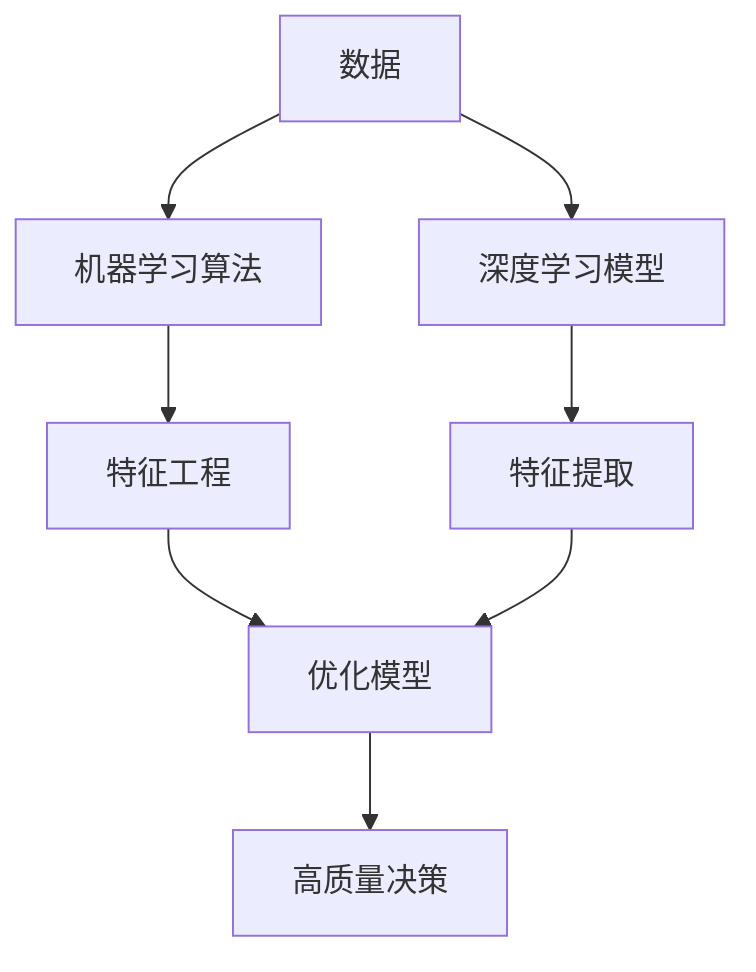

# AI人工智能深度学习算法：利用机器学习提升深度学习模型的决策质量

## 1. 背景介绍

### 1.1 问题的由来

在当今数据驱动的时代,人工智能(AI)和机器学习(ML)已广泛应用于各个领域,包括金融、医疗、制造业等。然而,传统的机器学习模型通常面临数据质量、过拟合、可解释性等挑战,导致决策质量和性能受到影响。为了克服这些挑战,深度学习(DL)技术应运而生,它利用多层神经网络模拟人脑的工作方式,从海量数据中自动学习特征表示,显著提高了模型的预测精度和泛化能力。

### 1.2 研究现状

深度学习在计算机视觉、自然语言处理、语音识别等领域取得了巨大成功,但同时也面临一些新的挑战,例如需要大量标注数据、黑盒模型难以解释、容易受到对抗性攻击等。为了提高深度学习模型的决策质量,研究人员提出了多种方法,如迁移学习、元学习、注意力机制等,旨在提高模型的数据效率、可解释性和鲁棒性。

### 1.3 研究意义

提升深度学习模型的决策质量对于实现可信赖的人工智能系统至关重要。高质量的决策不仅能够提高模型的准确性和效率,还能够增强模型的透明度和可解释性,从而赢得用户的信任。此外,通过机器学习技术优化深度学习模型,可以帮助企业和组织从海量数据中挖掘有价值的见解,支持更好的决策制定。

### 1.4 本文结构

本文将全面探讨如何利用机器学习算法和技术来提升深度学习模型的决策质量。我们将首先介绍相关的核心概念和理论基础,然后深入探讨核心算法原理和数学模型,并通过实际案例和代码示例进行详细说明。最后,我们将讨论实际应用场景、工具和资源推荐,以及未来发展趋势和挑战。

## 2. 核心概念与联系

在深入探讨如何利用机器学习提升深度学习模型的决策质量之前,我们需要先了解一些核心概念和它们之间的联系。

1. **人工智能(AI)**: 人工智能是一门致力于使机器具备智能行为的学科,包括感知、学习、推理、规划和行动等能力。

2. **机器学习(ML)**: 机器学习是人工智能的一个重要分支,它赋予计算机从数据中自动学习和改进的能力,而无需显式编程。常见的机器学习算法包括监督学习、无监督学习和强化学习等。

3. **深度学习(DL)**: 深度学习是机器学习的一种特殊形式,它基于人工神经网络,通过多层非线性变换自动学习数据的层次特征表示。深度学习在处理高维数据(如图像、语音、文本等)方面表现出色。

4. **决策质量**: 决策质量是指模型做出准确、可靠和可解释的决策的能力。高质量的决策需要考虑多个因素,如准确性、鲁棒性、公平性、可解释性等。

机器学习和深度学习是人工智能的两个重要分支,它们都致力于从数据中学习,但采用了不同的方法和技术。机器学习算法通常需要手工设计特征,而深度学习则能够自动学习数据的层次特征表示。通过将机器学习技术与深度学习相结合,我们可以提高深度学习模型的决策质量,克服单一模型的局限性。

下面是一个简单的 Mermaid 流程图,展示了机器学习和深度学习在提升决策质量中的作用:

在这个流程中,机器学习算法通过特征工程从原始数据中提取有用的特征,而深度学习模型则自动学习数据的层次特征表示。两者的输出都被用于优化模型,从而提高模型的决策质量。

## 3. 核心算法原理 & 具体操作步骤

### 3.1 算法原理概述

利用机器学习算法提升深度学习模型的决策质量,主要包括以下几个方面:

1. **数据预处理和增强**: 通过数据清洗、标准化、增广等技术,提高训练数据的质量和多样性,从而提升模型的泛化能力。

2. **特征工程**: 利用机器学习算法(如决策树、随机森林等)从原始数据中提取有用的特征,作为深度学习模型的输入,提高模型的表现。

3. **模型优化**: 采用贝叶斯优化、进化算法等技术,自动搜索深度学习模型的超参数,提高模型的性能。

4. **模型集成**: 将多个深度学习模型集成(如boosting、bagging等),提高预测的准确性和鲁棒性。

5. **可解释性增强**: 利用可解释的机器学习模型(如决策树、线性模型等)解释深度学习模型的决策过程,提高模型的透明度。

6. **迁移学习**: 将在大型数据集上预训练的深度学习模型迁移到小数据集上,提高模型在小数据场景下的性能。

7. **对抗训练**: 通过对抗性样本训练,增强深度学习模型对噪声和对抗性攻击的鲁棒性。

### 3.2 算法步骤详解

以下是利用机器学习算法提升深度学习模型决策质量的一般步骤:

1. **数据准备**:收集和清洗原始数据,进行标准化或归一化处理,并根据需要进行数据增广。

2. **特征工程**:利用机器学习算法(如决策树、随机森林等)从原始数据中提取有用的特征,作为深度学习模型的输入。

3. **模型构建**:设计和构建深度学习模型架构,包括选择合适的网络结构、激活函数、损失函数等。

4. **超参数优化**:采用贝叶斯优化、进化算法等技术,自动搜索深度学习模型的超参数(如学习率、正则化系数等),提高模型性能。

5. **模型训练**:使用优化后的超参数和特征工程后的数据,训练深度学习模型。

6. **模型评估**:在验证集或测试集上评估模型的性能,包括准确性、精确率、召回率、F1分数等指标。

7. **模型集成**(可选):将多个深度学习模型集成(如boosting、bagging等),提高预测的准确性和鲁棒性。

8. **可解释性增强**(可选):利用可解释的机器学习模型(如决策树、线性模型等)解释深度学习模型的决策过程,提高模型的透明度。

9. **迁移学习**(可选):将在大型数据集上预训练的深度学习模型迁移到小数据集上,提高模型在小数据场景下的性能。

10. **对抗训练**(可选):通过对抗性样本训练,增强深度学习模型对噪声和对抗性攻击的鲁棒性。

11. **模型部署**:将优化和增强后的深度学习模型部署到生产环境中,用于实际决策任务。

### 3.3 算法优缺点

利用机器学习算法提升深度学习模型决策质量的优点包括:

- 提高模型的准确性和泛化能力
- 增强模型的可解释性和透明度
- 提高模型对噪声和对抗性攻击的鲁棒性
- 缓解深度学习对大量标注数据的依赖
- 结合不同算法的优势,发挥集成效应

但同时也存在一些缺点和挑战:

- 增加了模型的复杂性和计算开销
- 需要对多种算法和技术有深入的理解和掌握
- 不同算法和模型之间的协同需要精心设计和调优
- 一些技术(如对抗训练)可能会引入新的安全隐患

### 3.4 算法应用领域

利用机器学习算法提升深度学习模型决策质量的技术可以应用于多个领域,包括但不限于:

- **计算机视觉**:图像分类、目标检测、语义分割等
- **自然语言处理**:文本分类、机器翻译、问答系统等
- **语音识别**:语音转文本、说话人识别等
- **医疗健康**:疾病诊断、药物发现、医疗影像分析等
- **金融**:欺诈检测、信用评分、风险管理等
- **制造业**:产品质量控制、预测性维护等
- **交通运输**:自动驾驶、交通流量预测等

无论是在哪个领域,提高人工智能系统的决策质量都是至关重要的,它不仅能够提高系统的性能和效率,还能增强用户的信任度,促进人工智能技术的广泛应用和发展。

## 4. 数学模型和公式 & 详细讲解 & 举例说明

### 4.1 数学模型构建

在利用机器学习算法提升深度学习模型决策质量的过程中,我们需要构建一些数学模型来描述和优化相关的过程。以下是一些常见的数学模型:

1. **特征选择模型**:用于从原始特征集合中选择最有用的特征子集,常用的模型包括Filter模型(如卡方检验、互信息等)和Wrapper模型(如递归特征消除等)。

2. **超参数优化模型**:用于搜索深度学习模型的最优超参数组合,常用的模型包括贝叶斯优化、模拟退火、进化算法等。

3. **集成学习模型**:用于将多个基学习器(如决策树、神经网络等)集成为一个强学习器,常用的模型包括Boosting、Bagging、Stacking等。

4. **对抗样本生成模型**:用于生成对抗性样本,增强深度学习模型的鲁棒性,常用的模型包括快速梯度符号方法(FGSM)、Jacobian矩阵数据集等。

5. **可解释性模型**:用于解释深度学习模型的决策过程,常用的模型包括LIME、SHAP、DeepLIFT等。

6. **迁移学习模型**:用于将在大型数据集上预训练的模型迁移到小数据集上,常用的模型包括微调(Fine-tuning)、特征提取等。

这些数学模型为利用机器学习算法提升深度学习模型决策质量提供了理论基础和技术支持。下面我们将详细讲解其中一些核心模型的原理和公式。

### 4.2 公式推导过程

#### 4.2.1 特征选择: 互信息

互信息(Mutual Information)是一种常用的特征选择方法,它衡量特征和目标变量之间的相关性。对于离散随机变量 $X$ 和 $Y$,互信息定义为:

$$I(X;Y) = \sum_{x \in \mathcal{X}}\sum_{y \in \mathcal{Y}}p(x,y)\log\frac{p(x,y)}{p(x)p(y)}$$

其中 $p(x,y)$ 是 $X$ 和 $Y$ 的联合概率分布,而 $p(x)$ 和 $p(y)$ 分别是 $X$ 和 $Y$ 的边缘概率分布。

互信息越大,说明特征 $X$ 和目标变量 $Y$ 之间的相关性越强,因此可以根据互信息值对特征进行排序和选择。

#### 4.2.2 超参数优化: 贝叶斯优化

贝叶斯优化是一种常用的超参数优化方法,它通过构建代理模型(如高斯过程)来近似目标函数,从而有效地搜索超参数空间。

假设我们要优化的目标函数为 $f(\mathbf{x})$,其中 $\mathbf{x}$ 是超参数向量。贝叶斯优化的目标是找到 $\mathbf{x}^*$ 使得 $f(\mathbf{x}^*)$ 最小(或最大)。

在每一次迭代中,贝叶斯优化会根