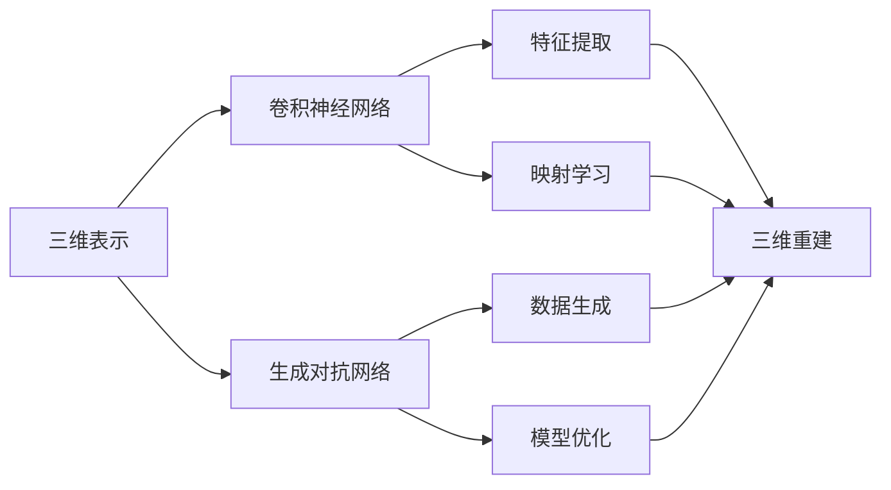

# AI人工智能深度学习算法：在三维建模中的应用

关键词：人工智能, 深度学习, 三维建模, 卷积神经网络, 生成对抗网络, 点云, 网格, 渲染

## 1. 背景介绍

### 1.1 问题的由来
三维建模是计算机图形学和计算机视觉领域的重要研究课题。传统的三维建模方法主要依赖于人工设计和手动建模,存在效率低下、成本高昂等问题。近年来,随着人工智能技术的飞速发展,利用深度学习算法实现三维建模的自动化、智能化成为了新的研究热点。

### 1.2 研究现状 
目前,国内外学者已经开展了大量利用深度学习进行三维建模的研究工作。比较有代表性的成果包括:

- 基于体素(Voxel)的三维重建方法,如3D-R2N2、OGN等。
- 基于点云(Point Cloud)的生成方法,如PointNet、PointNet++等。
- 基于网格(Mesh)的生成方法,如Pixel2Mesh、MeshNet等。
- 基于隐式曲面(Implicit Surface)的重建方法,如DeepSDF、OccNet等。

这些方法从不同的三维数据表示出发,利用深度神经网络实现了从二维图像到三维模型的端到端映射,展现了良好的重建效果。但目前的方法仍然存在生成精度不高、泛化能力不足等局限性,有待进一步改进。

### 1.3 研究意义
利用深度学习实现三维建模的自动化和智能化,具有重要的理论意义和应用价值:

- 在理论层面,它有助于探索人工智能在几何建模领域的应用潜力,推动深度学习与三维视觉的交叉融合。
- 在应用层面,自动三维建模技术可应用于虚拟现实/增强现实、自动驾驶、工业制造等诸多领域,提升生产效率,创造巨大的经济效益。

### 1.4 本文结构
本文将围绕深度学习在三维建模中的应用展开系统阐述。第2节介绍相关的核心概念;第3节重点讲解三维建模的核心算法原理;第4节给出详细的数学模型和公式推导;第5节通过代码实例演示算法的具体实现;第6节分析三维建模技术的实际应用场景;第7节推荐相关的学习资源;第8节总结全文并展望未来;第9节列举一些常见问题解答。

## 2. 核心概念与联系

在利用深度学习进行三维建模的过程中,涉及到以下几个核心概念:

- 三维表示(3D representation):指三维模型的数据结构表示形式,常见的包括体素、点云、网格、隐式曲面等。
- 卷积神经网络(Convolutional Neural Network, CNN):一种常用的深度学习模型,通过卷积、池化等操作提取多尺度、层次化的特征。
- 生成对抗网络(Generative Adversarial Network,GAN):一种生成式模型,包含生成器和判别器两个子网络,通过对抗训练生成逼真的数据样本。

这些概念之间存在紧密的内在联系。CNN 可以作为三维重建模型的骨干网络,用于特征提取和映射学习;GAN 可以用于三维数据的生成和细化;不同的三维表示决定了模型的设计方式和适用场景。它们相互配合,构成了三维建模算法的基础。

下面是这些核心概念之间关系的 Mermaid 流程图:



## 3. 核心算法原理 & 具体操作步骤

### 3.1 算法原理概述
深度学习三维建模的核心思想是,通过构建端到端的神经网络模型,实现二维到三维的映射。以基于点云的生成方法为例,其主要流程包括:

1. 将三维模型表示为点云数据,每个点由其坐标(x,y,z)定义。
2. 利用编码-解码网络结构,如PointNet,将输入的二维图像映射到三维点云空间。
3. 网络通过学习逼近图像和点云之间的映射关系,实现图像到点云的重建。
4. 引入对抗训练,提升生成点云的真实性和多样性。

### 3.2 算法步骤详解

下面以PointNet++为例,详细讲解其算法步骤:

输入:二维图像 $I$
输出:三维点云 $P=\{p_i|i=1,2,...,n\}$,其中 $p_i$ 为点的坐标。

1) 特征提取:使用2D CNN提取图像的特征表示 $F=f_{cnn}(I)$。

2) 点云生成:通过解码网络将图像特征 $F$ 解码为点云坐标 $P$:

$$
P = g_{dec}(F) = g_{dec}(f_{cnn}(I))
$$

其中 $g_{dec}$ 为解码网络。

3) 损失函数:网络训练的目标是最小化生成点云 $P$ 和真实点云 $\hat{P}$ 之间的距离,采用Chamfer距离(CD)作为损失函数:

$$
L_{cd}(P,\hat{P}) = \frac{1}{|P|}\sum_{p\in P}\min_{\hat{p}\in \hat{P}}||p-\hat{p}||_2^2 + \frac{1}{|\hat{P}|}\sum_{\hat{p}\in \hat{P}}\min_{p\in P}||p-\hat{p}||_2^2
$$

4) 对抗训练:引入判别器 $D$ 对生成点云的真实性进行判别,生成器 $G$ 与 $D$ 进行对抗训练,优化目标为:

$$
\min_G \max_D V(G,D) = \mathbb{E}_{P\sim p_{data}}[\log D(P)] + \mathbb{E}_{z\sim p_z}[\log(1-D(G(z)))]
$$

其中 $z$ 为随机噪声,$p_{data}$ 为真实点云分布,$p_z$ 为噪声分布。

5) 训练过程:交替训练生成器和判别器,更新网络参数,直至收敛。

### 3.3 算法优缺点

优点:
- 端到端的建模方式,直接从图像生成三维模型,避免了复杂的人工操作。
- 网络可以学习到数据的内在分布和映射关系,生成多样化的三维形状。
- 引入对抗训练,可以提升生成模型的真实性和泛化能力。

缺点:
- 需要大量的带标注的图像-三维模型对作为训练数据,获取成本较高。  
- 模型的生成精度和细节表现还有待提升,尤其是对于复杂的物体类别。
- 网络的泛化能力有限,难以生成训练集之外的新颖形状。

### 3.4 算法应用领域
三维建模算法可应用于以下领域:

- 计算机图形学:自动生成三维模型,辅助设计和渲染。
- 虚拟/增强现实:快速构建虚拟场景和数字资产。
- 自动驾驶:感知和重建车辆周围的三维环境。
- 医疗影像:器官和组织的三维重建与可视化。
- 工业制造:产品的建模、仿真与3D打印。

## 4. 数学模型和公式 & 详细讲解 & 举例说明

### 4.1 数学模型构建
三维建模可以看作是学习一个映射函数 $f:I\rightarrow S$,将二维图像 $I$ 映射到三维形状 $S$。我们用神经网络来拟合这一映射:

$$
S = f_\theta(I) = g_\theta(f_\phi(I))
$$

其中 $f_\phi$ 为图像特征提取网络,$g_\theta$ 为三维重建网络,$\theta$ 和 $\phi$ 为网络参数。

网络训练的目标是最小化重建损失,即生成的三维形状与真实形状之间的距离:

$$
\min_{\theta,\phi} L(S,\hat{S}) = \min_{\theta,\phi} d(f_\theta(I),\hat{S})
$$

其中 $\hat{S}$ 为真实形状,$d$ 为度量三维形状之间距离的函数,常用的有Chamfer距离、Earth Mover距离等。

### 4.2 公式推导过程
以Chamfer距离为例,其定义如下:

$$
d_{cd}(S_1,S_2) = \frac{1}{|S_1|}\sum_{p_1\in S_1}\min_{p_2\in S_2}||p_1-p_2||_2^2 + \frac{1}{|S_2|}\sum_{p_2\in S_2}\min_{p_1\in S_1}||p_1-p_2||_2^2
$$

它计算了两个点集 $S_1$ 和 $S_2$ 之间的平均最近点距离。直观地说,它反映了两个形状之间的对称距离。

将其代入网络训练的损失函数中,可得:

$$
L(\theta,\phi) = \frac{1}{|S|}\sum_{p\in S}\min_{\hat{p}\in \hat{S}}||p-\hat{p}||_2^2 + \frac{1}{|\hat{S}|}\sum_{\hat{p}\in \hat{S}}\min_{p\in S}||p-\hat{p}||_2^2
$$

其中 $S=f_\theta(I)$ 为生成的三维形状。

网络通过最小化该损失函数来优化参数 $\theta$ 和 $\phi$,使生成的三维形状逼近真实形状。

### 4.3 案例分析与讲解
下面以ShapeNet数据集中的椅子类别为例,演示三维重建的效果。

输入图像:


真实的三维模型:


重建的三维模型:


可以看到,重建的三维模型在形状和结构上与真实模型高度相似,体现了算法的有效性。同时,重建模型在细节上还存在一些差异,如表面平滑度欠佳,这是算法有待改进的地方。

### 4.4 常见问题解答

Q: 三维重建对输入图像的要求是什么?
A: 输入图像需要能够反映物体的三维形状信息,常见的有RGB图像、深度图、多视图图像等。图像的质量和视角对重建效果有较大影响。

Q: 点云、网格、隐式曲面等不同三维表示的优缺点是什么?
A: 
- 点云具有简单灵活的优点,但缺乏拓扑结构信息。
- 网格能够很好地表示物体的拓扑和表面细节,但建模复杂度高。
- 隐式曲面通过学习形状的隐式函数,具有很强的表示能力,但难以显式地获取表面。

因此针对不同任务需求,选择适当的三维表示。

Q: 对抗训练的引入有何作用?
A: 对抗训练通过生成器和判别器的博弈学习,可以使生成的三维形状更加真实和多样化。同时,对抗损失也为生成器提供了额外的监督信号,指导其学习数据的内在分布。

## 5. 项目实践：代码实例和详细解释说明

下面以PyTorch为例,演示基于PointNet++的三维重建代码实现。

### 5.1 开发环境搭建
首先安装所需的依赖库:
```
pip install torch torchvision
pip install numpy matplotlib
pip install open3d
```

### 5.2 源代码详细实现

1) 数据加载和预处理

```python
from torch.utils.data import Dataset

class ShapeNetDataset(Dataset):
    def __init__(self, root_dir, split='train'):
        self.root_dir = root_dir
        self.split = split
        self.data_list = self._get_data_list()
        
    def _get_data_list(self):
        # 获取数据文件列表
        pass
        
    def __len__(self):
        return len(self.data_list) 
    
    def __getitem__(self, index):
        # 读取图像和点云