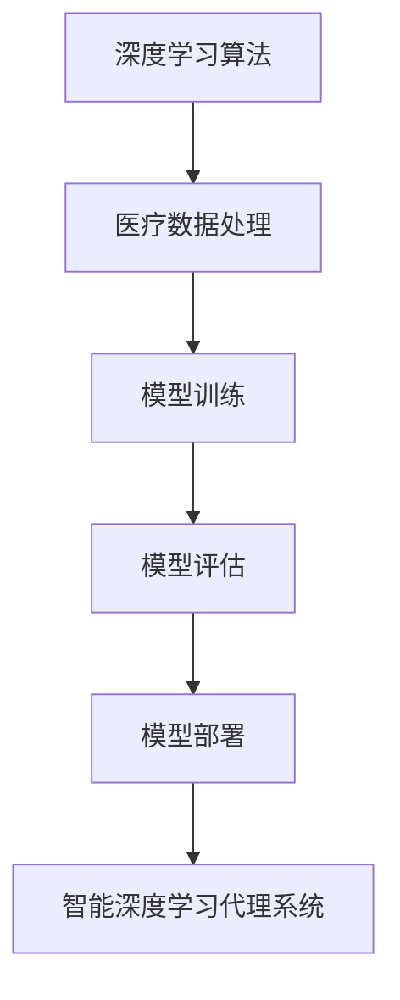

# AI人工智能深度学习算法：在健康医疗领域部署智能深度学习代理

## 1. 背景介绍

### 1.1 问题的由来

在当今的数字化时代,医疗健康领域正面临着前所未有的挑战。随着人口老龄化和慢性疾病的日益增多,传统的医疗体系已经难以满足日益增长的医疗需求。同时,医疗资源的不均衡分布也加剧了这一问题。因此,迫切需要创新的解决方案来提高医疗服务的可及性、质量和效率。

人工智能(AI)和深度学习技术在医疗健康领域的应用被视为一种有前景的解决方案。通过利用大量的医疗数据和强大的计算能力,深度学习算法可以学习复杂的模式和规律,从而实现精准的疾病诊断、个性化的治疗方案以及智能化的医疗决策支持。

### 1.2 研究现状

近年来,AI在医疗健康领域的应用取得了令人鼓舞的进展。深度学习模型已经在医学影像分析、基因组学、药物发现等领域展现出卓越的性能。例如,在医学影像分析中,卷积神经网络(CNN)可以准确地检测和分类肺部结节、乳腺癌等疾病。在基因组学领域,深度学习模型可以预测基因表达模式和蛋白质结构。在药物发现过程中,深度学习也被用于虚拟筛选和优化分子结构。

然而,尽管取得了这些进展,但在实际部署智能深度学习代理系统以提供医疗服务时,仍然存在一些重大挑战。这些挑战包括数据质量和隐私、模型可解释性、系统鲁棒性和可靠性等。

### 1.3 研究意义

成功部署智能深度学习代理系统在医疗健康领域具有重大意义。它可以提高医疗服务的可及性,缓解医疗资源短缺的问题。通过智能代理系统,患者可以获得及时、便捷和个性化的医疗咨询和建议,而无需亲自前往医疗机构。这对于偏远地区和行动不便的人群尤为重要。

此外,智能深度学习代理系统还可以提高医疗决策的质量和一致性。通过学习大量的医疗数据,这些系统可以提供准确的疾病诊断和治疗建议,减少人为判断的偏差和差异。同时,它们还可以帮助医生更好地管理复杂的病例,提高诊疗效率。

最后,智能深度学习代理系统在个性化医疗和预防性健康管理方面也大有可为。通过分析个人的基因、生活方式和医疗数据,这些系统可以提供个性化的健康风险评估和预防性建议,从而促进健康生活方式的养成。

### 1.4 本文结构

本文将全面探讨在医疗健康领域部署智能深度学习代理系统的关键技术和挑战。我们将首先介绍相关的核心概念和技术,包括深度学习算法、医疗数据处理和模型部署等。接下来,我们将深入探讨核心算法原理、数学模型和公式推导,并通过实际案例进行详细说明。

此外,我们还将提供一个端到端的项目实践,包括开发环境搭建、源代码实现、结果分析等,帮助读者更好地理解如何构建和部署智能深度学习代理系统。最后,我们将讨论实际应用场景、未来发展趋势和面临的挑战,并提供相关的工具和资源推荐。

## 2. 核心概念与联系

在探讨部署智能深度学习代理系统之前,我们需要了解一些核心概念和技术,包括深度学习算法、医疗数据处理和模型部署等。这些概念和技术相互关联,共同构建了一个完整的智能系统。

### 2.1 深度学习算法

深度学习算法是构建智能深度学习代理系统的核心。常见的深度学习算法包括卷积神经网络(CNN)、递归神经网络(RNN)、长短期记忆网络(LSTM)、生成对抗网络(GAN)等。这些算法可以从大量的数据中自动学习特征表示和模式,并对新的输入数据进行预测或决策。

在医疗健康领域,深度学习算法广泛应用于医学影像分析、电子病历挖掘、基因组学和药物发现等任务。例如,CNN可以用于检测和分类医学影像中的肿瘤或其他异常;RNN和LSTM可以用于分析电子病历中的临床narrati ve;GAN可以用于生成新的分子结构,加速药物发现过程。

### 2.2 医疗数据处理

医疗数据处理是部署智能深度学习代理系统的关键环节。医疗数据通常包括结构化数据(如电子病历、实验室检查结果等)和非结构化数据(如医学影像、临床笔记等)。这些数据需要进行适当的预处理,如去噪、标准化、特征提取等,以确保深度学习模型的有效训练和高性能。

此外,医疗数据还涉及隐私和安全问题。患者的个人信息和医疗记录需要得到妥善保护,避免泄露或被滥用。因此,在处理医疗数据时,需要采取适当的加密和匿名化措施,确保数据的安全性和隐私性。

### 2.3 模型训练和评估

在获得高质量的医疗数据后,下一步是训练深度学习模型。模型训练是一个迭代的过程,需要调整超参数、优化损失函数等,以获得最佳的模型性能。常见的训练技术包括随机梯度下降、批量归一化、dropout等。

在训练过程中,需要对模型进行评估,以确保其性能满足实际应用的要求。常用的评估指标包括准确率、精确率、召回率、F1分数、ROC曲线下面积(AUC)等。根据评估结果,可以对模型进行微调或重新训练。

### 2.4 模型部署

经过训练和评估后,深度学习模型需要被部署到实际的生产环境中,以提供智能服务。模型部署涉及多个方面,包括模型优化、服务器配置、API接口设计、负载均衡等。

此外,还需要考虑模型的可解释性和可靠性。可解释性意味着模型的决策过程应该是透明和可解释的,以确保其公平性和可信度。可靠性则要求模型在各种情况下都能稳定运行,并具有容错和恢复能力。

### 2.5 智能深度学习代理系统

将上述各个组件整合在一起,就构成了智能深度学习代理系统。该系统可以接收患者的查询或数据输入,并基于训练好的深度学习模型提供智能化的医疗服务,如疾病诊断、治疗建议、风险评估等。

智能深度学习代理系统可以通过多种渠道与患者互动,如网站、移动应用程序、聊天机器人等。它们还可以与现有的医疗信息系统集成,以获取患者的历史数据并提供个性化的服务。

## 3. 核心算法原理 & 具体操作步骤

### 3.1 算法原理概述

在医疗健康领域部署智能深度学习代理系统,常常需要采用多种深度学习算法和模型。每种算法都有其特定的原理和适用场景。以下是一些常见算法的原理概述:

1. **卷积神经网络(CNN)**:
CNN是一种专门用于处理图像和视频数据的深度学习模型。它通过卷积、池化和全连接层来自动学习图像的特征表示,并对图像进行分类或检测。在医学影像分析中,CNN可以用于检测肺部结节、乳腺癌等疾病。

2. **递归神经网络(RNN)和长短期记忆网络(LSTM)**:
RNN和LSTM是处理序列数据(如文本、语音、时间序列等)的有效模型。它们可以捕捉序列数据中的长期依赖关系,并对序列进行预测或生成。在医疗领域,RNN和LSTM可以用于分析电子病历、临床笔记等文本数据,以提取有用的临床信息。

3. **生成对抗网络(GAN)**:
GAN是一种无监督学习模型,由生成器和判别器组成。生成器试图生成逼真的数据样本,而判别器则试图区分真实数据和生成数据。在药物发现领域,GAN可以用于生成新的分子结构,加速新药物的发现过程。

4. **图神经网络(GNN)**:
GNN是一种专门处理图数据(如社交网络、蛋白质结构等)的深度学习模型。它可以有效地捕捉图中节点之间的关系和结构信息。在医疗领域,GNN可以用于分析蛋白质互作网络、基因调控网络等,以揭示疾病的分子机制。

5. **多任务学习模型**:
在实际应用中,我们通常需要解决多个相关任务,如同时进行疾病诊断和风险预测。多任务学习模型可以共享底层的特征表示,提高模型的泛化能力和数据利用率。

这些算法可以单独使用,也可以组合使用,形成复杂的深度学习模型。选择合适的算法和模型架构对于构建高性能的智能深度学习代理系统至关重要。

### 3.2 算法步骤详解

虽然不同的深度学习算法有所不同,但它们的训练过程通常遵循以下基本步骤:

1. **数据预处理**:
首先需要对原始数据进行预处理,包括去噪、标准化、增广等操作。这有助于提高模型的泛化能力和稳健性。

2. **构建模型架构**:
根据任务需求和数据特征,设计合适的深度学习模型架构,包括选择算法类型、确定层数和神经元数量等。

3. **初始化模型参数**:
使用合适的初始化策略(如Xavier初始化、He初始化等)为模型参数赋予初始值。良好的初始化有助于加速模型收敛。

4. **定义损失函数和优化器**:
选择合适的损失函数(如交叉熵损失、均方误差等)和优化算法(如随机梯度下降、Adam等),以最小化损失函数并更新模型参数。

5. **模型训练**:
使用训练数据对模型进行训练,通常需要多次迭代。每次迭代会计算损失函数,并根据优化算法更新模型参数。可以采用批量训练或在线训练等策略。

6. **模型评估**:
在训练过程中,定期使用验证数据对模型进行评估,监控模型的性能指标(如准确率、AUC等)。根据评估结果,可以决定是否继续训练或进行早停等操作。

7. **模型微调和集成**:
对于复杂任务,可以采用模型微调或集成的策略。模型微调是在预训练模型的基础上,使用特定任务数据进行进一步训练。模型集成则是将多个模型的预测结果进行组合,以提高整体性能。

8. **模型部署**:
最后,将训练好的模型部署到生产环境中,提供实际的智能服务。部署过程需要考虑模型优化、API设计、负载均衡等因素。

上述步骤并非一成不变,根据具体算法和任务需求,可能需要进行适当的调整和优化。但总的来说,这些步骤为构建高质量的深度学习模型提供了基本框架。

### 3.3 算法优缺点

每种深度学习算法都有其优缺点,适用于不同的场景和任务。以下是一些常见算法的优缺点分析:

1. **卷积神经网络(CNN)**:
- 优点:
  - 能够自动学习图像的空间特征和层次结构
  - 对平移、缩放和旋转等变换具有一定的鲁棒性
  - 在图像分类、检测和分割任务上表现卓越
- 