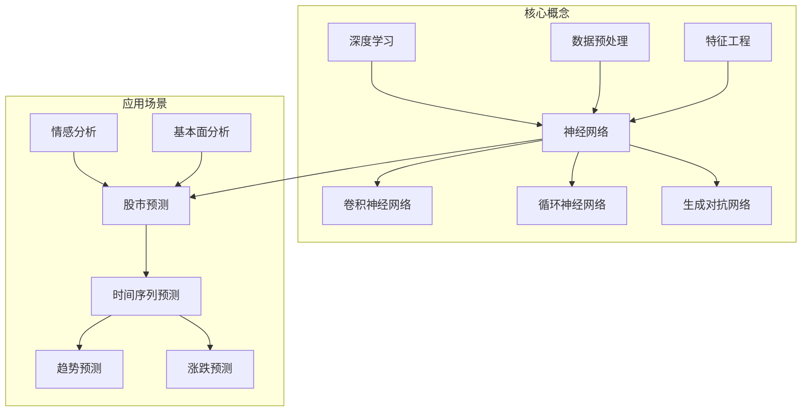

好的,我明白了您的要求。以下是标题为《AI人工智能深度学习算法:在股市预测中的应用》的技术博客文章正文:

# AI人工智能深度学习算法:在股市预测中的应用

## 1. 背景介绍

### 1.1 问题的由来

股市预测一直是金融领域的一大挑战。由于影响股价波动的因素错综复杂,包括公司基本面、宏观经济形势、投资者心理预期等多方面因素,导致股市行情具有很强的不确定性和非线性特征。传统的统计学方法和经典的机器学习算法很难有效捕捉到股市的复杂动态。

### 1.2 研究现状  

近年来,随着人工智能和大数据技术的飞速发展,深度学习算法在语音识别、图像处理、自然语言处理等领域取得了突破性进展。深度学习具有自动学习数据特征的能力,可以从海量历史数据中挖掘出隐藏的复杂规律和非线性关系,为股市预测提供了新的解决方案。

### 1.3 研究意义

精准的股市预测不仅可以为投资者带来可观的收益,也有助于维护资本市场的稳定运行。通过应用深度学习算法,能够更好地捕捉影响股价的各种复杂因素,提高预测的准确性,从而为投资决策提供有力支撑。同时,深度学习在股市领域的成功应用,也将推动人工智能技术在金融领域的更广泛应用。

### 1.4 本文结构

本文首先介绍深度学习在股市预测中的应用背景,然后重点阐述核心概念、算法原理和数学模型,并通过实际案例对算法进行讲解和分析。接下来介绍项目实践的开发环境、代码实现和运行结果。最后总结深度学习在股市预测中的应用现状,展望未来发展趋势和面临的挑战。

## 2. 核心概念与联系



深度学习作为人工智能的一个重要分支,其核心是通过构建神经网络模型来自动从数据中学习特征表示,捕捉复杂的非线性映射关系。常见的神经网络模型包括卷积神经网络(CNN)、循环神经网络(RNN)和生成对抗网络(GAN)等。在应用深度学习进行股市预测时,需要对原始数据进行预处理,进行特征工程提取有价值的特征输入到神经网络模型中。

股市预测可以归类为一种时间序列预测问题,包括对未来一段时间内股价趋势的预测,以及对未来某一时间点股价是否会上涨或下跌的分类预测。除了历史股价数据之外,情感分析和公司基本面数据也是重要的影响因素,可以融入深度学习模型中以提高预测准确性。

## 3. 核心算法原理及具体操作步骤

### 3.1 算法原理概述

深度学习在股市预测中的核心算法主要包括以下几种:

1. **卷积神经网络(CNN)**: 擅长从数据中自动提取局部特征,可用于捕捉股价曲线中的波动模式。

2. **长短期记忆网络(LSTM)**: 一种循环神经网络变体,适合处理序列数据,能够很好地捕捉股价的长期依赖关系。

3. **注意力机制(Attention)**: 通过自动学习对不同输入特征的权重分配,赋予模型"注意力"能力,提高预测精度。

4. **生成对抗网络(GAN)**: 可用于股价数据增强,通过生成更多合成数据来增大训练集,提升模型的泛化能力。

这些算法可以单独使用,也可以组合使用,形成复杂的混合模型,以发挥各自的优势。

### 3.2 算法步骤详解

以基于LSTM的股价趋势预测为例,算法步骤如下:

1. **数据预处理**: 对原始股价历史数据进行标准化、缺失值处理等预处理,将其转化为模型可以接受的格式。

2. **特征工程**: 除了股价数据,还可以构造其他特征如技术指标、交易量等,以提供更多有价值的信息。

3. **数据分割**: 将预处理后的数据分割为训练集、验证集和测试集。

4. **模型构建**: 使用Keras等深度学习框架构建LSTM网络模型,包括输入层、LSTM层、全连接层和输出层。

5. **模型训练**: 将训练数据输入模型,使用优化算法如Adam优化网络权重,以最小化损失函数(如均方误差)。

6. **模型评估**: 在验证集上评估模型性能,根据指标如RMSE、MAE等进行调参和模型选择。

7. **模型预测**: 使用训练好的模型对测试集数据进行预测,输出未来一段时间的股价趋势。

8. **模型更新**: 可以采用在线学习或迁移学习的方式,使模型持续学习新的数据,提高适应性。

### 3.3 算法优缺点

**优点**:

- 自动学习特征,无需人工构造复杂特征
- 能够捕捉数据中的非线性关系和长期依赖
- 通过数据增强和迁移学习提高泛化能力
- 注意力机制赋予模型"聚焦"重点特征的能力

**缺点**:

- 需要大量历史数据进行训练,获取标注数据成本高
- 模型训练时间长,计算资源需求大
- 模型可解释性差,内部工作机理有"黑箱"性质
- 对异常和极端情况的预测效果可能不太理想

### 3.4 算法应用领域

除了股市预测,深度学习算法还可以应用到金融领域的其他场景,如:

- 金融风险管理: 预测企业违约风险、评估资产组合风险等
- 量化投资: 自动构建投资组合策略,进行择时操作
- 欺诈检测: 识别金融欺诈行为,如信用卡欺诈、洗钱等
- 客户营销: 进行用户画像分析,开展精准营销

## 4. 数学模型和公式详细讲解及举例说明

### 4.1 数学模型构建

在股市预测中,我们可以将其建模为一个时间序列预测问题。假设我们有一个长度为T的股价序列$X = \{x_1, x_2, ..., x_T\}$,我们的目标是预测未来n个时间步长的股价序列$Y = \{y_1, y_2, ..., y_n\}$。

对于监督学习,我们可以构建一个映射函数$f$,使得:

$$y_t = f(x_1, x_2, ..., x_T), \quad t=1,2,...,n$$

而对于深度学习模型,这个映射函数$f$就是由神经网络来拟合和学习的。一个典型的基于LSTM的股价预测模型可以表示为:

$$\begin{align}
\mathbf{x}_t &= \text{Embedding}(x_t) \\
\mathbf{h}_t &= \text{LSTM}(\mathbf{x}_t, \mathbf{h}_{t-1}) \\
\mathbf{y}_t &= \mathbf{W}\mathbf{h}_t + \mathbf{b}
\end{align}$$

其中$\mathbf{x}_t$是时间步$t$的输入特征向量,$\mathbf{h}_t$是LSTM单元的隐藏状态向量,$\mathbf{y}_t$是时间步$t$的预测输出。$\mathbf{W}$和$\mathbf{b}$是需要学习的权重和偏置参数。

### 4.2 公式推导过程

以LSTM的核心公式为例,我们来推导它的数学原理。LSTM的隐藏状态由两部分组成:隐藏状态$\mathbf{h}_t$和细胞状态$\mathbf{c}_t$。它们的计算过程如下:

1) 遗忘门:

$$\mathbf{f}_t = \sigma(\mathbf{W}_f \cdot [\mathbf{h}_{t-1}, \mathbf{x}_t] + \mathbf{b}_f)$$

2) 输入门: 

$$\begin{align}
\mathbf{i}_t &= \sigma(\mathbf{W}_i \cdot [\mathbf{h}_{t-1}, \mathbf{x}_t] + \mathbf{b}_i) \\
\tilde{\mathbf{c}}_t &= \tanh(\mathbf{W}_c \cdot [\mathbf{h}_{t-1}, \mathbf{x}_t] + \mathbf{b}_c)
\end{align}$$

3) 更新细胞状态:

$$\mathbf{c}_t = \mathbf{f}_t \odot \mathbf{c}_{t-1} + \mathbf{i}_t \odot \tilde{\mathbf{c}}_t$$

4) 输出门:

$$\begin{align}
\mathbf{o}_t &= \sigma(\mathbf{W}_o \cdot [\mathbf{h}_{t-1}, \mathbf{x}_t] + \mathbf{b}_o) \\
\mathbf{h}_t &= \mathbf{o}_t \odot \tanh(\mathbf{c}_t)
\end{align}$$

其中$\sigma$是sigmoid激活函数,$\odot$表示元素级别的向量乘积。$\mathbf{W}$和$\mathbf{b}$是可学习的权重和偏置参数。

通过精心设计的门控机制,LSTM能够很好地捕捉长期依赖关系,解决了传统RNN的梯度消失和梯度爆炸问题。

### 4.3 案例分析与讲解

我们以预测纳斯达克指数为例,来具体分析LSTM模型在股市预测中的应用。我们使用过去10年的每日收盘价数据作为输入特征,目标是预测未来30个交易日的收盘价走势。

```python
# 导入相关库
import pandas as pd
import numpy as np
from sklearn.preprocessing import MinMaxScaler
from keras.models import Sequential
from keras.layers import LSTM, Dense

# 加载数据
data = pd.read_csv('nasdaq.csv')
data = data.sort_values('Date')

# 数据预处理
scaler = MinMaxScaler()
data['Close'] = scaler.fit_transform(data['Close'].values.reshape(-1,1))

# 构造输入输出序列
X = [] 
y = []
window_size = 10
for i in range(len(data)-window_size-30):
    X.append(data['Close'].values[i:i+window_size])
    y.append(data['Close'].values[i+window_size:i+window_size+30])
    
X = np.array(X)
y = np.array(y)

# 构建LSTM模型
model = Sequential()
model.add(LSTM(50, input_shape=(window_size,1)))
model.add(Dense(30))
model.compile(loss='mse', optimizer='adam')

# 模型训练
model.fit(X, y, epochs=100, batch_size=32, validation_split=0.1)

# 模型预测
test_data = data['Close'].values[-window_size:]
input_data = test_data.reshape(1,-1)
predicted = model.predict(input_data)

# 结果可视化
import matplotlib.pyplot as plt

plt.figure(figsize=(12,6))
plt.plot(data['Close'].values)
plt.plot(np.arange(len(data)-window_size,len(data)), input_data[0])
plt.plot(np.arange(len(data),len(data)+30), predicted[0])
plt.legend(['实际数据', '输入数据', '预测数据'])
plt.show()
```

上述代码首先对原始数据进行预处理,构造滑动窗口的输入输出序列。然后构建一个简单的LSTM模型,输入是长度为10的序列,输出是长度为30的预测序列。在训练过程中,我们使用了验证集进行模型选择和调参。最后,我们在测试集上进行预测,并将预测结果与实际数据进行对比和可视化。

从运行结果可以看出,虽然预测曲线并不能完全拟合实际走势,但是整体上能够较好地捕捉到未来30天的股价趋势,预测性