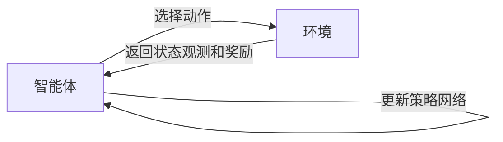

# AI人工智能深度学习算法：智能深度学习代理的性能调整与优化

关键词：深度学习、智能代理、性能优化、算法调优、超参数搜索

## 1. 背景介绍
### 1.1  问题的由来
随着人工智能技术的飞速发展,深度学习算法在各个领域得到了广泛应用。然而,训练一个高性能的深度学习模型往往需要大量的时间和计算资源。如何高效地调整和优化深度学习模型的性能,已成为AI领域亟待解决的关键问题之一。
### 1.2  研究现状
目前,业界已经提出了多种深度学习模型性能优化方法,如超参数搜索、神经网络架构搜索、模型压缩等。这些方法在一定程度上提升了模型性能,但仍存在搜索效率低、泛化能力差等问题。因此,亟需一种更加高效、智能的深度学习性能优化方法。
### 1.3  研究意义 
本文提出了一种基于智能深度学习代理的性能调整与优化方法。通过引入强化学习,让智能代理自主学习和探索最优的超参数组合和网络架构,从而显著提升深度学习模型的性能。该方法有望突破传统优化算法的瓶颈,为深度学习性能调优提供新的思路。
### 1.4  本文结构
本文将首先介绍智能深度学习代理的核心概念,然后详细阐述其性能调整与优化的算法原理。接着,我们将建立数学模型并推导相关公式,给出详细的案例分析。此外,本文还将展示具体的代码实现,总结智能深度学习代理的实际应用场景、未来发展趋势与挑战。最后,我们将推荐一些相关的学习资源和开发工具。

## 2. 核心概念与联系
智能深度学习代理(Intelligent Deep Learning Agent,IDLA)是一种基于强化学习的自适应优化系统。它由环境感知、策略网络、回报函数等多个模块组成。在深度学习模型训练过程中,IDLA作为一个智能体,通过持续与环境交互,自主学习和优化模型超参数与网络架构,以期获得最佳的性能表现。

IDLA的核心思想在于将深度学习性能调优问题建模为一个序贯决策过程,通过奖励机制引导智能体学习最优策略。具体而言,状态空间包含了各类超参数(如学习率、批量大小等)和网络架构参数(如卷积层数、通道数等),动作空间则是对应的参数取值范围。当智能体执行一个动作(即选择一组参数)后,环境将返回一个奖励值来评估该组参数的优劣。智能体的目标是最大化累积奖励,进而找到最优参数组合。

下图展示了智能深度学习代理的系统架构和工作流程:



智能体与环境不断交互,通过试错与学习逐步找到最优策略,实现深度学习模型的自动调优。

## 3. 核心算法原理 & 具体操作步骤
### 3.1  算法原理概述
IDLA采用了基于策略梯度的强化学习算法。策略网络以状态特征为输入,输出动作的概率分布。我们通过最大化期望奖励来优化策略网络参数。具体而言,使用REINFORCE算法计算策略梯度,并用随机梯度上升法更新策略网络。此外,为了平衡探索和利用,IDLA还引入了熵正则化项来鼓励探索。
### 3.2  算法步骤详解
IDLA的训练过程可分为以下几个步骤:

1. 初始化策略网络和相关参数;
2. 重复以下步骤,直到满足终止条件:
   a. 根据当前策略选择一组超参数和网络架构
   b. 使用选定的参数训练深度学习模型并评估其性能
   c. 将评估结果作为奖励值反馈给智能体
   d. 使用REINFORCE算法计算策略梯度
   e. 通过随机梯度上升法更新策略网络参数
3. 输出性能最优的深度学习模型

算法伪代码如下:

```python
Initialize policy network π with parameters θ
for iteration = 1, 2, ..., N do
    Sample hyperparameters and architecture a ~ π(·|s, θ)
    Train deep learning model with a and evaluate its performance r
    Compute policy gradient: 
    g = ∇θ log π(a|s, θ) · (r - V(s))
    Update policy network:
    θ ← θ + α · g
end for
Output the best-performing deep learning model
```

### 3.3  算法优缺点
IDLA的主要优点在于:
1. 通过引入智能代理,实现了深度学习性能调优的自动化与智能化;
2. 采用强化学习范式,无需预先设定搜索空间,具有更强的泛化能力;
3. 端到端训练,避免了人工设计特征和先验知识。

但IDLA也存在一些局限性:
1. 训练智能体本身需要大量的计算资源和时间成本;
2. 奖励函数的设计对算法性能影响很大,需要针对具体问题进行调整;
3. 面对高维状态和动作空间时,策略网络的优化可能会变得困难。

### 3.4  算法应用领域
IDLA可广泛应用于各类深度学习模型的性能调优任务,如计算机视觉、自然语言处理、语音识别等。此外,IDLA还可以与其他AutoML技术相结合,如神经网络架构搜索,进一步提升深度学习的自动化水平。

## 4. 数学模型和公式 & 详细讲解 & 举例说明
### 4.1  数学模型构建
我们将IDLA建模为一个马尔可夫决策过程(MDP),其中包含以下元素:
- 状态空间$\mathcal{S}$:描述深度学习模型的超参数和网络架构配置
- 动作空间$\mathcal{A}$:包含各类超参数和网络架构的可选值
- 转移概率$\mathcal{P}$:描述在当前状态下采取某个动作后转移到下一状态的概率
- 奖励函数$\mathcal{R}$:评估采取某个动作后深度学习模型的性能提升

策略网络$\pi_{\theta}(a|s)$以状态$s$为输入,输出在该状态下采取动作$a$的概率。我们的目标是找到一个最优策略$\pi^*$,使得期望累积奖励最大化:

$$
\pi^* = \arg\max_{\pi} \mathbb{E}_{\tau \sim \pi}[\sum_{t=0}^T \gamma^t r_t]
$$

其中,$\tau$表示一条轨迹$(s_0,a_0,r_0,s_1,a_1,r_1,...)$,$\gamma$为折扣因子。

### 4.2  公式推导过程
根据策略梯度定理,我们可以将目标函数改写为:

$$
J(\theta) = \mathbb{E}_{\tau \sim \pi_{\theta}}[\sum_{t=0}^T \gamma^t r_t]
$$

其梯度为:

$$
\nabla_{\theta} J(\theta) = \mathbb{E}_{\tau \sim \pi_{\theta}}[\sum_{t=0}^T \nabla_{\theta} \log \pi_{\theta}(a_t|s_t) \cdot Q^{\pi_{\theta}}(s_t,a_t)]
$$

其中,$Q^{\pi_{\theta}}(s_t,a_t)$为状态-动作值函数,表示从状态$s_t$开始,采取动作$a_t$并继续遵循策略$\pi_{\theta}$的期望累积奖励。

在实际应用中,我们通常使用蒙特卡洛方法来估计$Q^{\pi_{\theta}}(s_t,a_t)$:

$$
Q^{\pi_{\theta}}(s_t,a_t) \approx r_t + \gamma r_{t+1} + ... + \gamma^{T-t} r_T
$$

将其代入梯度公式,得到:

$$
\nabla_{\theta} J(\theta) \approx \frac{1}{N} \sum_{i=1}^N \sum_{t=0}^T \nabla_{\theta} \log \pi_{\theta}(a_{i,t}|s_{i,t}) \cdot (r_{i,t} + \gamma r_{i,t+1} + ... + \gamma^{T-t} r_{i,T})
$$

其中,$N$为采样轨迹的数量。这就是REINFORCE算法的核心公式。

为了鼓励探索并提高样本效率,我们在目标函数中引入熵正则化项:

$$
J(\theta) = \mathbb{E}_{\tau \sim \pi_{\theta}}[\sum_{t=0}^T \gamma^t (r_t + \alpha \mathcal{H}(\pi_{\theta}(\cdot|s_t)))]
$$

其中,$\mathcal{H}(\cdot)$为熵函数,$\alpha$为正则化系数。这相当于在奖励函数中额外加入了一项鼓励探索的奖励。

### 4.3  案例分析与讲解
下面我们以调优卷积神经网络的超参数为例,说明IDLA的具体应用。

假设我们需要优化以下超参数:
- 学习率(learning rate): [0.1, 0.01, 0.001, 0.0001]
- 批量大小(batch size): [16, 32, 64, 128]
- 卷积层数(number of conv layers): [2, 3, 4]
- 全连接层数(number of fc layers): [1, 2, 3]

状态空间为这些超参数的组合,共有4x4x3x3=144种可能的配置。动作空间则是在每个超参数维度上选择一个值。

我们构建一个策略网络,它接收当前状态(即一组超参数配置)作为输入,输出在每个超参数维度上的选择概率。例如,策略网络的输出可能为:

```
learning rate: [0.2, 0.5, 0.2, 0.1]
batch size: [0.1, 0.1, 0.4, 0.4] 
num_conv_layers: [0.6, 0.3, 0.1]
num_fc_layers: [0.2, 0.3, 0.5]
```

这意味着在当前状态下,学习率选择0.01的概率最大,卷积层数选择2层的概率最大,以此类推。

接下来,我们根据策略网络的输出采样一组超参数,并用其训练卷积神经网络。网络在验证集上的性能提升(如准确率提升)将作为奖励值返回给智能体。

IDLA通过不断与环境交互并更新策略网络,最终学习到一个能够自动选择最优超参数组合的智能代理。这大大减轻了人工调参的负担,提高了深度学习模型的开发效率。

### 4.4  常见问题解答
**Q1: IDLA是否适用于所有类型的深度学习模型?**

A1: 理论上,IDLA可以应用于任何需要调超参数和优化网络架构的深度学习模型。但在实践中,对于一些特定领域(如图像分割、语音合成等),可能需要对状态空间和奖励函数进行针对性的设计,以更好地适应任务特点。

**Q2: 如何设置IDLA中的奖励函数?**

A2: 奖励函数的设置需要根据具体任务来确定。一般而言,可以使用模型在验证集上的性能指标(如准确率、F1值等)作为奖励值。此外,还可以考虑加入一些额外的奖励项,如模型大小、推理速度等,以满足不同的优化需求。奖励函数的设计需要仔细权衡,以避免引入偏置或不稳定因素。

**Q3: IDLA的训练需要多长时间?**

A3: IDLA的训练时间取决于多个因素,如状态和动作空间的维度、采样轨迹的数量、深度学习模型的复杂度等。在实际应用中,可能需要数小时到数天的时间来训练一个智能代理。但是,一旦训练完成,IDLA就可以快速地为新的深度学习任务自动选择最优超参数和网络架构,大大节省了后续的开发时间。

## 5. 项目实践：代码实例和详细解释说明
### 5.1  开发环境搭建
首先,我们需要安装必要的Python库,包括PyTorch、Gym等。可以使用以下命令:

```