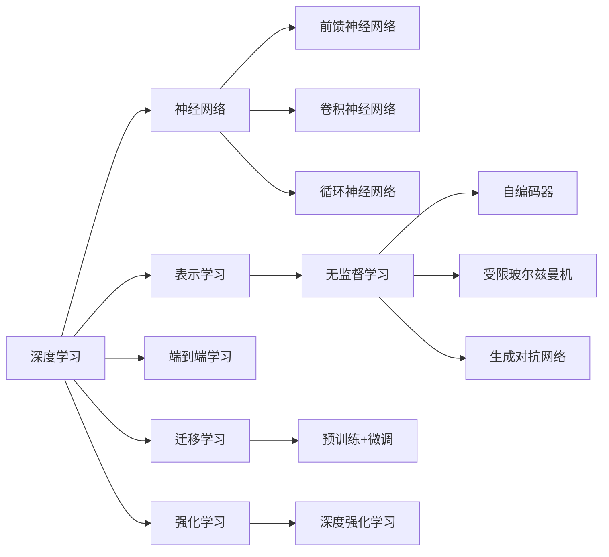

# AI人工智能深度学习算法：深度学习的挑战与前景

关键词：人工智能, 深度学习, 神经网络, 卷积神经网络, 循环神经网络, 无监督学习, 迁移学习, 强化学习, 生成对抗网络

## 1. 背景介绍
### 1.1  问题的由来
人工智能(Artificial Intelligence, AI)是计算机科学的一个重要分支,其目标是研究如何让计算机模拟甚至超越人类的智能。近年来,随着计算机硬件性能的飞速提升和大数据时代的来临,深度学习(Deep Learning, DL)作为人工智能的一个重要分支,取得了令人瞩目的成就,在计算机视觉、自然语言处理、语音识别等领域不断刷新着最高记录。然而,深度学习算法仍然面临着诸多挑战,如何进一步提升深度学习算法的性能和泛化能力,是学术界和工业界共同关注的热点问题。

### 1.2  研究现状
目前,深度学习算法主要包括卷积神经网络(Convolutional Neural Networks, CNN)、循环神经网络(Recurrent Neural Networks, RNN)、生成对抗网络(Generative Adversarial Networks, GAN)等。其中,CNN在计算机视觉领域取得了突破性进展,AlexNet、VGGNet、GoogLeNet、ResNet等经典CNN模型相继问世,极大地提升了图像分类、目标检测、语义分割等任务的性能。RNN则在序列数据建模方面展现出强大的能力,广泛应用于机器翻译、语音识别、情感分析等任务。近年来,GAN作为一种新兴的生成模型,可以生成逼真的图像和视频,在图像翻译、超分辨率重建等任务上取得了惊人的效果。

除了上述经典模型,一些新的学习范式也受到广泛关注,如迁移学习(Transfer Learning)、元学习(Meta Learning)、联邦学习(Federated Learning)等。迁移学习利用已训练好的模型作为新任务的初始化或特征提取器,可以大幅减少新任务所需的标注数据和训练时间。元学习则是让模型学会如何学习,从而可以快速适应新的任务。联邦学习致力于在保护用户隐私的前提下,实现多个参与方之间的协同学习。

尽管深度学习取得了巨大成功,但其仍然存在一些局限性。首先,深度学习算法通常需要大量的标注数据进行训练,而人工标注数据非常昂贵。其次,深度学习模型容易过拟合,泛化能力有待提高。此外,深度学习模型的可解释性较差,难以解释其内部工作机制。因此,如何进一步改进深度学习算法,提升其性能和泛化能力,是目前亟待解决的问题。

### 1.3  研究意义
深度学习作为人工智能的核心技术之一,在学术界和工业界都具有重要的研究意义。从学术角度来看,深入研究深度学习算法的内在机理,探索新的网络结构和学习范式,有助于推动人工智能基础理论的发展。从应用角度来看,深度学习已经在多个领域取得了突破性进展,如自动驾驶、医学影像分析、智能客服等,大大提高了生产效率和生活质量。因此,深入研究深度学习算法,对于促进人工智能产业发展,推动社会进步具有重要意义。

### 1.4  本文结构
本文将全面探讨深度学习算法的原理、模型、应用以及面临的挑战。第2节介绍深度学习的核心概念及其内在联系。第3节重点阐述几种主流深度学习算法的原理和实现步骤。第4节建立深度学习的数学模型,并结合具体案例进行详细讲解。第5节通过代码实例,演示如何使用主流深度学习框架实现经典模型。第6节总结深度学习的主要应用场景及未来应用前景。第7节推荐深度学习领域常用的学习资源、开发工具和相关文献。第8节总结全文,展望深度学习未来的发展趋势和面临的挑战。第9节列举深度学习常见问题并给出解答。

## 2. 核心概念与联系
深度学习是机器学习的一个分支,其核心思想是通过构建具有多个隐藏层的人工神经网络,来自动学习数据的内在特征和规律。与传统的机器学习方法相比,深度学习具有以下优势:

1. 特征学习能力强。传统机器学习通常需要人工设计特征,而深度学习可以自动学习层次化的特征表示,从原始数据中提取高级抽象特征。

2. 建模能力强。得益于多个非线性隐藏层的叠加,深度学习可以拟合非常复杂的函数,对高维非线性数据建模。  

3. 端到端学习。深度学习可以直接从原始数据学习到输出,不需要人工干预,实现端到端的学习过程。

4. 迁移能力强。深度学习模型可以在不同但相关的任务间进行迁移,大大减少新任务所需的训练数据和时间。

深度学习与其他几个重要概念密切相关,包括:

- 神经网络:深度学习模型的基本组成单元,由大量的人工神经元互联而成。常见的神经网络包括前馈神经网络、卷积神经网络、循环神经网络等。

- 表示学习:深度学习的重要特征之一,指自动学习数据的多层次特征表示,从低级特征到高级语义特征。

- 无监督学习:不需要标注数据,直接从数据中学习内在结构和规律。常见的无监督学习模型包括自编码器、受限玻尔兹曼机、生成对抗网络等。

- 迁移学习:将已训练好的模型应用到新的相关任务上,实现知识的迁移和复用。预训练+微调是常用的迁移学习范式。

- 强化学习:通过智能体与环境的交互,学习最优的决策序列来获得最大累积奖励。深度强化学习将深度学习引入强化学习,取得了显著成效。

下图展示了深度学习的核心概念及其内在联系:

## 3. 核心算法原理 & 具体操作步骤
### 3.1  算法原理概述
深度学习的核心是通过构建多层神经网络,来自动学习数据的层次化特征表示。常见的深度学习算法包括:

1. 卷积神经网络(CNN):主要用于图像、视频等网格型数据。CNN通过局部连接和权值共享,可以有效地提取空间局部特征。

2. 循环神经网络(RNN):主要用于序列数据如文本、语音等。RNN通过将前一时刻的隐藏状态作为当前时刻的输入,可以建模数据的时间依赖关系。

3. 生成对抗网络(GAN):由生成器和判别器组成,通过两者的博弈学习来生成逼真的数据样本。GAN常用于图像生成、风格迁移等任务。

4. 图神经网络(GNN):主要用于图结构数据如社交网络、分子结构等。GNN通过聚合节点的邻居信息,可以有效地学习节点的embedding表示。

5. Transformer:主要用于自然语言处理任务。Transformer抛弃了RNN的循环结构,完全依靠注意力机制来建模文本之间的依赖关系。

### 3.2  算法步骤详解
以CNN为例,详细介绍其算法步骤:

1. 卷积层:对输入图像进行卷积操作,提取局部特征。卷积操作可以表示为:
$$
\mathbf{Z} = \mathbf{W} * \mathbf{X} + \mathbf{b}
$$
其中,$\mathbf{W}$为卷积核,$\mathbf{X}$为输入特征图,$\mathbf{b}$为偏置项。

2. 激活层:对卷积层的输出进行非线性变换,提高网络的表达能力。常用的激活函数包括ReLU、Sigmoid、Tanh等。以ReLU为例:
$$
\mathbf{A} = max(0, \mathbf{Z})
$$

3. 池化层:对激活层的输出进行下采样,减小特征图的尺寸,提高特征的鲁棒性。常用的池化操作包括最大池化和平均池化。

4. 全连接层:将池化层输出的特征图展平为一维向量,并通过全连接的方式进行分类或回归预测。

5. 损失函数:衡量模型预测值与真实值之间的差异,常用的损失函数包括交叉熵损失、均方误差损失等。

6. 优化算法:通过最小化损失函数来更新模型参数,常用的优化算法包括随机梯度下降(SGD)、Adam、RMSprop等。

### 3.3  算法优缺点
以CNN为例,分析其优缺点:

优点:
- 局部连接和权值共享,大大减少了参数量,降低了过拟合风险。
- 平移不变性,对图像的平移、旋转等变换具有鲁棒性。
- 层次化特征提取,可以自动学习从低级到高级的特征表示。

缺点:  
- 需要大量标注数据进行训练,对于小样本学习效果不佳。
- 对于非网格型数据如图结构数据,表现力受限。
- 可解释性差,难以解释模型的内部工作机制。

### 3.4  算法应用领域
深度学习算法已经在多个领域取得了广泛应用,主要包括:

- 计算机视觉:图像分类、目标检测、语义分割、人脸识别等。
- 自然语言处理:机器翻译、情感分析、问答系统、文本生成等。  
- 语音识别:语音转文本、说话人识别、语音合成等。
- 推荐系统:个性化推荐、协同过滤等。
- 生物医疗:医学影像分析、药物发现、基因组学等。

随着深度学习技术的不断发展,其应用领域也在不断扩展,未来有望在更多领域发挥重要作用。

## 4. 数学模型和公式 & 详细讲解 & 举例说明
### 4.1  数学模型构建
以图像分类任务为例,介绍CNN的数学模型。假设输入图像为$\mathbf{X} \in \mathbb{R}^{H \times W \times C}$,其中$H$、$W$、$C$分别表示图像的高度、宽度和通道数。CNN的数学模型可以表示为:
$$
\mathbf{Y} = f(\mathbf{X}; \theta)
$$
其中,$\mathbf{Y} \in \mathbb{R}^{K}$为模型的输出,$K$为类别数。$f$为CNN的映射函数,$\theta$为CNN的参数。

CNN的映射函数$f$可以进一步表示为多个卷积层、激活层、池化层和全连接层的复合函数:
$$
f(\mathbf{X}) = f_L(...f_2(f_1(\mathbf{X})))
$$
其中,$L$为网络的层数。$f_l$表示第$l$层的映射函数,可以是卷积、激活、池化或全连接操作。

### 4.2  公式推导过程
以卷积层的前向传播为例,推导其数学公式。假设卷积层的输入为$\mathbf{X} \in \mathbb{R}^{H \times W \times C}$,卷积核为$\mathbf{W} \in \mathbb{R}^{K \times K \times C \times D}$,偏置项为$\mathbf{b} \in \mathbb{R}^{D}$,其中$K$为卷积核大小,$D$为输出通道数。卷积层的输出$\mathbf{Z} \in \mathbb{R}^{H' \times W' \times D}$