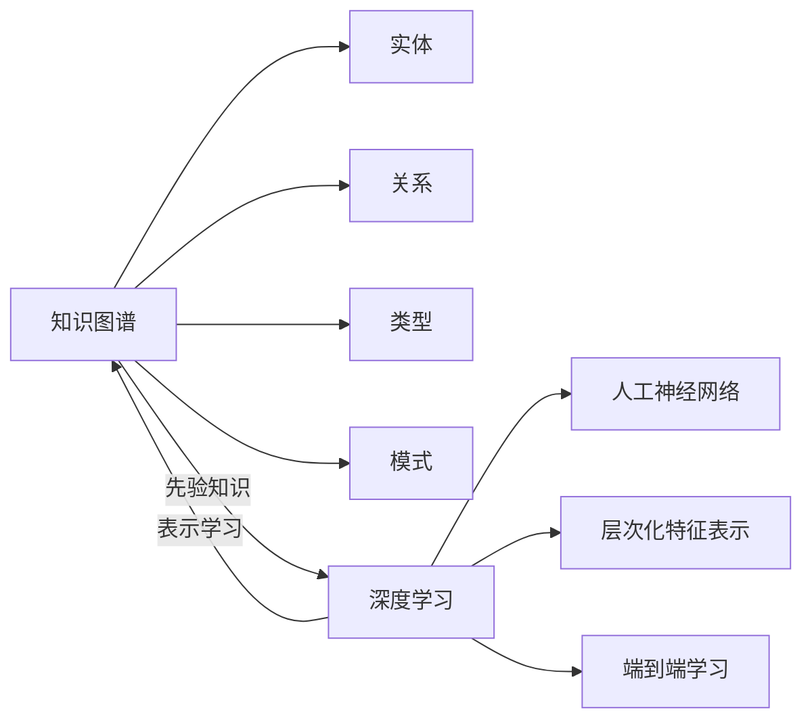

# AI人工智能深度学习算法：知识图谱在深度学习代理中的应用

作者：禅与计算机程序设计艺术 / Zen and the Art of Computer Programming

关键词：深度学习、知识图谱、人工智能、深度学习代理、知识表示

## 1. 背景介绍

### 1.1 问题的由来

随着人工智能技术的飞速发展,深度学习已经成为当前人工智能领域的研究热点。深度学习模型在计算机视觉、自然语言处理等领域取得了巨大的成功。然而,传统的深度学习模型主要依赖于大量的标注数据进行训练,缺乏对知识的显式表示和推理能力。这使得深度学习模型难以适应复杂的现实场景,尤其是在知识密集型任务中表现不佳。

知识图谱作为一种结构化知识表示方法,能够以图的形式表示实体及其之间的关系。将知识图谱引入深度学习,可以显式地将先验知识融入到深度学习模型中,增强模型的可解释性和泛化能力。这种将知识图谱与深度学习相结合的方法,被称为知识图谱增强的深度学习。

### 1.2 研究现状

近年来,知识图谱增强的深度学习受到了学术界和工业界的广泛关注。一些研究者提出了将知识图谱嵌入到深度学习模型中的方法,如知识图谱嵌入[1]、知识图谱注意力网络[2]等。这些方法通过将知识图谱中的实体和关系映射到低维向量空间,使得深度学习模型能够更好地理解和利用结构化知识。

除了将知识图谱嵌入到深度学习模型中,一些研究者还探索了将知识图谱用于指导深度学习模型训练的方法。例如,将知识图谱作为先验知识,通过正则化项[3]或损失函数[4]引入到模型训练中,使得模型在学习过程中能够遵循先验知识的约束。

### 1.3 研究意义

将知识图谱引入深度学习,对于提升人工智能系统的性能和可解释性具有重要意义:

1. 增强模型的泛化能力:通过利用知识图谱中的结构化知识,深度学习模型可以更好地理解和推理未见过的实例,提高模型的泛化能力。

2. 提高模型的可解释性:知识图谱以图的形式表示知识,具有良好的可解释性。将知识图谱融入深度学习,可以使模型的决策过程更加透明和可解释。

3. 减少对标注数据的依赖:利用知识图谱中的先验知识,可以减少深度学习模型对大量标注数据的依赖,在标注数据稀缺的情况下也能取得良好的性能。

4. 支持知识密集型任务:在知识密集型任务如问答、推荐等领域,知识图谱可以为深度学习模型提供丰富的背景知识,提升任务性能。

### 1.4 本文结构

本文将详细介绍知识图谱在深度学习中的应用,重点探讨知识图谱增强的深度学习代理。全文结构如下:

第2节介绍知识图谱和深度学习的核心概念及其联系。
第3节详细阐述知识图谱增强的深度学习代理的核心算法原理和具体操作步骤。
第4节给出知识图谱增强深度学习的数学模型和公式,并通过详细讲解和举例说明加深理解。
第5节通过代码实例和详细解释,演示知识图谱增强深度学习代理的实现过程。
第6节讨论知识图谱增强深度学习的实际应用场景。
第7节推荐相关的学习资源、开发工具和研究论文。
第8节总结全文,展望知识图谱增强深度学习的未来发展趋势和面临的挑战。
第9节附录,回答一些常见问题。

## 2. 核心概念与联系

在探讨知识图谱在深度学习中的应用之前,我们首先需要了解知识图谱和深度学习的核心概念及其联系。

知识图谱(Knowledge Graph)是一种结构化知识表示方法,它以图的形式表示实体(Entity)及其之间的关系(Relation)。形式化地,知识图谱可以表示为一个三元组$(h,r,t)$的集合,其中$h$表示头实体(Head Entity),$r$表示关系,$t$表示尾实体(Tail Entity)。知识图谱中的实体和关系通常具有类型(Type),实体和关系的类型构成了知识图谱的模式(Schema)。知识图谱能够以结构化的方式表示复杂的现实世界知识,支持知识的存储、检索和推理。

深度学习(Deep Learning)是一种基于人工神经网络(Artificial Neural Network)的机器学习方法。深度学习模型通过多层非线性变换,自动学习数据中的层次化特征表示。与传统的机器学习方法相比,深度学习能够自动学习特征,无需人工设计特征,在图像分类、语音识别、自然语言处理等领域取得了巨大成功。然而,传统的深度学习模型主要依赖于大量标注数据进行训练,学习到的特征表示难以解释,缺乏显式的知识表示和推理能力。

知识图谱和深度学习看似是两个不同的领域,但它们之间存在着紧密的联系。知识图谱中的结构化知识可以为深度学习提供先验知识,指导深度学习模型的训练和推理。将知识图谱引入深度学习,一方面可以增强深度学习模型对知识的理解和利用能力,另一方面可以利用深度学习强大的表示学习能力,学习知识图谱中的隐含模式。知识图谱和深度学习的结合,有望突破传统深度学习模型的局限性,实现更加智能和可解释的人工智能系统。

## 3. 核心算法原理 & 具体操作步骤

### 3.1 算法原理概述

知识图谱增强的深度学习代理(Knowledge Graph Enhanced Deep Learning Agent)是一种将知识图谱引入深度学习,实现知识驱动的智能代理的方法。其核心思想是将知识图谱嵌入到深度学习模型中,使得模型能够显式地表示和推理结构化知识,同时利用深度学习的表示学习能力,学习知识图谱中的隐含模式。

具体而言,知识图谱增强的深度学习代理主要包括以下几个关键组件:

1. 知识图谱嵌入(Knowledge Graph Embedding):将知识图谱中的实体和关系映射到低维向量空间,使得在向量空间中的距离能够反映实体和关系之间的语义相似性。常用的知识图谱嵌入方法包括TransE[5]、TransR[6]、ComplEx[7]等。

2. 知识图谱编码器(Knowledge Graph Encoder):将知识图谱嵌入与深度学习模型相结合,学习知识图谱的表示。常见的知识图谱编码器包括图神经网络(Graph Neural Network)[8]、关系型图卷积网络(Relational Graph Convolutional Network)[9]等。

3. 任务专属模型(Task-Specific Model):针对特定任务(如分类、问答等)设计的深度学习模型,用于完成下游任务。知识图谱编码器学习到的知识表示将作为任务专属模型的输入,指导任务专属模型的训练和推理。

4. 知识图谱推理(Knowledge Graph Reasoning):利用知识图谱中的逻辑规则,对知识进行推理,扩展知识图谱。知识图谱推理的结果可以作为额外的监督信号,指导深度学习模型的训练。

通过将知识图谱嵌入、编码、推理与深度学习模型相结合,知识图谱增强的深度学习代理能够同时利用结构化知识和大规模数据,实现知识驱动的智能决策。

### 3.2 算法步骤详解

下面我们详细介绍知识图谱增强的深度学习代理的具体算法步骤。

输入:
- 知识图谱$\mathcal{G}=\{(h,r,t)\}$,其中$(h,r,t)$表示一个知识三元组。
- 任务相关的标注数据集$\mathcal{D}=\{(x_i,y_i)\}$,其中$x_i$表示输入样本,$y_i$表示相应的标签。

输出:
- 知识图谱增强的深度学习代理模型$\mathcal{M}$。

Step 1. 知识图谱嵌入:
- 对知识图谱$\mathcal{G}$中的实体和关系进行嵌入,得到实体嵌入矩阵$\mathbf{E}\in\mathbb{R}^{n_e\times d}$和关系嵌入矩阵$\mathbf{R}\in\mathbb{R}^{n_r\times d}$,其中$n_e$和$n_r$分别表示实体数量和关系数量,$d$表示嵌入维度。
- 常用的知识图谱嵌入方法包括TransE、TransR、ComplEx等,这里以TransE为例。TransE假设对于一个知识三元组$(h,r,t)$,头实体嵌入$\mathbf{h}$加上关系嵌入$\mathbf{r}$应该接近尾实体嵌入$\mathbf{t}$,即$\mathbf{h}+\mathbf{r}\approx\mathbf{t}$。TransE的目标函数为:

$$\mathcal{L}_{TransE}=\sum_{(h,r,t)\in\mathcal{G}}\sum_{(h',r,t')\in\mathcal{G}'}\max(0,f_r(h,t)+\gamma-f_r(h',t'))$$

其中,$\mathcal{G}'$表示负样本三元组集合,$\gamma$为超参数,TransE的得分函数$f_r(h,t)=\|\mathbf{h}+\mathbf{r}-\mathbf{t}\|_2^2$。

Step 2. 知识图谱编码:
- 将知识图谱嵌入与深度学习模型相结合,学习知识图谱的表示。这里以图神经网络(GNN)为例。
- 对于每个实体$e_i$,使用GNN聚合其邻居实体的信息,更新实体表示。设$\mathbf{h}_i^{(l)}$表示第$l$层GNN中实体$e_i$的表示,则GNN的更新规则为:

$$\mathbf{h}_i^{(l+1)}=\sigma(\mathbf{W}^{(l)}\sum_{j\in\mathcal{N}(i)}\frac{1}{c_{ij}}\mathbf{h}_j^{(l)}+\mathbf{b}^{(l)})$$

其中,$\mathcal{N}(i)$表示实体$e_i$的邻居实体集合,$c_{ij}$为归一化常数,$\mathbf{W}^{(l)}$和$\mathbf{b}^{(l)}$为第$l$层GNN的参数,$\sigma$为激活函数。
- 通过多层GNN的更新,可以得到知识图谱的节点表示$\mathbf{H}=\{\mathbf{h}_1,\ldots,\mathbf{h}_{n_e}\}$。

Step 3. 任务专属模型训练:
- 将知识图谱编码得到的实体表示$\mathbf{H}$作为任务专属模型的输入,指导任务专属模型的训练。
- 以文本分类任务为例,设$\mathbf{x}_i$表示第$i$个文本样本的词嵌入序列,$y_i$表示其对应的标签。将$\mathbf{x}_i$通过双向LSTM编码得到文本表示$\mathbf{s}_i$。
- 对于样本$\mathbf{x}_i$中的每个实体mention,在知识图谱中找到对应的实体节点,获取其表示。设$\mathbf{e}_{i1},\ldots,\mathbf{e}_{im}$为样本$\mathbf{x}_i$中的实体表示,则样本$\mathbf{x}_i$的知识增强表示为:

$$\mathbf{k}_i=\frac{1}{m}\sum_{j=