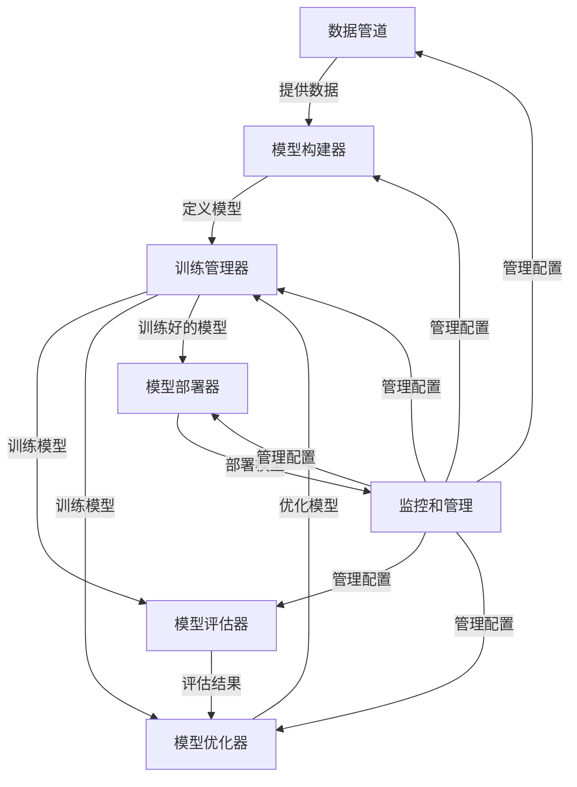

以下是对《AI开发框架原理与代码实战案例讲解》这一主题的详细阐述和分析:

# AI开发框架原理与代码实战案例讲解

## 1. 背景介绍

### 1.1 问题的由来

随着人工智能(AI)技术的不断发展和应用领域的日益扩大,AI系统的复杂性也与日俱增。传统的软件开发方法已经无法满足AI系统开发的需求,因此亟需一种新的开发范式和框架来支持AI系统的快速构建、部署和维护。

### 1.2 研究现状 

目前,已有多种AI开发框架应运而生,如TensorFlow、PyTorch、Keras等。这些框架提供了丰富的工具集和库,简化了AI模型的构建、训练和部署过程。然而,大多数现有框架仍然存在一些不足,例如:

1. 缺乏统一的设计理念和架构模式
2. 框架之间缺乏互操作性和兼容性
3. 对分布式训练和在线学习的支持有限
4. 缺乏对AI系统全生命周期的完整支持

### 1.3 研究意义

设计和实现一种全新的AI开发框架,能够解决现有框架的不足,为AI系统的开发、部署和维护提供统一的解决方案。这种新框架应具有以下特点:

1. 基于模块化设计,支持灵活组合和扩展
2. 提供统一的API和抽象层,屏蔽底层细节
3. 支持分布式训练、在线学习和增量学习
4. 涵盖AI系统全生命周期,从数据处理到模型部署

### 1.4 本文结构

本文将首先介绍AI开发框架的核心概念和关键组件,然后详细阐述框架的设计原理和算法实现。接下来,我们将通过数学模型和公式推导来深入探讨框架的理论基础。在此基础上,我们将提供一个完整的代码实例,并对其进行详细的解释和分析。最后,我们将讨论框架的实际应用场景、未来发展趋势和面临的挑战。

## 2. 核心概念与联系

AI开发框架的核心概念包括:

1. **数据管道(Data Pipeline)**: 负责数据的采集、预处理、增强和输入模型。
2. **模型构建器(Model Builder)**: 提供各种神经网络层和模块,支持灵活组合和自定义扩展。
3. **训练管理器(Training Manager)**: 管理模型的训练过程,支持分布式训练、在线学习和增量学习。
4. **模型评估器(Model Evaluator)**: 评估模型的性能,提供各种评估指标和可视化工具。
5. **模型优化器(Model Optimizer)**: 优化模型的结构和参数,提高模型的精度和效率。
6. **模型部署器(Model Deployer)**: 将训练好的模型部署到生产环境中,支持多种部署方式。
7. **监控和管理(Monitoring and Management)**: 监控模型的运行状态,管理模型的版本和配置。

这些核心概念相互关联,共同构成了一个完整的AI开发生命周期。数据管道为模型提供数据输入,模型构建器定义模型的结构,训练管理器负责模型的训练过程,模型评估器和优化器用于提高模型的性能,最终由模型部署器将模型投入生产使用。整个过程由监控和管理模块进行全程跟踪和管理。

## 3. 核心算法原理 & 具体操作步骤

### 3.1 算法原理概述

AI开发框架的核心算法主要包括以下几个方面:

1. **数据处理算法**: 包括数据采集、清洗、增强、编码和批处理等算法,用于构建高质量的数据管道。
2. **模型构建算法**: 包括各种神经网络层的实现,如全连接层、卷积层、循环层等,以及层与层之间的连接方式。
3. **训练算法**: 包括各种优化算法(如梯度下降、Adam等)、损失函数、正则化技术等,用于指导模型的训练过程。
4. **评估算法**: 包括各种评估指标的计算,如准确率、精确率、召回率、F1分数等,以及可视化技术。
5. **优化算法**: 包括模型剪枝、量化、知识蒸馏等技术,用于优化模型的结构和参数。
6. **部署算法**: 包括模型序列化、加载、预测等算法,用于将模型部署到生产环境中。

这些算法相互协作,共同实现了AI开发框架的核心功能。

### 3.2 算法步骤详解

以下是AI开发框架的典型工作流程:

1. **数据准备**:
   - 采集原始数据
   - 数据清洗和预处理
   - 数据增强和编码
   - 构建数据管道

2. **模型构建**:
   - 定义网络层和连接方式
   - 自定义层和损失函数
   - 组装模型结构

3. **模型训练**:
   - 选择优化算法和超参数
   - 构建训练循环
   - 分布式训练和在线学习

4. **模型评估**:
   - 计算评估指标
   - 可视化评估结果
   - 性能分析和调优

5. **模型优化**:
   - 模型剪枝
   - 模型量化
   - 知识蒸馏

6. **模型部署**:
   - 模型序列化
   - 模型加载和预测
   - 部署到生产环境

7. **监控和管理**:
   - 监控模型性能和资源使用
   - 管理模型版本和配置
   - 自动化运维和升级

在整个过程中,每一步都由相应的算法来实现,并且各步骤之间存在紧密的联系和依赖关系。

### 3.3 算法优缺点

AI开发框架所采用的算法具有以下优点:

1. **模块化设计**: 框架中的各个组件都是相对独立的模块,可以灵活组合和扩展。
2. **高度抽象**: 框架提供了统一的API和抽象层,屏蔽了底层细节,提高了开发效率。
3. **支持分布式**: 框架支持分布式训练和在线学习,可以充分利用计算资源。
4. **全生命周期支持**: 框架涵盖了AI系统的整个生命周期,从数据处理到模型部署。

同时,这些算法也存在一些不足之处:

1. **复杂度高**: 框架中包含了大量的算法和组件,整体复杂度较高,存在一定的学习曲线。
2. **资源消耗大**: 分布式训练和在线学习需要消耗大量的计算资源,对硬件环境有较高的要求。
3. **可解释性差**: 神经网络模型通常被视为"黑箱",缺乏可解释性,难以理解模型的内部工作原理。
4. **安全性风险**: AI系统可能存在安全隐患,如对抗性攻击、数据隐私泄露等,需要采取相应的防护措施。

### 3.4 算法应用领域

AI开发框架及其核心算法可以应用于多个领域,包括但不限于:

1. **计算机视觉**: 图像分类、目标检测、语义分割、视频分析等。
2. **自然语言处理**: 机器翻译、文本生成、情感分析、问答系统等。
3. **推荐系统**: 个性化推荐、协同过滤、内容过滤等。
4. **金融科技**: 风险管理、欺诈检测、量化交易等。
5. **医疗健康**: 医学影像分析、疾病诊断、药物发现等。
6. **智能制造**: 缺陷检测、预测维护、工艺优化等。
7. **智能交通**: 自动驾驶、路径规划、交通流量预测等。

随着AI技术的不断发展,其应用领域也在不断扩展,AI开发框架将为这些领域提供强有力的支持和推动。

## 4. 数学模型和公式 & 详细讲解 & 举例说明

### 4.1 数学模型构建

AI开发框架中的许多算法都基于数学模型和公式。以下是一些常见的数学模型:

1. **神经网络模型**:
   - 前馈神经网络
   - 卷积神经网络
   - 循环神经网络
   - 生成对抗网络
   - transformer等

2. **优化算法**:
   - 梯度下降
   - 动量优化
   - Adam优化
   - L-BFGS等

3. **损失函数**:
   - 均方误差
   - 交叉熵损失
   - Focal Loss
   - Triplet Loss等

4. **正则化技术**:
   - L1/L2正则化
   - Dropout
   - BatchNorm
   - 早停等

5. **评估指标**:
   - 准确率
   - 精确率
   - 召回率
   - F1分数
   - IoU等

这些数学模型和公式为AI开发框架提供了理论基础和支撑。

### 4.2 公式推导过程

以下以**梯度下降算法**为例,详细推导其数学公式:

给定一个损失函数 $J(\theta)$,其中 $\theta$ 表示模型参数。我们的目标是找到 $\theta$ 的值,使得损失函数 $J(\theta)$ 最小化。

梯度下降算法的基本思想是沿着损失函数的负梯度方向更新参数,具体步骤如下:

1. 初始化参数 $\theta_0$
2. 计算损失函数 $J(\theta_t)$ 在当前参数 $\theta_t$ 处的梯度 $\nabla_\theta J(\theta_t)$
3. 更新参数: $\theta_{t+1} = \theta_t - \eta \nabla_\theta J(\theta_t)$,其中 $\eta$ 为学习率
4. 重复步骤2和3,直到收敛或达到最大迭代次数

梯度下降算法的数学表达式为:

$$\theta_{t+1} = \theta_t - \eta \nabla_\theta J(\theta_t)$$

其中:
- $\theta_t$ 表示第 $t$ 次迭代时的参数值
- $\nabla_\theta J(\theta_t)$ 表示损失函数 $J$ 在 $\theta_t$ 处的梯度
- $\eta$ 为学习率,控制每次更新的步长

通过不断迭代,参数 $\theta$ 将朝着损失函数最小值的方向更新,直到收敛或达到预设的停止条件。

### 4.3 案例分析与讲解

现在,我们以一个简单的线性回归问题为例,来说明梯度下降算法的具体应用。

假设我们有一组数据点 $(x_i, y_i)$,其中 $x_i$ 为输入特征,而 $y_i$ 为对应的目标值。我们的目标是找到一条最佳拟合直线 $y = \theta_0 + \theta_1 x$,使得预测值 $\hat{y}_i = \theta_0 + \theta_1 x_i$ 与真实值 $y_i$ 之间的差异最小。

对于这个线性回归问题,我们可以定义均方误差(MSE)作为损失函数:

$$J(\theta_0, \theta_1) = \frac{1}{2m} \sum_{i=1}^m (\theta_0 + \theta_1 x_i - y_i)^2$$

其中 $m$ 为数据点的个数。

我们可以使用梯度下降算法来优化参数 $\theta_0$ 和 $\theta_1$,具体步骤如下:

1. 初始化参数 $\theta_0$ 和 $\theta_1$,例如 $\theta_0 = 0$, $\theta_1 = 0$
2. 计算损失函数 $J(\theta_0, \theta_1)$ 对 $\theta_0$ 和 $\theta_1$ 的偏