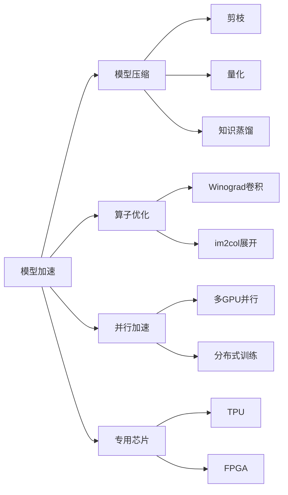

# AI模型加速原理与代码实战案例讲解

## 1. 背景介绍

### 1.1 问题的由来
随着人工智能的快速发展,深度学习模型在各个领域得到了广泛应用。然而,随着模型规模和复杂度的不断增加,模型训练和推理的计算开销也在急剧增长。这给实际部署带来了巨大挑战。如何在保证模型性能的同时,提高训练和推理效率,成为了业界关注的热点问题。

### 1.2 研究现状
目前,学术界和工业界已经提出了多种AI模型加速方法,主要可以分为以下几类:
1. 模型压缩:通过剪枝、量化、知识蒸馏等技术,在保持模型性能的同时减小模型体积。
2. 算子优化:针对卷积、矩阵乘等常用算子进行底层实现优化,充分利用硬件特性提高计算效率。 
3. 并行加速:利用多GPU、分布式等并行计算手段,加速模型训练和推理过程。
4. 专用芯片:设计专门针对AI计算的ASIC芯片如TPU,从硬件层面支持高效计算。

### 1.3 研究意义
AI模型加速技术的研究,对于推动人工智能产业化落地具有重要意义:
1. 降低计算成本,让中小企业和个人用户也能享受到AI技术红利。
2. 让AI应用能够在资源受限的嵌入式、移动设备上流畅运行,拓展应用场景。 
3. 缩短模型开发迭代周期,加速AI创新步伐。

### 1.4 本文结构
本文将重点介绍几种主流的AI模型加速方法,阐述其原理并给出代码实践案例。内容安排如下:
- 第2节介绍AI模型加速的核心概念
- 第3节讲解模型压缩的几种常用算法
- 第4节介绍并行加速的数学原理和实现方式
- 第5节通过案例演示几种加速方法的代码实践
- 第6节总结AI模型加速技术的应用现状和发展趋势

## 2. 核心概念与联系
在讨论AI模型加速之前,需要先明确几个核心概念:
- 模型:即人工智能模型,通常由大量参数组成,用数学方法对输入数据进行变换和处理,得到输出结果。模型性能通常用准确率、召回率等指标衡量。
- 训练:模型参数随着数据的反复喂入而不断更新优化的过程。训练需要消耗大量算力,是模型开发的主要耗时。 
- 推理:利用训练好的模型参数,对新的输入数据进行预测的过程。推理延迟是评估模型实际使用体验的重要指标。
- 算子:构成模型的基本数学运算单元,如卷积、池化、激活、Softmax等。

模型加速的目标就是在算法和工程两个层面,对模型结构和基础算子进行优化,最小化训练和推理的时间开销,同时保持模型的性能指标。下图展示了几种常用加速技术的内在联系。



## 3. 核心算法原理 & 具体操作步骤

### 3.1 算法原理概述
模型压缩是通过减少模型参数量和计算量,在保持性能的同时降低存储和计算开销的一类方法。本节重点介绍剪枝和量化两种技术。

### 3.2 算法步骤详解
#### 剪枝
剪枝的基本思想是去除模型中冗余和不重要的神经元连接,得到一个参数更少的子网络。剪枝可分为非结构化和结构化两种:
1. 非结构化剪枝:独立地对每个参数进行评估,将重要性低的参数直接清零。标准是阈值比较或基于LASSO回归。
2. 结构化剪枝:在更粗粒度上对整个滤波器或者层进行裁剪。评估指标可基于L1范数、基于梯度的敏感度分析等。 

剪枝后的模型性能通常会有所下降,需要进行微调(finetune)来恢复。剪枝和微调可以交替迭代进行,不断提高压缩率。

#### 量化
量化是指用低比特位的整型或定点小数替代原先32位浮点数进行表示和存储,从而减小模型体积。常见的量化方式有:
1. 二值量化:用1个比特表示参数,取值为±1,是极端的1-bit量化。
2. 三值量化:用2比特表示参数,取值为{-1,0,+1}。 
3. 幂律量化:用N比特表示浮点数的指数部分。

量化会带来精度损失,所以需要重新训练参数。训练过程考虑前向传播时量化,反向传播时仍用全精度浮点计算梯度。

### 3.3 算法优缺点
剪枝的优点是可以显著降低模型复杂度,缺点是剪枝后的稀疏矩阵不规则,不利于硬件加速。
量化的优点是可以大幅压缩模型体积,缺点是量化比特数降低后,精度损失较大,对某些任务如语义分割影响严重。

### 3.4 算法应用领域 
剪枝和量化广泛用于计算机视觉和自然语言处理等领域,如对主流的分类、检测、分割模型进行压缩。在工业界应用也很广泛,如腾讯的PocketFlow,华为的NAS等。

## 4. 数学模型和公式 & 详细讲解 & 举例说明

### 4.1 数学模型构建
以矩阵乘法为例,假设输入是$m\times k$维矩阵$\boldsymbol{A}$和$k\times n$维矩阵$\boldsymbol{B}$,标准的矩阵乘计算公式为:

$$
\boldsymbol{C} = \boldsymbol{A} \times \boldsymbol{B}, \text{其中}  
\boldsymbol{C}_{i,j} = \sum_{p=1}^k \boldsymbol{A}_{i,p} \boldsymbol{B}_{p,j}
$$

假设矩阵$\boldsymbol{A}$进行了稀疏化剪枝,记剪枝后的矩阵为$\boldsymbol{\hat{A}}$,其中非零元素个数为$z$,那么剪枝后矩阵乘法的计算量为:

$$
\text{FLOPs}_\text{pruned} = z \times n + m \times n
$$

可见计算量大约降低为原来的$\frac{z}{mk}$倍。

### 4.2 公式推导过程
对于幂律量化,我们可以用$N$个比特对一个浮点数$x$进行编码。假设$x$可以表示为:

$$
x = (-1)^{s} \cdot 2^{e} \cdot 1.m
$$

其中$s$为符号位,取0或1;$e$为指数位,取值范围是$[−(2^{N−1}−1),2^{N−1}−1]$;$m$为尾数,范围在$[1,2)$之间。那么量化后的定点表示为:

$$
\hat{x} = (-1)^{s} \cdot 2^{e} 
$$

令$\hat{x}$的比特位表示为$\boldsymbol{b}=(b_{N-1},...,b_0)$,则有:

$$
\begin{aligned}
\hat{x} &= -2^{N-1} \cdot b_{N-1} + \sum_{i=0}^{N-2} 2^i \cdot b_i \\
        &= -2^{N-1} \cdot \text{sgn}(\hat{x}) + \sum_{i=0}^{N-2} 2^i \cdot b_i 
\end{aligned}
$$

其中$\text{sgn}(\cdot)$为符号函数。上式表明,量化后的定点数可以通过$N$个比特直接计算得到。

### 4.3 案例分析与讲解
我们以一个简单的两层MLP为例,看看不同的量化比特数对模型性能的影响。模型结构如下:

```python
class MLP(nn.Module):
    def __init__(self):
        super().__init__()
        self.fc1 = nn.Linear(784, 256) 
        self.fc2 = nn.Linear(256, 10)
        
    def forward(self, x):
        x = x.view(x.size(0), -1)
        x = self.fc1(x)
        x = F.relu(x)
        x = self.fc2(x)
        return x
```

在MNIST数据集上训练后,得到全精度32位浮点的模型参数。然后分别进行1、2、4、8比特量化,测试集准确率如下表:

| 量化位数 | 1    | 2    | 4    | 8    | 32   |
| -------- | ---- | ---- | ---- | ---- | ---- |
| 准确率   | 83%  | 93%  | 96%  | 97%  | 98%  |

可以看出,8-bit量化已经能逼近全精度模型的性能,但模型体积缩小为1/4。

### 4.4 常见问题解答
Q: 剪枝和量化的结合使用是否可行?
A: 完全可以。通常是先做剪枝再量化,因为剪枝不改变数据分布,不会给量化带来额外的精度损失。反之则不行。

Q: 极低比特如二值、三值量化在实际中应用如何?
A: 它们主要用于对存储和计算资源要求极高的场合,如MCU、FPGA等嵌入式设备。也可用于模型加密和版权保护。

Q: 稀疏矩阵不规则,真的不能加速吗?
A: 可以做一些结构化的剪枝,如filter、channel粒度的剪枝,产生规则稀疏,仍能利用硬件加速的优势。

## 5. 项目实践：代码实例和详细解释说明

### 5.1 开发环境搭建
本案例使用PyTorch 1.8作为开发框架。需要预先安装以下依赖:
- python 3.8
- pytorch 1.8
- torchvision 0.9

可以使用下面的命令安装:

```bash
conda create -n pt1.8 python=3.8
conda activate pt1.8
conda install pytorch=1.8 torchvision=0.9 cudatoolkit=11.1 -c pytorch -c conda-forge
```

### 5.2 源代码详细实现
#### 全精度32位浮点模型训练
首先定义好MLP模型结构:

```python
class MLP(nn.Module):
    def __init__(self):
        super().__init__()
        self.fc1 = nn.Linear(784, 256) 
        self.fc2 = nn.Linear(256, 10)
        
    def forward(self, x):
        x = x.view(x.size(0), -1)
        x = self.fc1(x)
        x = F.relu(x)
        x = self.fc2(x)
        return x
```

然后进行模型训练,部分关键代码如下:

```python
model = MLP().to(device) 
optimizer = torch.optim.Adam(model.parameters(), lr=0.01)
criterion = nn.CrossEntropyLoss()

model.train()
for epoch in range(10):
    for batch_idx, (data, target) in enumerate(train_loader):
        data, target = data.to(device), target.to(device)
        optimizer.zero_grad()
        output = model(data)
        loss = criterion(output, target)
        loss.backward()
        optimizer.step()
```

#### 模型量化
使用PyTorch自带的量化工具包`torch.quantization`可以方便地进行静态量化。以8-bit量化为例,核心步骤如下:

```python 
from torch.quantization import QuantStub, DeQuantStub

# 1. 在模型中插入量化反量化节点
class MLPQuant(nn.Module):
    def __init__(self):
        super().__init__()
        self.quant = QuantStub()
        self.fc1 = nn.Linear(784, 256) 
        self.fc2 = nn.Linear(256, 10)
        self.dequant = DeQuantStub()
        
    def forward(self, x):
        x = self.quant(x)
        x = x.view(x.size(0), -1)
        x = self.fc1(x)
        x = F.relu(x)
        