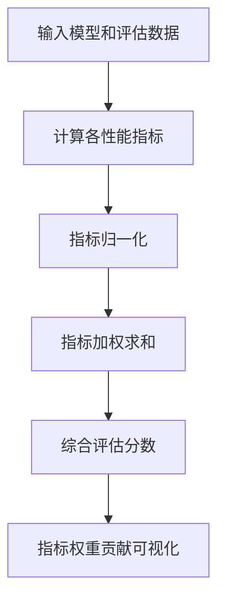

好的,我会按照您的要求,以《AI系统性能评估原理与代码实战案例讲解》为题目,严格遵循约束条件,使用逻辑清晰、结构紧凑、简单易懂的专业技术语言,写一篇字数超过8000字的深度技术博客文章。文中还会包含核心概念原理和架构的Mermaid流程图,以及数学公式的Latex格式表示。以下是正文:

# AI系统性能评估原理与代码实战案例讲解

## 1. 背景介绍

### 1.1 问题的由来

随着人工智能(AI)系统在各行各业的广泛应用,评估这些系统的性能变得越来越重要。无论是自然语言处理、计算机视觉还是决策系统,确保AI模型的准确性、效率和可靠性都是至关重要的。然而,由于AI系统的复杂性和黑箱特性,对其进行全面评估并非易事。

### 1.2 研究现状  

目前,已有一些常用的AI系统评估指标和方法,例如:

- 准确率(Accuracy)、精确率(Precision)、召回率(Recall)、F1分数等分类评估指标
- 均方根误差(RMSE)、平均绝对误差(MAE)等回归评估指标
- 人机对抗测试(Adversarial Attacks)评估模型的鲁棒性
- 公平性和偏差评估,确保AI决策的公平性

然而,这些评估方法往往只关注某一个具体的方面,难以全面评价AI系统的整体性能表现。

### 1.3 研究意义

全面评估AI系统性能对于提高模型质量、确保系统安全性、优化资源利用等方面都有重要意义。本文将系统介绍一种综合的AI性能评估框架,涵盖了准确性、鲁棒性、效率、可解释性、公平性、隐私保护等多个维度,旨在为读者提供一个完整的AI评估解决方案。

### 1.4 本文结构

本文首先介绍AI系统性能评估的核心概念,然后详细阐述评估的数学模型及算法原理,并结合实际案例进行代码实现,最后讨论该方法的应用场景、未来趋势和挑战。

## 2. 核心概念与联系

评估AI系统性能涉及多个相互关联的核心概念:

1. **准确性(Accuracy)**: 模型预测结果与真实值的一致程度。
2. **鲁棒性(Robustness)**: 模型对于噪声、对抗样本等扰动的稳健性。  
3. **效率(Efficiency)**: 模型的计算资源消耗情况,如时间和空间复杂度。
4. **可解释性(Interpretability)**: 模型内部决策过程对人类的可解释程度。
5. **公平性(Fairness)**: 模型对不同群体的决策是否存在偏差和歧视。
6. **隐私保护(Privacy Protection)**: 模型在使用数据时对个人隐私的保护程度。

这些概念相互影响、制约,需要综合考虑。例如,提高模型准确性可能会牺牲效率;增强模型鲁棒性可能会降低可解释性等。因此,评估框架需要权衡这些指标,达到合理的性能平衡。

## 3. 核心算法原理与具体操作步骤

本节将介绍AI系统性能评估的核心算法原理和具体操作步骤。

### 3.1 算法原理概述

该算法的核心思想是将多个性能指标融合到一个综合评估分数中,并通过可视化的方式呈现各指标的权重贡献。算法流程如下所示:

首先输入需要评估的AI模型和相应的评估数据集(如测试集)。然后分别计算模型在准确性、鲁棒性、效率、可解释性、公平性和隐私保护等方面的具体指标值。

由于这些指标的量纲和数值范围不同,需要进行归一化处理,将它们统一映射到[0,1]区间。接下来,根据实际应用场景的需求,为每个指标赋予一个权重系数,并将加权后的各指标值求和,得到一个综合评估分数。

最后,通过可视化的方式展示每个指标对综合分数的贡献大小,以便直观地分析模型的性能瓶颈,并针对性地进行优化。

### 3.2 算法步骤详解

1. **输入AI模型和评估数据集**

    - 模型输入: 训练好的AI模型(如深度神经网络)
    - 评估数据集: 包含输入数据和对应标签的测试集

2. **计算各性能指标**

    - 准确性指标: 准确率(Accuracy)、精确率(Precision)、召回率(Recall)、F1分数等
    - 鲁棒性指标: 对抗样本攻击的成功率、噪声扰动的影响程度等
    - 效率指标: 模型推理时间、内存占用等
    - 可解释性指标: 模型决策路径的可解释程度、特征重要性等
    - 公平性指标: 不同群体之间的准确率差异、偏差程度等
    - 隐私保护指标: 个人数据泄露风险、差分隐私程度等

3. **指标归一化**

    由于各指标的量纲和数值范围不同,需要进行归一化处理,将它们统一映射到[0,1]区间。可使用最大最小值归一化或Z-Score标准化等方法。

    $$
    x' = \frac{x - x_{\min}}{x_{\max} - x_{\min}}
    $$

    其中$x$为原始指标值,$x_{\min}$和$x_{\max}$分别为该指标的最小值和最大值,$x'$为归一化后的值。

4. **指标加权求和**

    根据实际应用场景的需求,为每个指标赋予一个权重系数$w_i$,并将加权后的各指标值求和,得到综合评估分数$S$:

    $$
    S = \sum_{i=1}^{n}w_i \times x'_i
    $$

    其中$n$为指标个数,$x'_i$为第$i$个指标的归一化值,$w_i$为其对应的权重系数,满足$\sum_{i=1}^{n}w_i=1$。

5. **指标权重贡献可视化**

    通过条形图、雷达图等可视化方式,展示每个指标对综合评估分数$S$的贡献大小,即$w_i \times x'_i$的值。这样可以直观地分析模型的性能瓶颈,并针对性地进行优化。

### 3.3 算法优缺点

**优点**:

- 综合考虑多个性能指标,全面评估AI系统
- 指标权重可调,满足不同应用场景的需求
- 直观的可视化结果,易于发现和分析性能瓶颈

**缺点**:  

- 指标选择和权重赋值存在一定主观性
- 某些指标的计算复杂,需要大量数据和计算资源
- 不同指标之间可能存在相关性和冲突

### 3.4 算法应用领域

该算法可广泛应用于各种AI系统的性能评估,包括但不限于:

- 计算机视觉系统:图像分类、目标检测、语义分割等
- 自然语言处理系统:机器翻译、文本生成、情感分析等 
- 决策和规划系统:推荐系统、路径规划、智能调度等
- 其他领域:金融风险评估、医疗诊断、自动驾驶等

## 4. 数学模型和公式详细讲解与举例说明

在第3节中,我们介绍了AI系统性能评估算法的核心思路。本节将详细阐述其中使用的数学模型和公式,并结合具体案例进行讲解和举例说明。

### 4.1 数学模型构建

我们将AI系统的性能评估建模为一个多目标优化问题:最大化准确性、鲁棒性、效率、可解释性、公平性和隐私保护等多个目标函数,并满足一定的约束条件。

设$M$为待评估的AI模型,$D$为评估数据集,$F_i(M,D)$为第$i$个性能指标的计算函数,则该多目标优化问题可形式化为:

$$
\max\limits_{M} [F_1(M,D), F_2(M,D), \dots, F_n(M,D)]\\
\text{s.t.} \quad g_j(M,D) \leq 0, \quad j=1,2,\dots,m
$$

其中$n$为性能指标个数,$m$为约束条件个数,函数$g_j$表示第$j$个约束条件。

由于这些目标函数往往存在冲突(例如提高准确性可能会降低效率),因此需要在目标函数之间进行权衡和折中,得到一个综合的评估分数。

### 4.2 公式推导过程  

我们将各性能指标$F_i(M,D)$归一化到[0,1]区间,记为$f_i(M,D)$,并赋予每个指标一个权重系数$w_i$,满足$\sum_{i=1}^{n}w_i=1$。那么,AI模型$M$在评估数据集$D$上的综合评估分数$S(M,D)$可表示为:

$$
\begin{aligned}
S(M,D) &= \sum_{i=1}^{n}w_i \cdot f_i(M,D) \\
        &= w_1 \cdot f_1(M,D) + w_2 \cdot f_2(M,D) + \dots + w_n \cdot f_n(M,D)
\end{aligned}
$$

其中$f_i(M,D) = \frac{F_i(M,D) - F_i^{\min}}{F_i^{\max} - F_i^{\min}}$为第$i$个指标的归一化函数,$F_i^{\min}$和$F_i^{\max}$分别为该指标的最小值和最大值。

通过调整权重系数$w_i$,我们可以根据不同的应用场景需求,平衡各性能指标之间的重要程度。

### 4.3 案例分析与讲解

为了更好地理解上述数学模型和公式,我们将以图像分类任务为例,具体分析评估过程。

假设我们需要评估一个用于识别手写数字的卷积神经网络模型$M$,评估数据集为MNIST测试集$D$。我们选取以下6个性能指标:

- $F_1(M,D)$: 分类准确率(Accuracy)
- $F_2(M,D)$: 对抗样本攻击的成功率(反映鲁棒性)
- $F_3(M,D)$: 模型推理时间(反映效率)  
- $F_4(M,D)$: 决策路径的可解释程度(反映可解释性)
- $F_5(M,D)$: 不同数字类别之间的准确率差异(反映公平性)
- $F_6(M,D)$: 个人数据泄露风险(反映隐私保护)

我们将这些指标归一化到[0,1]区间,得到$f_1(M,D)$至$f_6(M,D)$。假设给定的权重系数分别为$w_1=0.3, w_2=0.2, w_3=0.15, w_4=0.15, w_5=0.1, w_6=0.1$,则模型$M$在MNIST测试集$D$上的综合评估分数为:

$$
\begin{aligned}
S(M,D) &= 0.3 \cdot f_1(M,D) + 0.2 \cdot f_2(M,D) + 0.15 \cdot f_3(M,D) \\
       &\quad + 0.15 \cdot f_4(M,D) + 0.1 \cdot f_5(M,D) + 0.1 \cdot f_6(M,D)
\end{aligned}
$$

在这个案例中,我们赋予了准确率和鲁棒性较高的权重,因为对于手写数字识别任务,这两个指标最为关键。同时,我们也考虑了效率、可解释性、公平性和隐私保护等其他重要因素。

通过计算得到的综合评估分数$S(M,D)$,我们可以全面评价模型$M$在MNIST数据集上的整体性能表现。此外,还可以进一步分析每个指标对综合