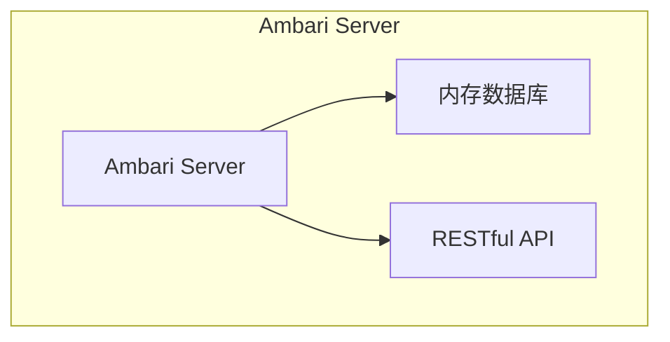
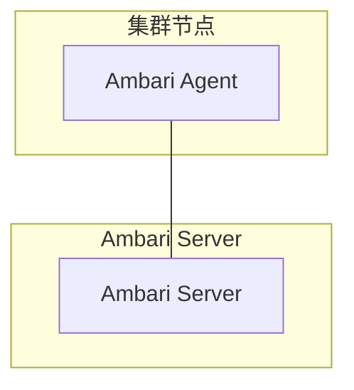
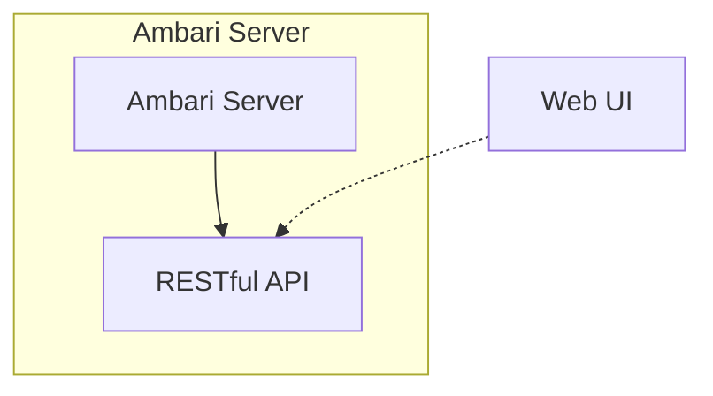
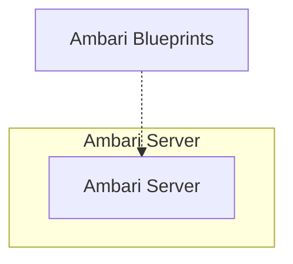
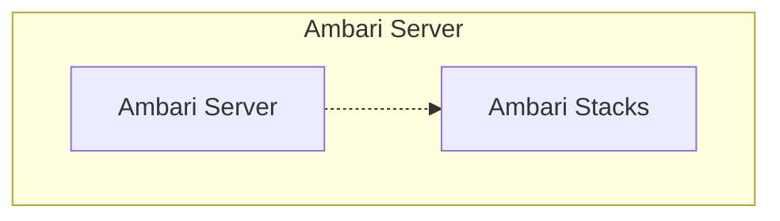
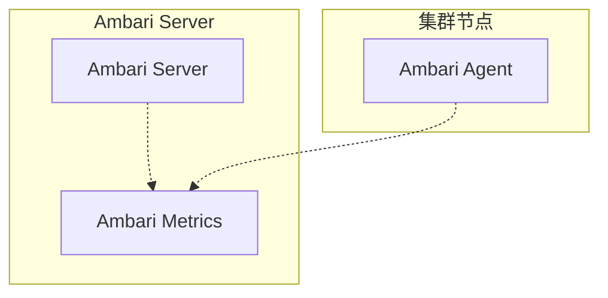
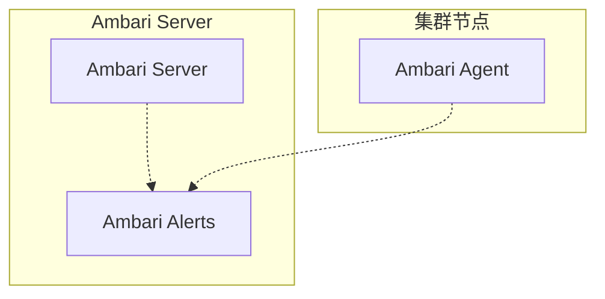
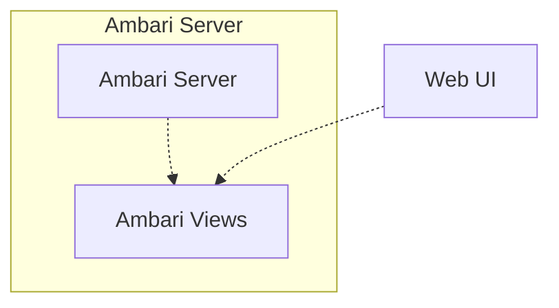
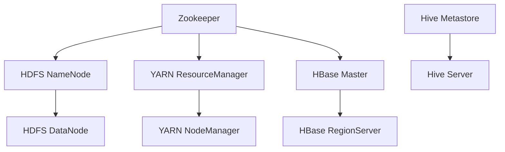

# Ambari原理与代码实例讲解

## 1. 背景介绍

### 1.1 问题的由来

随着大数据技术的快速发展,Apache Hadoop生态系统中的组件也在不断增加和演进。然而,手动部署、配置和管理这些分布式系统组件是一项艰巨的任务,尤其是在大规模集群环境中。这就催生了一种新的需求,即需要一个统一的平台来简化这些复杂的操作,提高效率和可靠性。Apache Ambari应运而生,旨在解决这一痛点。

### 1.2 研究现状

Apache Ambari是一个开源的大数据操作平台,用于提供对Apache Hadoop集群的供应、管理和监控。它基于Apache Hadoop生态系统构建,支持多种大数据组件,如HDFS、YARN、Hive、Hbase、Kafka等。Ambari提供了一个直观的Web UI界面,使用户能够轻松部署、配置、管理和监控Hadoop集群。

目前,Ambari已经成为管理Hadoop集群的事实标准之一,被广泛应用于生产环境中。它不仅简化了集群管理,还提高了可靠性和可维护性。然而,Ambari的原理和实现细节对于很多用户来说仍然是一个黑盒子,缺乏深入的了解和掌握。

### 1.3 研究意义

深入探究Ambari的原理和实现细节,对于更好地利用和定制Ambari具有重要意义。通过剖析Ambari的架构设计、核心算法和代码实现,我们可以更好地理解其工作原理,发现潜在的优化空间,并根据实际需求进行定制和扩展。

此外,研究Ambari也有助于我们了解大数据集群管理的最佳实践,掌握分布式系统的设计思路和技术细节。这对于构建高可用、高扩展的大数据平台至关重要。

### 1.4 本文结构

本文将全面介绍Ambari的原理和实现细节,内容安排如下:

1. 背景介绍
2. 核心概念与联系
3. 核心算法原理与具体操作步骤
4. 数学模型和公式详细讲解与案例分析
5. 项目实践:代码实例和详细解释说明
6. 实际应用场景
7. 工具和资源推荐
8. 总结:未来发展趋势与挑战
9. 附录:常见问题与解答

## 2. 核心概念与联系

在深入探讨Ambari的原理之前,我们需要先了解一些核心概念及其相互关系。

### 2.1 Ambari Server

Ambari Server是Ambari的核心组件,负责管理和协调整个Ambari系统。它维护了一个关于集群拓扑结构、配置和指标的内存数据库,并提供了RESTful API供Ambari Agents和Web UI进行交互。



### 2.2 Ambari Agent

Ambari Agent是部署在每个集群节点上的代理程序,负责执行来自Ambari Server的命令,如安装、配置和监控组件。它与Ambari Server通过心跳机制保持通信,并定期上报节点状态和指标数据。



### 2.3 Ambari Web UI

Ambari Web UI是一个基于Web的用户界面,提供了友好的可视化操作界面。用户可以通过Web UI部署和管理Hadoop集群,监控集群运行状态,并查看各种指标和日志信息。



### 2.4 Ambari Blueprints

Ambari Blueprints是一种基于JSON的声明式集群定义语言,用于描述要部署的Hadoop集群拓扑结构和配置。它使用户能够通过简单的JSON文件来定义期望的集群状态,而不需要手动执行复杂的操作步骤。



### 2.5 Ambari Stacks

Ambari Stacks定义了受Ambari支持的各种Hadoop服务及其版本。它包含了每个服务的元数据,如服务配置属性、依赖关系、自定义操作等。Ambari利用这些元数据来正确地部署和管理Hadoop集群。



### 2.6 Ambari Metrics

Ambari Metrics是Ambari的监控子系统,用于收集和存储各种集群指标数据,如主机指标、服务指标和作业指标等。它支持多种指标存储后端,如Embedded、Ganglia、Graphite等,并提供了丰富的图形化查询和展示界面。



### 2.7 Ambari Alerts

Ambari Alerts是Ambari的警报子系统,用于根据预定义的规则和阈值监测集群健康状况。当检测到异常情况时,它会触发相应的警报通知,以便管理员及时采取措施。



### 2.8 Ambari Views

Ambari Views是一种可扩展的Web应用程序框架,允许第三方开发者为Ambari添加自定义视图和功能。通过Views,用户可以访问和管理特定的大数据工具和应用程序,如Hive视图、Tez视图等。



通过上述核心概念的介绍,我们可以看到Ambari是一个复杂的分布式系统,各个组件通过良好的设计和协作来实现集群的供应、管理和监控功能。接下来,我们将深入探讨Ambari的核心算法原理和实现细节。

## 3. 核心算法原理与具体操作步骤

### 3.1 算法原理概述

Ambari的核心算法原理主要包括以下几个方面:

1. **集群拓扑建模**: Ambari使用有向无环图(DAG)来表示集群的拓扑结构,描述各个组件之间的依赖关系。这种建模方式使得Ambari能够根据依赖关系自动确定组件的安装和启动顺序。

2. **配置管理**: Ambari维护了一个集中式的配置存储库,用于管理整个集群的配置信息。它支持基于角色的配置覆盖,以及配置版本控制和回滚。这种设计确保了配置的一致性和可追溯性。

3. **任务调度和执行**: Ambari采用了分布式任务调度和执行框架,将集群操作任务分发到各个Ambari Agent进行执行。它利用有向无环图来确定任务的执行顺序,并通过重试和回滚机制来保证任务的可靠性。

4. **状态监控和恢复**: Ambari持续监控集群的运行状态,包括主机状态、服务状态和指标数据。当检测到异常情况时,它会自动尝试进行恢复操作,如重启服务、重新应用配置等。

5. **扩展性和可插拔性**: Ambari设计了一套可扩展的框架,支持添加新的服务和组件。它通过插件机制来加载服务的元数据和自定义操作,实现了良好的可插拔性。

### 3.2 算法步骤详解

接下来,我们将详细介绍Ambari核心算法的具体操作步骤。

#### 3.2.1 集群拓扑建模

Ambari使用有向无环图(DAG)来表示集群的拓扑结构,其中节点表示服务组件,边表示组件之间的依赖关系。这种建模方式使得Ambari能够根据依赖关系自动确定组件的安装和启动顺序。

1. 定义组件节点
   - 每个服务组件都被定义为一个节点,包括元数据信息,如组件名称、版本、主机等。
2. 确定依赖关系
   - 分析各个组件之间的依赖关系,如安装依赖、配置依赖、启动依赖等。
   - 将依赖关系表示为有向边,连接相应的组件节点。
3. 构建DAG
   - 根据组件节点和依赖关系边,构建出整个集群的DAG模型。



上图展示了一个简化的Hadoop集群DAG模型,其中包括HDFS、YARN、HBase、Hive和Zookeeper等组件。通过这种建模方式,Ambari可以根据依赖关系自动确定组件的安装和启动顺序,从而简化了集群部署和管理的复杂性。

#### 3.2.2 配置管理

Ambari维护了一个集中式的配置存储库,用于管理整个集群的配置信息。它支持基于角色的配置覆盖,以及配置版本控制和回滚。这种设计确保了配置的一致性和可追溯性。

1. 配置存储
   - Ambari Server维护了一个内存数据库,用于存储集群的配置信息。
   - 配置信息包括服务级别的配置和主机级别的配置。
2. 配置覆盖
   - 支持基于角色的配置覆盖,允许为不同的组件角色设置不同的配置值。
   - 覆盖规则遵循继承原则,从最具体的角色配置到最通用的服务配置。
3. 配置版本控制
   - 每次配置更新都会生成一个新的配置版本,并保存在版本历史记录中。
   - 支持配置版本回滚,可以将集群配置恢复到历史版本。
4. 配置推送
   - 当配置发生变更时,Ambari Server会将新配置推送到相关的Ambari Agent。
   - Ambari Agent负责在本地节点应用新配置,并重启受影响的服务。

通过这种配置管理机制,Ambari能够确保集群配置的一致性和可追溯性,同时支持灵活的配置覆盖和版本控制。这为集群管理提供了强大的支持。

#### 3.2.3 任务调度和执行

Ambari采用了分布式任务调度和执行框架,将集群操作任务分发到各个Ambari Agent进行执行。它利用有向无环图来确定任务的执行顺序,并通过重试和回滚机制来保证任务的可靠性。

1. 任务定义
   - 每个集群操作,如安装、启动、停止等,都被定义为一个任务。
   - 任务包含元数据信息,如任务类型、目标主机、执行命令等。
2. 任务调度
   - Ambari Server根据集群拓扑DAG和任务依赖关系,生成一个有向无环图,表示任务的执行顺序。
   - 任务被分发到相应的Ambari Agent进行执行。
3. 任务执行
   - Ambari Agent接收到任务后,在本地节点上执行相应的操作命令。
   - 执行过程中,Ambari Agent会向Ambari Server发送心跳和状态更新。
4. 重试和回滚
   - 如果任务执行失败,Ambari会自动重试一定次数。
   - 如果重试仍然失败,Ambari会执行回滚操作,将集群恢复到之前的状态。

```mermaid
graph TD
    subgraph Ambari Server
    S1[任务调度器]
    end
    