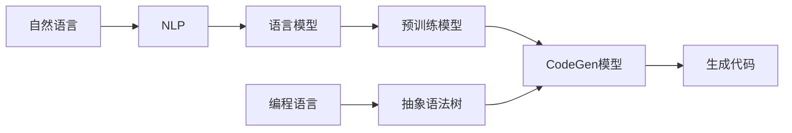
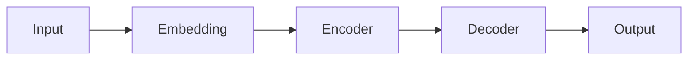

# CodeGen原理与代码实例讲解

作者：禅与计算机程序设计艺术 / Zen and the Art of Computer Programming

## 1. 背景介绍
### 1.1 问题的由来
随着人工智能技术的不断发展,自然语言处理(NLP)领域也取得了巨大的进步。而在NLP领域中,代码生成(Code Generation,简称CodeGen)是一个备受关注的研究方向。CodeGen旨在通过自然语言描述自动生成对应的代码片段,这对于提高软件开发效率,降低开发成本具有重要意义。

### 1.2 研究现状
目前,CodeGen技术主要基于深度学习模型,通过大规模代码数据的训练,学习自然语言和编程语言之间的映射关系。一些主流的CodeGen模型包括:
- Codex:由OpenAI开发,基于GPT-3架构,在Python等主流编程语言上表现出色。
- CodeBERT:由微软开发,基于BERT架构,可以支持多种编程语言。 
- PLBART:由伯克利大学提出,引入编程语言特定的预训练任务,提升了生成代码的质量。

这些模型在代码补全、代码搜索、代码翻译等任务上取得了不错的效果,展现出CodeGen技术的巨大潜力。

### 1.3 研究意义
CodeGen技术的研究意义主要体现在以下几个方面:

1. 提高开发效率:通过自然语言自动生成代码,可以大大减少开发者的工作量,提升软件开发效率。
2. 降低开发门槛:对于编程经验不足的人员,CodeGen可以帮助他们快速实现功能,降低软件开发门槛。
3. 辅助代码优化:通过分析海量优质代码,CodeGen模型可以给出代码优化建议,帮助开发者写出高质量代码。
4. 支持智能化开发:CodeGen是实现软件开发智能化的关键技术之一,对于未来的智能化编程助手意义重大。

### 1.4 本文结构
本文将从以下几个方面对CodeGen技术进行详细阐述:

1. CodeGen的核心概念与技术原理
2. CodeGen的关键算法步骤与数学模型
3. CodeGen模型的代码实现与效果展示
4. CodeGen技术的应用场景与未来展望

通过本文的学习,读者可以对CodeGen技术的原理和实现有一个全面的认识,为进一步研究和应用CodeGen技术打下良好基础。

## 2. 核心概念与联系

在详细介绍CodeGen原理之前,我们首先需要了解几个与之密切相关的核心概念:

- 自然语言处理(NLP):旨在让计算机能够处理、"理解"自然语言,是人工智能领域的重要分支。常见任务包括分词、词性标注、句法分析、语义理解、文本分类等。CodeGen需要用到NLP技术来分析用户意图。

- 语言模型:用于计算一段文本的概率分布,可以用于预测下一个最可能出现的词。常见的语言模型有N-gram、RNN、Transformer等。CodeGen本质上是一种条件语言模型。

- 预训练模型:通过在大规模无标注数据上进行自监督学习,得到通用的语义表示。将预训练模型应用到下游任务,能够显著提升模型效果。BERT、GPT系列都是非常成功的预训练模型。

- 编程语言:一种用于编写计算机程序的形式化语言,如Python、Java、C++等。不同编程语言有不同的语法规则。CodeGen需要根据目标编程语言的语法,来约束生成的代码。

- 抽象语法树(AST):用树形结构表示程序代码的抽象语法结构,每个节点表示一个语法结构(如语句、表达式)。将代码解析成AST,可以方便地进行语法检查、代码优化等。

下图展示了这些概念之间的关系:

自然语言经过NLP处理,通过语言模型学习,并利用预训练模型来提取语义信息。同时考虑编程语言的语法结构(AST),最终通过CodeGen模型来生成目标代码。

理解这些概念之间的联系,有助于我们更好地掌握CodeGen的原理和实现。接下来,我们将详细介绍CodeGen的核心算法。

## 3. 核心算法原理 & 具体操作步骤
### 3.1 算法原理概述
CodeGen的核心是将自然语言描述映射为编程语言代码。这个过程可以看作是一个序列到序列(Seq2Seq)的转换问题。具体来说,输入是一段自然语言文本,输出是对应的代码片段。我们希望建立一个条件概率模型P(Code|NL),即给定自然语言描述NL,生成代码Code的概率。

主流的CodeGen模型大多基于Transformer架构,如下图所示:

- Embedding:将输入的自然语言token映射为连续的向量表示。
- Encoder:采用多层自注意力机制,学习输入序列的上下文信息。
- Decoder:同样基于自注意力,并引入Encoder的输出作为上下文,逐token地生成输出序列。
- Output:将Decoder的输出映射为目标编程语言的token。

模型训练时,通过最大化P(Code|NL)来更新模型参数。预测时,则使用beam search等解码策略,得到概率最大的代码序列。

### 3.2 算法步骤详解
CodeGen的训练和预测分为以下几个关键步骤:

1. 数据准备
   - 收集大规模的<自然语言描述,代码>配对数据。
   - 对自然语言和代码分别进行token化,得到token序列。
   - 将token映射为数字索引,并根据模型需要进行padding等处理。

2. 模型构建
   - 定义Embedding层,将输入token映射为向量。
   - 搭建Encoder和Decoder,设置自注意力层数、隐藏层大小等超参数。
   - 在Encoder和Decoder之间添加cross attention,将Encoder输出作为Decoder的上下文信息。
   - 定义输出层,将Decoder输出映射为目标编程语言的token概率分布。

3. 模型训练
   - 将数据分为训练集和验证集。
   - 设置优化器和损失函数,通常使用Adam优化器和交叉熵损失。
   - 对训练数据进行mini-batch迭代,前向传播计算损失,反向传播更新模型参数。
   - 在每个epoch结束时,在验证集上评估模型性能,如BLEU、CodeBLEU等指标。

4. 模型预测
   - 对新的自然语言描述进行token化和数字化。
   - 将其输入到训练好的CodeGen模型中。
   - 采用beam search等解码策略,生成概率最大的代码序列。
   - 将生成的token索引映射回实际的代码token。

5. 后处理优化
   - 对生成的代码进行语法检查,纠正可能存在的语法错误。
   - 根据代码规范,对生成的代码进行格式化、变量重命名等优化。
   - 结合执行结果和人工反馈,对模型进行fine-tune,提升生成代码的质量。

### 3.3 算法优缺点
CodeGen算法的优点主要包括:

- 端到端的生成方式,无需人工定义复杂的规则和模板。
- 基于深度学习,具有强大的语义理解和泛化能力。
- 支持多种主流编程语言,通过更换训练数据即可实现。
- 生成效率高,可以实现实时的代码补全和生成。

但CodeGen算法也存在一些局限性:

- 生成的代码可能存在语法错误或逻辑错误,需要后处理优化。
- 对于复杂的程序逻辑,生成的代码质量和正确性难以保证。
- 需要大规模高质量的<自然语言,代码>数据进行训练,数据成本高。
- 难以处理自然语言中的歧义和不完整描述,对用户输入质量要求较高。

### 3.4 算法应用领域
尽管存在局限性,但CodeGen算法已经在实际中得到了广泛应用,主要包括:

- 代码补全:根据上下文自动补全代码,提高编程效率。
- 代码搜索:通过自然语言检索相关代码片段,便于开发者参考和复用。
- 代码翻译:将一种编程语言的代码转换为另一种,方便代码迁移。
- 编程教育:自动生成题目和答案,辅助编程学习和练习。
- 低代码开发:通过自然语言指令生成代码,降低开发门槛。

未来,随着CodeGen技术的不断发展和完善,有望在更多领域发挥重要作用。

## 4. 数学模型和公式 & 详细讲解 & 举例说明
### 4.1 数学模型构建
CodeGen的数学模型可以用概率图模型来表示。设自然语言描述为$x$,生成的代码为$y$,则我们要建模的是条件概率$P(y|x)$。在Transformer架构下,这个概率可以进一步分解为:

$$P(y|x) = \prod_{t=1}^{T} P(y_t|y_{<t},x)$$

其中$y_t$表示生成的第$t$个token,$y_{<t}$表示之前生成的token序列。这个概率分布可以通过Transformer的Decoder输出得到。

具体来说,设Decoder第$l$层第$i$个位置的隐藏状态为$h_i^l$,则最后一层$L$的输出$h_i^L$经过一个线性变换和softmax函数,就可以得到第$i$个位置的token概率分布:

$$P(y_i|y_{<i},x) = \text{softmax}(W_o h_i^L + b_o)$$

其中$W_o$和$b_o$是可学习的参数矩阵和偏置项。

### 4.2 公式推导过程
Decoder的隐藏状态$h_i^l$是通过自注意力机制和Encoder-Decoder注意力机制计算得到的。

首先,Decoder的第$l$层会对前一层的输出$h^{l-1}$进行自注意力计算:

$$\alpha_{ij}^l = \text{softmax}(\frac{(W_q h_i^{l-1})(W_k h_j^{l-1})^T}{\sqrt{d}})$$

$$a_i^l = \sum_{j=1}^{i-1} \alpha_{ij}^l (W_v h_j^{l-1})$$

其中$W_q,W_k,W_v$是可学习的参数矩阵,$d$是隐藏状态的维度。$\alpha_{ij}^l$表示位置$i$对位置$j$的注意力权重,$a_i^l$则是加权平均后的上下文向量。

接着,Decoder会与Encoder的输出$e$进行注意力交互:

$$\beta_{ij}^l = \text{softmax}(\frac{(W_q' h_i^{l-1})(W_k' e_j)^T}{\sqrt{d}})$$

$$c_i^l = \sum_{j=1}^{|x|} \beta_{ij}^l (W_v' e_j)$$

其中$W_q',W_k',W_v'$是另一组可学习的参数矩阵。$c_i^l$表示Decoder在位置$i$时,对Encoder输出的加权平均。

最后,Decoder将自注意力的输出$a_i^l$和Encoder-Decoder注意力的输出$c_i^l$拼接起来,并经过前馈神经网络(FFN)得到最终的隐藏状态:

$$h_i^l = \text{FFN}([a_i^l;c_i^l])$$

通过这种方式,Decoder可以综合考虑自己已经生成的token序列和Encoder提供的源语言信息,从而更好地预测下一个token。

### 4.3 案例分析与讲解
下面我们以一个简单的例子来说明CodeGen的生成过程。假设我们要根据自然语言描述"将两个数字相加"来生成Python代码。

首先,将自然语言描述进行token化,得到$x=$ "将 两个 数字 相加",对应的token索引序列为$[12,8,20,13]$。