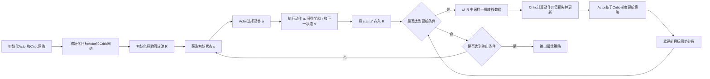

# DDPG原理与代码实例讲解

## 1. 背景介绍
### 1.1 问题的由来
强化学习(Reinforcement Learning, RL)是一种通过智能体(Agent)与环境(Environment)交互来学习最优策略的机器学习方法。近年来,深度强化学习(Deep Reinforcement Learning, DRL)将深度学习(Deep Learning, DL)与强化学习相结合,利用深度神经网络强大的表征能力来逼近最优策略,在连续动作空间的控制任务中取得了重大突破。然而,传统的DRL算法如DQN在面对高维连续动作空间时往往难以收敛。为了解决这一问题,DeepMind于2016年提出了一种新的Actor-Critic算法——深度确定性策略梯度(Deep Deterministic Policy Gradient, DDPG),成功应用于连续控制任务并取得了优异的表现。

### 1.2 研究现状
DDPG算法自提出以来受到了学术界和工业界的广泛关注。很多研究者在DDPG的基础上提出了改进算法,如Distributed DDPG、Prioritized Experience Replay DDPG、DDPG with Hindsight Experience Replay等,进一步提升了DDPG的性能表现。此外,DDPG也被成功应用于机器人控制、自动驾驶、智能电网等诸多领域,展现出了强大的实用价值。但DDPG仍然存在一些不足之处,如对超参数敏感、训练不稳定等,亟需后续研究予以解决。

### 1.3 研究意义 
作为一种简单而强大的连续动作空间DRL算法,深入理解和掌握DDPG算法对于从事DRL研究和应用的人员具有重要意义。一方面,DDPG为解决连续控制问题提供了新的思路,有助于推动DRL在实际场景中的应用;另一方面,通过对DDPG的学习和研究,可以加深对DRL的整体认识,为进一步改进和设计新的DRL算法奠定基础。

### 1.4 本文结构
本文将全面介绍DDPG算法的原理、实现和应用。第2节阐述DDPG的核心概念;第3节详细讲解DDPG的算法原理和步骤;第4节给出DDPG的数学模型和公式推导;第5节通过代码实例演示DDPG的具体实现;第6节总结DDPG的实际应用场景;第7节推荐DDPG相关的学习资源;第8节对全文进行总结并展望DDPG的未来发展;第9节列举DDPG的常见问题与解答。

## 2. 核心概念与联系
DDPG是一种Actor-Critic结构的DRL算法,其核心概念包括:

- 状态(State):描述智能体所处环境的特征表示。
- 动作(Action):智能体根据策略选择的具体行为。 
- 奖励(Reward):环境根据智能体的动作给出的即时反馈。
- 轨迹(Trajectory):智能体与环境交互产生的状态-动作-奖励序列。
- 策略(Policy):将状态映射为动作的函数,分为随机性策略和确定性策略。
- 价值函数(Value Function):估计状态的长期累积奖励,分为状态价值函数和动作价值函数。
- 模型(Model):对环境的转移概率和奖励函数的估计,分为有模型学习和无模型学习。

在DDPG中,通过Actor网络逼近确定性策略函数,Critic网络逼近动作价值函数。两个网络相互配合,Actor负责生成动作,Critic负责评估动作的价值并指导Actor更新。整个系统遵循确定性策略梯度定理进行端到端训练,最终收敛到最优确定性策略。

## 3. 核心算法原理 & 具体操作步骤
### 3.1 算法原理概述
DDPG结合了DQN和DPG(Deterministic Policy Gradient)的思想,通过引入Actor-Critic架构和目标网络(Target Network)等技术,实现了连续动作空间下的稳定学习。其基本原理可概括为:

1. Actor网络基于状态生成确定性动作。
2. 环境根据动作产生下一状态和奖励。 
3. 将状态、动作、奖励、下一状态存入经验回放池。
4. 从经验回放池中随机采样一个批次的转移数据。
5. Critic网络基于采样数据计算动作价值损失并更新参数。
6. Actor网络基于Critic网络的梯度信息更新策略网络参数。
7. 软更新目标网络的参数。
8. 重复步骤1-7,直至算法收敛。

### 3.2 算法步骤详解

1. 随机初始化Actor网络 $\mu(s|\theta^\mu)$ 和Critic网络 $Q(s,a|\theta^Q)$ 的参数 $\theta^\mu$ 和 $\theta^Q$。
2. 初始化目标Actor网络 $\mu'(s|\theta^{\mu'})$ 和目标Critic网络 $Q'(s,a|\theta^{Q'})$ 的参数 $\theta^{\mu'} \leftarrow \theta^\mu$, $\theta^{Q'} \leftarrow \theta^Q$。
3. 初始化经验回放池 $R$。
4. for episode = 1, M do
    1. 初始化初始状态 $s_1$
    2. for t = 1, T do 
        1. 根据当前策略 $\mu(s_t|\theta^\mu)$ 选择动作 $a_t=\mu(s_t|\theta^\mu)+\mathcal{N}_t$
        2. 执行动作 $a_t$, 观察奖励 $r_t$ 和下一状态 $s_{t+1}$
        3. 将转移 $(s_t,a_t,r_t,s_{t+1})$ 存入 $R$ 
        4. 从 $R$ 中随机采样一个批次的转移数据 $(s_i,a_i,r_i,s_{i+1})$
        5. 计算目标动作价值 $y_i = r_i + \gamma Q'(s_{i+1},\mu'(s_{i+1}|\theta^{\mu'})|\theta^{Q'})$
        6. 最小化Critic网络损失 $L = \frac{1}{N}\sum_i(y_i - Q(s_i,a_i|\theta^Q))^2$,更新Critic网络参数 $\theta^Q$
        7. 基于采样梯度更新Actor网络参数 $\theta^\mu$:
        
        $\nabla_{\theta^\mu}J \approx \frac{1}{N}\sum_i\nabla_aQ(s,a|\theta^Q)|_{s=s_i,a=\mu(s_i)}\nabla_{\theta^\mu}\mu(s|\theta^\mu)|_{s_i}$
        8. 软更新目标网络参数:
        
        $\theta^{Q'} \leftarrow \tau\theta^Q + (1-\tau)\theta^{Q'}$
        
        $\theta^{\mu'} \leftarrow \tau\theta^\mu + (1-\tau)\theta^{\mu'}$
    3. end for
5. end for

其中, $\mathcal{N}_t$ 为探索噪声, $\gamma$ 为折扣因子, $\tau \ll 1$ 为软更新系数。

### 3.3 算法优缺点

DDPG算法的主要优点包括:
- 端到端学习连续动作策略,无需手工离散化动作空间。
- 引入经验回放和目标网络,提高了样本利用效率和训练稳定性。
- 采用确定性策略,避免了策略梯度方差大的问题。
- Actor-Critic架构有利于策略与价值的联合优化。

DDPG算法的主要缺点包括:
- 对超参数敏感,需要精细调参。
- 离线策略训练,难以适应非平稳环境。
- 使用确定性策略,探索能力有限。
- 单步更新,训练效率偏低。

### 3.4 算法应用领域
DDPG算法主要应用于连续动作空间的控制任务,如:

- 机器人运动规划与控制
- 自动驾驶决策与规划
- 电力负荷调度优化
- 工业过程参数优化
- 金融投资组合管理

此外,DDPG也可以与其他技术(如分层学习、迁移学习等)结合,进一步拓展其应用范围。

## 4. 数学模型和公式 & 详细讲解 & 举例说明
### 4.1 数学模型构建
考虑一个标准的连续控制强化学习任务,可以用马尔可夫决策过程(Markov Decision Process, MDP)来建模。MDP由一个六元组 $\langle \mathcal{S},\mathcal{A},\mathcal{P},\mathcal{R},\rho_0,\gamma \rangle$ 描述:

- 状态空间 $\mathcal{S}$ 为有限状态集合。
- 动作空间 $\mathcal{A}$ 为有限动作集合。
- 状态转移概率 $\mathcal{P}:\mathcal{S} \times \mathcal{A} \times \mathcal{S} \to [0,1]$。
- 奖励函数 $\mathcal{R}:\mathcal{S} \times \mathcal{A} \to \mathbb{R}$。
- 初始状态分布 $\rho_0:\mathcal{S} \to [0,1]$。
- 折扣因子 $\gamma \in [0,1]$。

在MDP中,智能体与环境交互产生轨迹 $\tau=(s_0,a_0,r_0,s_1,a_1,r_1,...)$。智能体的目标是最大化累积期望奖励:

$$J(\pi) = \mathbb{E}_{\tau \sim \pi}[\sum_{t=0}^{\infty}\gamma^tr_t]$$

其中 $\pi:\mathcal{S} \to \mathcal{A}$ 为智能体的策略。

定义状态价值函数 $V^\pi(s)$ 和动作价值函数 $Q^\pi(s,a)$ 分别为:

$$V^\pi(s)=\mathbb{E}_{\tau \sim \pi}[\sum_{k=0}^{\infty}\gamma^kr_{t+k}|s_t=s]$$

$$Q^\pi(s,a)=\mathbb{E}_{\tau \sim \pi}[\sum_{k=0}^{\infty}\gamma^kr_{t+k}|s_t=s,a_t=a]$$

满足贝尔曼方程:

$$V^\pi(s)=\mathbb{E}_{a \sim \pi}[Q^\pi(s,a)]$$

$$Q^\pi(s,a)=\mathcal{R}(s,a)+\gamma \mathbb{E}_{s' \sim \mathcal{P}}[V^\pi(s')]$$

最优价值函数 $V^*(s)$ 和 $Q^*(s,a)$ 定义为:

$$V^*(s)=\max_{\pi}V^\pi(s)$$

$$Q^*(s,a)=\max_{\pi}Q^\pi(s,a)$$

满足最优贝尔曼方程:

$$V^*(s)=\max_{a}Q^*(s,a)$$

$$Q^*(s,a)=\mathcal{R}(s,a)+\gamma \mathbb{E}_{s' \sim \mathcal{P}}[V^*(s')]$$

### 4.2 公式推导过程
传统的Q学习算法通过值迭代来逼近最优动作价值函数:

$$Q(s_t,a_t) \leftarrow Q(s_t,a_t) + \alpha[r_t+\gamma \max_{a}Q(s_{t+1},a)-Q(s_t,a_t)]$$

其中 $\alpha$ 为学习率。然而,对于连续动作空间,上式中的 $\max$ 操作难以计算。为此,DDPG引入Actor-Critic架构,Actor网络 $\mu(s|\theta^\mu)$ 显式建模策略函数,Critic网络 $Q(s,a|\theta^Q)$ 逼近动作价值函数。

定义Critic网络的损失函数为均方误差:

$$L(\theta^Q)=\mathbb{E}_{(s,a,r,s') \sim \math