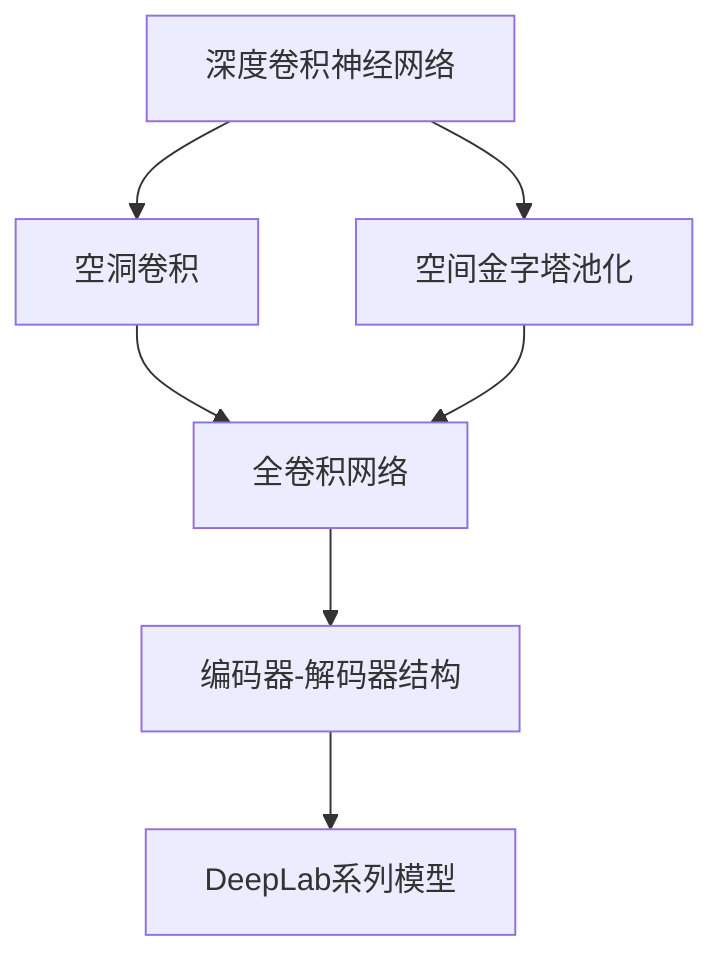

# DeepLab系列原理与代码实例讲解

## 1. 背景介绍

### 1.1 问题的由来

在计算机视觉领域中,语义分割是一项关键任务,旨在对图像中的每个像素进行分类,将其与特定的对象类别相关联。传统的基于像素的分类方法存在一些固有的局限性,例如缺乏对物体的整体理解和上下文信息的利用。为了解决这些问题,DeepLab系列模型应运而生,它利用深度卷积神经网络(CNN)的强大特征提取能力,结合空间金字塔池化(SPP)和全卷积网络(FCN)等技术,显著提高了语义分割的性能。

### 1.2 研究现状

DeepLab系列模型自2014年提出以来,经历了多次迭代和改进。最初的DeepLab模型采用空洞卷积(atrous convolution)来扩大感受野,并引入了全连接条件随机场(Dense CRF)来细化分割边界。后续的DeepLabv2通过空间金字塔池化模块(ASPP)进一步捕获多尺度上下文信息。DeepLabv3则采用了级联和并行的ASPP模块,并引入了编码器-解码器结构。最新的DeepLabv3+则在此基础上引入了一种新的解码器模块,显著提高了分割边界的精度。

### 1.3 研究意义

语义分割在计算机视觉领域具有广泛的应用,包括无人驾驶、医学影像分析、遥感图像处理等。DeepLab系列模型在多个公开基准测试中取得了领先的性能,成为语义分割领域的代表性模型之一。深入研究DeepLab系列模型的原理和实现,对于推动语义分割技术的发展、提高相关应用的性能具有重要意义。

### 1.4 本文结构

本文将全面介绍DeepLab系列模型的核心概念、算法原理、数学模型、代码实现和应用场景。首先,我们将探讨DeepLab系列模型的核心概念和它们之间的联系。接下来,详细阐述模型的算法原理和具体操作步骤。然后,我们将深入解析模型背后的数学基础,包括公式推导和案例分析。在此基础上,我们将提供完整的代码实例,并对其进行详细的解释和分析。最后,我们将探讨DeepLab系列模型在实际应用中的场景,介绍相关工具和资源,总结未来发展趋势和面临的挑战。

## 2. 核心概念与联系

DeepLab系列模型融合了多种核心概念,包括深度卷积神经网络(CNN)、空洞卷积(atrous convolution)、空间金字塔池化(SPP)、全卷积网络(FCN)和编码器-解码器结构。这些概念相互关联,共同推动了DeepLab模型的性能提升。

1. **深度卷积神经网络(CNN)**: DeepLab系列模型基于CNN的强大特征提取能力,利用多层卷积和池化操作从图像中提取丰富的语义信息。CNN的层次结构使其能够捕获从低级到高级的视觉特征,为语义分割任务奠定了坚实的基础。

2. **空洞卷积(atrous convolution)**: 空洞卷积是DeepLab系列模型的核心技术之一。它通过在卷积核中引入空洞(即跳过部分像素)来扩大感受野,从而捕获更广泛的上下文信息,而无需增加计算量或损失分辨率。这种技术有助于模型更好地理解物体的整体结构和周围环境。

3. **空间金字塔池化(SPP)**: 空间金字塔池化模块(ASPP)是DeepLab系列模型中另一个关键组件。它采用并行的空洞卷积核,具有不同的采样率,从而捕获多尺度的上下文信息。通过融合不同尺度的特征,ASPP模块可以更好地处理不同大小和形状的物体。

4. **全卷积网络(FCN)**: DeepLab系列模型采用全卷积网络架构,将传统的全连接层替换为卷积层。这种设计使得模型可以处理任意大小的输入图像,并产生相应大小的分割结果,从而提高了模型的灵活性和效率。

5. **编码器-解码器结构**: DeepLab系列模型中的编码器-解码器结构借鉴了U-Net等模型的设计思想。编码器部分通过卷积和池化操作提取特征,而解码器部分则通过上采样和跳跃连接恢复分割结果的空间分辨率。这种结构有助于模型保留细节信息,提高分割边界的精度。

这些核心概念相互关联,共同推动了DeepLab系列模型在语义分割任务中的卓越表现。下一节将详细阐述模型的算法原理和具体操作步骤。

## 3. 核心算法原理与具体操作步骤

### 3.1 算法原理概述

DeepLab系列模型的核心算法原理可以概括为以下几个关键步骤:

1. **特征提取**: 利用深度卷积神经网络(CNN)从输入图像中提取丰富的视觉特征,包括低级特征(如边缘和纹理)和高级特征(如物体部件和语义信息)。

2. **空洞卷积**: 在CNN的特定层中应用空洞卷积,以扩大感受野并捕获更广泛的上下文信息,而无需增加计算量或损失分辨率。

3. **空间金字塔池化(ASPP)**: 采用并行的空洞卷积核,具有不同的采样率,从而捕获多尺度的上下文信息。通过融合不同尺度的特征,ASPP模块可以更好地处理不同大小和形状的物体。

4. **编码器-解码器架构**: 在编码器部分,CNN通过卷积和池化操作提取特征。在解码器部分,通过上采样和跳跃连接恢复分割结果的空间分辨率,同时融合来自编码器的特征信息。

5. **分割预测**: 在解码器的输出上应用一个卷积层,生成与输入图像相同大小的分割预测图,其中每个像素对应一个类别标签。

6. **后处理(可选)**: 可以应用全连接条件随机场(Dense CRF)或其他后处理技术,进一步细化分割边界和优化分割结果。

### 3.2 算法步骤详解

DeepLab系列模型的具体算法步骤可以分为以下几个部分:

#### 3.2.1 编码器部分

1. **输入图像**: 将输入图像馈送到CNN的输入层。

2. **卷积和池化**: 在CNN的编码器部分,通过多层卷积和池化操作提取特征。每一层的卷积核都会学习捕获不同级别的视觉特征,从低级的边缘和纹理到高级的物体部件和语义信息。

3. **空洞卷积**: 在CNN的特定层中应用空洞卷积,以扩大感受野并捕获更广泛的上下文信息。空洞卷积通过在卷积核中引入空洞(即跳过部分像素)来实现,从而增加了感受野的大小,而无需增加计算量或损失分辨率。

4. **ASPP模块**: 在CNN的特定层中插入ASPP(空间金字塔池化)模块。ASPP模块包含多个并行的空洞卷积核,具有不同的采样率,从而捕获多尺度的上下文信息。通过融合不同尺度的特征,ASPP模块可以更好地处理不同大小和形状的物体。

#### 3.2.2 解码器部分

1. **上采样和跳跃连接**: 在解码器部分,通过上采样操作逐步恢复特征图的空间分辨率。同时,利用跳跃连接将来自编码器的相应特征图与解码器的特征图进行融合,以保留细节信息。

2. **卷积和预测**: 在解码器的输出上应用一个卷积层,生成与输入图像相同大小的分割预测图,其中每个像素对应一个类别标签。

#### 3.2.3 后处理(可选)

1. **全连接条件随机场(Dense CRF)**: 可以应用全连接条件随机场(Dense CRF)或其他后处理技术,利用像素之间的空间和语义关系,进一步细化分割边界和优化分割结果。

2. **其他后处理技术**: 根据具体应用场景,可以采用其他后处理技术,如形态学操作、图割等,以进一步提高分割结果的质量。

### 3.3 算法优缺点

DeepLab系列模型具有以下优点:

1. **高精度**: 通过利用空洞卷积、ASPP模块和编码器-解码器架构,DeepLab系列模型能够捕获丰富的上下文信息和细节特征,从而实现高精度的语义分割。

2. **多尺度处理能力**: ASPP模块能够有效地融合多尺度特征,使模型能够处理不同大小和形状的物体。

3. **保留空间分辨率**: 全卷积网络架构和编码器-解码器结构有助于保留分割结果的空间分辨率,从而产生高质量的分割边界。

4. **灵活性**: 全卷积网络架构使得DeepLab系列模型可以处理任意大小的输入图像,提高了模型的灵活性。

然而,DeepLab系列模型也存在一些缺点:

1. **计算复杂度较高**: 由于采用了深度卷积神经网络和多个并行的空洞卷积核,DeepLab系列模型的计算复杂度相对较高,对硬件资源的要求较高。

2. **训练数据需求较大**:为了获得良好的性能,DeepLab系列模型通常需要大量的标注数据进行训练,这对于一些数据稀缺的领域可能是一个挑战。

3. **对小目标的处理能力有限**:尽管ASPP模块可以捕获多尺度特征,但对于非常小的目标,DeepLab系列模型的性能可能会受到一定影响。

4. **后处理步骤增加了复杂性**: 虽然后处理步骤(如Dense CRF)可以进一步提高分割质量,但也增加了模型的复杂性和计算开销。

### 3.4 算法应用领域

DeepLab系列模型在多个领域都有广泛的应用,包括但不限于:

1. **无人驾驶**: 在自动驾驶汽车中,准确的语义分割对于识别道路、行人、障碍物等具有至关重要的作用。DeepLab系列模型可以为自动驾驶系统提供高质量的分割结果。

2. **医学影像分析**: 在医学影像分析中,语义分割可用于自动化分割和识别人体器官、肿瘤等,为医生提供辅助诊断和治疗规划。DeepLab系列模型在这一领域展现出了出色的表现。

3. **遥感图像处理**: 在遥感图像处理中,语义分割可用于识别和分类地物,如建筑物、道路、植被等,为城市规划、环境监测等提供有价值的信息。DeepLab系列模型在这一领域也有广泛的应用。

4. **机器人视觉**: 在机器人视觉中,语义分割可用于识别和定位目标物体,为机器人的导航、抓取等任务提供支持。DeepLab系列模型可以为机器人视觉系统提供高质量的分割结果。

5. **增强现实(AR)和虚拟现实(VR)**: 在AR和VR应用中,语义分割可用于实时分割和识别场景中的物体,为虚拟物体的插入和交互提供基础。DeepLab系列模型在这一领域也有潜在的应用前景。

6. **视频监控和安防**: 在视频监控和安防领域,语义分割可用于实时检测和跟踪感兴趣的目标,如人、车辆等,为安全监控和事件检测提供支持。DeepLab系列模型在这一领域也有应用潜力。

总的来说,DeepLab