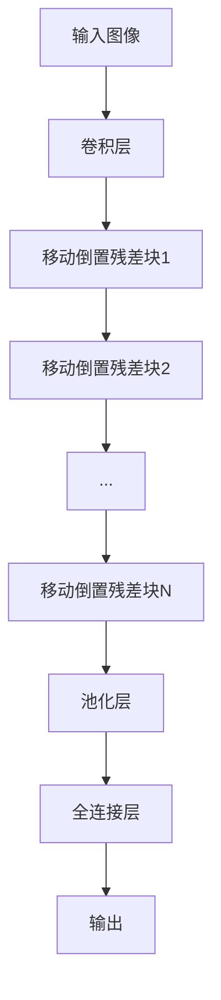
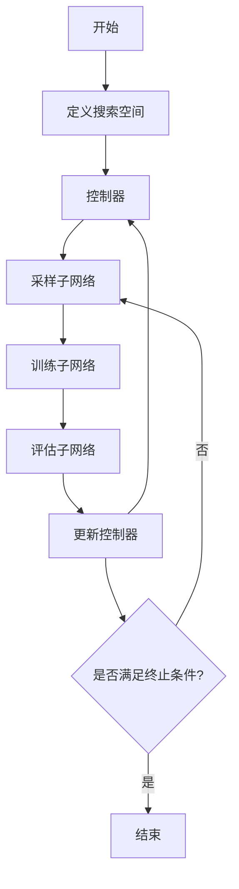

# EfficientNet原理与代码实例讲解

## 1. 背景介绍

### 1.1 问题的由来

在深度学习领域中,卷积神经网络(CNN)已经成为计算机视觉和图像识别任务中不可或缺的核心模型。然而,传统的CNN模型往往需要大量的计算资源和内存,这对于移动设备和嵌入式系统来说是一个巨大的挑战。因此,如何在保持高精度的同时,设计出高效、轻量级的CNN模型,成为了研究的重点课题。

### 1.2 研究现状

为了解决上述问题,研究人员提出了多种模型压缩和加速技术,例如剪枝、量化、知识蒸馏等。同时,也有一些工作专注于设计高效的网络架构,例如MobileNets、ShuffleNets等。这些方法在一定程度上缓解了计算资源的瓶颈,但仍然存在一些局限性,比如难以在不同的资源约束下进行灵活的模型缩放。

### 1.3 研究意义

EfficientNet是谷歌大脑团队在2019年提出的一种新型卷积神经网络架构,旨在通过模型缩放的方式,在保持高精度的同时,实现计算资源的高效利用。该模型不仅在ImageNet数据集上取得了出色的表现,而且在多个视觉任务上都展现了优异的性能。EfficientNet的出现为设计高效、轻量级的CNN模型提供了新的思路和方法。

### 1.4 本文结构

本文将全面介绍EfficientNet的原理、算法细节和代码实现。首先,我们将探讨EfficientNet的核心概念和思想,包括模型缩放策略和复合模型缩放方法。接下来,详细阐述EfficientNet的网络架构和算法原理,包括深度可分离卷积、移动倒置残差块等关键组件。然后,我们将通过数学模型和公式,深入解释EfficientNet的理论基础。此外,还将提供EfficientNet的代码实例和详细解释,帮助读者更好地理解和实现该模型。最后,我们将讨论EfficientNet在实际应用场景中的应用,以及未来的发展趋势和挑战。

## 2. 核心概念与联系

EfficientNet的核心思想是通过模型缩放的方式,在保持高精度的同时,实现计算资源的高效利用。传统的模型缩放方法通常只关注单一维度的缩放,如深度、宽度或分辨率,这种单一维度的缩放往往会导致精度和效率之间的权衡。

为了解决这个问题,EfficientNet提出了复合模型缩放(Compound Model Scaling)的方法,同时缩放网络的深度、宽度和分辨率。具体来说,EfficientNet定义了一个新的缩放因子$\phi$,用于控制网络的深度、宽度和分辨率的缩放比例。通过平衡这三个维度的缩放,EfficientNet能够在不同的资源约束下,实现更好的精度和效率权衡。

EfficientNet的另一个关键概念是基线网络(Baseline Network)。基线网络是一个小型的卷积神经网络,作为EfficientNet架构的基础。通过对基线网络进行复合模型缩放,可以得到一系列不同规模的EfficientNet模型,从而满足不同的计算资源需求。

EfficientNet还引入了一些新的网络组件,如移动倒置残差块(Mobile Inverted Residual Block)和深度可分离卷积(Depthwise Separable Convolution),这些组件有助于进一步提高模型的效率和表现。

总的来说,EfficientNet通过复合模型缩放、基线网络和高效网络组件的结合,实现了在不同资源约束下,精度和效率之间的优化平衡。

## 3. 核心算法原理 & 具体操作步骤

### 3.1 算法原理概述

EfficientNet的核心算法原理可以概括为以下几个方面:

1. **复合模型缩放(Compound Model Scaling)**:EfficientNet同时缩放网络的深度、宽度和分辨率,以实现更好的精度和效率权衡。具体来说,EfficientNet定义了一个新的缩放因子$\phi$,用于控制网络的深度、宽度和分辨率的缩放比例。

2. **基线网络(Baseline Network)**:EfficientNet的基线网络是一个小型的卷积神经网络,作为整个架构的基础。通过对基线网络进行复合模型缩放,可以得到一系列不同规模的EfficientNet模型。

3. **移动倒置残差块(Mobile Inverted Residual Block)**:EfficientNet采用了一种新的网络组件,即移动倒置残差块,作为主要的构建模块。这种块结构能够有效地提高计算效率,同时保持良好的表现。

4. **深度可分离卷积(Depthwise Separable Convolution)**:EfficientNet广泛使用了深度可分离卷积,这是一种特殊的卷积操作,可以显著减少计算量和模型大小,同时保持较高的精度。

5. **自动模型搜索(AutoML)**:EfficientNet的设计过程中,采用了自动模型搜索技术,以寻找最优的网络架构和超参数配置。这种方法可以减少人工调参的工作,并提高模型的性能。

### 3.2 算法步骤详解

1. **复合模型缩放**

EfficientNet的复合模型缩放策略可以表示为:

$$
\begin{aligned}
\text{depth} &= \alpha^{\phi} \\
\text{width} &= \beta^{\phi} \\
\text{resolution} &= \gamma^{\phi} \\
\text{dropout\_rate} &= \delta \\
\end{aligned}
$$

其中,$\alpha$、$\beta$、$\gamma$和$\delta$是用于控制缩放比例的常数系数,$\phi$是缩放因子。通过改变$\phi$的值,可以得到不同规模的EfficientNet模型。

2. **基线网络**

EfficientNet的基线网络是一个小型的卷积神经网络,由一系列移动倒置残差块组成。基线网络的架构如下所示:

3. **移动倒置残差块**

移动倒置残差块是EfficientNet的核心构建模块,它由以下几个部分组成:

- 深度可分离卷积层
- 批量归一化层
- 激活函数(一般使用ReLU或Swish)
- 残差连接

移动倒置残差块的结构如下所示:

4. **深度可分离卷积**

深度可分离卷积是EfficientNet中广泛使用的一种特殊卷积操作,它将传统的卷积操作分解为两个步骤:深度卷积(depthwise convolution)和点wise卷积(pointwise convolution)。这种分解方式可以显著减少计算量和模型大小,同时保持较高的精度。

深度可分离卷积的计算过程如下:

$$
\begin{aligned}
\text{depthwise conv}: & \quad \mathbf{G}_{k,l,m} = \sum_{i,j} \mathbf{K}_{i,j,m} \cdot \mathbf{F}_{k+i-1, l+j-1, m} \\
\text{pointwise conv}: & \quad \mathbf{F}_{k,l,n} = \sum_{m} \mathbf{G}_{k,l,m} \cdot \mathbf{V}_{m,n}
\end{aligned}
$$

其中,$\mathbf{F}$是输入特征图,$\mathbf{K}$是深度卷积核,$\mathbf{G}$是深度卷积的输出,$\mathbf{V}$是点wise卷积核。

5. **自动模型搜索**

EfficientNet的设计过程中,采用了自动模型搜索技术,以寻找最优的网络架构和超参数配置。具体来说,研究人员使用了一种基于强化学习的搜索算法,称为Progressive Neural Architecture Search (PNAS)。

PNAS算法的工作流程如下:

通过多次迭代,PNAS算法可以找到具有最优性能的网络架构和超参数配置。

### 3.3 算法优缺点

**优点:**

1. 通过复合模型缩放,实现了精度和效率之间的更好权衡。
2. 采用了高效的网络组件,如移动倒置残差块和深度可分离卷积,进一步提高了计算效率。
3. 使用自动模型搜索技术,减少了人工调参的工作,提高了模型性能。
4. 在多个视觉任务上展现出了出色的表现,具有广泛的应用前景。

**缺点:**

1. 复合模型缩放策略增加了模型设计的复杂性,需要更多的调参工作。
2. 自动模型搜索过程计算量较大,需要强大的硬件支持。
3. 对于一些特殊任务,可能需要进行额外的网络架构调整和优化。

### 3.4 算法应用领域

EfficientNet由于其高效、轻量级的特点,在以下领域具有广泛的应用前景:

1. **移动设备和嵌入式系统**:由于计算资源有限,EfficientNet可以在保持较高精度的同时,实现高效的计算和内存利用,非常适合部署在移动设备和嵌入式系统中。

2. **边缘计算和物联网**:在边缘计算和物联网场景中,设备通常具有严格的能耗和计算能力限制,EfficientNet可以在这些资源受限的环境中提供高效的视觉处理能力。

3. **自动驾驶和机器人**:自动驾驶和机器人系统需要实时处理大量视觉数据,EfficientNet可以在保证精度的同时,提供高效的计算能力,满足实时性和低延迟的要求。

4. **云计算和数据中心**:在云计算和数据中心环境中,EfficientNet可以有效地利用计算资源,降低能耗和成本,提高整体效率。

5. **医疗影像和遥感领域**:在医疗影像和遥感领域,EfficientNet可以用于高效地处理大量图像数据,提高诊断和分析的准确性和效率。

总的来说,EfficientNet的高效、轻量级特性使其在各种资源受限的场景下都具有广泛的应用前景。

## 4. 数学模型和公式 & 详细讲解 & 举例说明

### 4.1 数学模型构建

EfficientNet的核心思想是通过复合模型缩放,在保持高精度的同时,实现计算资源的高效利用。为了实现这一目标,EfficientNet构建了一个数学模型,用于描述网络的缩放策略。

EfficientNet的复合模型缩放策略可以表示为:

$$
\begin{aligned}
\text{depth} &= \alpha^{\phi} \\
\text{width} &= \beta^{\phi} \\
\text{resolution} &= \gamma^{\phi} \\
\text{dropout\_rate} &= \delta \\
\end{aligned}
$$

其中,$\alpha$、$\beta$、$\gamma$和$\delta$是用于控制缩放比例的常数系数,$\phi$是缩放因子。通过改变$\phi$的值,可以得到不同规模的EfficientNet模型。

具体来说:

- $\text{depth}$表示网络的深度,即网